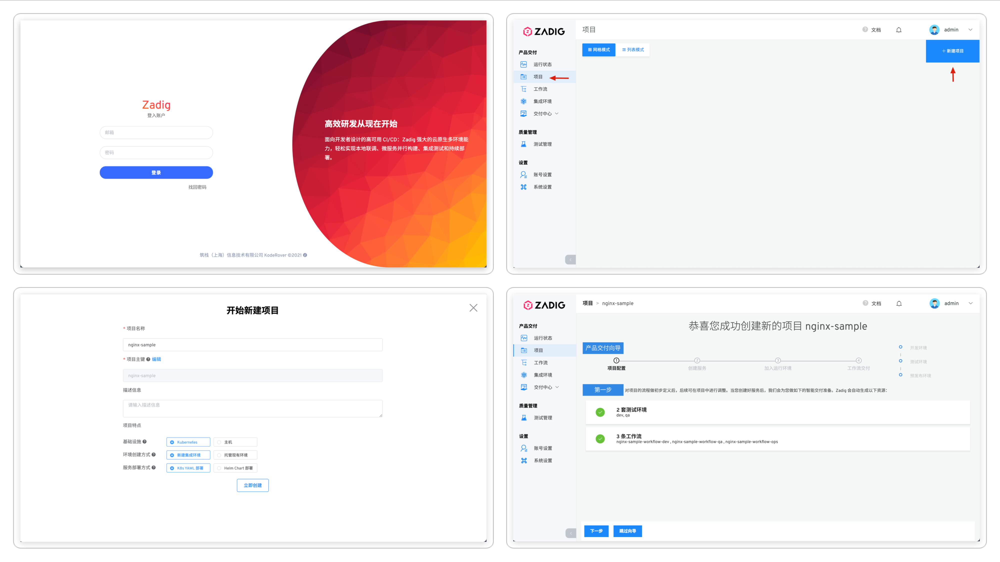

## 新建项目

进入 Zadig 系统，点击「项目」-「新建项目」，基于`Kubernetes`、`新建集成环境`、`K8s YAML 部署`的特点组合创建项目。

## 服务配置
点击`下一步`，创建服务并为服务配置构建。
- 选择从代码仓库导入服务配置，本例中使用 [koderover/zadig](https://github.com/koderover/zadig) 仓库的 [nginx](https://github.com/koderover/zadig/tree/main/examples/nginx) 案例。
> 更细节的信息可参考 [K8s YAML 服务](/v1.8.0/project/service/#k8s-yaml-服务)

- 配置信息导入后，系统会自动解析 K8s 资源及相关服务组件。

- 点击`添加构建`，为服务组件添加构建配置，填写构建所需基本信息和构建脚本后保存构建。
> 更细节的信息可参考[构建配置](/v1.8.0/project/build/)。

## 加入环境

服务配置完毕后点击`下一步`, Zadig 系统会默认为该项目创建两套集成环境和三条工作流。

待环境和工作流准备完毕，点击`下一步`，进入到工作流交付环节。

::: tip
服务数量以及启动服务所需的资源会影响环境的创建时间，请耐心等待。
:::

## 工作流交付

- 执行 `nginx-sample-workflow-dev` 工作流，对 `dev` 环境的服务进行更新升级。

- 在工作流执行详情页面可实时跟踪构建日志，待工作流成功运行完毕，服务会被自动更新部署。

