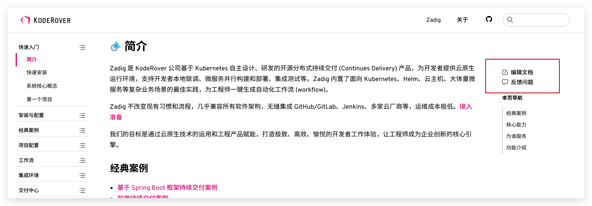
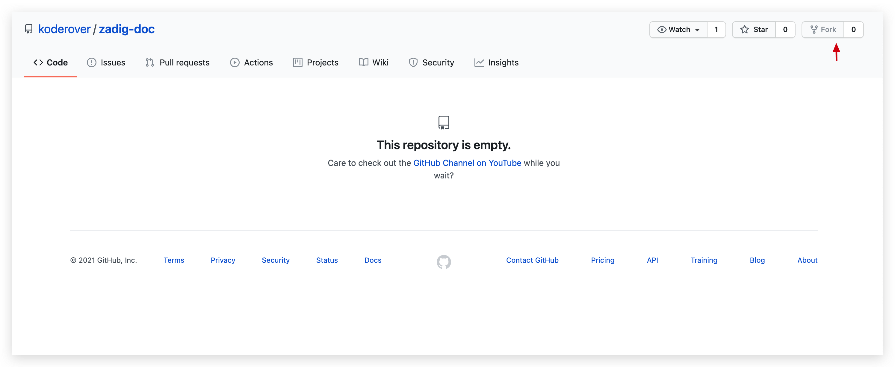

# Zadig 文档贡献指南

欢迎您的参与，以帮助改善 Zadig 文档。

## 目录

- [文档编写指南](#文档编写指南)
- [如何贡献文档](#如何贡献文档)
  - [反馈问题](#反馈问题)
  - [线上编辑](#线上编辑)
  - [本地编辑](#本地编辑)
- [寻求帮助](#如何寻求帮助)

## 文档编写指南

为了确保文档的一致性，我们要求所有贡献者参考我们的[文档编写指南](./DOCS-WRITING-GUIDE-CN.md)。
该指南对文档编写的以下内容进行了详细的说明：

- [目录配置](./DOCS-WRITING-GUIDE-CN.md#目录配置)
- [Markdown 书写规范](./DOCS-WRITING-GUIDE-CN.md#Markdown-书写规范)
- [语法扩展](./DOCS-WRITING-GUIDE-CN.md#语法扩展)

## 如何贡献文档

Zadig 的文档发布在 [docs.koderover.com](https://docs.koderover.com/)，可以通过以下几种方式参与贡献。

### 反馈问题



[文档站点](https://docs.koderover.com/) 每个页面的右上角菜单都配有 `编辑文档` 以及 `反馈问题`，点击可直接跳转到对应文档的 GitHub 仓库的编辑以及 Issue 页面。
也可以直接访问文档仓库的 [Issue](https://github.com/koderover/zadig/issues) 页面提交问题。

> 注意：如果直接在文档仓库里的 Issue 反馈问题，请标注问题文档的页面链接。

### 线上编辑

#### Fork

如上图，点击文档站点右上角的 `编辑此页` 后，会跳转到 GitHub 的如下页面，请按照提示点击 `Fork this repository`。



### 本地编辑

1. Fork 文档仓库 [koderover/zadig-doc](https://github.com/koderover/zadig-doc) 到自己的账号下。

2. Clone 文档仓库到本地，并添加 Remote。

   ```
   git clone https://github.com/yourgithubname/zadig-doc
   git remote add upstream https://github.com/koderover/zadig-doc.git
   ```

3. 确定文档的版本，切换到相应的文件夹进行编辑，对应规则：1.7.0 对应 v1.7.0 版本、1.6.0 对应 v1.6.0 版本，依此类推。

   ```
   cd 1.7.0
   ```

4. 完成后提交。

5) 从 Fork 的仓库创建一个 Pull Request 至上游仓库 [https://github.com/koderover/zadig-doc](https://github.com/koderover/zadig-doc)。

## 如何寻求帮助

在进行文档贡献时遇到任何问题，都可以通过以下方式联系我们获取帮助。

<table>
  <tbody>
    <tr>
      <td>Slack 群组</td>
      <td><a href="https://join.slack.com/t/zadig-workspace/shared_invite/zt-qedvct1t-mQUf2eyTRkoVCc_RWKKgxw">Join Zadig</a></td>
    </tr>
    <tr>
      <td>GitHub Issue</td>
      <td><a href="https://github.com/koderover/zadig-doc/issues/new">Create new issues</a></td>
    </tr>
  <tbody>
<table>
