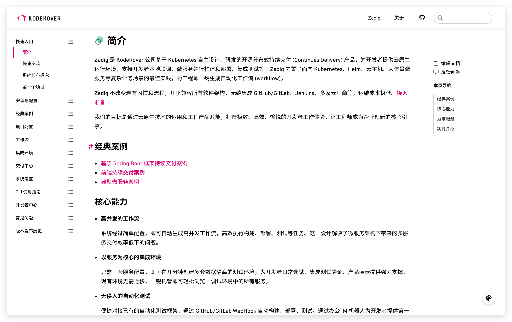
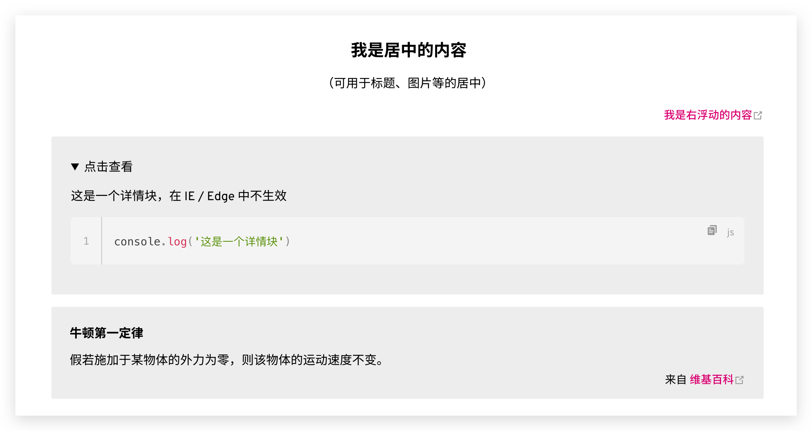

# Zadig 文档编写指南

## 目录

- [简介](#简介)
- [版本约定](#版本约定)
- [目录配置](#目录配置)
- [Markdown 书写规范](#markdown-书写规范)
  - [文档需要有一级标题](#文档需要有一级标题)
  - [标题严格遵守层级关系](#标题严格遵守层级关系)
- [语法扩展](#语法扩展)


## 简介

Zadig 文档使用 Markdown 格式编写，并使用 [Vuepress](https://vuepress.vuejs.org/) 将 Markdown 文件编译为 HTML 文件。

文档展现分为三部分：



- 左侧菜单目录。

  该部分需要编辑者根据目录生成规则进行配置，配置后将根据相应结构，进行目录的渲染。

- 中间文档内容。

  该部分将显示 Markdown 文件内的具体内容。

- 右侧页内索引。

  该部分将会自动渲染 Markdown 文件内所有的二级标题，并且支持快速跳转。


## 版本约定

文档版本通过根目录的文件夹名称进行约束，版本与内容文件夹的对应关系：

- 1.7.0 对应 v1.7.0 
- 1.6.0 对应 v1.6.0

其余依此类推。

如果需要新增版本，请在根目录中新建对应的文件夹，例如：1.8.0，并在该文件夹中新建对应的二级目录或者 Markdown 文档。每一个 Markdown 文档都需要在首部添加元数据信息（Metadata），用来标识该文档的标题、时间、永久链接等信息，文档生成器会根据 Metadata 自动渲染该文档到侧边栏。请在 permalink 配置中添加该文档的版本信息，例如：`permalink: /v1.8.0/quick-start/introduction/`，同时确保该文档的永久链接全局唯一。

```
---
title: 简介
date: 2021-12-09 09:24:00
permalink: /v1.8.0/quick-start/introduction/
---
```


## 目录配置


* 无论是**文件**还是**文件夹**，请为其名称添加上正确的**正整数序号**和`.`，从 `00` 或 `01` 开始累计，如 `01.文件夹`、`02.文件.md`，目录渲染会按照序号的顺序来决定其在侧边栏当中的顺序。
* 同一级别目录别内即使只有一个文件或文件夹也要为其加上序号。
* 文件或文件夹名称中间不能出现多余的点`.`，如`01.我是.名称.md`中间出现`.`将会导致解析错误

> 注意 序号只是用于决定目录的先后顺序，不一定需要连续，例如 `01、02、03...`，文档编写过程中可能会在两个文章中间插入一篇新的文章的情况，因此为了方便，可以采用间隔序号 `10、20、30...`，后续如果需要在 `10` 和 `20` 中间插入一篇新文档，可以给定序号 `15`。

## Markdown 书写规范

Zadig 文档支持标准的 Markdown 规范语法，但是在编写文档过程中需要遵守以下约定。

### 文档需要有一级标题

- 每个 Markdown 文件必须有全局唯一的一级标题；
- 标题必须能清晰表示该文件的内容。

### 标题严格遵守层级关系

文档会读取二级标题作为右侧导航，遵守层级关系以保证目录结构清晰。

```markdown
# h1
  ## h2
    ### h3
  ## h2
    ### h3
```


## 语法扩展

Markdown 容器是对 Markdown 语法的一个扩展，使用简单的语法就可以在页面中呈现丰富的效果。


### 信息框容器
**输入**
```` md
::: tip
这是一条提示
:::

::: warning
这是一条注意
:::

::: danger
这是一条警告
:::

::: note
这是笔记容器
:::
````

**输出**


自定义标题

**输入**

```` md
::: tip 我的提示
自定义标题的提示框
:::
````

**输出**


### 布局容器 

**输入**

```` md
::: center
  ### 我是居中的内容
  （可用于标题、图片等的居中）
:::

::: right
  [我是右浮动的内容](https://zh.wikipedia.org/wiki/%E7%89%9B%E9%A1%BF%E8%BF%90%E5%8A%A8%E5%AE%9A%E5%BE%8B)
:::

::: details
这是一个详情块，在 IE / Edge 中不生效
```js
console.log('这是一个详情块')
```
:::

::: theorem 牛顿第一定律
假若施加于某物体的外力为零，则该物体的运动速度不变。
::: right
来自 [维基百科](https://zh.wikipedia.org/wiki/%E7%89%9B%E9%A1%BF%E8%BF%90%E5%8A%A8%E5%AE%9A%E5%BE%8B)
:::
````

**输出**





