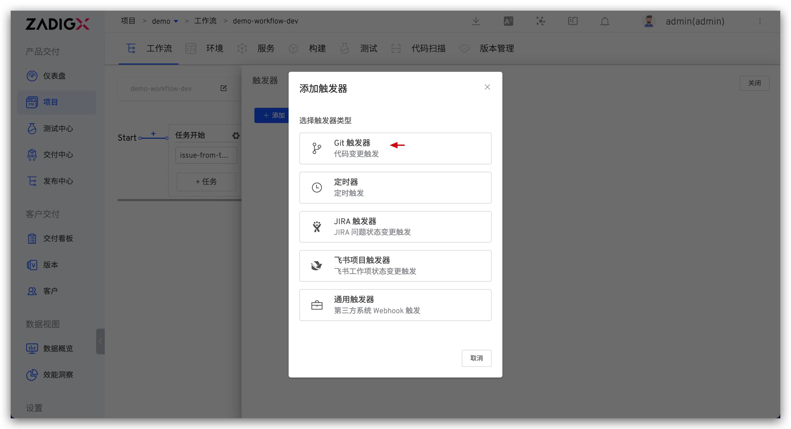
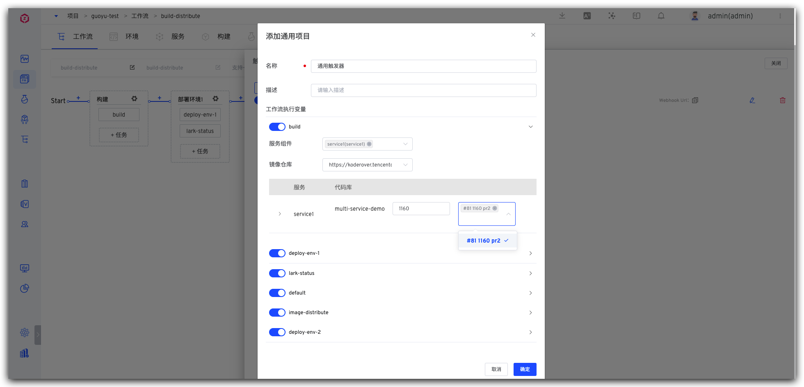

## 简介

本文主要介绍 Zadig 自定义工作流的触发器功能，包括：

- `Git 触发器`：代码变更后自动触发工作流
- `定时器`：定时触发工作流
- `通用触发器`：任意第三方系统通过 Webhook 自动触发工作流

产品工作流中支持 Git 触发器和定时器，具体使用可参考文档：[产品工作流触发器操作](/Zadig%20dev/project/workflow/#git-webhook)、[产品工作流定时器操作](/Zadig%20dev/project/workflow/#定时器)。

## Git 触发器

::: tip
1. 为工作流配置触发器，当满足触发条件的事件发生时会自动触发工作流执行。
2. 支持的代码源请参考文档：[代码源信息](/Zadig%20dev/settings/codehost/overview/#功能兼容列表)。
3. 在工作流中配置触发器参数即可，Zadig 会自动在对应代码库中创建 Webhook，适用于代码源集成账号对代码库有创建 Webhook 权限的场景。
:::

点击工作流右侧的 `触发器` -> 选择 `Git 触发器` -> 填写参数后保存即可。

参数说明：
- `工作流执行变量`：希望被 Webhook 触发执行的任务，以及任务中的具体配置
- 其他参数：请参考 [Git 触发器基本配置](/Zadig%20dev/project/workflow/#自动创建)中的描述

## 定时器

编辑工作流，点击右侧的 `触发器` -> 选择 `定时器`，通过配置定时器，可以实现周期性的运行工作流。支持定时循环、周期循环以及基于 Cron 表达式循环。

参数说明：

- 工作流执行变量：希望被触发执行的任务，以及任务中的具体配置
- 其他参数：参考[定时器配置](/Zadig%20dev/project/workflow/#定时器)

## 通用触发器
点击右侧的 `触发器` -> 选择 `通用触发器` 即可配置实现第三方 Webhook 触发工作流。

参数说明：
- `工作流执行变量`：希望被触发执行的任务，以及任务中的具体配置

复制 Webhook Url，在第三方系统中完成添加。

