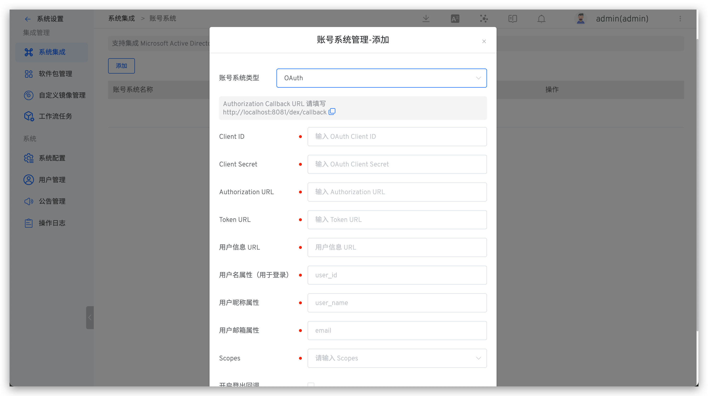

## 如何集成

Zadig 支持用户通过 OAuth 2.0 账号授权进行登录。访问`系统设置` -> `系统集成` -> `账号系统`-> 点击添加 -> 选择 `OAuth`。



**参数说明：**
| 参数名                 | 描述                                                 |
|------------------------|----------------------------------------------------|
| Client ID              | OAuth Client ID                                    |
| Client Secret          | OAuth Client Secret                                |
| Authorization URL      | 获取 Authorization Code 的地址                       |
| Token URL              | 获取 Access Token 的地址                             |
| 用户信息 URL            | 获取用户信息的地址                                     |
| 用户名属性（用于登录）     | 用于登录的用户名称属性                                 |
| 用户昵称属性             | 用户昵称属性，选填                                     |
| 用户邮箱属性             | 用户邮箱属性                                          |
| Scopes                 | 向账号系统请求的相关字段，可查阅账号系统相关文档            |

> 如果你的 OAuth provider 返回的用户信息不属于 root 层级，则需要通过 `.` 的方式嵌套配置。
>
> 例如在以下返回样例中，如需正确解析用户信息，则需将用户名属性设置为 `data.userinfo.user_id`，将用户昵称属性设置为 `data.userinfo.fullname`， 将用户邮箱属性设置为 `data.userinfo.email`。
```
{
    "code": 0,
    "data": {
        "userinfo": {
            "user_id": "2022001",
            "fullname": "demo",
            "email": "demo@example.com"
        },
        "timestamp": 1655882773,
        ...
    }
    ...
}
```

## [可选]设置为默认账号系统
参考[设置默认账号系统](/dev/settings/account/ldap/#可选-设置为默认账号系统)。
