## 代码源集成
Zadig 支持集成以下代码源：

| 代码源 | 如何集成 | 说明 |
|-------|---------|---|
| GitLab | [GitLab 代码源集成](/dev/settings/codehost/gitlab/)| 采用 OAuth2 的方式进行授权认证 |
| GitHub | [GitHub 代码源集成](/dev/settings/codehost/github/)| 采用 OAuth2 的方式进行授权认证 |
| Gerrit | [Gerrit 代码源集成](/dev/settings/codehost/gerrit/)| 采用 Basic Auth 的方式进行授权认证 |
| Gitee 社区版 | [Gitee 代码源集成](/dev/settings/codehost/gitee/)| 采用 OAuth2 的方式进行授权认证 |
| Gitee 企业版  | [Gitee 代码源集成](/dev/settings/codehost/gitee-enterprise/)| 采用 OAuth2 的方式进行授权认证 |
| 其他 | [其他代码源集成](/dev/settings/codehost/others/)|对于支持标准 Git 协议的代码源，使用 SSH Key 或 Access Token 的方式进行鉴权|

## 功能兼容列表

不同代码源在系统中可使用的功能有所差异，详细介绍如下。

| 系统功能 | GitHub | GitLab | Gerrit | Gitee 社区版 | Gitee 企业版| 其他代码源 |
|:--------|:-----------------------------|:---------|:----|:---|:---|:----|:----|
| 构建配置（[图示](#构建配置)） | ✅ | ✅ | ✅ | ✅ | ✅ |✅|
| 测试配置（[图示](#测试配置)） | ✅ | ✅ | ✅ | ✅ | ✅ |✅|
| 代码扫描配置（[图示](#代码扫描配置)） | ✅ | ✅ | ✅ | ✅ | ✅ |支持 Access Token 方式|
| 通用任务配置（[图示](#通用任务配置)） | ✅ | ✅ | ✅ | ✅ | ✅ |✅|
| 创建 K8s YAML 服务（[图示](#创建-k8s-yaml-服务)） | ✅ | ✅ | ✅ | ✅ | ✅ |—|
| 创建 K8s Helm Chart 服务（[图示](#创建-k8s-helm-chart-服务)） | ✅ | ✅ | ✅ | ✅ | ✅ |✅|
| 创建 K8s Helm Chart 服务模板（[图示](#创建-k8s-helm-chart-服务模板)） | ✅ | ✅ | ✅ | ✅ | ✅ |✅|
| 批量录入代码信息（[图示](#批量录入代码信息)） | ✅ | ✅ | — | ✅ | ✅ | — |
| 环境配置（[图示](#环境配置)） | ✅ | ✅ | — | — | — |—|
| 工作流触发器，自动配置（[图示](#自动配置工作流触发器)） | ✅ | ✅ | ✅ | ✅ | ✅ |—|
| 工作流触发器，手动配置（[图示](#手动配置工作流触发器)） | ✅ | ✅ | — | ✅ | ✅ |—|
| 工作流触发器，YAML 方式配置（[图示](#yaml-方式)） | — | ✅ | — | — | — |—|
| 测试触发器（[图示](#测试触发器)） | ✅ | ✅ | — | ✅ | ✅ |—|
| 代码扫描触发器（[图示](#代码扫描触发器)） | ✅ | ✅（额外支持正则表达式） | — | — | — |—|
| 导入 Helm Chart Values 文件（[图示](#导入-helm-chart-values-文件)） | ✅ | ✅ | — | — | — |—|
| 和 Jira Issue 联动（[图示](#和-jira-issue-联动)） | ✅ | ✅ | — | — | — |—|
| 基于 PR 的独立测试环境（[图示](#基于-pr-的独立测试环境)） | — | ✅ | — | — | — |—|
| 自定义任务来源配置（[图示](#自定义任务来源配置)） | ✅ | ✅ | — | ✅ | ✅ |✅|

## 图示

### 构建配置
::: details
</img>
:::

### 测试配置
::: details
</img>
:::

### 代码扫描配置
::: details
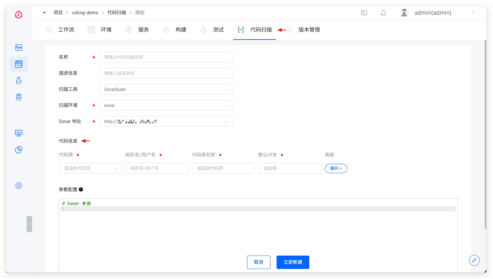</img>
:::

### 通用任务配置
::: details
</img>
:::

### 创建 K8s YAML 服务
::: details
</img>
:::

### 创建 K8s Helm Chart 服务
::: details
</img>
:::

### 创建 K8s Helm Chart 服务模板
::: details
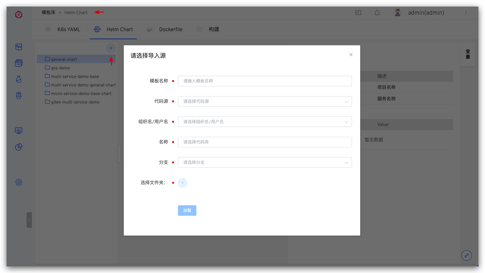</img>
:::

### 批量录入代码信息

::: details
</img>
</img>
:::

### 环境配置
::: details
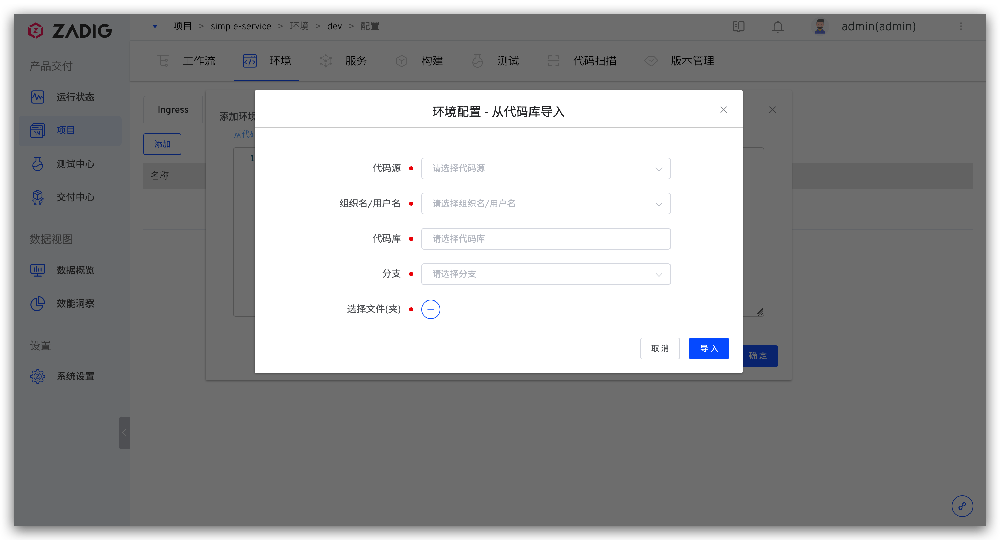</img>
:::

### 工作流触发器

#### 自动配置工作流触发器

::: details 产品工作流
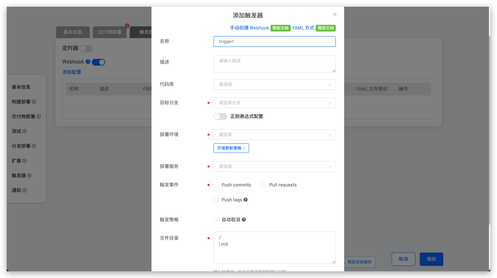</img>
:::

::: details 自定义工作流
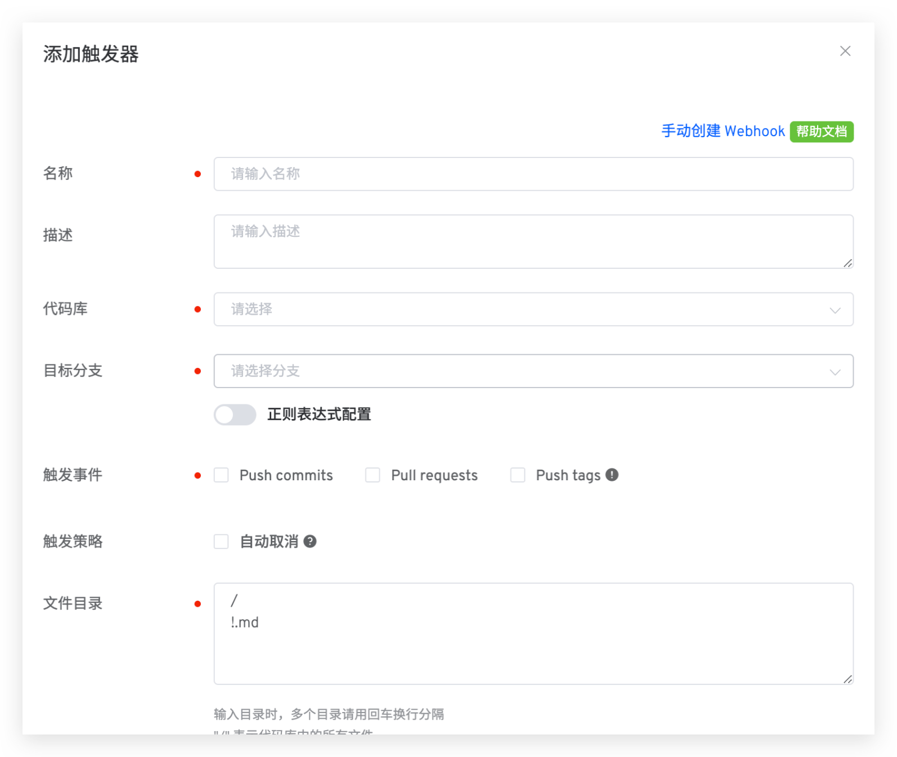</img>
:::

#### 手动配置工作流触发器

::: details 产品工作流
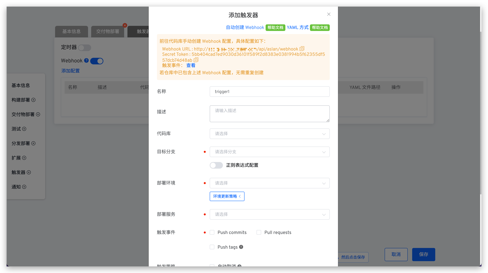</img>
:::

::: details 自定义工作流
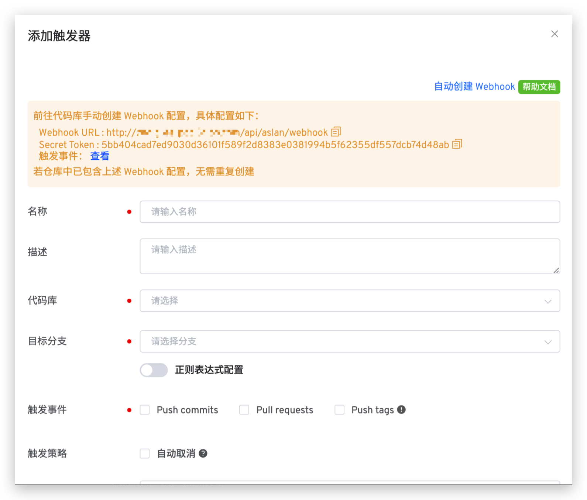</img>
:::

#### YAML 方式
> 仅产品工作流支持 YAML 方式配置触发器。

::: details
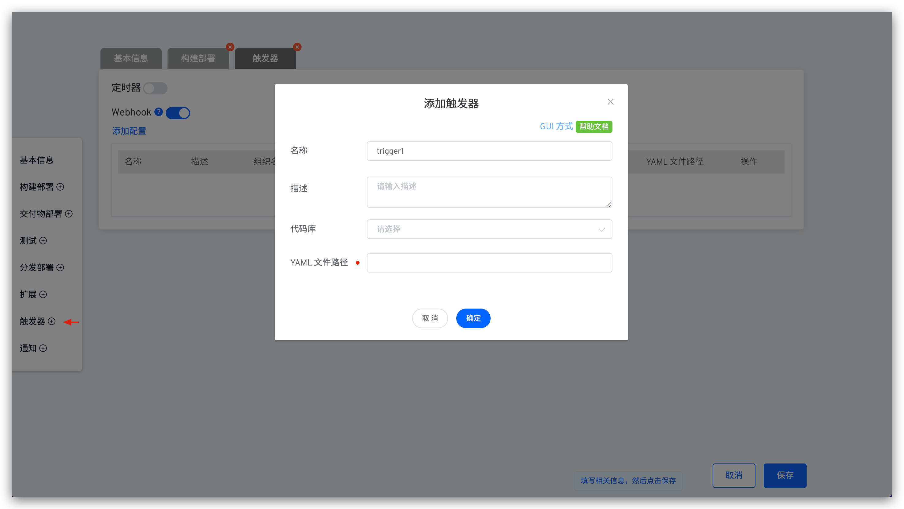</img>
:::

### 测试触发器
::: details
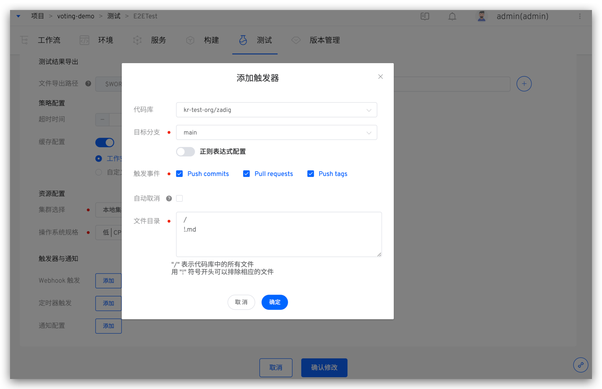</img>
:::

### 代码扫描触发器
::: details
</img>
:::

### 导入 Helm Chart Values 文件
::: details
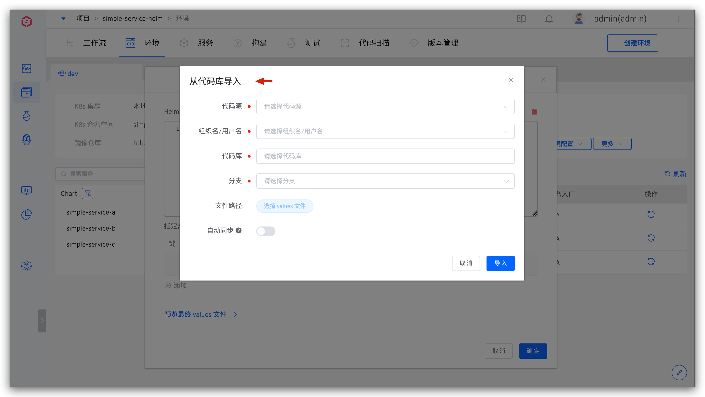</img>
:::

### 和 Jira Issue 联动

> 如何实现和 Jira Issue 的联动可参考文档：[在 Zadig 中追踪 Jira Issue](/dev/settings/jira/#在-zadigx-中追踪-issue)。

::: details
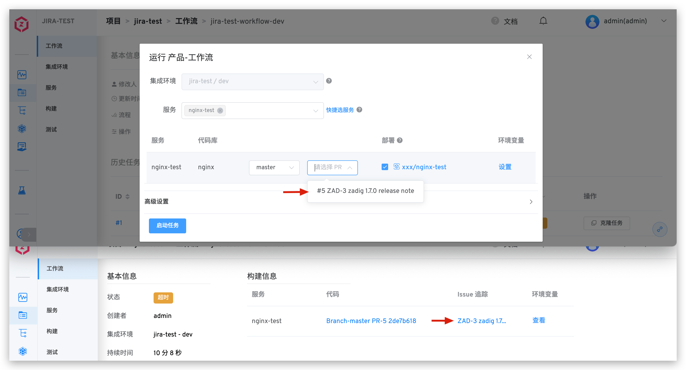</img>
:::

### 基于 PR 的独立测试环境

> 如何实现基于 PR 的独立测试环境可参考文档：[Pull Request 独立测试环境](/dev/workflow/trigger/#进阶使用场景-pull-request-独立测试环境)。

::: details
</img>
</img>
:::

### 自定义任务来源配置

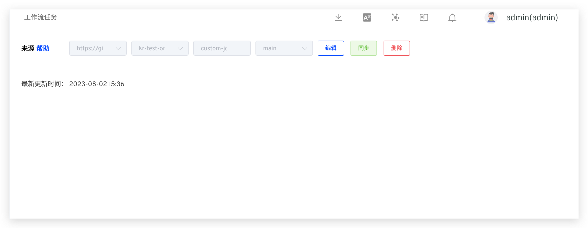</img>
