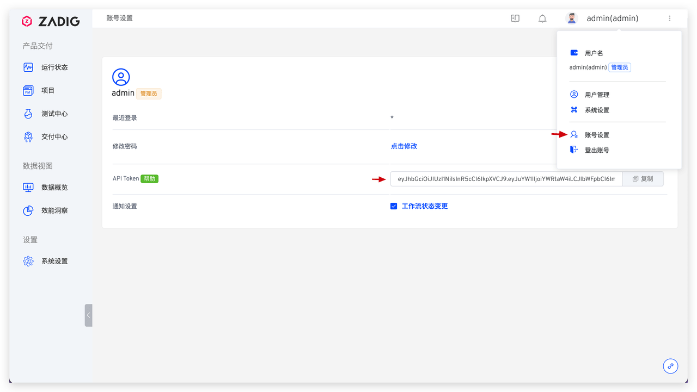
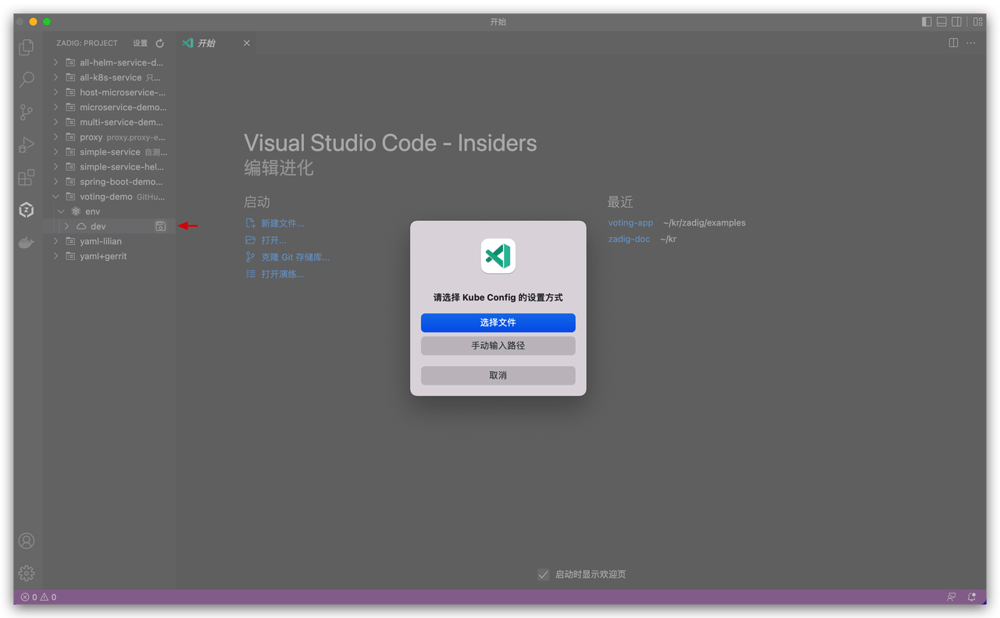
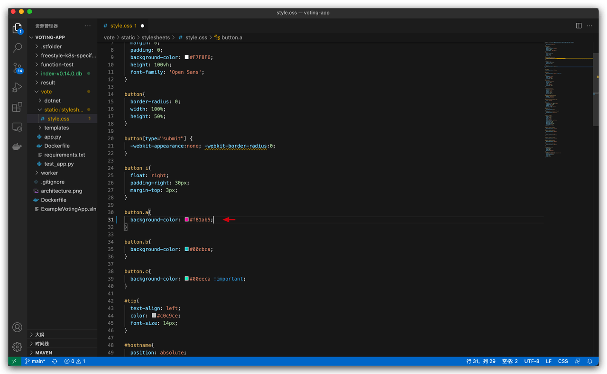
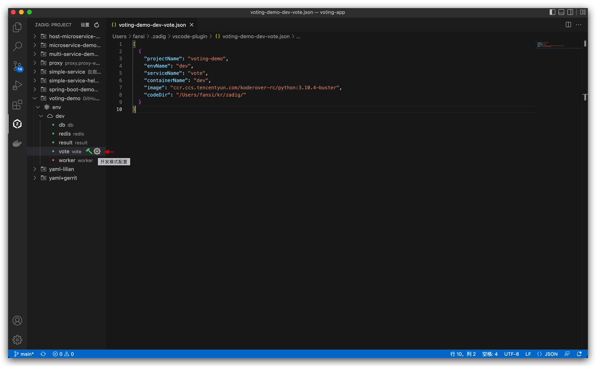

Zadig Toolkit 是 KodeRover 旗下开源产品 Zadig 的 Visual Studio Code 插件。
该插件让开发者无需关注平台切换的繁琐，在 IDE 中即可获得 Zadig 产品核心能力，轻松地对 Zadig 项目中的 Kubernetes 环境进行查看、做服务调试和升级、重启及日志实时查看等。
在日常开发代码过程，代码修改后无需提交到 Git 仓库，也无需打包镜像，即可将服务热部署到 Zadig 云端，方便开发者做服务自测、联调和集成验证。
目前 Zadig Toolkit 支持的功能如下：
- Zadig 环境查看
- 微服务重启、服务镜像更换、服务详情查看、Pod 实时日志查看、登录到服务实例 Pod
- 远程调试本地应用程序、配置远程开发环境

## 准备工作
- 系统准备：[安装 Zadig v1.12.0+ 版本](https://docs.koderover.com/zadig/install/overview/)
- 项目准备：参考[如何使用 GitHub + Zadig 实现产品级持续交付](https://www.koderover.com/tutorials/codelabs/GitHub/index.html?index=..%2F..index#0)

## 安装插件
- 打开 Visual Studio Code 并进入应用市场。
- 在应用市场中搜索 `Zadig Toolkit`，查看详情并安装。


## 配置插件
1. 打开已安装的 Zadig Toolkit 插件。
2. 点击`设置`进入插件配置页。


**配置参数说明：**
1. Zadig 部署地址：请根据实际协议，填写完整的 URI，例如：`http://zadig.com`。
2. Zadig API Token：进入 Zadig 系统，点击`账号设置`，如下图所示。



配置完成后，可在左侧栏看到 Zadig 系统中的项目。


## 如何使用
### 远程调试本地代码

下面以准备好的 `voting-demo` 项目为例，介绍如何通过 Zadig Toolkit 进行远程调试。

- 选择 `voting-demo` 项目 -> `dev` 环境，点击环境右侧图标设置 Kube Config（即：dev 环境所在集群的 config 配置文件），可在文件目录中选择该配置文件或手动输入其路径后回车。



- 选择 `vote` 服务，点击调试按钮进入开发模式。


- 选择本地开发代码目录，本例中为 [koderover/zadig](https://github.com/koderover/zadig) -> examples -> voting-app。


- 选择开发环境使用的基础镜像 `python:3.10.4-buster`。


- 稍等片刻待开发模式启动执行完毕后，进入开发容器 `dev`，所选目录中内容将自动同步到开发容器中。


- 修改本地代码并保存：修改第一个投票按钮的背景颜色。



- 改动的代码会自动同步到远端 `dev` 开发环境。在终端中进入 `vote` 目录，执行启动命令。

```bash
pip install -r requirements.txt -i https://mirrors.aliyun.com/pypi/simple/
gunicorn app:app -b 0.0.0.0:80 --log-file - --access-logfile - --workers 4 --keep-alive 0
```


- 访问 vote 服务地址，修改结果如下图所示。


- 点击红色按钮，确定结束开发模式，容器恢复正常。


至此一个完整的本地调试流程演示完毕。

### 查看环境和服务

日常联调测试过程中，需要对服务进行诊断，通过 Zadig Toolkit 可以查看服务的状态，重启服务，更换服务镜像，查看服务的实时日志、登录到服务对应的 Pod 中等。

- 右键点击服务可查看服务详情，在服务详情页面中可查看服务实时日志，点击镜像右侧的修改图标可修改服务镜像。


- 右键点击服务后，点击`重启服务`可以对服务进行重启。


- 右键点击服务，点击`终端`可登录到服务对应的 Pod 中。


### 配置远程开发环境

- 需要修改开发环境的基础镜像，或者修改同步的本地代码目录时，可通过点击`开发模式配置`按钮快速设置。

> 配置中各字段说明：
``` json
[
  {
    "projectName": 项目名称,
    "envName": 环境名称,
    "serviceName": 服务名称,
    "containerName": 开发环境容器名称,
    "image": 开发环境基础镜像,
    "codeDir": 同步至开发环境容器中的本地目录
  }
]
```



- 保存自定义的开发模式配置后，点击`启动开发模式`，会基于配置文件中的信息快速启动开发模式。


