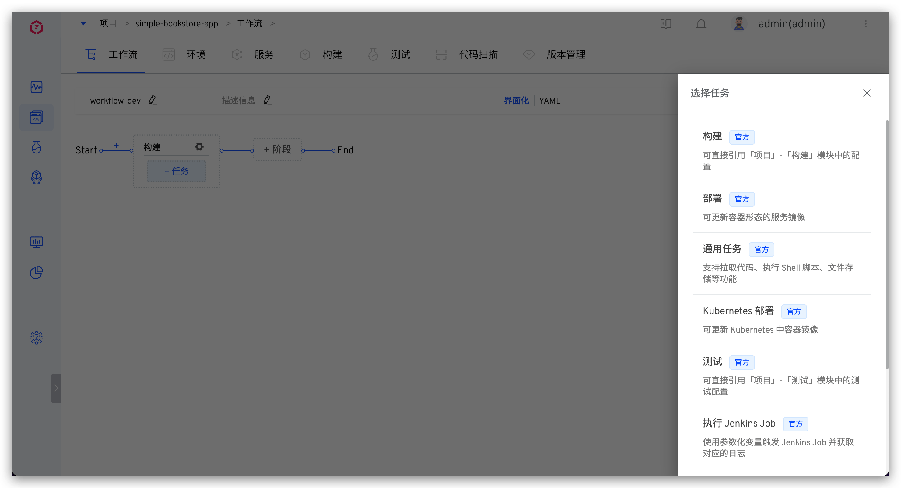
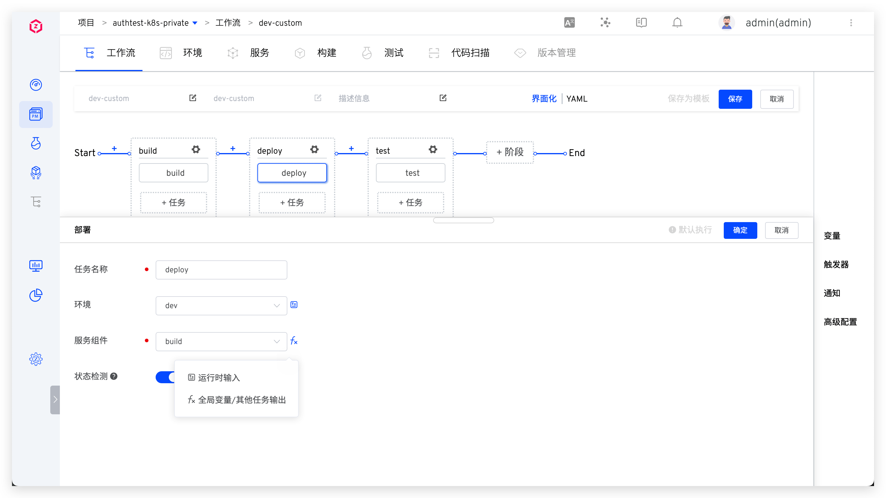
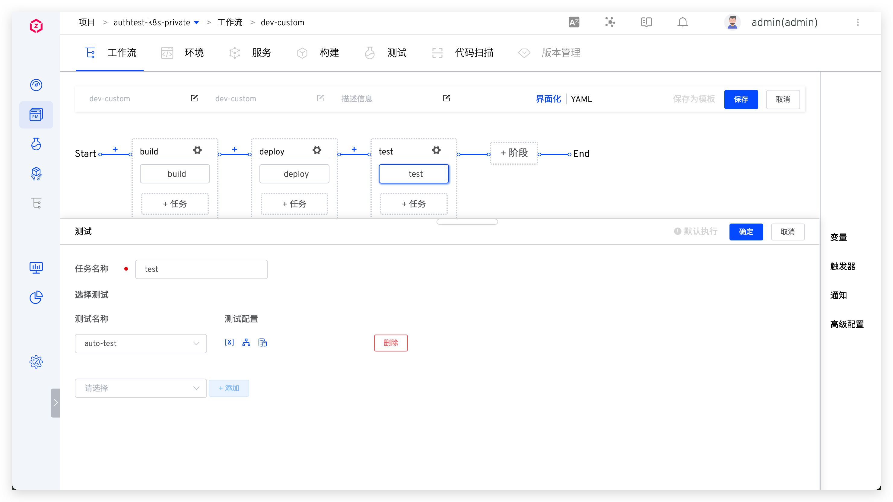
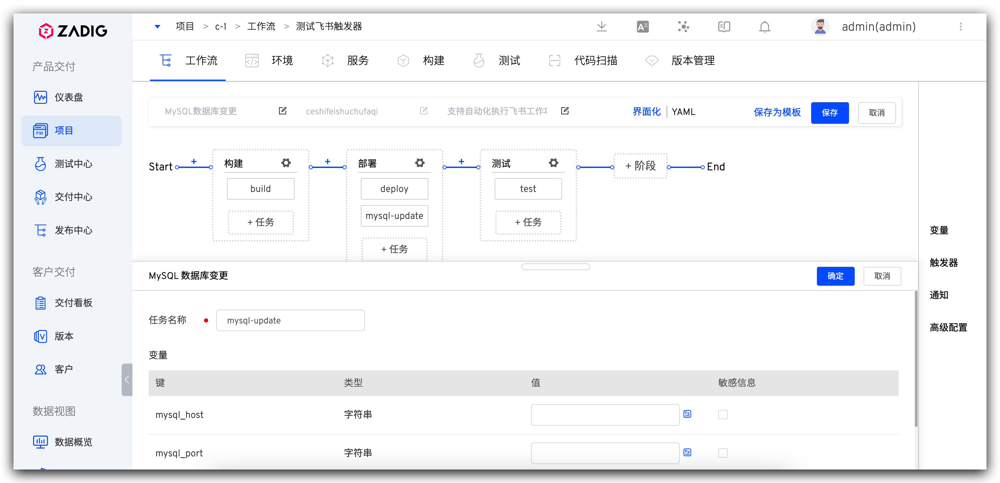

> 本文主要介绍自定义工作流中的任务如何使用。

工作流任务指在阶段下方点击 `+任务`为阶段增加的任务配置，系统目前支持`构建`、`部署`、`通用任务`、`Kubernetes 部署`、`测试`、`自定义任务` 等任务类型。

## 构建
### 构建任务

| 任务类型 | 自定义工作流 | 发布工作流 |
|:--------: | :----: |:--------:|
| 构建任务 | √ | - |

参数说明：
- `任务名称`：支持 32 位以内的小写英文字母、数字或者中划线，且以小写英文字母开头；在同一个自定义工作流中，任务名称需唯一
- `镜像仓库`：选择镜像仓库，当构建任务执行完成功后，构建出的镜像（即内置 $IMAGE 变量）会被推送到所选仓库中
- `服务组件`：选择服务组件以及该服务组件使用的构建名称，点击展开构建配置的 `设置` 可配置所选中的变量值以及代码库默认分支
  - `变量`：参考 [构建任务变量](/Zadig%20v1.18.0/project/common-workflow/#构建任务)
  - `分支配置`：选择代码库并指定默认分支，执行工作流时会默认使用指定的分支

::: tip
1. 内置构建任务中不再支持 `$ENV_NAME` 构建变量，需要确保构建脚本中未使用该变量。
2. 暂不支持使用 Jenkins 构建。
:::

## 部署
### 部署任务

| 任务类型 | 自定义工作流 | 发布工作流 |
|:--------: | :----: |:--------:|
| 部署任务 | √ | - |

参数说明：
- `任务名称`：支持 32 位以内的小写英文字母、数字或者中划线，且以小写英文字母开头；在同一个自定义工作流中，任务名称需唯一
- `环境`：选择要部署的环境，支持三种配置方式，具体请参考 [部署任务变量](/Zadig%20v1.18.0/project/common-workflow/#部署任务) 中关于环境信息的描述
- `服务组件`：配置要部署的服务组件，支持两种配置方式，具体请参考 [部署任务变量](/Zadig%20v1.18.0/project/common-workflow/#部署任务) 中关于服务信息的描述
- `状态检测`：若开启，部署任务会轮询服务运行状态
  - 服务实例的 Replicas = AvailableReplicas，则部署成功，工作流任务状态为成功
  - 服务容器因 ImagePullBackOff/ErrImagePull/CrashLoopBackOff/ErrImageNeverPull 原因而处于 waiting 状态时，视为部署失败，工作流任务状态为失败
  - 当超过部署超时时间后仍没有满足成功/失败条件，则部署超时，部署超时设置可参考 [服务策略配置](/Zadig%20v1.18.0/project/service/k8s/#策略配置)

### Kubernetes 部署任务

| 任务类型 | 自定义工作流 | 发布工作流 |
|:--------: | :----: |:--------:|
| Kubernetes 部署任务 | √ | √ |

部署指定集群指定命名空间中的容器。

参数说明：
- `任务名称`：在同一个自定义工作流中，任务名称需唯一
- `镜像仓库`：执行 Kubernetes 部署任务时，从哪个镜像仓库获取镜像来部署目标容器
- `集群`：待部署容器所在的集群
- `命名空间`：待部署容器所在的命名空间
- `容器`：指定命名空间中的容器应用（目前支持 Deployment 资源及 Statefulset 资源）
- `容器状态检测`：若开启，部署任务会轮询容器运行状态，在部署超时之前该容器正常运行，任务状态才为成功
- `超时时间`：容器部署超时时间

## 测试
### 测试任务

| 任务类型 | 自定义工作流 | 发布工作流 |
|:--------: | :----: |:--------:|
| 测试任务 | √ | √ |

支持在自定义工作流中引用测试配置。

选择具体的测试配置后，可对测试配置中的变量以及代码库默认分支进行设置。

### 代码扫描

| 任务类型 | 自定义工作流 | 发布工作流 |
|:--------: | :----: |:--------:|
| 代码扫描 | √ | √ |

使用已配置完成的 Sonar 进行代码扫描任务，对代码质量进行验证。代码扫描的配置详见 [代码扫描设置](/Zadig%20v1.18.0/project/common-workflow/#设置输出变量)

参数说明：
- `任务名称`：在同一个自定义工作流中，任务名称需唯一。
- `扫描名称`：选择项目中的代码扫描任务，可多选。
- `分支配置`：可对添加的代码库的指定分支进行扫描。如需修改代码扫描的代码库配置，可参照[代码扫描设置](/v1.16.0/project/common-workflow/#设置输出变量)

## 数据变更
### MySQL 数据库变更

| 任务类型 | 自定义工作流 | 发布工作流 |
|:--------: | :----: |:--------:|
| MySQL 数据库变更 | √ | √ |

对 MySQL 数据库执行 SQL 语句，实现数据和代码变更联动变更。

参数说明：
- `mysql_host`：数据库地址
- `mysql_port`：数据库端口号
- `username`：用户名
- `password`：密码
- `query`：SQL语句，支持多行

## 其他
### 通用任务

| 任务类型 | 自定义工作流 | 发布工作流 |
|:--------: | :----: |:--------:|
| 通用任务 | √ | √ |

支持拉取代码、执行 Shell 脚本、文件存储等功能。

- `执行环境`：参考 [构建环境配置](/Zadig%20v1.18.0/project/build/#构建环境)
- `代码信息`：参考 [代码信息配置](/Zadig%20v1.18.0/project/build/#代码信息)，也可以配置代码库类型的全局变量后，将代码源的值设置为全局变量/其他任务输出

- `变量`：参考 [通用任务变量](/Zadig%20v1.18.0/project/common-workflow/#通用任务-2)
- `添加步骤`：包括添加 Shell 脚本执行以及文件存储，可参考 [更多构建配置](/Zadig%20v1.18.0/project/build/#更多构建步骤)
- `高级配置`：参考 [高级配置](/Zadig%20v1.18.0/project/build/#高级配置)

### 镜像分发

| 任务类型 | 自定义工作流 | 发布工作流 |
|:--------: | :----: |:--------:|
| 镜像分发 | √ | √ |

可将镜像 Retag 后推送到指定镜像仓库。

参数说明：
- `任务名称`：在同一个自定义工作流中，任务名称需唯一。
- `服务组件`：需要做镜像分发的服务组件，支持手动输入和其他任务输出两种方式。
- `源镜像仓库`：待分发的镜像来源。
- `目标镜像仓库`：镜像分发的目标仓库。
- `镜像版本规则`：开启后，镜像分发任务将根据指定规则生成目标镜像的版本，支持变量和常量组合的方式来配置。

执行时不允许用户指定目标镜像版本，所有服务的镜像版本都按照配置中的规则生成

镜像版本规则中可用变量列表：

| 变量名 | 说明              |
|--------|-----------------------------|
| `{{.project}}` | 项目名称 |
| `{{.workflow.name}}` | 工作流名称 |
| `{{.workflow.task.creator}}`  | 工作流任务执行者 |
| `{{.workflow.task.timestamp}}` | 工作流任务执行时间，Unix 时间戳格式 |
| `{{.workflow.task.id}}` | 工作流任务序号 |
| `{{.workflow.input.imageTag}}` | 当服务组件指定为运行时输入时可使用该变量，其值为输入的值 |
| `{{.job.<部署任务名称>.envName}}`| 指定部署任务中的环境名称 |
| `{{.job.preBuild.imageTag}}` | 当服务组件指定为其他任务输出时可使用该变量，其值为前置构建任务的镜像版本 |

除上述变量外，还支持使用前置任务中输出的变量：

- 对于构建任务，变量的形式为：`{{.job.<任务名>.<服务名>.<服务组件名>.output.<输出变量名>}}`
- 对于其他任务，变量的形式为：`{{.job.<任务名>.output.<输出变量名>}}`

### 自定义任务
自己定义任务的实现，在工作流中配置自定义任务，详细使用方法请参考 [自定义任务](/Zadig%20v1.18.0/settings/custom-task/)。
