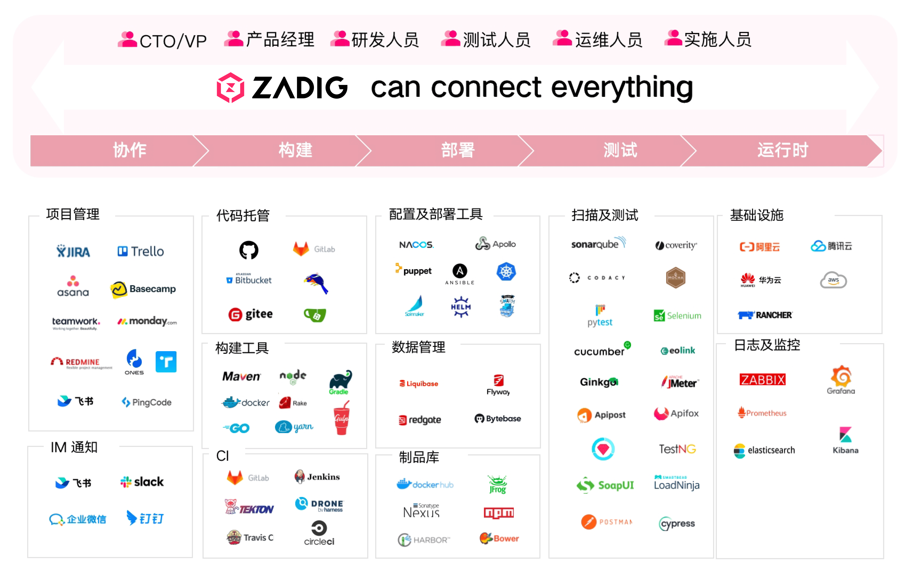

## 平台简介

Zadig 是由 KodeRover 公司基于 Kubernetes 研发的自助式云原生 DevOps 平台，源码 100% 开放。Zadig 提供灵活可扩展的工作流支持、多种发布策略编排以及一键安全审核等特性。该平台还支持定制的企业级 XOps 敏捷效能看板，深度集成多种企业级平台，并通过项目模板化批量快速接入，实现数千个服务的一键纳管治理。其主要目标是帮助企业实现产研的数字化转型，使工程师成为创新引擎，并为数字经济的无限价值链接提供支持。

## Zadig 价值链

## 与传统 DevOps 方案比对

现存做法大多以「单点工具 + 写脚本」或运管类平台为主，Zadig 则是面向开发者视角，中立，云原生一体化价值链平台。

## 业务架构

## 用户价值

建立产研全流程工程协同基线，科学化运营，释放团队生产力，让每个人的价值得到体现。

## 核心能力

- **灵活易用的高并发工作流**

  简单配置，可自动生成高并发工作流，多个微服务可并行构建、并行部署、并行测试，大大提升代码验证效率。自定义的工作流步骤，配合人工审批，灵活且可控的保障业务交付质量。

- **面向开发者的云原生环境**

  分钟级创建或复制一套完整的隔离环境，应对频繁的业务变更和产品迭代。基于全量基准环境，快速为开发者提供一套独立的自测环境。一键托管集群资源即可轻松调试已有服务，验证业务代码。

- **高效协同的测试管理**

  便捷对接 Jmeter、Pytest 等主流测试框架，跨项目管理和沉淀 UI、API、E2E 测试用例资产。通过工作流，向开发者提供前置测试验证能力。通过持续测试和质量分析，充分释放测试价值。

- **强大免运维的模板库**

  跨项目共享 K8s YAML 模板、Helm Chart 模板、构建模板、工作流模板等，实现配置的统一化管理。基于一套模板可创建数百微服务，开发工程师少量配置可自助使用，大幅降低运维管理负担。

- **安全可靠的发布管理** 

  自定义工作流打通人、流程、内外部系统合规审批，支持灵活编排蓝绿、金丝雀、分批次灰度、Istio 等发布策略。通过多集群、多项目视角呈现生产环境的状态，实现发布过程的透明可靠。

- **稳定高效的客户交付** 

  简化供应商对客户版本、客户私有云、公有云、离线环境的产品实施过程以及产品许可证的管理。供应商管理平面联动客户控制台完成对客户环境实施、更新、维护过程，提升企业对外服务质量。

- **客观精确的效能洞察**

  全面了解系统运行状态，包括集群、项目、环境、工作流，关键过程通过率等数据概览。提供项目维度的构建、测试、部署等客观的效能度量数据，精准分析研发效能短板，促进稳步提升。

- **云原生 IDE 插件**

  开发者无需平台切换，在 VScode IDE 中即可获得 Zadig 产品核心能力。编写代码后，无需打包镜像，即可一键热部署到自测环境，快速完成自测、联调和集成验证，开发效率倍增。