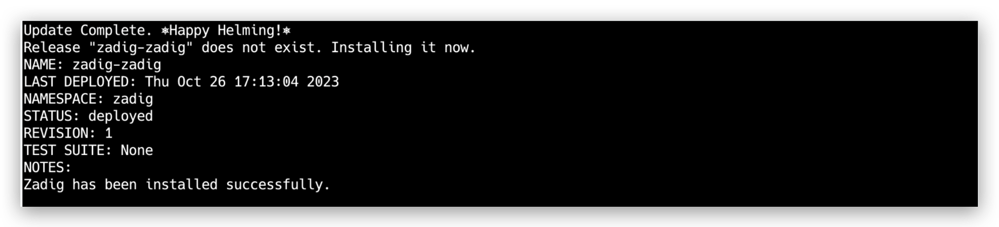
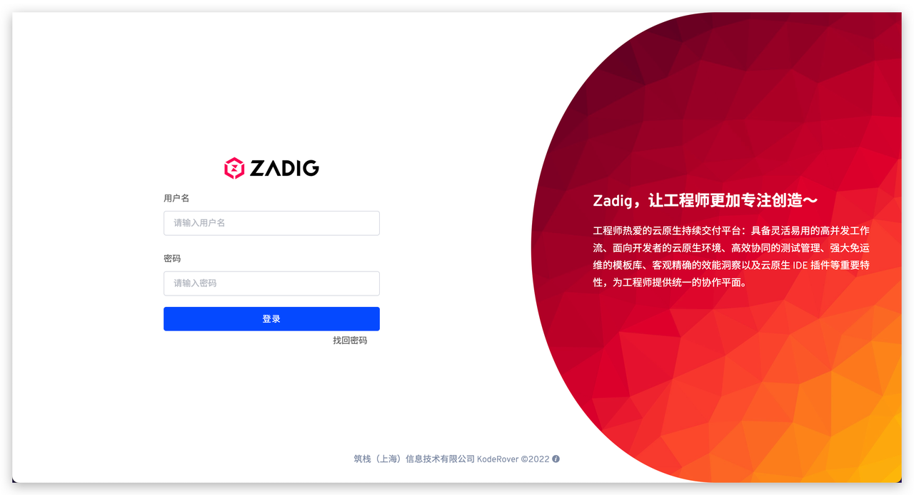
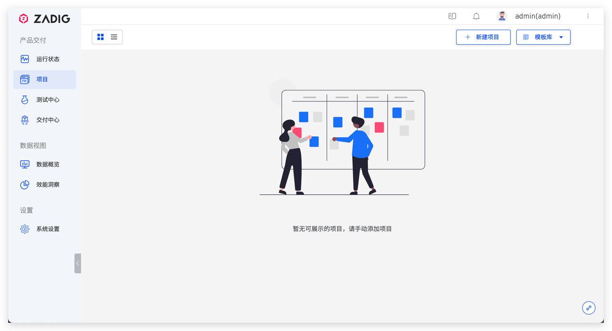

本文主要介绍如何在本地安装 Zadig。

## 步骤 1：准备 Kubernetes 集群

使用 minikube、KinD 等工具在本地拉起一套 K8s 集群。

::: tip
本地 K8s 集群版本 v1.16~v1.26，且满足至少 4C8G 的资源配置。
:::

相关工具安装参考如下：

- [安装 minikube](https://minikube.sigs.k8s.io/docs/start/)
- [安装 docker-desktop](https://www.docker.com/products/docker-desktop/)
- 更多工具请参考其官方安装文档

## 步骤 2：执行安装脚本

在本地集群中执行以下脚本：

> 如果安装 Zadig 后要集成外部系统，请确保安装的 Zadig 系统有公网 IP， 以保证其可访问。

``` bash
export IP=<本机 IP 地址>
export PORT=< 30000 - 32767 任一端口>
curl -SsL https://download.koderover.com/install?type=quickstart | bash
```

安装成功后系统会自动初始化登录账号和密码。



## 步骤 3：访问系统

::: tip
如果使用的是 KinD 拉起的集群，由于其自身特性，需要打通本机端口到 K8s 集群 NodePort 服务的通路，参考命令如下：

``` bash
kubectl -n zadig port-forward svc/gateway-proxy 32000:80
```
:::

访问 IP:PORT，使用默认账号密码 admin/Zadig123 登录即可。




::: tip
专业版许可证获取和配置参考文档：[许可证](/Zadig%20v2.0.0/enterprise-mgr/#许可证)
:::

## Zadig 卸载

设置 NAMESPACE 环境变量后使用脚本来一键卸载当前安装的 Zadig 系统，命令如下：

```bash
export NAMESPACE=zadig
curl -SsL https://github.com/koderover/zadig/releases/download/v2.0.0/uninstall.sh | bash
```

也可以执行官方最新版卸载脚本：
```bash
export NAMESPACE=zadig
curl -SsL https://download.koderover.com/install?type=uninstall | bash
```
