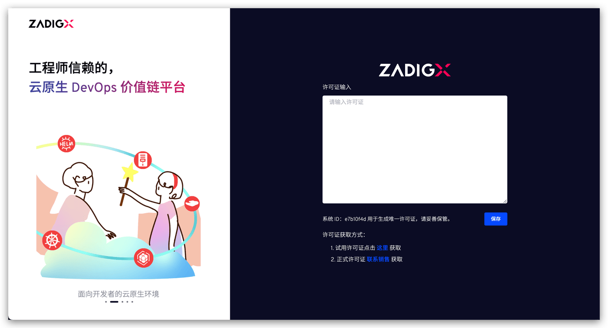

本文档主要介绍企业如何试用 ZadigX，其中包括资源准备及详细的安装步骤。

## 资源准备

1. Kubernetes 集群，版本：v1.16 ~ v1.26，节点建议：至少 4C8G，且对该集群有管理员操作权限
2. Helm 命令行工具，版本：v3.5+，可以从[此处](https://github.com/helm/helm/releases)获取
3. 网络：
    - 如果选择 `IP+端口` 的方式访问 ZadigX 系统，需要确保集群节点有外部 IP 可供访问
    - 如果选择`域名`方式访问 ZadigX 系统，需要准备可用的域名

::: tip 注意事项
1. 若需要使用 Zadig 内置的存储组件（MySQL / MongoDB / MinIO），在安装之前，需要配置 Kubernetes 默认的 StorageClass，以支持创建 PVC 用于数据持久化<br>
2. 受限于部分类型集群网络插件及其配置，Service 的后端 Pod 可能无法通过该 Service 访问自身，在安装之前请确保集群中不存在此问题
3. 配置 kube-dns 服务，以支持服务和 Pod 之间的按名称寻址
:::

## 试用安装

### 第一步：安装

使用[官方安装小助手](https://www.koderover.com/trial)一键快速安装。

> 安装过程受硬件配置和网络情况影响，不同环境下的时间可能不同，可以执行 kubectl -n {Namespace} get pod 查询服务状态，当所有服务都是 RUNNING 状态时，则说明部署成功。

### 第二步：获取许可证

安装后，通过[官网自助](https://www.koderover.com/getLicense)获取试用许可证，试用过程如需获得帮助可加群。


### 第三步：配置许可证

待 ZadigX 成功部署后，访问 ZadigX 系统，输入许可证保存后登录即可。

> 初始化账号密码在安装时指定。



## 升级

试用版本不建议升级, 若需要升级试用版 ZadigX，请参考以下操作：

### 第一步：确认版本信息
- 请确认当前安装的 ZadigX 版本，并确定要升级的目标版本。
- 请勿跨版本升级，若当前版本与目标版本之间存在多个版本，请逐版本操作。
> 可以通过命令 helm list -n {Namespace} 获取当前 ZadigX 的版本信息。

### 第二步：备份数据以及安装参数
- 参考文档：[备份数据](/Zadig%20v2.0.0/stable/backup-and-restore/#数据备份)进行数据备份。
- 通过命令 helm get values -n {Namespace} {ReleaseName} > zadigx.yaml 备份当前的安装参数。

### 第三步：执行升级
- 升级时请勿使用 ZadigX 
- 执行以下命令升级 ZadigX：
``` bash
helm repo add koderover-chart https://koderover.tencentcloudcr.com/chartrepo/chart 
helm repo update
helm upgrade {releaseName} -n {Namespace} --version={Version} koderover-chart/zadigx -f zadigx.yaml
```

### 第四步：升级检查
检查以下功能是否正常，对此次升级做验收：
1. 检查账号系统是否可以正常登录。
2. 检查项目/环境/服务/系统集成的数据是否正常。
3. 检查验收项目中的环境、服务数据是否展示正常。
4. 检查验收项目中的产品/自定义工作流（若有）是否可正常运行。

## 卸载
- 卸载 ZadigX 时，不会删除通过 ZadigX 创建的环境，服务等资源；若您需要清理资源，请手动操作。
- 执行以下命令卸载 ZadigX
``` bash
helm uninstall {ReleaseName} -n {Namepsace}
```

