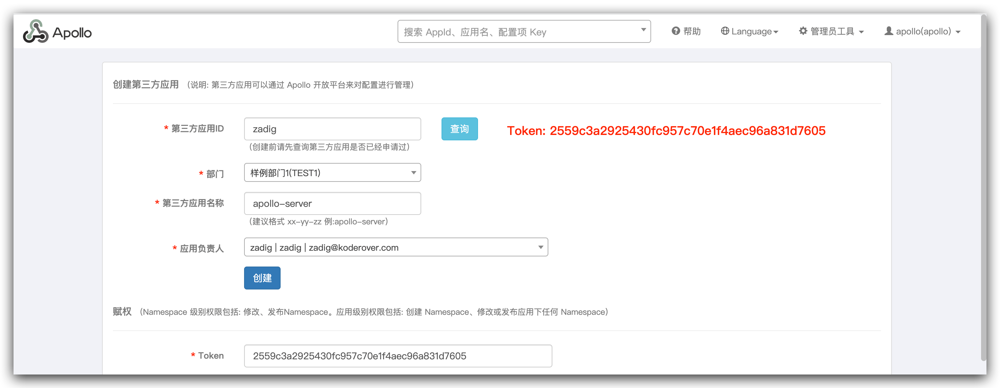
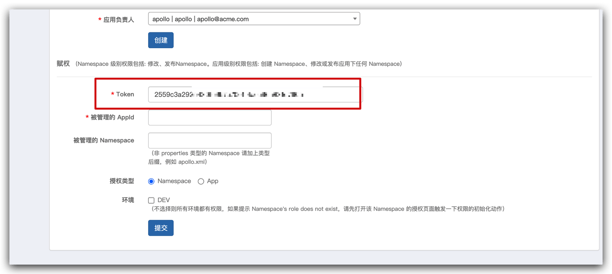
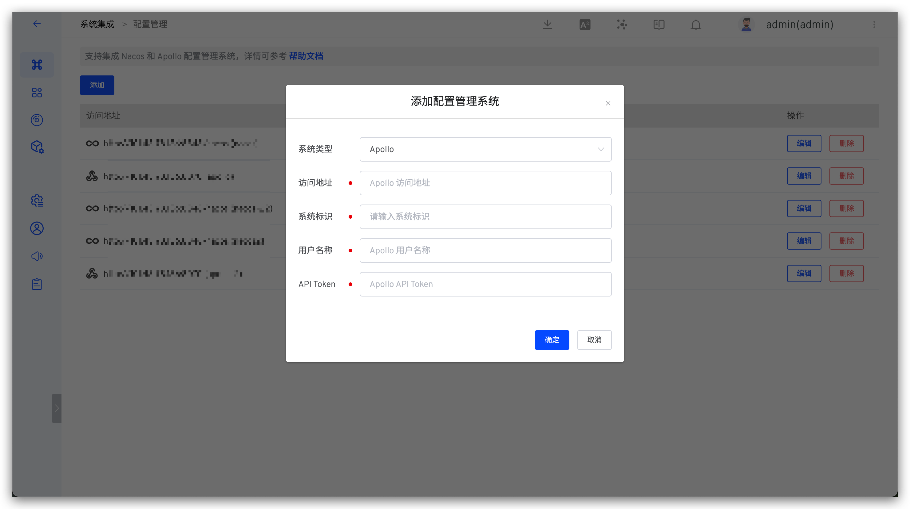

本文主要介绍如何在 Zadig 中集成和使用 Apollo，实现高效稳定的配置变更管理。

## 如何接入

### 第一步：在 Apollo 中创建第三方应用
进入 `管理员工具` ->`开放平台授权管理`，填写信息，完成第三方应用创建。

创建成功后复制下方的 Token。

### 第二步：在 Zadig 中集成 Apollo
访问 `系统设置`-> `系统集成` -> `配置管理`，添加 Apollo 配置并通过系统连通性校验即可。

参数说明：

- `系统类型`：选择 `Apollo`
- `访问地址`：企业内部 Apollo 系统的地址，比如：`https://apollo.koderover.com`
- `系统标识`：自定义，方便在 Zadig 系统中快速识别，系统标识信息需唯一
- `用户名称`：Apollo 系统中存在的用户，用于和 Zadig 系统交互
- `API Token`：第二步中复制的 Token

## 如何使用

在自定义工作流中编排 Apollo 配置变更任务即可实现 Apollo 配置自动变更，参考文档：[Apollo 配置变更](/Zadig%20v2.0.0/project/workflow-jobs/#apollo-配置变更)。
