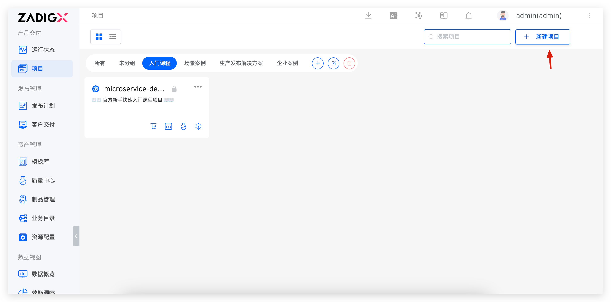
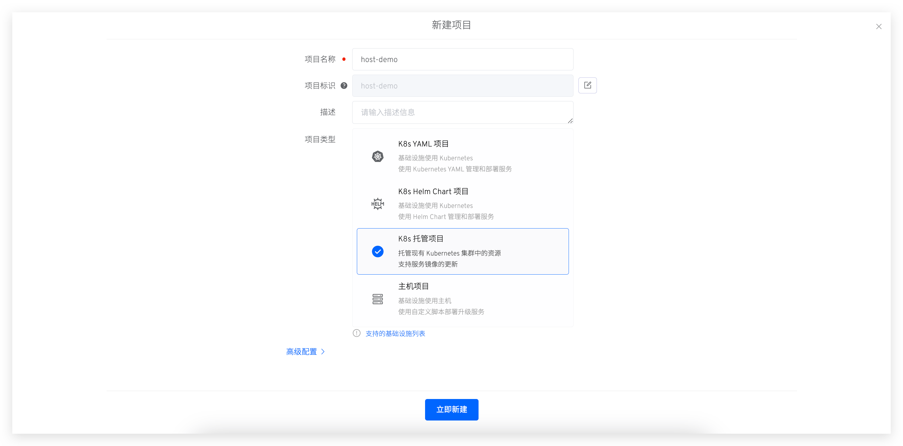
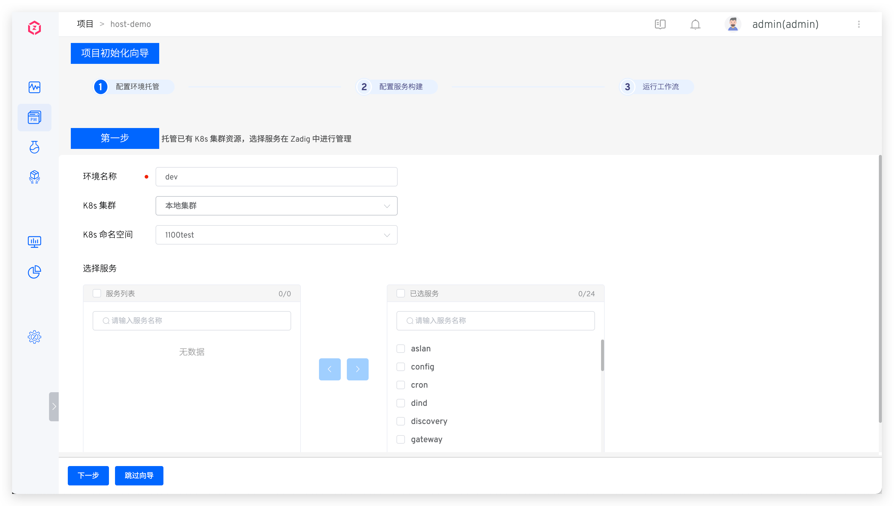
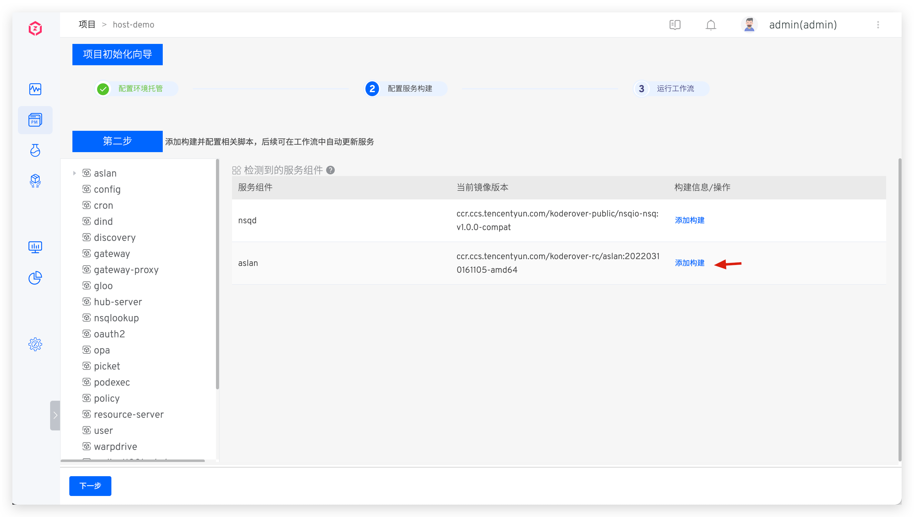
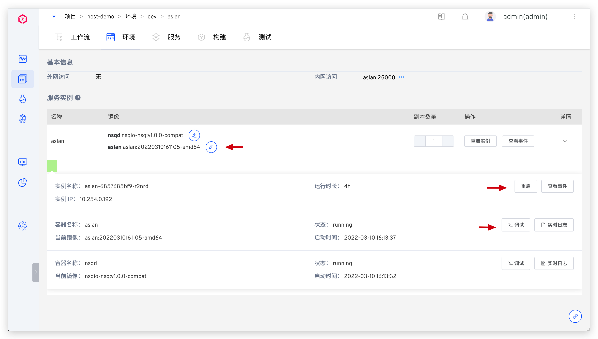
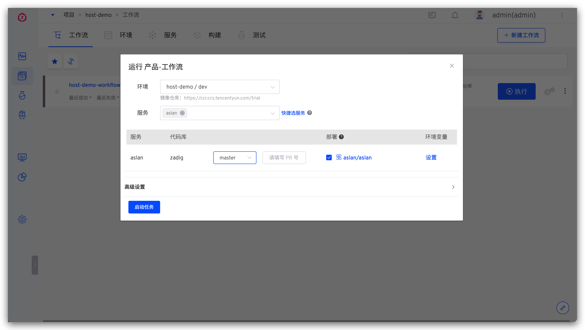
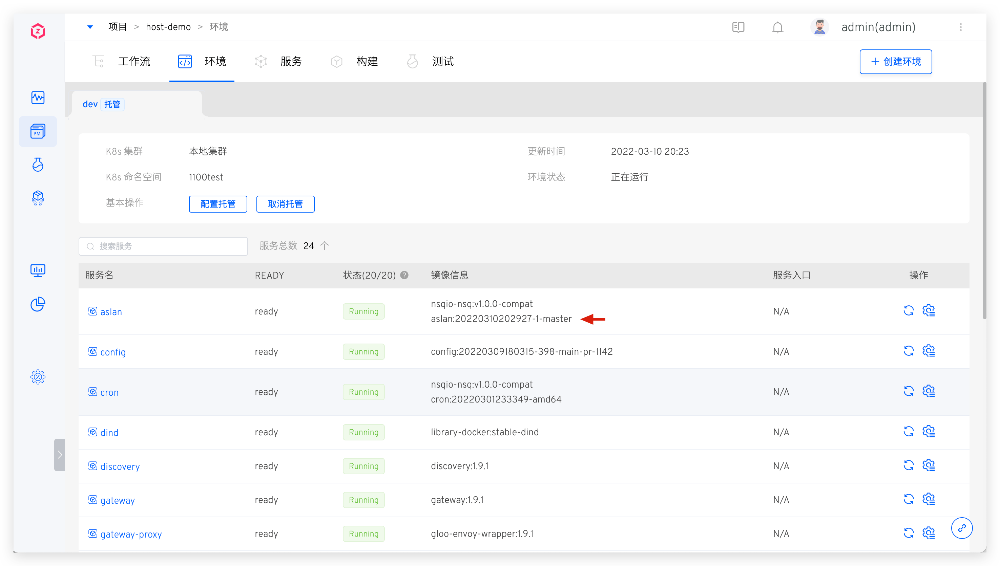

支持对 Kubernetes 集群指定命名空间的资源进行托管管理，通过在 Zadig 中创建环境并托管服务，实现跨集群的测试环境管理、服务管理。

## 快速搭建项目

以下内容为 K8s 托管项目的快速搭建步骤，如果你需要具体的案例，可参考：[教程](https://www.koderover.com/tutorials-detail/codelabs/Hosting-Namespace/index.html?index=..%2F..index#0)。

### 新建项目
进入 Zadig 系统，点击「项目」-「新建项目」，填写项目名称，选择`K8s 托管项目`的项目类型新建项目。

### 配置环境托管
填写环境名称，选择托管集群和集群里的命名空间，并选择要被托管管理的服务。

::: tip
1. Zadig 可对本地集群和非本地集群的服务进行托管，本地集群指 Zadig 系统所在的集群。
2. 配置多集群请参考 [集群管理](/Zadig%20v2.0.0/pages/cluster_manage/)。
:::

### 配置服务构建
系统会自动解析服务组件，点击`添加构建`，为服务组件添加构建配置，可参考文档：[构建配置](/Zadig%20v2.0.0/project/build/)。

> 服务组件的概念介绍可参考文档：[服务组件](/Zadig%20v2.0.0/env/overview/#什么是服务组件)。

点击`下一步`，至此完成了该 Kubernetes 集群的服务托管。集成环境中可预览被托管服务的状态、镜像等信息。

点击具体的服务，可查看该服务更细节的信息，包括但不限于修改服务镜像版本、查看服务部署事件、查看实时日志等操作。

### 运行工作流
触发工作流，选择要更新的服务并启动任务，实现被托管服务的自动化部署升级。待工作流执行完毕，进入环境查看服务被自动更新。

## 托管项目切换 K8s YAML 项目

用户可根据需要将现有托管项目一键切换为 K8s YAML 项目。

::: tip 切换后：
1. 工作流/构建/测试/代码扫描/权限/协作模式会保持不变，同时新增服务管理能力。
2. 所有托管的环境在新项目中均展示。
3. 所有环境下的服务配置均会被托管展示，多个相同服务配置仅保留一个。
:::

进入对应托管项目，点击 `切换项目类型`，完成项目类型切换。
