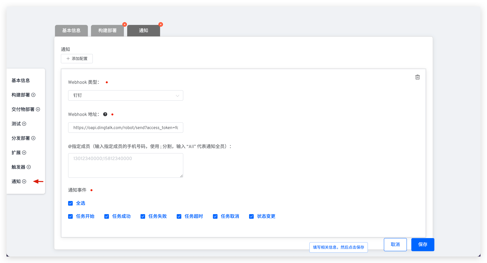
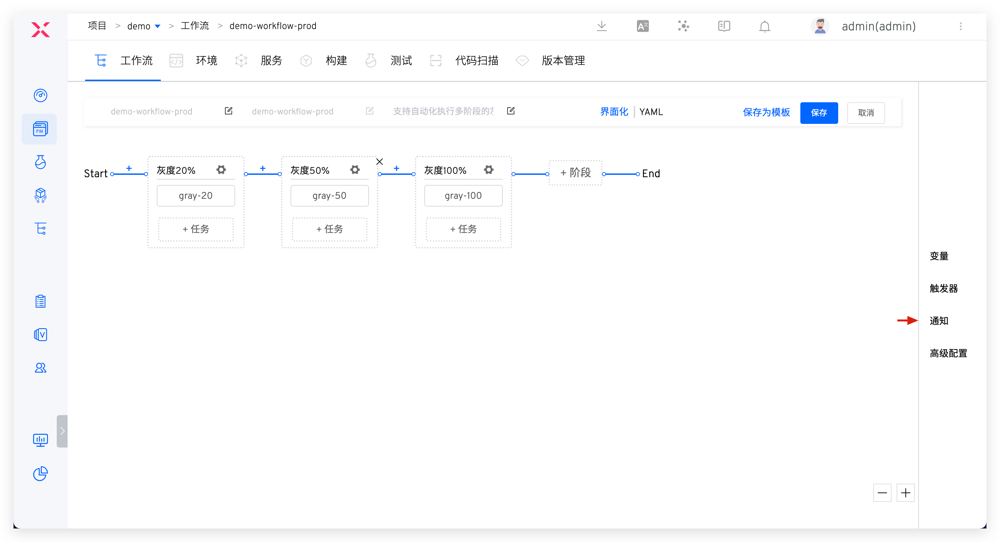
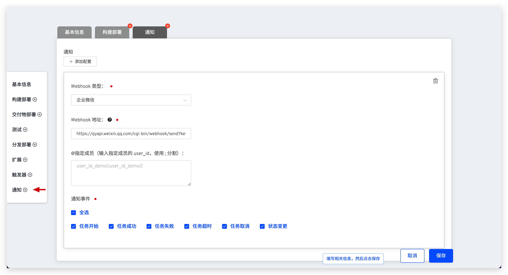
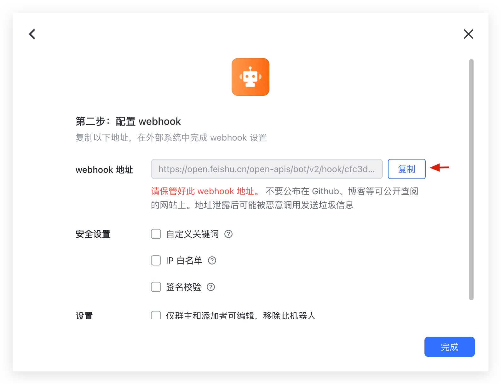
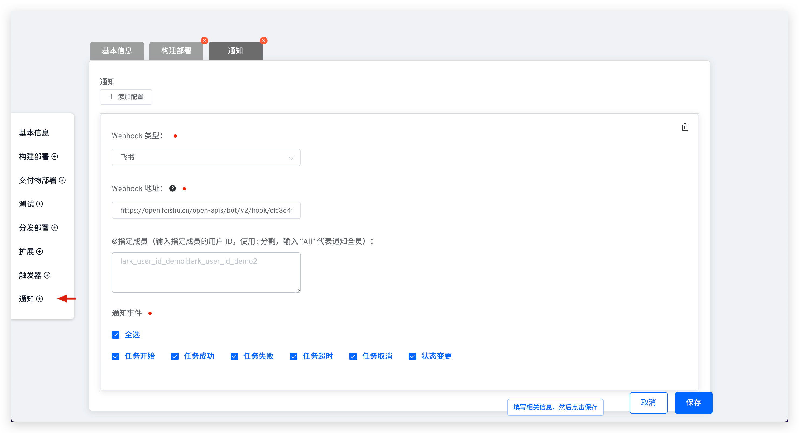
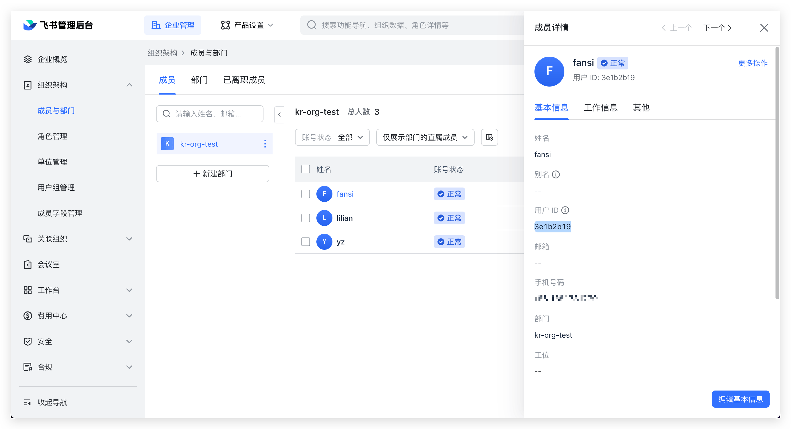

本文主要介绍如何使用 Zadig 工作流的通知功能。
- 支持配置多个通知，支持通知到指定人
- 支持在工作流的不同阶段发起通知（开始运行、运行成功、取消运行...）
- 支持发送通知信息到钉钉、企业微信、飞书

## 钉钉

### 如何配置

第一步：配置钉钉自定义机器人并获取 Webhook 地址，可参考文档：[添加钉钉自定义机器人](https://open.dingtalk.com/document/robots/custom-robot-access#title-jfe-yo9-jl2)。

::: tip
在钉钉中配置自定义机器人时，若安全设置指定为`自定义关键字`，请配置`工作流`三个字即可。
:::

第二步：编辑工作流，添加钉钉通知。

产品工作流通知配置入口：

自定义工作流通知配置入口：

参数说明：

- `Webhook 类型`：选择`钉钉`
- `Webhook 地址`：第一步中获取的 Webhook 地址
- `@指定成员`：如果希望通知到指定人，输入对应钉钉用户的手机号，多个用户用 `;` 分割即可
- `通知事件`：配置通知的规则，工作流状态可多选

### 通知效果

## 企业微信

### 如何配置

第一步：添加企业微信群机器人并获取 Webhook 地址，参考文档：[如何设置企业微信群机器人](https://open.work.weixin.qq.com/help2/pc/14931?person_id=1&is_tencent=)。

第二步：编辑工作流，添加企业微信通知。

产品工作流通知配置入口：

自定义工作流通知配置入口：

参数说明：

- `Webhook 类型`：选择`企业微信`
- `Webhook 地址`：第一步中获取的 Webhook 地址
- `@指定成员`：如果希望通知到指定人，输入对应用户的 user_id，多个用户用 `;` 分割即可
- `通知事件`：配置通知的规则，工作流状态可多选

> 获取 user_id 可参考文档：[如何获取成员的 UserID](https://developers.weixin.qq.com/community/develop/doc/00084af5cc8010eaee9a1163f58400)

### 通知效果

## 飞书

### 如何配置

第一步：在飞书群中添加自定义机器人并获取 Webhook 地址，参考文档：[如何在群组中使用机器人](https://www.feishu.cn/hc/zh-CN/articles/360024984973)

第二步：编辑工作流，添加飞书通知。

产品工作流通知配置入口：

自定义工作流通知配置入口：

参数说明：

- `Webhook 类型`：选择`飞书`
- `Webhook 地址`：第一步中获取的 Webhook 地址
- `@指定成员`：如果希望通知到指定人，输入对应用户的 ID，多个用户用 `;` 分割即可
- `通知事件`：配置通知的规则，工作流状态可多选

> 进入飞书管理后台，点击组织架构 > 成员与部门，选定成员即可获得 ID。

### 通知效果

