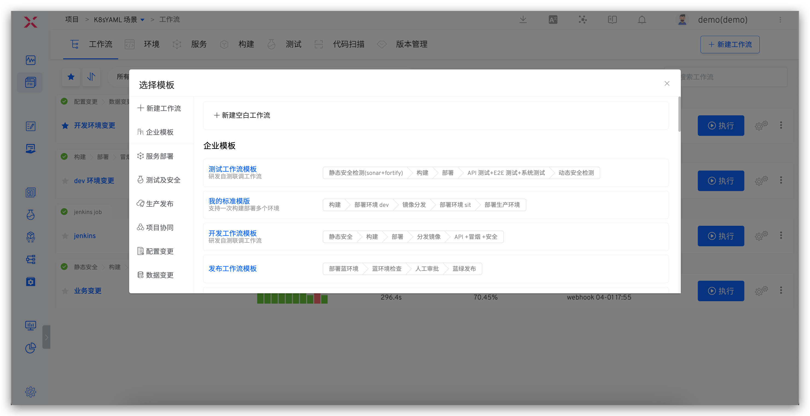
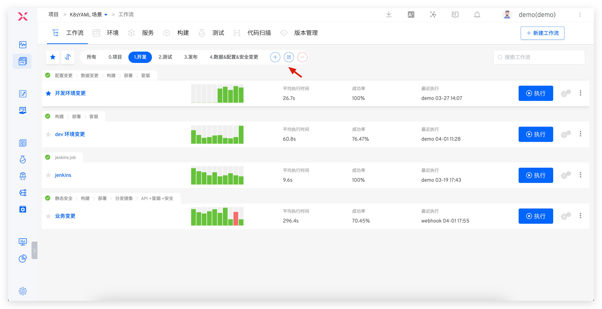
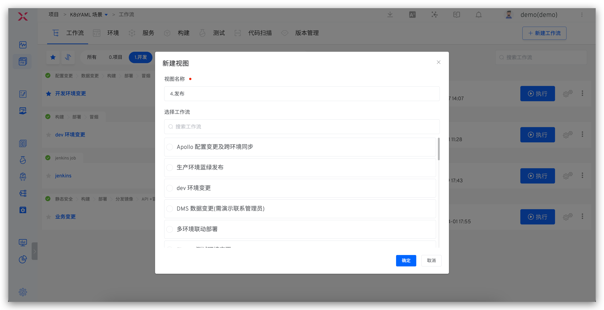

本文主要介绍 Zadig 工作流的基本概念。Zadig 工作流支持自由编排工作流流程，自定义执行步骤，同时具备配置变更、数据变更、灰度发布等能力。

## 基本概念

工作流由`阶段` 和`任务`组成：
- 阶段：对工作流的任务进行逻辑分组，比如构建阶段、部署阶段……多个阶段串行运行，一个阶段可包括多个任务。
- 任务：一个独立的、完整的操作，比如构建、部署、测试、自定义任务...多个任务可串行执行或并发执行。任务分为两种类型：
    - 自定义任务：通过开发自定义任务实现和第三方系统的交互，具体开发方式参考：[工作流任务](/Zadig%20v2.2.0/settings/custom-task/)
    - 官方任务：Zadig 官方提供任务，可以满足复杂的构建、部署、测试、发布等需求，具体任务类型如下：

| 任务类型 | 任务名称 | 描述 | 配置 |
| --- | --- | --- | --- |
| 构建 | 构建 | 可直接引用「项目」-「构建」模块中的配置 | [查看](/Zadig%20v2.2.0/project/workflow-jobs/#构建-2) |
| 部署 | 服务部署 | 更新 Zadig 环境中的服务镜像、变量和服务配置 | [查看](/Zadig%20v2.2.0/project/workflow-jobs/#服务部署) |
|  | Kubernetes 部署 | 可更新 Kubernetes 中容器镜像 | [查看](/Zadig%20v2.2.0/project/workflow-jobs/#kubernetes-部署) |
|  | 更新 K8s YAML 任务 | 使用原生 Kubernetes Patch 能力更新 YAML | [查看](/Zadig%20v2.2.0/project/workflow-jobs/#更新-k8s-yaml-任务) |
| 测试 | 测试 | 可直接引用「项目」-「测试」模块中的测试配置 | [查看](/Zadig%20v2.2.0/project/workflow-jobs/#测试-2) |
|  | 代码扫描 | 可直接引用「项目」-「代码扫描」模块中的配置 | [查看](/Zadig%20v2.2.0/project/workflow-jobs/#代码扫描) |
| 发布策略 | Helm Chart 部署 | 可直接将 Helm 仓库中的 Chart 部署到环境中 | [查看](/Zadig%20v2.2.0/project/workflow-jobs/#helm-chart-部署) |
|  | MSE 灰度发布 | 基于 MSE 创建全链路灰度发布资源 | [查看](/Zadig%20v2.2.0/project/release-workflow/#mse-灰度发布) |
|  | 下线 MSE 灰度服务 | 从环境中删除 MSE 指定灰度标签相关资源 | [查看](/Zadig%20v2.2.0/project/release-workflow/#mse-灰度发布) |
|  | 部署蓝绿环境 | 基于「服务」模块中的配置部署蓝绿环境 | [查看](/Zadig%20v2.2.0/project/release-workflow/#蓝绿发布) |
|  | 蓝绿发布 | 结合前置的「部署蓝绿环境」，执行蓝绿发布 | [查看](/Zadig%20v2.2.0/project/release-workflow/#蓝绿发布) |
|  | 金丝雀部署 | 基于 Kubernetes 原生的能力部署金丝雀 | [查看](/Zadig%20v2.2.0/project/release-workflow/#金丝雀发布) |
|  | 金丝雀发布 | 结合前置的「金丝雀部署」任务执行金丝雀发布 | [查看](/Zadig%20v2.2.0/project/release-workflow/#金丝雀发布) |
|  | 灰度发布 | 基于 Kubernetes 原生的能力执行灰度发布 | [查看](/Zadig%20v2.2.0/project/release-workflow/#分批次灰度发布) |
|  | 灰度回滚 | 基于 Kubernetes 原生的能力执行回滚任务，滚动升级到灰度之前状态 | [查看](/Zadig%20v2.2.0/project/release-workflow/#灰度回滚) |
|  | Istio 发布 | 基于 Istio 执行发布过程 | [查看](/Zadig%20v2.2.0/project/release-workflow/#istio-发布) |
|  | Istio 回滚 | 基于 Istio 执行回滚任务，回滚到 Istio 发布之前状态 | [查看](/Zadig%20v2.2.0/project/release-workflow/#istio-发布回滚) |
| 项目协同 | 飞书工作项状态变更 | 修改指定飞书项目工作项状态 | [查看](/Zadig%20v2.2.0/project/workflow-jobs/#飞书工作项状态变更) |
|  | JIRA 问题状态变更 | 修改指定的 JIRA 问题状态 | [查看](/Zadig%20v2.2.0/project/workflow-jobs/#jira-问题状态变更) |
| 配置变更 | Nacos 配置变更 | 更新指定 Nacos 配置 | [查看](/Zadig%20v2.2.0/project/workflow-jobs/#nacos-配置变更) |
|  | Apollo 配置变更 | 更新并发布指定 Apollo 配置 | [查看](/Zadig%20v2.2.0/project/workflow-jobs/#apollo-配置变更) |
| 数据变更 | SQL 数据变更 | 针对指定数据库执行数据变更 | [查看](/Zadig%20v2.2.0/project/workflow-jobs/#sql-数据变更) |
|  | DMS 数据变更工单 | 创建并跟踪 DMS 数据变更工单 | [查看](/Zadig%20v2.2.0/project/workflow-jobs/#dms-数据变更工单) |
| 服务监测 | 观测云监测 | 使用观测云监测服务是否健康 | [查看](/Zadig%20v2.2.0/project/workflow-jobs/#观测云监测) |
|  | Grafana 监测 | 使用 Grafana 监测服务是否健康| [查看](/Zadig%20v2.2.0/project/workflow-jobs/#grafana-监测) |
| CI/CD | 执行 Jenkins Job | 可同时执行多个 Jenkins Job 并获取对应日志 | [查看](/Zadig%20v2.2.0/project/workflow-jobs/#执行-jenkins-job) |
| 其他 | 通用任务 | 支持拉取代码、执行 Shell 脚本、文件存储等功能 | [查看](/Zadig%20v2.2.0/project/workflow-jobs/#通用任务) |
|  | 镜像分发 | 可将镜像 Retag 后推送到镜像仓库 | [查看](/Zadig%20v2.2.0/project/workflow-jobs/#镜像分发) |
|  | 触发 Zadig 工作流 | 可触发其他 Zadig 工作流 | [查看](/Zadig%20v2.2.0/project/workflow-jobs/#触发-zadig-工作流) |
|  | 下线服务 | 从指定环境中删除服务相关资源 | [查看](/Zadig%20v2.2.0/project/workflow-jobs/#下线服务) |

## 触发器

支持的触发器类型：
| 类型 | 描述 | 配置和使用 |
| --- | --- | --- |
| Git 触发器 | 代码变更后自动触发工作流 | [查看](/Zadig%20v2.2.0/project/workflow-trigger/#git-触发器) |
| 定时器 | 定时触发工作流 | [查看](/Zadig%20v2.2.0/project/workflow-trigger/#定时器) |
| JIRA 触发器 | JIRA 问题状态变更后自动触发工作流 | [查看](/Zadig%20v2.2.0/project/workflow-trigger/#jira-触发器) |
| 飞书项目触发器 | 飞书项目状态变更后自动触发工作流 | [查看](/Zadig%20v2.2.0/project/workflow-trigger/#飞书项目触发器) |
| 通用触发器 | 第三方系统通过 Webhook 自动触发工作流 | [查看](/Zadig%20v2.2.0/project/workflow-trigger/#通用触发器) |

## 通知

工作流支持通知到飞书、企业微信、钉钉群组，具体配置和使用参考：[工作流通知](/Zadig%20v2.2.0/workflow/im/)

## 工作流视图

> 将工作流组织在不同的视图里，方便快速预览和使用。

进入项目 -> 工作流，点击视图 Tab 可分别查看当前视图下的工作流信息，点击 `+` 按钮可新建视图。

- 仅系统管理员和项目管理员可操作 `新建视图`、`编辑视图`、`删除视图`
- `所有` 视图中包含当前项目下的所有工作流，且不可删除
- 在某个视图下新建工作流后，工作流将自动归属到当前视图中

