本文将详细介绍如何结合 Zadig 和 Ingress 实现生产稳定发布的基本原理，并通过实际案例演示在 Zadig 中的具体操作。

## 基本原理

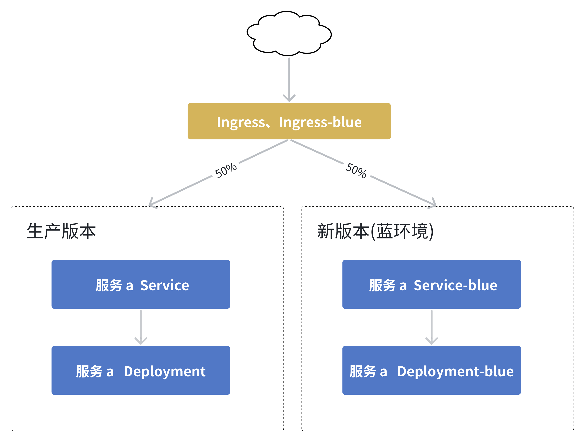

> 说明：生产版本和新版本(蓝环境)在 Zadig 同一个生产环境中管理。 

**工作原理：**
1. 部署蓝环境：复制当前 workload，设置新镜像，并创建一个 blue service 指向它。
2. 切换部分生产流量到蓝环境：在原来 ingress 基础上创建一个相同 Host 的 ingress-blue ，service 指向 blue service，并且开启 `nginx.ingress.kubernetes.io/canary: "true"`，并按实际情况修改权重配置 nginx.`ingress.kubernetes.io/canary-weight：50`。
3. 蓝绿发布：将生产使用的 workload 镜像设置为新镜像。
4. 切断蓝环境流量：修改 ingress-blue 配置 `nginx.ingress.kubernetes.io/canary: "false"`。
5. 蓝绿清理：工作流执行完成后，无论最终为何种状态，删除 blue service、blue workload 。

下面将详细介绍如何在 Zadig 中结合 Ingress 实现安全、稳定、高效的生产发布。

## 项目准备

### 创建项目

创建项目，配置生产服务`a`、`b`、`c`。本示例源码和服务 YAML 配置参考[项目](https://github.com/koderover/zadig/tree/main/examples/grayscale-demo)。

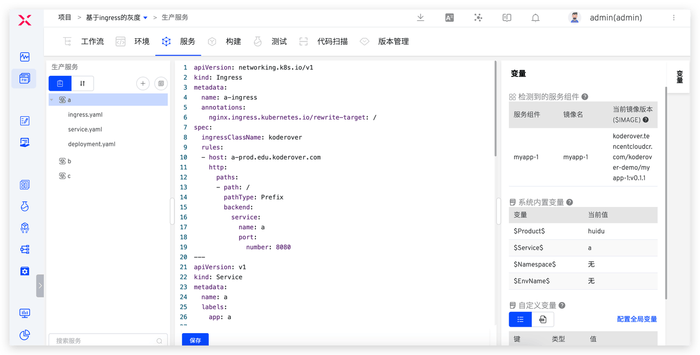

在 a 服务 YAML 配置上添加 ingress 配置：

```yaml
apiVersion: networking.k8s.io/v1
kind: Ingress
metadata:
  name: a-ingress
  annotations:
    nginx.ingress.kubernetes.io/rewrite-target: /
spec:
  ingressClassName: koderover
  rules:
  - host: a-prod.edu.koderover.com
    http:
      paths:
      - path: /
        pathType: Prefix
        backend:
          service:
            name: a
            port:
              number: 8080
```

### 配置环境

1. 创建生产环境 prod > 管理服务 > 添加服务，选择`a`、`b`、`c`。

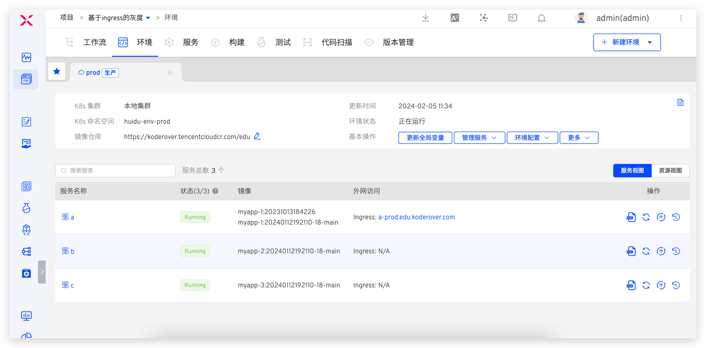

2. 添加 ingress-blue ，为生产发布配置做准备。

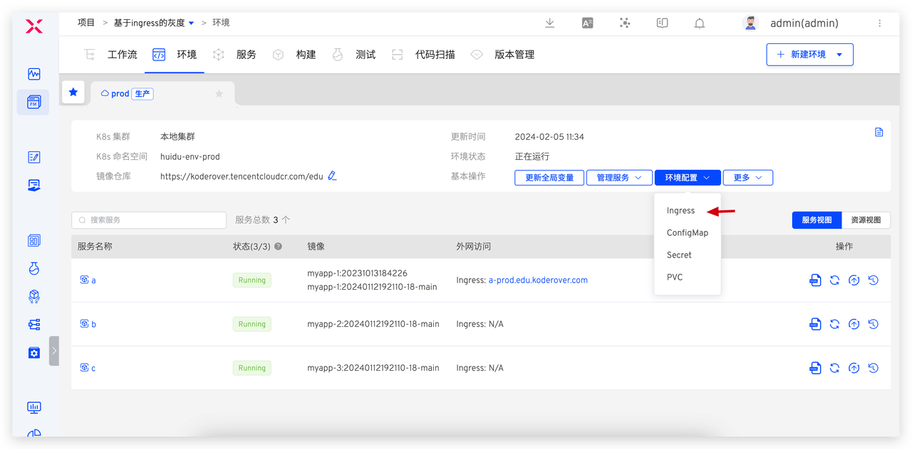
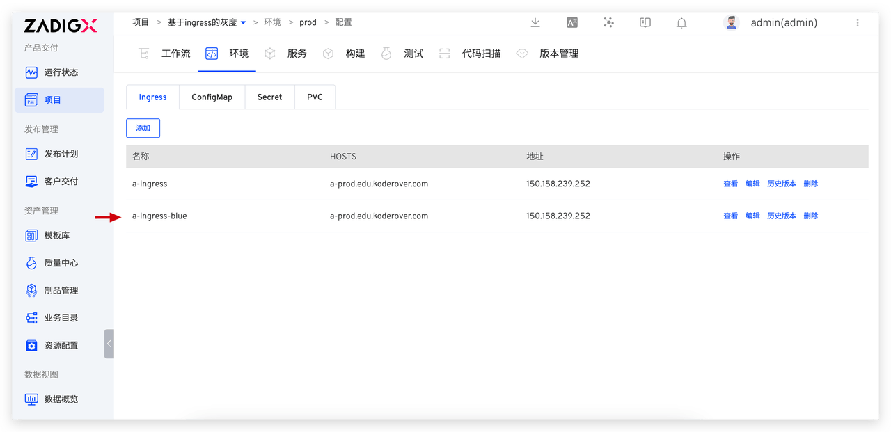

在 a 服务 ingress-blue 配置如下：

```yaml
apiVersion: networking.k8s.io/v1
kind: Ingress
metadata:
  name: a-ingress-blue
  annotations:
    nginx.ingress.kubernetes.io/rewrite-target: /
    nginx.ingress.kubernetes.io/canary: "false"
    nginx.ingress.kubernetes.io/canary-weight: "0"
spec:
  ingressClassName: koderover
  rules:
  - host: a-prod.edu.koderover.com  #此处和 a 服务 ingress 配置中使用的 host 保持一致
    http:
      paths:
      - path: /
        pathType: Prefix
        backend:
          service:
            name: a-blue #指向 a 服务新版本的 service 
            port:
              number: 8080

```

### 配置工作流

新建工作流 > 选择 「蓝绿发布」模板 > 配置工作流，工作流包含步骤和具体配置如下：

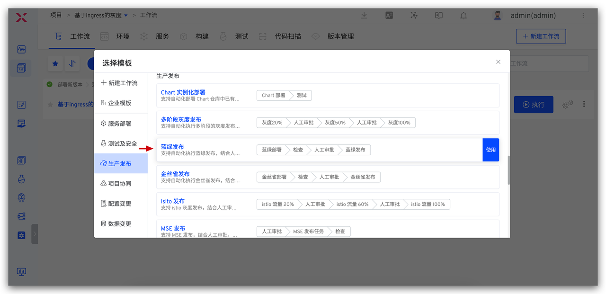
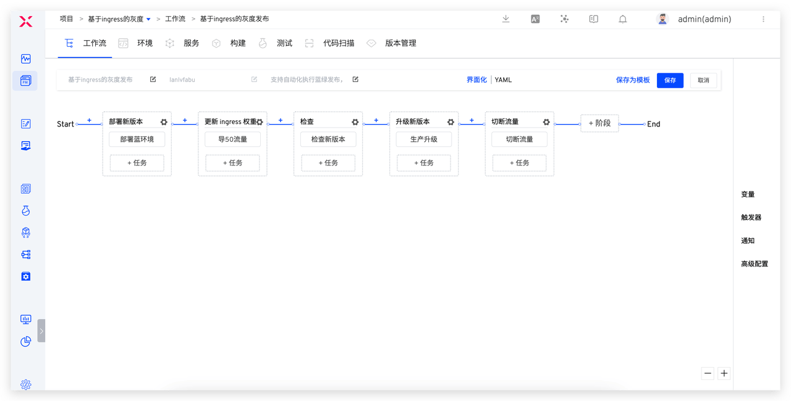

1. `部署蓝绿环境`：使用「部署蓝绿环境」任务，添加 服务 a。

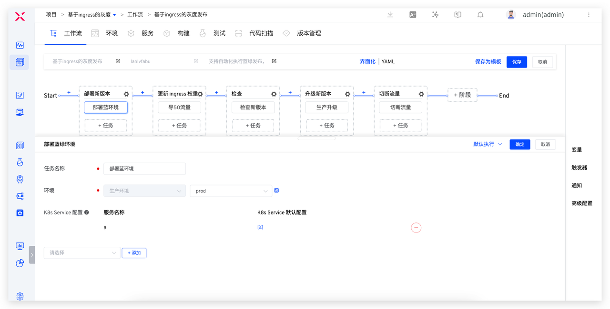

2. `导 50 流量`:  使用「更新 K8s YAML 任务」，选择 ingress-blue 配置，并设置 `nginx.ingress.kubernetes.io/canary: "true"`，`nginx.ingress.kubernetes.io/canary-weight: "50"`。

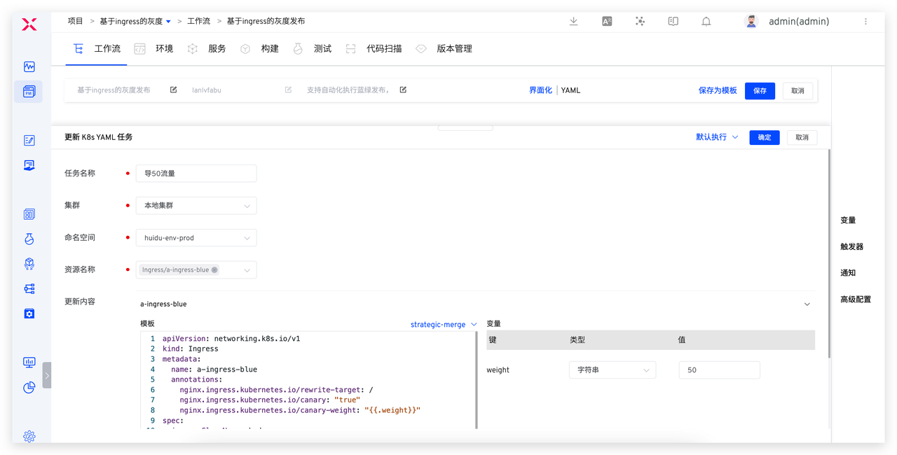

3. `检查新版本`: 使用「通用任务」或者「测试」任务来配置对应的检查脚本，针对新版本进行自动化测试。
4. `审批`：在生产升级阶段上开启「人工审批」，来保证发布的可靠性。

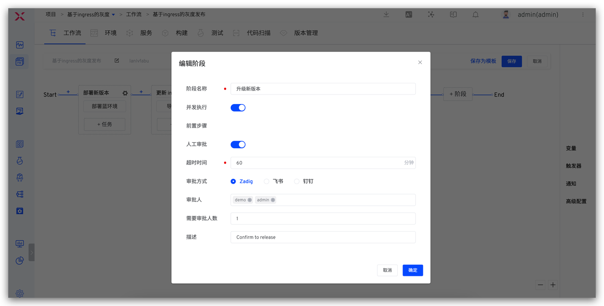

5. `生产升级`：使用「蓝绿发布」任务，注意配置中前置「部署蓝绿环境」任务需要正确选择。

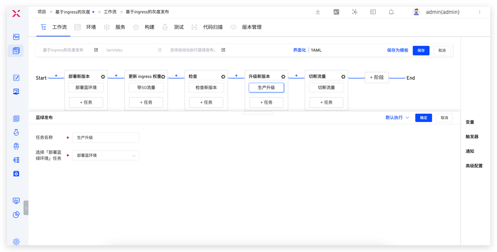

6. `切断流量`：使用「更新 K8s YAML 任务」，选择 ingress-blue 配置，并设置`nginx.ingress.kubernetes.io/canary: "false"`，`nginx.ingress.kubernetes.io/canary-weight: "0"`。


## 执行生产发布

### 执行工作流

按照以下配置执行工作流：
- 部署蓝环境：服务组件选择 myapp-1(a)，以及选择需要发布的镜像
- 导 50 流量：选择 ingress-blue 资源
- 切断流量：选择 ingress-blue 资源

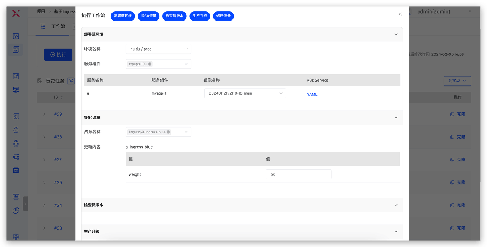
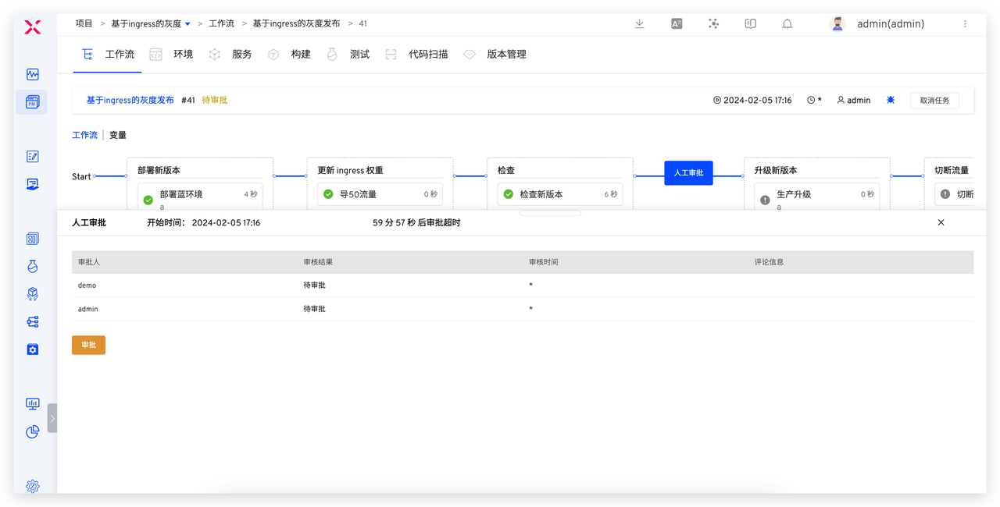

工作流运行至待审批状态时，已完成自动部署蓝环境、导入 50% 流量到新版本中、对生产环境自动化测试验证三个操作。下面结合 Zadig 环境能力来验证流量走向是否符合预期。

### 效果验证

在发布过程中，服务 a 存在两组 deployment 和 service，分别为生产版本和新版本，此时，预期 50% 流量进入生产版本，50% 流量进入新版本。

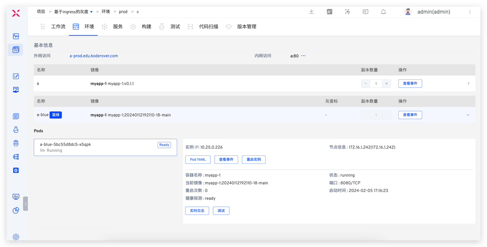
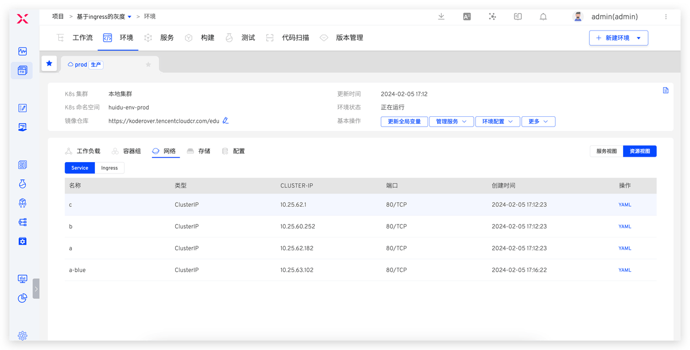


执行以下请求，查看服务日志以验证流量分配结果。

```bash
for i in $(seq 1 100); do curl -X PUT http://a-prod.edu.koderover.com/api/v1/count; done
```

请求分别进入服务 a 生产版本和新版本的数量：

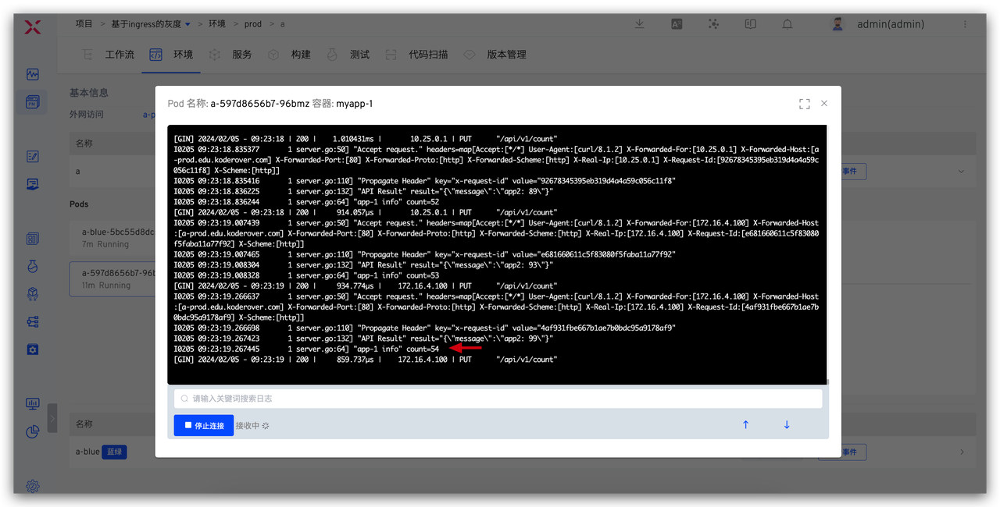
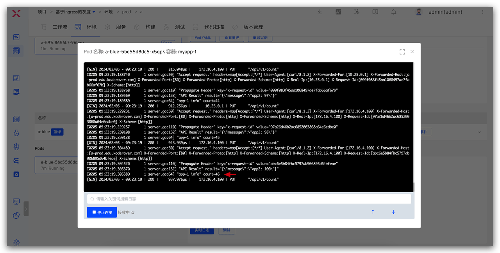

人工审批通过后，工作流自动更新生产环境镜像，并将流量全部切回生产，最后清理所有临时资源。

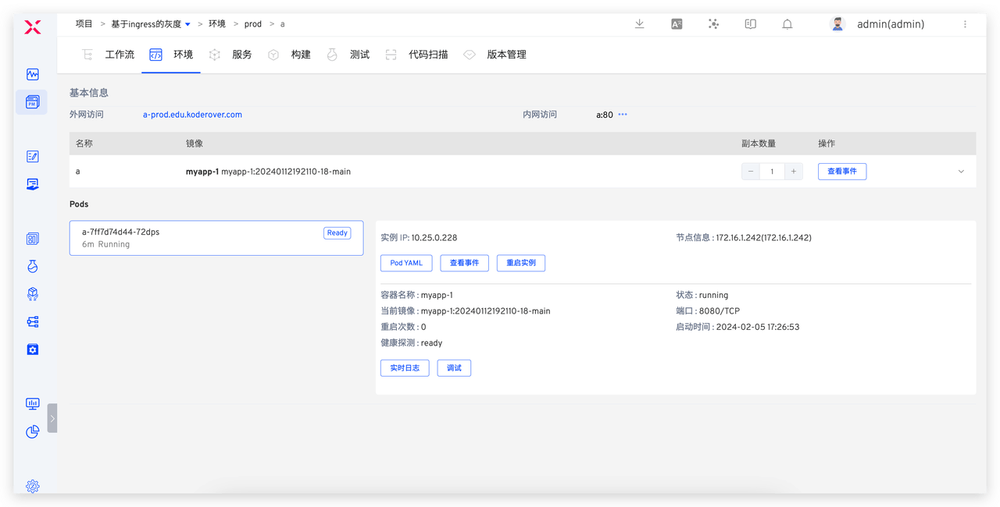
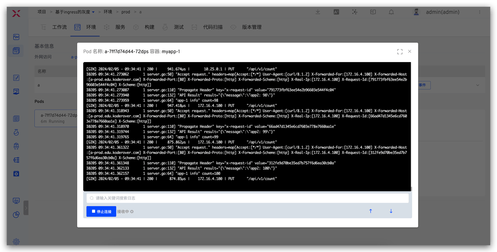

至此，一次完整的生产发布已经完成。在实际使用过程中，可以结合监控数据在人工审批阶段控制新版本上线的时间，以确保在使用低峰时段进行生产发布，减少上线过程对用户的影响。