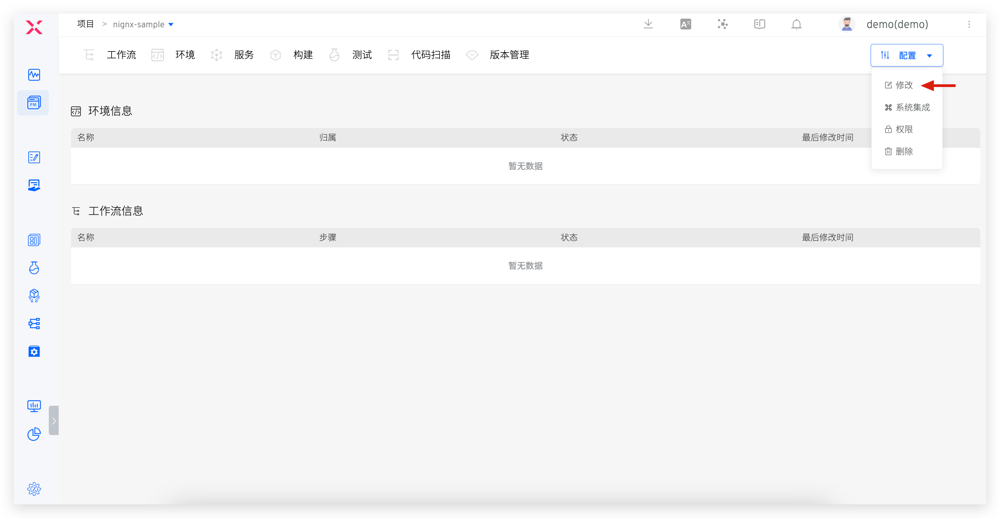
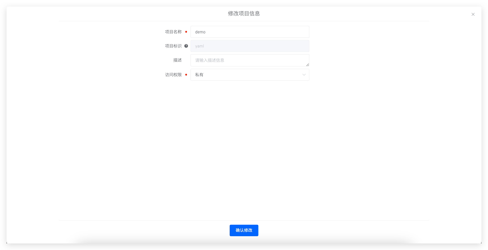
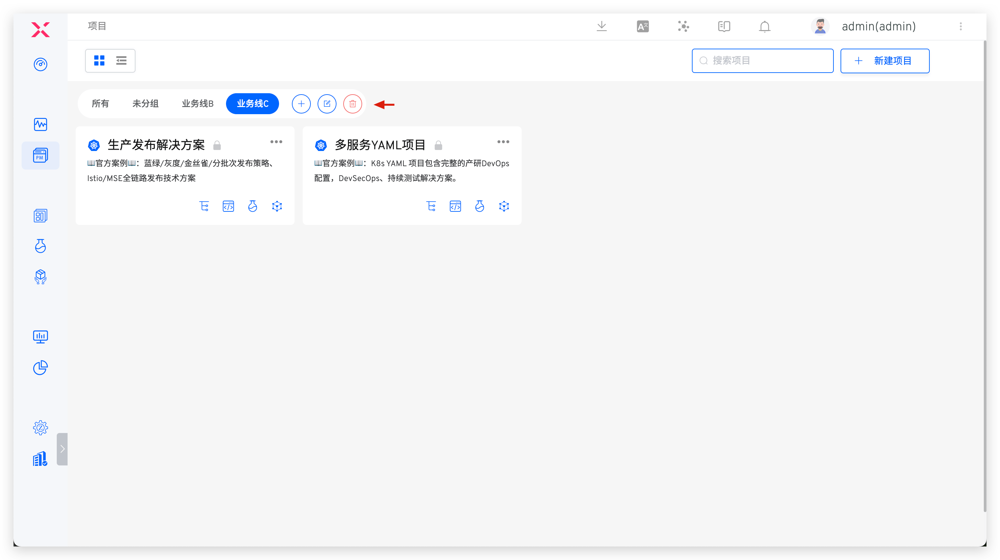
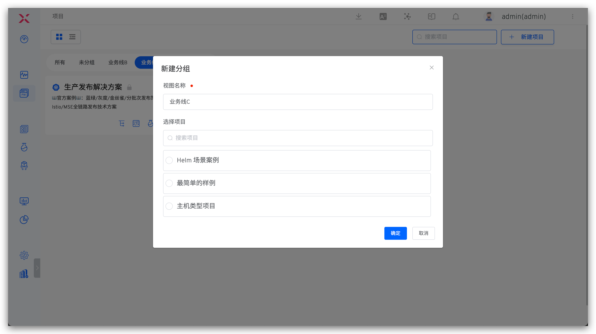
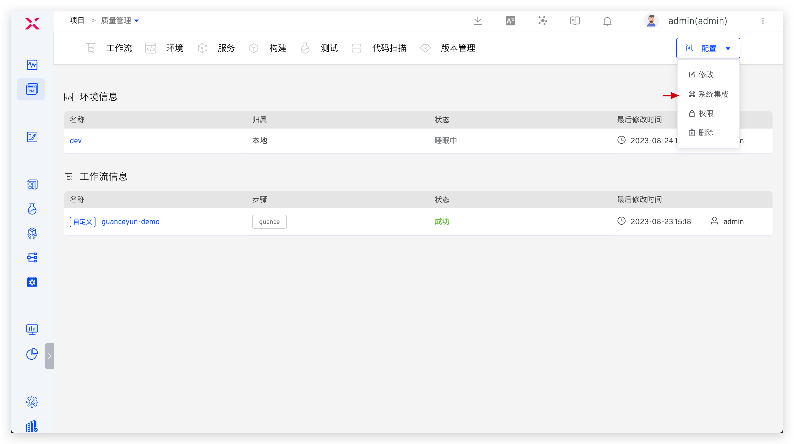

Zadig 的项目可以理解为一个完整的业务单元、产品或者系统，其中包含工作流、环境、服务、构建、测试、代码扫描、版本等资源，用户在项目中可以进行服务开发、服务部署、集成测试、版本发布等操作，来对产品进行持续交付。

本文主要介绍 Zadig 支持的四类项目、如何快速搭建、如何修改项目的基本信息、对项目进行分组以及如何在项目中集成系统资源。

## 项目类型

Zadig 支持以下四种项目类型：
- `K8s YAML 项目`：使用 Kubernetes 作为基础设施，使用 Kubernetes YAML 管理和部署服务。
- `K8s Helm Chart 项目`：使用 Kubernetes 作为基础设施，使用 Helm Chart 管理和部署服务。
- `K8s 托管项目`：托管已有 Kubernetes 集群中的资源，在 Zadig 平台中对其服务进行管理：查看服务实时日志、登录 Pod 进行 debug、更新服务镜像等。
- `主机项目`：使用主机作为基础设施，使用自定义脚本部署升级服务。

## 快速搭建

参考：

- [K8s YAML 项目](/Zadig%20v2.3/project/k8s-yaml/)
- [K8s Helm Chart 项目](/Zadig%20v2.3/project/helm-chart/)
- [K8s 托管项目](/Zadig%20v2.3/project/host-k8s-resources/)
- [主机项目](/Zadig%20v2.3/project/vm/)

## 修改项目

::: tip
仅系统管理员及项目管理员，可以修改项目。
:::

在项目详情页点击`配置`->`修改`，对项目的基本信息进行修改。

参数说明：
- `项目名称`：该项目的名称，项目创建后可修改。
- `项目标识`：创建项目时可指定，默认值为项目名称。项目创建后，其标识不可再更改。
- `描述信息`：对该项目的简要描述，非必填。
- `访问权限`：可选`公开`或`私有`，定义该项目的默认权限。
    - 公开项目：用户默认享有 `read-only` 角色中的权限，可查看项目中的资源。该角色的细节请阅[权限配置](/Zadig%20v2.3/project/permission/#权限配置)。
    - 私有项目：用户默认无权限查看项目中的资源，项目管理员可以在权限和协作模式中对用户进行细粒度的权限控制。

## 项目分组

系统管理员可对项目进行分组管理。

1. `所有`中包含全部项目，`未分组`中包含所有未被分组的项目，且这两个分组不可修改、删除
2. 支持新建分组、编辑分组、删除分组，删除分组后，其中的项目将自动归属到`未分组`中
3. 在某个分组下新建项目后，项目将自动归属到当前分组中
4. 一个项目只能属于一个分组

## 系统集成

项目管理员访问项目 -> 配置 -> 系统集成，为项目集成代码源、主机等资源。资源集成后仅在项目内可用，实现项目之间的资源隔离。

### 代码源

具体集成参数配置可参考文档 [代码源集成](/Zadig%20v2.3/settings/codehost/overview/)。

### 主机
> 适用于主机类型的项目。

具体集成参数配置可参考文档 [主机集成](/Zadig%20v2.3/settings/vm-management/#添加主机)。
