本文主要介绍 K8s Helm Chart 项目中的测试环境和生产环境相关配置。

## 查看环境

环境创建完成后，点击不同的 Tab 即可切换到该环境的详情页面。点击`资源视图`，可从工作负载/容器组/网络/存储/配置等资源视角对该环境所在命名空间下的资源进行查看。

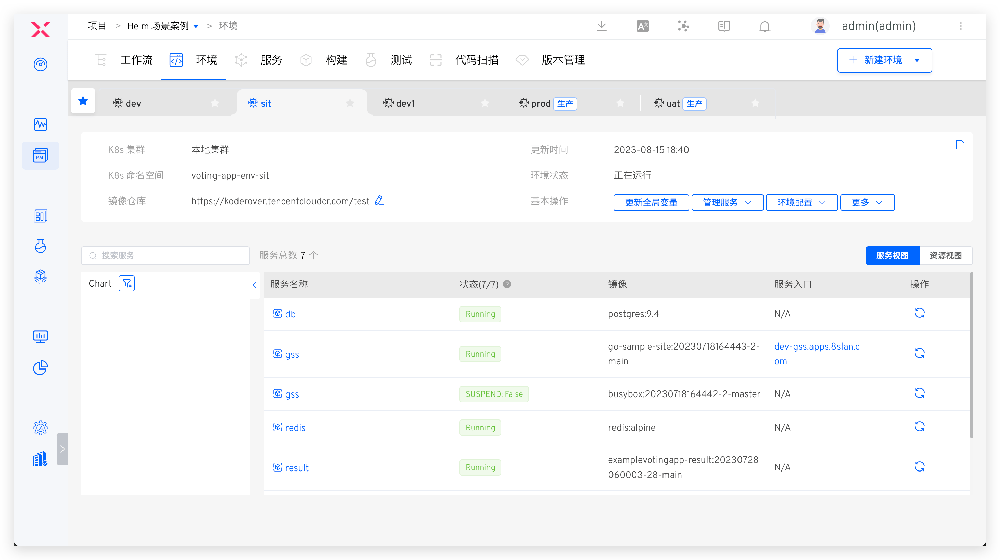
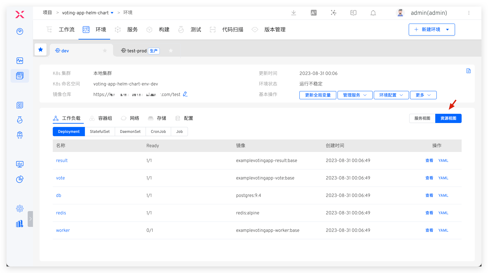

环境的基本信息包括 K8s 集群，K8s 命名空间，更新时间，环境状态，镜像仓库，服务列表及  Chart 视图。

- Chart 视图的介绍可参考文档：[Chart 视图](#chart-视图)
- 其他介绍可参考 K8s YAML 测试环境中的描述：[查看环境](/Zadig%20v2.3/project/env/k8s/#查看环境)

## 新建环境

::: tip
服务数量以及启动服务所需的资源会影响环境的创建时间，请耐心等待。
:::

### 测试环境
在项目中，点击`新建环境`按钮，选择测试环境后进入新建环境页面。

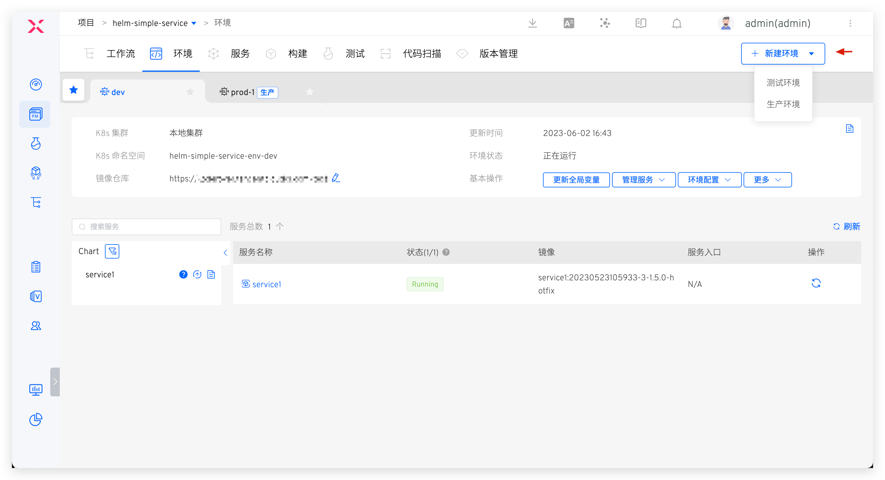
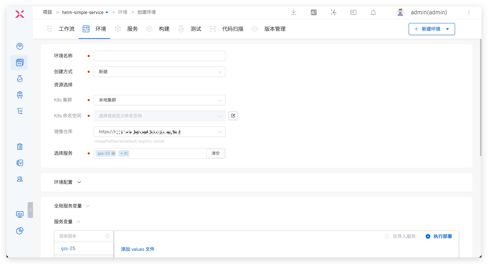

#### 基本信息

- `环境名称`：要创建的环境的名称，根据实际语义配置即可，比如：`dev`、`pre-release`。
- `创建方式`：支持`新建`和`复制`两种方式，复制环境可参考：[复制环境](#复制环境)。
- `资源选择`：
	- `K8s 集群`：选择新建环境时所使用的集群资源，其中`本地集群`指 Zadig 系统所在的集群。关于集群的集成可参考[集群管理](/Zadig%20v2.3/pages/cluster_manage/)。
	- `K8s 命名空间`：不同的环境会使用独立的 Kubernetes 命名空间实现隔离。Zadig 系统创建命名空间的默认规则为 `项目名-env-环境名`，用户也可以自定义或者选择已有命名空间。
	- `镜像仓库`：指定环境创建后所使用的镜像仓库，使用工作流构建部署服务，以及修改服务镜像，均会使用此处指定的镜像仓库。关于镜像仓库的集成可参考[镜像仓库管理](/Zadig%20v2.3/settings/image-registry/#添加镜像仓库)。
- `服务选择`：选择新建环境所包含的服务，默认为当前项目下的所有服务。

#### 环境配置

在新建环境时为环境创建配置，说明如下：

- 可创建多个 Ingress、ConfigMap、Secret、PVC 类型的配置
- 支持直接粘贴或从代码库导入配置，支持的代码源请参考文档：[代码源信息](/Zadig%20v2.3/settings/codehost/overview/#功能兼容列表)
- 环境创建成功后，此处新建的配置即会在环境/集群中生效，也可以在环境创建完成后再管理环境配置，参考[环境配置管理](/Zadig%20v2.3/project/env/k8s/#环境配置管理)

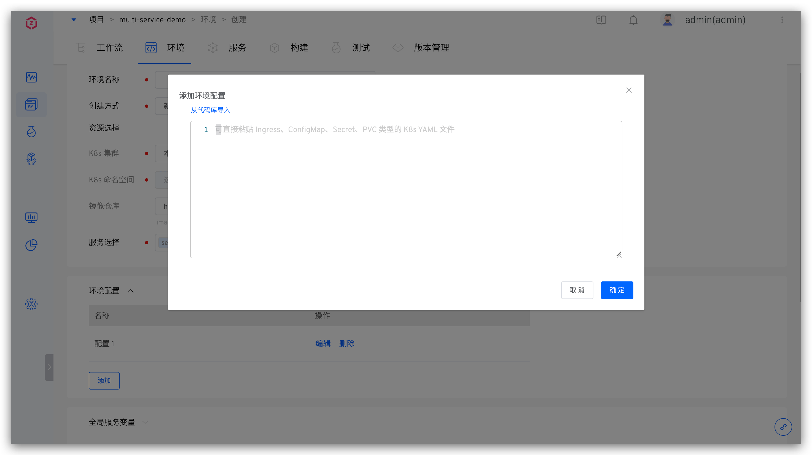

#### 全局服务变量
点击展开`全局服务变量`，可修改 values 文件内容设置环境级别的变量值，支持 2 种方式：

- 手动输入 YAML 文件的内容，内容详情即为要设置的变量信息。
- 从指定代码库导入 values，支持的代码源请参考文档：[代码源信息](/Zadig%20v2.3/settings/codehost/overview/#功能兼容列表)。

从代码库导入时如果打开`自动同步`开关，Zadig 会定时从代码库获取最新的 values 文件并将其自动更新到环境中。

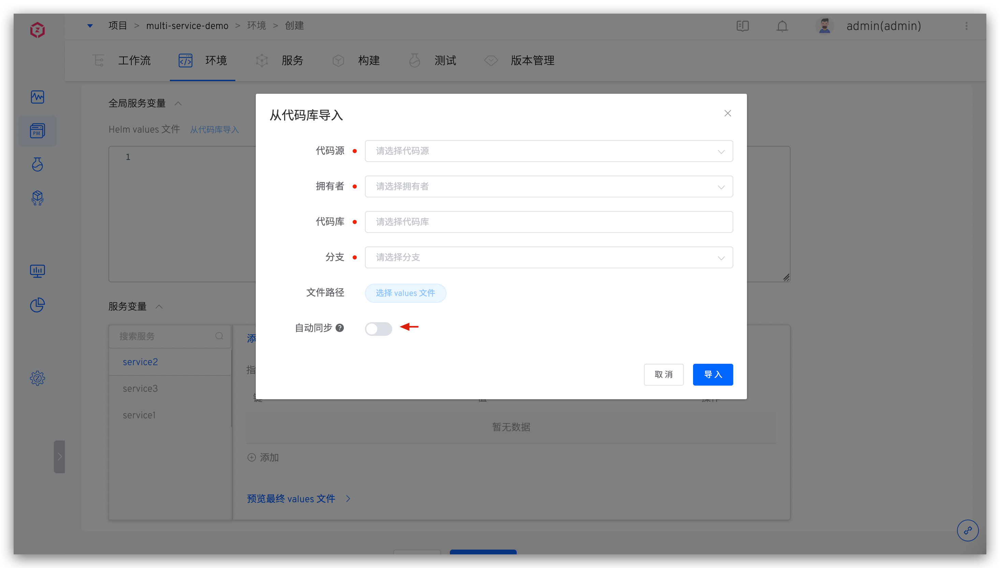

#### 服务变量

可修改指定服务的 values 文件内容，配置服务级别的变量值，支持 3 种方式：
- 手动输入 values 文件内容。
- 从指定 GitHub/GitLab 代码库同步 values 文件。如果打开`自动同步`开关，Zadig 会定时从指定的代码库获取最新的 values 文件并将其自动更新到环境中。
- 手动输入键值对，覆盖服务配置中的 values 文件内容。

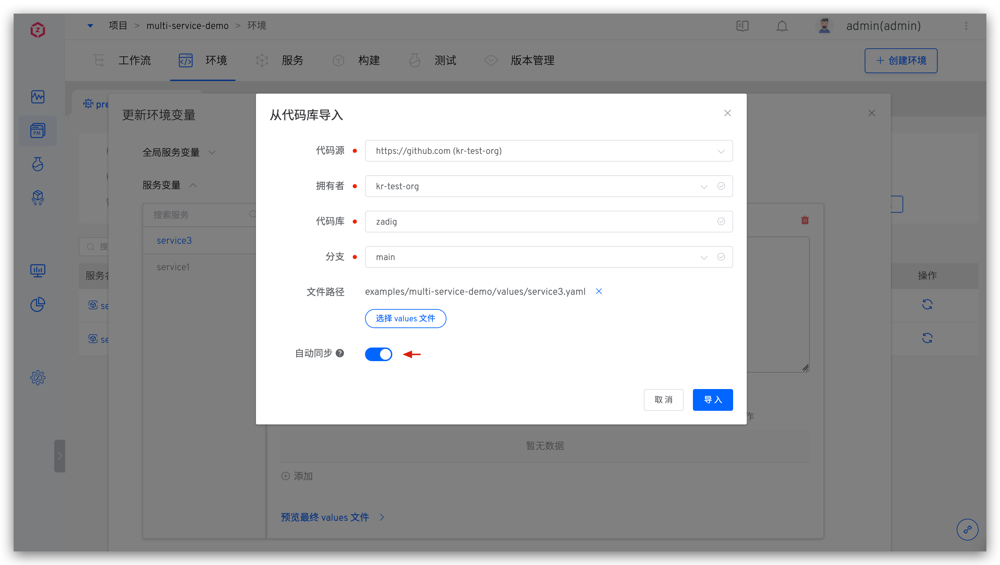

::: tip 扩展知识
1. 服务变量的设置只对单一服务生效。
2. 全局服务变量的设置对当前环境的所有服务都生效。
2. 如果既设置了全局服务变量，又设置了服务变量时，服务变量的优先级高于全局服务变量。
:::

### 生产环境

参考：[新建环境](/Zadig%20v2.3/project/prod/env/k8s/#新建环境)。

## 复制环境

> 仅测试环境支持复制环境。

参考 K8s YAML 测试环境中的描述：[复制环境](/Zadig%20v2.3/project/env/k8s/#复制环境)。

## 更新全局变量
点击基本操作中的`更新全局变量`，可修改全局服务变量，修改后对当前环境下的所有服务都生效，支持以下几种方式：

- 手动输入 values 内容
- 从代码库导入 values 文件，支持的代码库请参考：[代码源信息](/Zadig%20v2.3/settings/codehost/overview/#功能兼容列表)
- 使用变量组，变量组管理参考[变量组配置](/Zadig%20v2.3/project/permission/#变量组) 

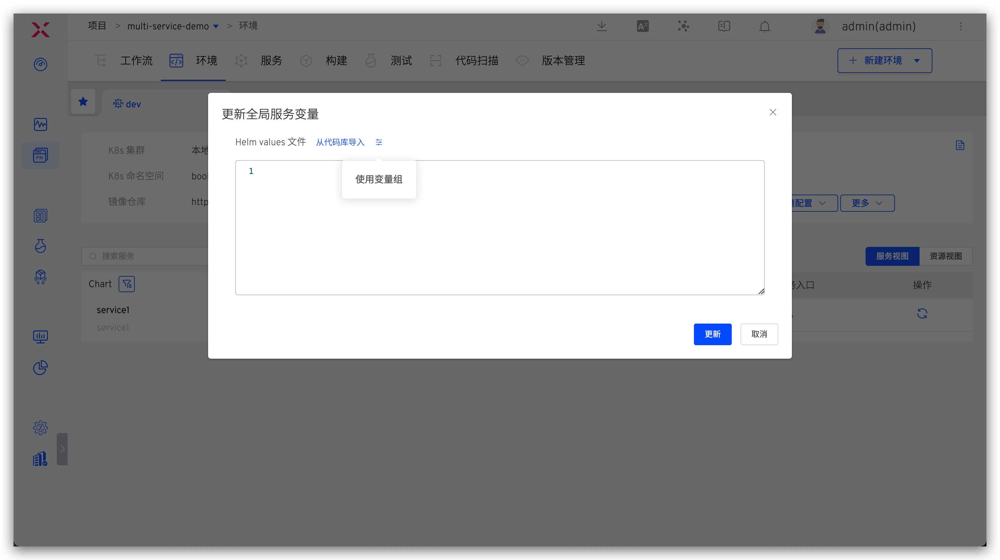

## 管理服务
点击基本操作中的`管理服务`，可以对环境中的服务进行添加、更新、删除操作。

### 添加服务

将服务添加到环境中，支持 `Zadig 服务` 和 `Chart 仓库` 两种服务来源。

> 测试环境仅支持添加 `Zadig 服务` 。

**Zadig 服务**

服务的配置在 Zadig 中管理。

点击 `管理服务` -> `添加服务` 选择要添加的服务，可按需修改其 values 内容。选择服务后，系统会自动检测 release 在所选的 Kubernetes 命名空间中是否存在，如果资源已存在，则可以选择一键导入已有服务，或者重新部署服务。

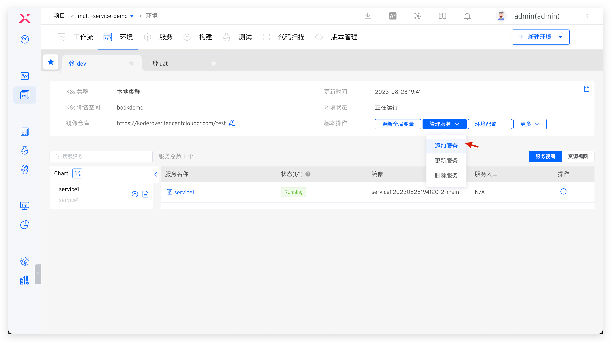
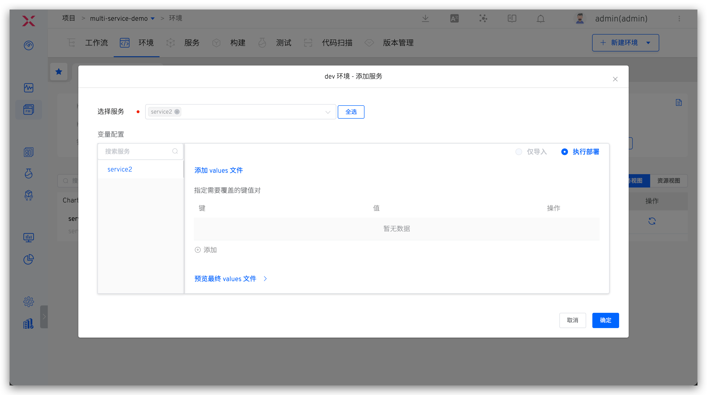

**Chart 仓库**

服务的配置在 Chart 仓库中管理。服务来源选择 `Chart 仓库` > 点击添加按钮 > 输入服务 Release 名称 > 选择 Chart 仓库及版本，可按需修改 values 文件内容。

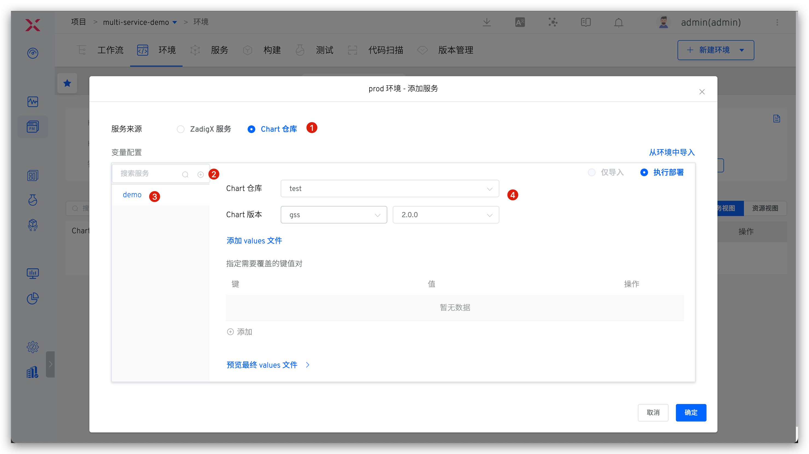

支持从已有的 Kubernetes 命名空间中批量导入服务：点击`从环境中导入` > 选择默认 Chart 仓库 > 选择 Release 后点击确定，可按需修改 Release 的 Chart 版本。

::: tip 使用前提
环境所在的命名空间中已存在 Release。
:::

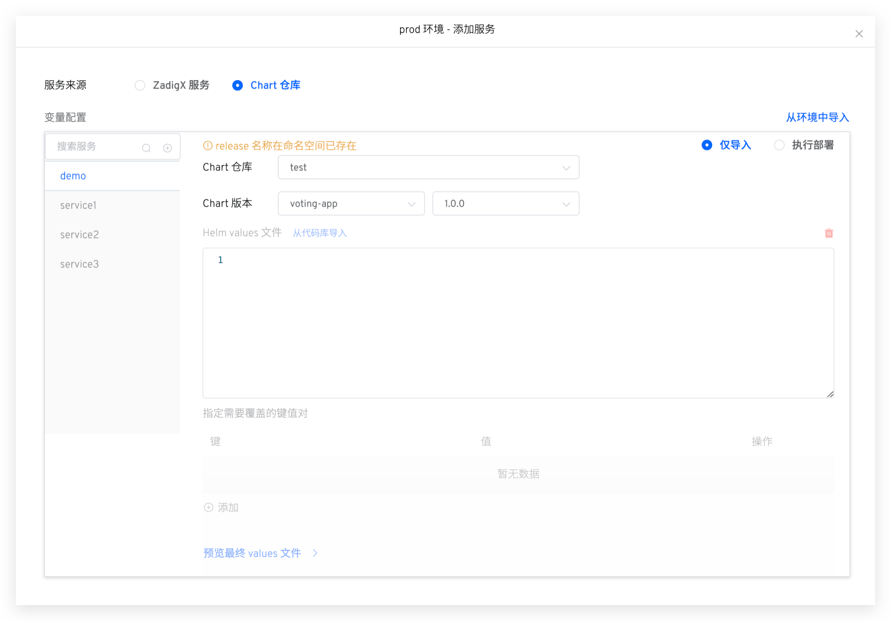

在添加服务时，系统会自动检测命名空间中 Release 是否已存在，如果已存在，可选择仅导入服务，或者重新部署服务到环境中。

### 更新服务

点击`管理服务` -> `更新服务` -> 选择要更新的服务，可按需修改其 values 内容 -> 点击`确定`即可对环境中的服务进行更新。如果不修改其 values 内容，则会使用服务配置中的 values 来修改该服务。

::: tip
如果服务加入环境后，镜像有做过更新（比如：使用工作流部署过服务镜像，或者在环境中手动切换过服务镜像），则服务镜像并不会基于 values 中的镜像信息更新。
:::

### 删除服务

点击`管理服务` -> `删除服务` -> 选择要删除的服务 -> 点击`确定`即可将该服务从当前环境中删除。

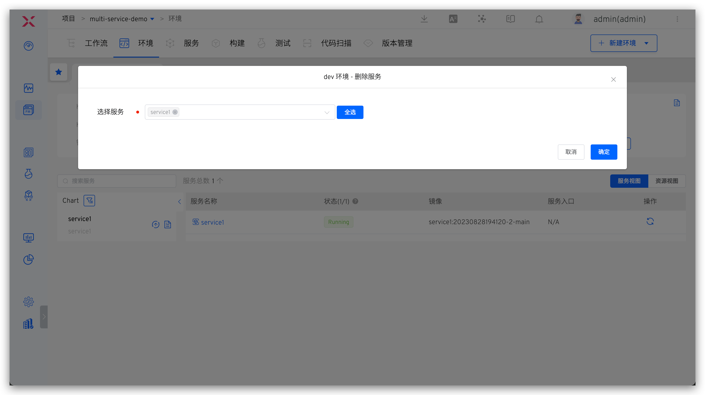

## 服务回滚

在 Chart 视图中，点击 Chart 右侧的历史版本图标可查看 Chart 的所有历史版本，比较两个不同版本的配置差异，一键将 Chart 回滚到指定版本。

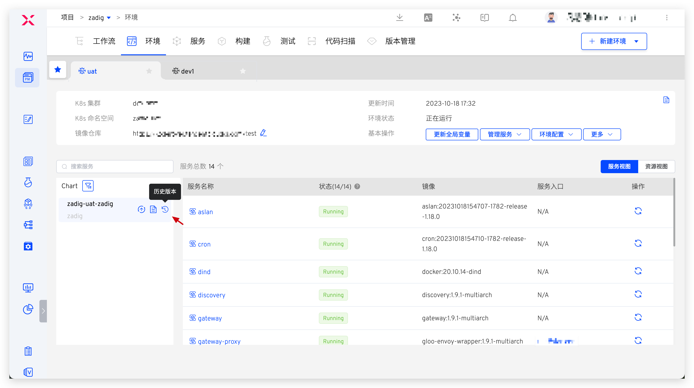
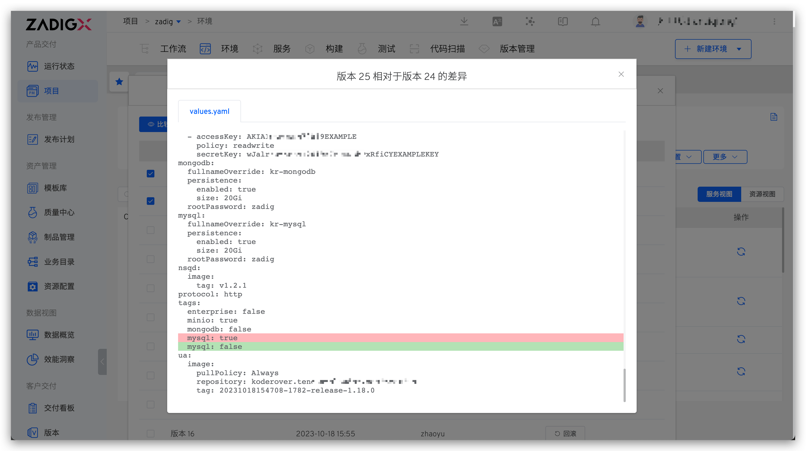

## 环境配置

为环境配置 Ingress、ConfigMap、Secret、PVC 资源，细节描述请阅读[环境配置管理](/Zadig%20v2.3/project/env/k8s/#环境配置管理)。

## 自测模式

参考文档：[自测模式](/Zadig%20v2.3/project/env/k8s/#自测模式)。

## 睡眠与唤醒

参考文档：[睡眠与唤醒](/Zadig%20v2.3/project/env/k8s/#睡眠与唤醒)。

## 变更记录
点击右上角的图标可查看该环境的操作日志。

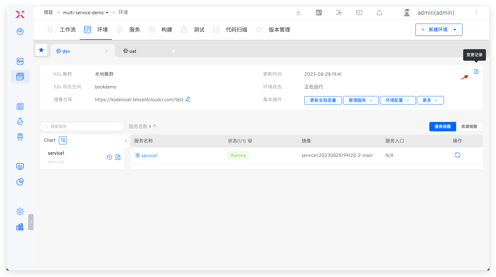

## Chart 视图

在服务列表左侧的 Chart 视图中可对服务快速过滤，查看服务实例的 values 文件内容，点击左侧的更新按钮可对环境中的服务进行更新。

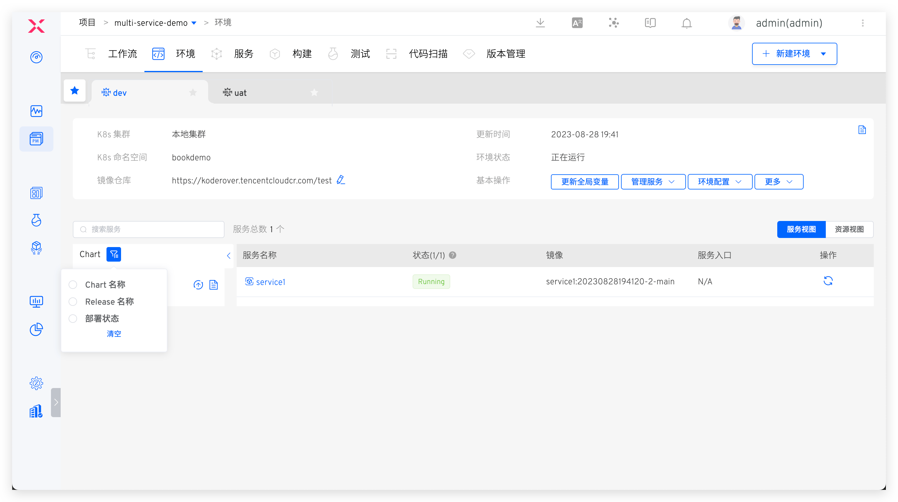

若更新失败，服务会变为红色，可查看具体的失败原因。

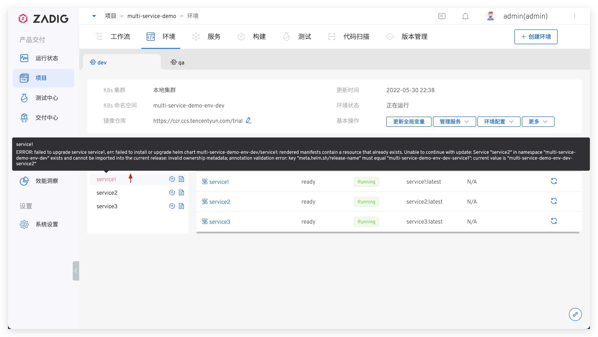

## 设置别名

> 仅生产环境支持设置别名。

点击`基本操作` -> `更多` -> `设置别名`按钮并输入新的名称后即可为环境设置别名并在 Tab 中展示。

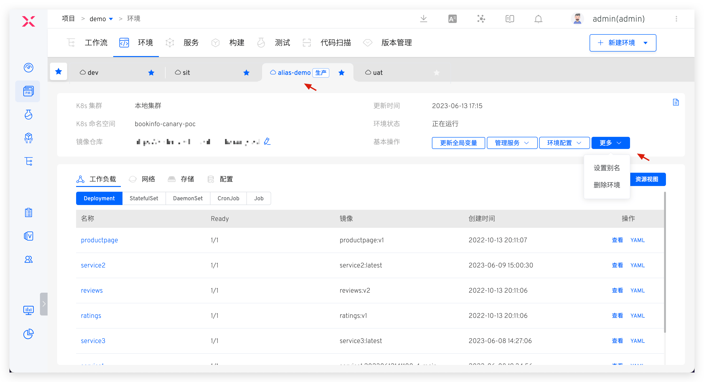

## 删除环境
点击`基本操作` -> `更多` -> `删除环境`按钮并输入环境名即可删除环境。当勾选`同时删除环境对应的 K8s 命名空间和服务`后：

- 如果环境是基于新的 Namespace 创建的，则删除环境操作会删除环境对应的 Namespace 及其中由 Zadig 系统创建的资源。
- 如果环境是基于已有 Namespace 创建的，则删除环境操作会删除 Namespace 中由 Zadig 系统创建的资源，但不会删除 Namespace。

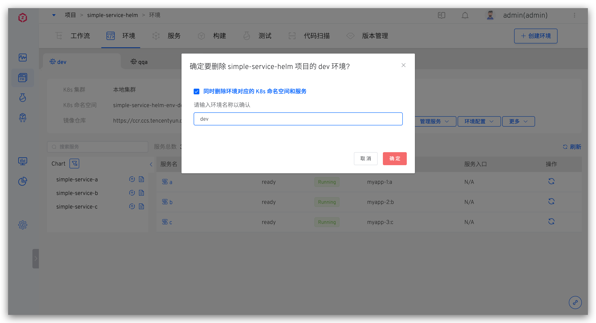

::: tip
1. 鉴于生产服务的严肃性，在 Zadig 中删除生产环境只是将环境记录删除，Kubernetes 集群中相关服务资源并不会删除。
2. 如果需要删除集群中的资源，请在确保没有影响后手动操作。
:::
