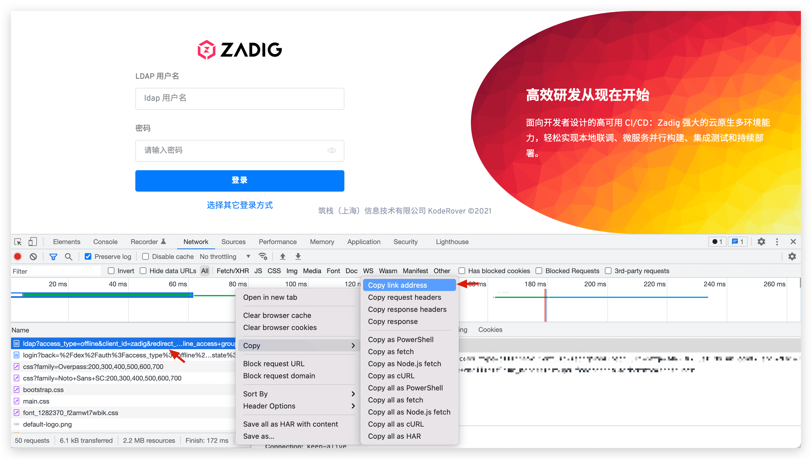
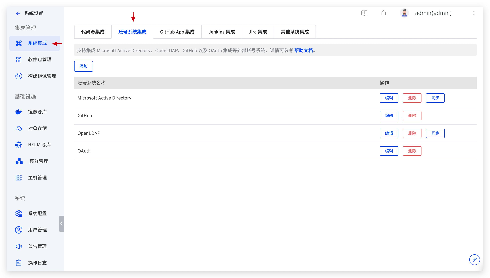
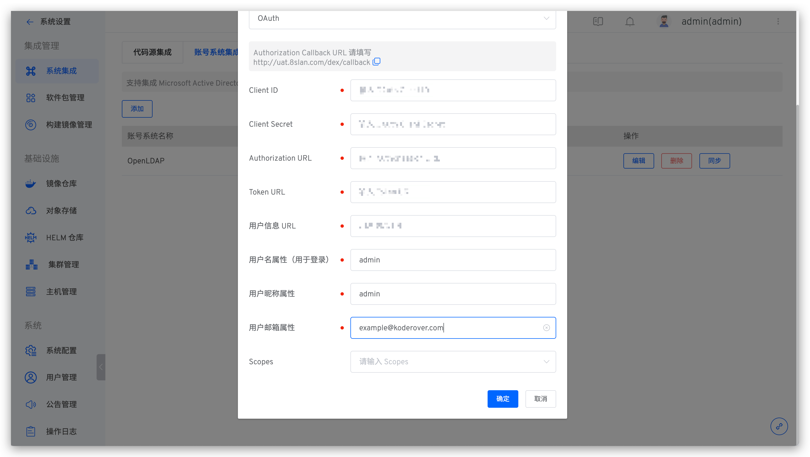
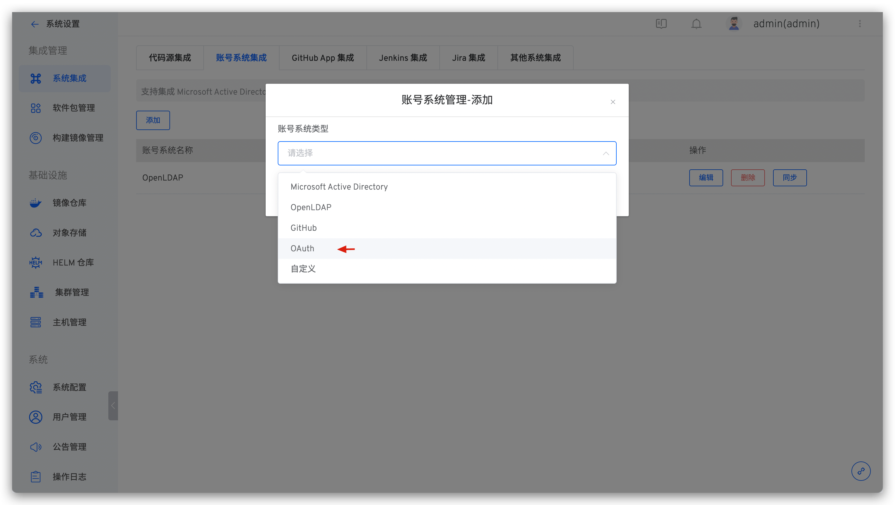

## 系统账号无法登录

如果集成了 AD/LDAP/SSO，请确认集群内的网络是否可以正常连接 AD/LDAP/SSO 系统。

## 在集成第三方账号登录后，如何快速访问第三方账号登录界面

以 LDAP 为例进行说明：打开浏览器调试模式，点击 LDAP 后复制第一个请求地址，访问这个地址即可直达第三方账号登录界面。




## 和用户/账号相关的配置有哪些，如何查阅

集成的账号系统登录失败，一般情况下均为配置有误：包括相关服务组件中的配置以及集成的第三方账号系统配置。此处提供对配置进行检查的几种途径以便在遇到错误时快速自查。

### 服务组件配置

1. 名为 `aslan-config` 的 configmap，可通过下述命令查看其详细内容。

```bash
kubectl -n {Zadig 系统所在的 Namespace} get configmap aslan-config -o yaml
```


2. 名为 `*-dex` 的 secret，可通过下述命令查看其详细内容。

```bash
1. kubectl -n {Zadig 系统所在的 Namespace} get secret {具体的 secret 名称} -o yaml # 查看配置
2. echo {上一步中查到的配置} | base64 -d # 查看配置明文
```


### 第三方账号系统配置

在系统设置 -> 集成管理 -> 系统集成 -> 账号系统集成中可查看集成账号系统的配置，参考 [LDAP](/Zadig%20v2.3/settings/account/ldap/)/[OAuth](/Zadig%20v2.3/settings/account/oauth2/)/[GitHub](/Zadig%20v2.3/settings/account/github/)/[自定义](/Zadig%20v2.3/settings/account/custom/)账号系统对检查有误的信息进行修改。



## 修改了和用户/账号相关的 configmap、secret 配置后，系统读取的还是老的配置

此处配置并不支持热更新，在更新配置后需重启 `aslan` 组件和 `dex` 组件。

## 即使密码正确，登录时也报错 401

aslan 依赖 secret:zadig-aes-key 作为加解密的密钥。如果 secret 被更新后需要重启 aslan 服务。

## 对 Zadig 自定义开发新增 API 后，被系统拦截鉴权失败

在 [urls.yaml](https://github.com/koderover/zadig/blob/main/pkg/microservice/policy/core/yamlconfig/urls.yaml) 文件的 public 部分配上新增的 API 后重新编译 aslan 的镜像并替换即可。

## 使用外置高可用的 MySQL，dex 组件报错 Unknown database dex 或者 table dex.xx doesn't exist

使用外置高可用的 MySQL 安装 Zadig 时，需要在 MySQL 中手动创建名为 dex 的库，否则即会出现 Unknown database dex 的错误。删除 dex 库中的所有表后重启 dex 组件即可解决 table dex.xx doesn't exist 的问题。

## dex 组件报错 Unregistered returned_uri("xxxx")

通常原因为 dex 的配置错误，可以通过以下方式诊断：

1. 使用 `kubectl -n {Zadig 所在的 Namespace} get secret | grep dex | grep Opaque` 查找环境中 dex 相关的 secret 配置，并使用 `kubectl -n {Zadig 所在的 Namespace} get secret {查阅到的 secret 名称} -o yaml` 查看其内容。


2. 复制配置中 config.yaml 的内容，并执行 `echo "{config.yaml 的内容}" | base64 -d` 对其进行解密，检查 redirectURLs 是否正确。


## OAuth 登录报错 Internal Server Error, Failed to authenicate:Oauth Connector:not found xx claim

通常原因为 OAuth 配置错误，可以查阅 [OAuth 配置](/Zadig%20v2.3/settings/account/oauth2/) 进行检查。以下图中的错误配置为例示范：



需注意在用户名属性和用户昵称属性中，正确配置应该是属性名而不是属性实例。 例如用于登录的用户名属性为 account，其中一个实例叫 admin，则此处应该配置 account 而非 admin。

## 如何集成 cas 单点登录系统
cas 可以集成 OAuth2 协议。在 Zadig 的系统设置-系统集成-账号系统管理中，添加 OAuth 配置后即可集成。


