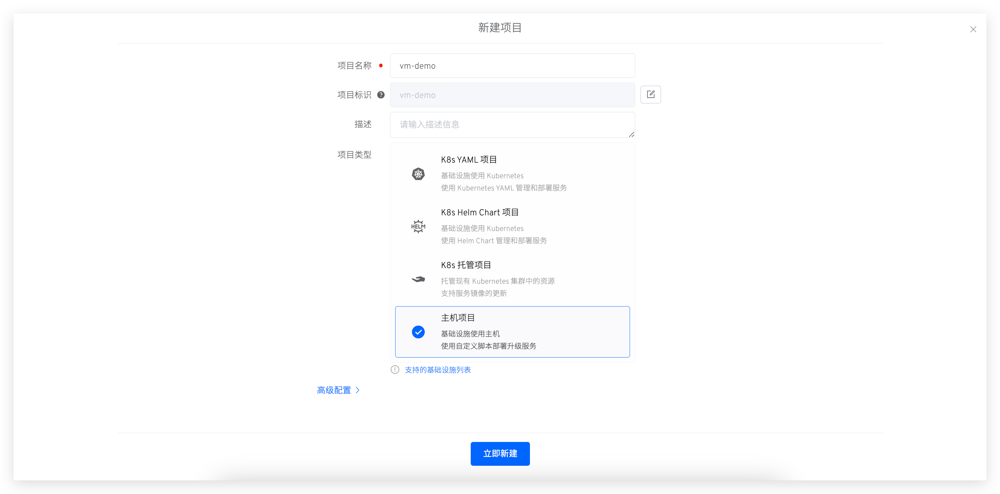
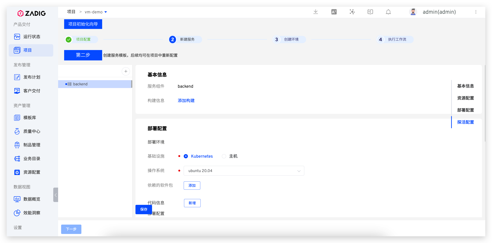
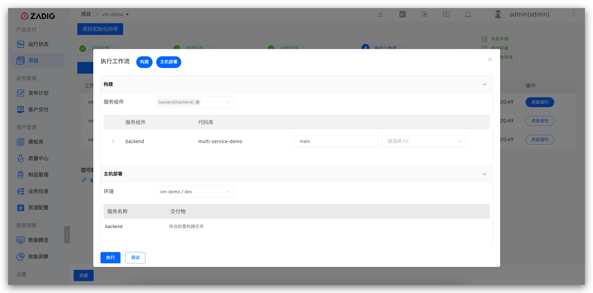

## 快速搭建项目

以下内容为主机项目的快速搭建步骤，如果你需要具体的案例，可参考：[教程](https://www.koderover.com/tutorials-detail/codelabs/cloudhost/index.html?index=..%2F..index#0)。

### 新建项目

进入 Zadig 系统，点击「项目」-「新建项目」，填写项目名称，选择`主机项目`的项目类型新建项目。

### 服务配置
点击 `+` 按钮，填写服务名称。并分别为其配置构建、服务部署及服务探活等信息。

> 可参阅 [主机服务](/Zadig%20v3.0/project/service/vm/)，完成相关配置项。

### 新建环境

新建环境，关联主机资源。

### 工作流交付

待环境和工作流准备完毕，点击`下一步`，选择 dev 环境的工作流，可触发 dev 环境的服务更新。

