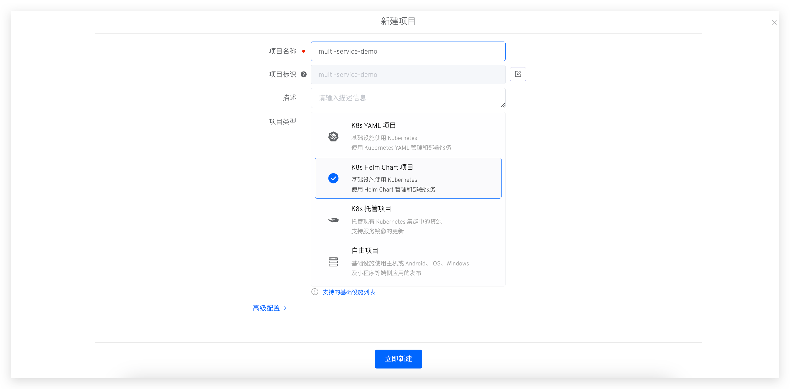
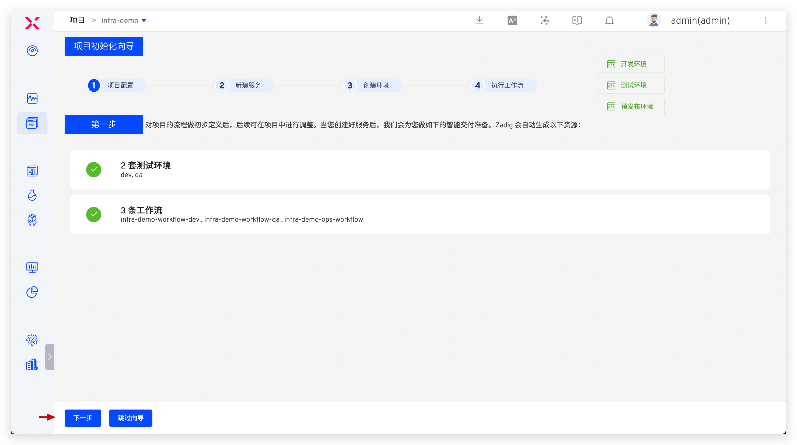
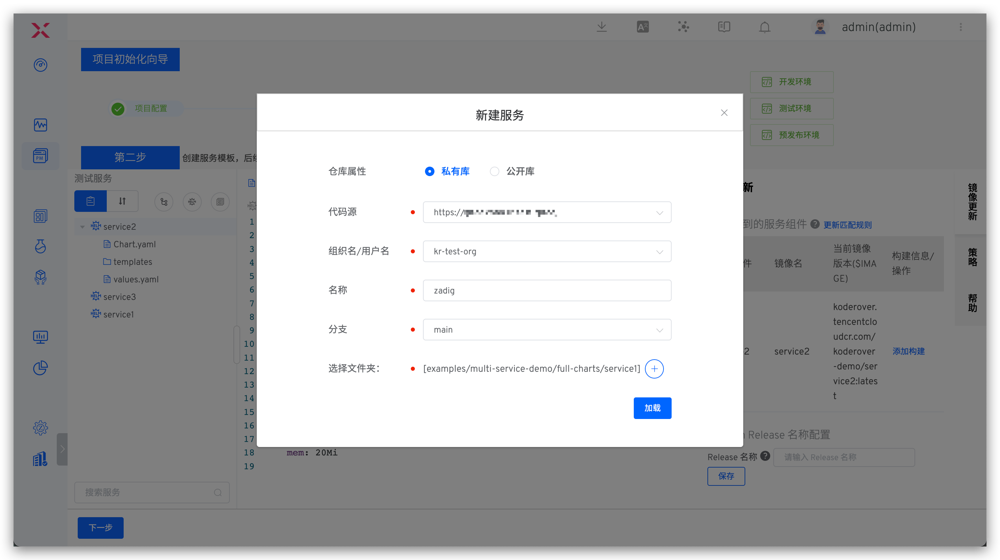
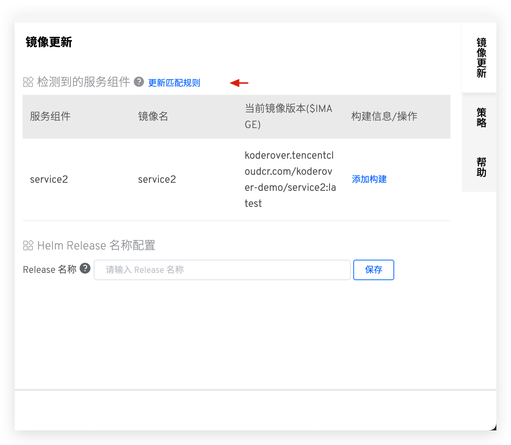
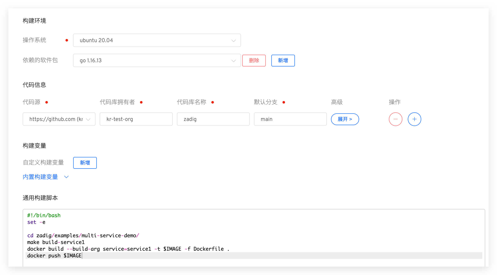
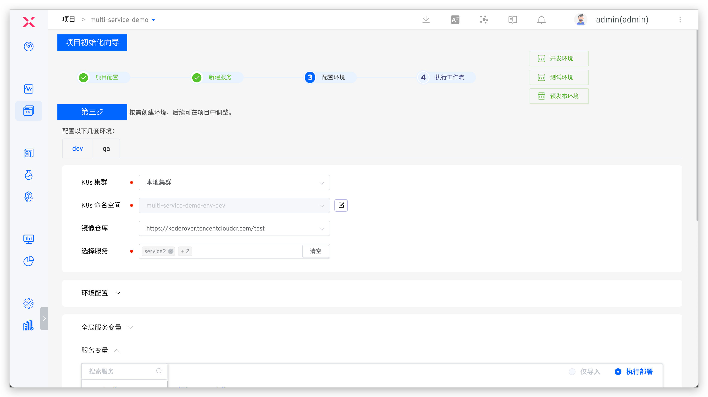
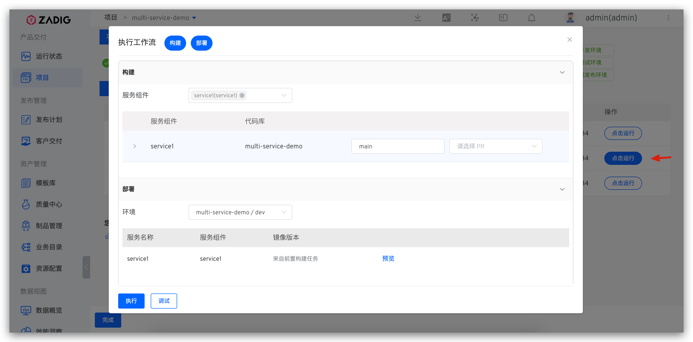
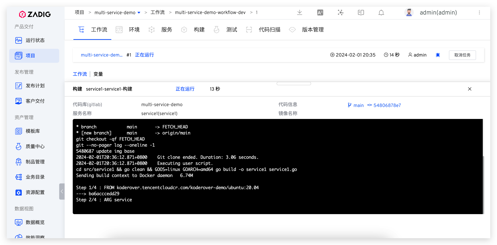
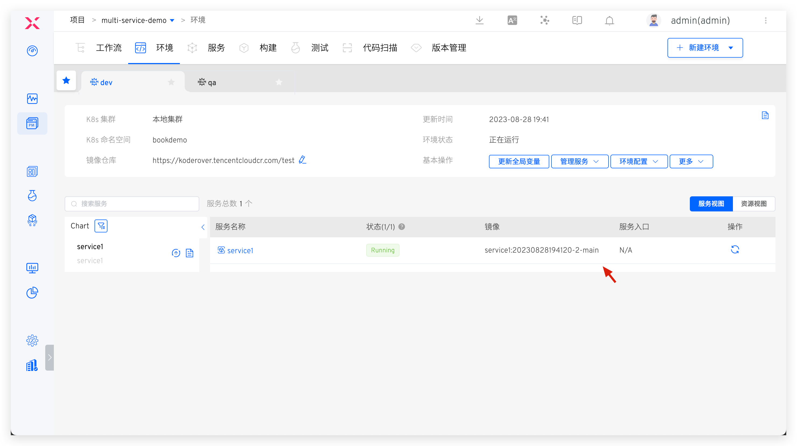
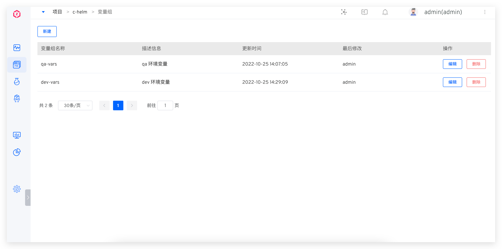

## 快速搭建项目

以下内容为 K8s Helm Chart 项目的快速搭建步骤，如果你需要具体的案例，可参考：[教程](https://www.koderover.com/tutorials-detail/codelabs/helm-chart/index.html?index=..%2F..index#0)。

### 新建项目

进入 Zadig 系统，点击「项目」-「新建项目」，填写项目名称，选择`K8s Helm Chart 项目`的项目类型新建项目。

点击`下一步`，进入服务配置环节。

### 服务配置

新建服务并为服务配置构建。新建服务可参考文档：[新建 K8s Helm Chart 服务](/Zadig%20v3.1/project/service/helm/chart/#新建服务)。

服务创建完毕后，系统会自动解析 values 文件中定义的服务组件。点击`添加构建`为服务组件配置构建，参考文档：[构建配置](/Zadig%20v3.1/project/build/)。

> 服务组件的概念介绍可参考文档：[服务组件](/Zadig%20v3.1/env/overview/#什么是服务组件)。

### 配置环境
服务配置完毕后点击`下一步`, 进入新建环境页面，用户可根据需要配置业务环境。
> 相关参数说明可参考文档：[新建环境](/Zadig%20v3.1/project/env/k8s/#新建环境)。

点击`新建环境`，待环境创建完毕，点击`下一步`，进入到工作流交付环节。
::: tip
服务数量以及启动服务所需的资源会影响环境的创建时间，请耐心等待。
:::

### 工作流交付

- 执行 `multi-service-demo-workflow-dev` 工作流，对 `dev` 环境的服务进行更新升级。

- 在工作流执行详情页面可实时跟踪构建日志。

- 待工作流成功运行完毕，服务会被自动更新部署。

## 变量组

### 如何配置

Helm Chart 项目中，项目管理员点击`配置`->`变量组`可以对项目中的变量进行管理。

### 如何使用

Helm Chart 项目中环境的全局变量可以使用变量组，详情参考[更新全局变量](/Zadig%20v3.1/project/env/helm/chart/#更新全局变量)。
