本文主要介绍相比 Jenkins 任务，Zadig 工作流的独特之处以及从 Jenkins 迁移到 Zadig 的具体操作。

## Zadig 工作流到底有何独特之处？

Zadig 工作流引擎起初基于 Kubernetes 原生能力搭建，借助 Kubernertes 的资源动态分配能力，实现多任务的并发执行，相比 Jenkins 至少可以节省 **50%** 的资源，并可以提高至少 **40%** 的任务执行效率。
Zadig 工作流的设计更贴合实际业务场景，支持编排产品交付过程中涉及到的任何系统和工具，如：项目管理系统、代码托管平台、测试平台、部署工具、配置管理工具、数据管理工具、审批系统、企业自建系统等等。Zadig 工作流除了具备 CI 工作流的基本能力（比如克隆代码、执行 shell 脚本、触发器、通知、缓存等等）外，支持以下更多能力：
  - 支持多服务共享构建、构建模板、利用 Serverless 资源构建
  - 支持多服务的并发构建、并发部署、并发测试
  - 支持项目管理中的任务状态变更、配置变更、数据变更
  - 支持蓝绿发布、金丝雀发布、分批次灰度发布、MSE 全链路和 Istio 全链路发布
  - 支持发布过程审批
  - 在执行时支持根据实际的分支策略，自由选择 Branch、PR/MR、Branch+PR/MR、Tag、Commit 方式进行构建
  - ……


### 工作流实现方式的细节差异

| 工作流关键环节 | Jenkins | Zadig |
| --- | --- | --- |
| 执行环境 | 手工制作环境 | 可扩展云原生环境及依赖包 |
| 代码信息 | 分散配置代码源 | 统一管理多种代码来源 |
| 执行脚本与变量 | 分散编写脚本 | 统一配置脚本规范 |
| 定时触发 | 定时触发 | 多种可定制触发策略 |
| 代码变更触发 | 插件代码触发  | 海量多种触发策略 |
| 工作流间的串接 | 根据工作流状态触发 | 服务化灵活编排调度 |
| 多任务并发执行 | 编写脚本控制并发 | 云原生任务 GUI 配置并发 |
|  任务并发数量控制 | 资源节点控制并发 | 统一管理并发调度策略 |


## 从 Jenkins 迁移到 Zadig 具体操作

### 比较一：执行环境

对于工作流任务依赖的环境，在 Jenkins 上需在对应节点上手工制作，而在 Zadig 上支持管理任务运行时基础环境和依赖的软件包，方便平台运维统一管控业务构建、测试等过程使用的基础资源，保障资源的安全及合规。

Jenkins 任务的执行环境通过在配置中选择运行节点来指定，任务执行过程中用到的软件包需要在对应节点上安装和管理。

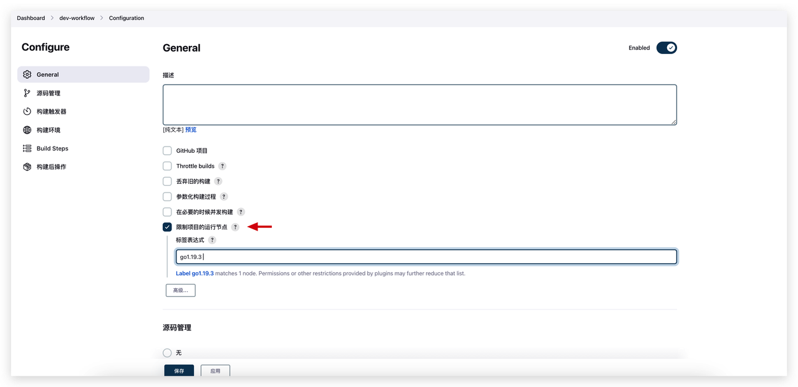

Zadig 任务的执行环境通过在配置中选择操作系统和依赖软件包来指定。


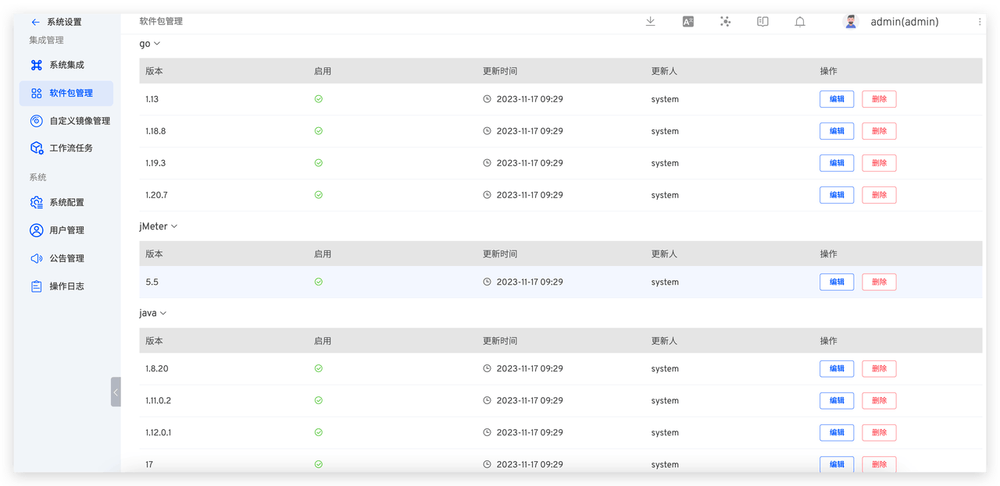
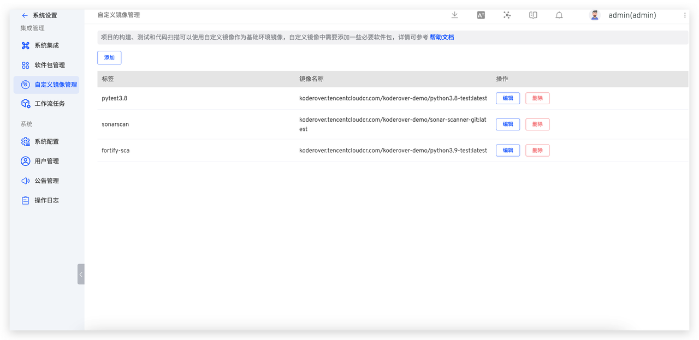
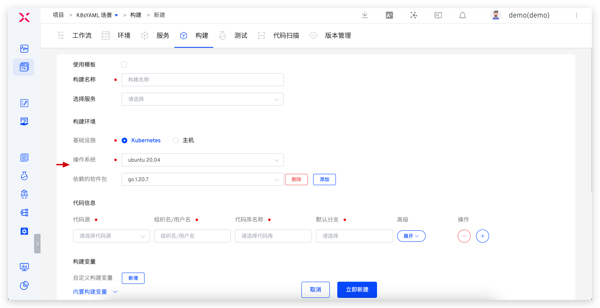

### 比较二：代码信息

对企业内部使用的代码源，在Jenkins上将其分散在不同的任务中进行管理，而在 Zadig 上由管理员统一集成，以确保代码源的安全性。

下面以 GitLab 为例，比对 Jenkins 和 Zadig 上代码信息的配置。

Jenkins 通过配置「源码管理」来实现构建代码源的定义。

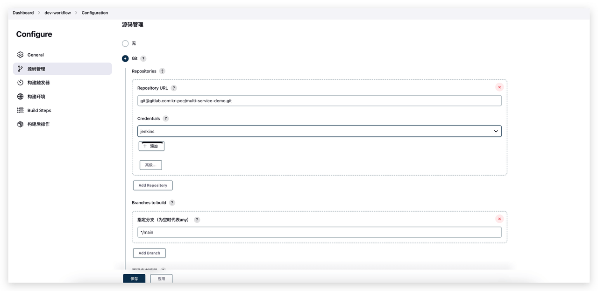

Zadig 支持 GitLab、GitHub、Gerrit、Gitee 、其他通用 Git 代码源等代码托管平台的集成，完成集成后可列出代码库中有权限的代码仓库信息，包括 Branch、PR/MR、Tag 等等，对于开发者更加直观、体验更友好。

- 步骤 1：集成代码源。具体过程参考 [GitLab 代码源集成](/Zadig%20v3.1/settings/codehost/gitlab/)

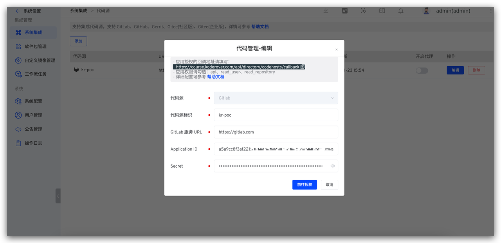

- 步骤 2：任务中配置代码信息。Zadig 构建、测试、代码扫描及通用任务均支持拉取代码信息。

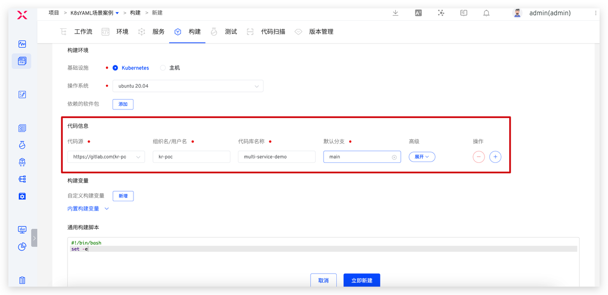

### 比较三：执行脚本及变量

对于服务执行脚本和变量的定义，在 Jenkins 上分散在各个任务中进行管理，而在 Zadig 上可以通过构建模版来标准化服务的构建过程，降低运维管理的负担。

下面以一个多服务的代码仓库的构建并推送镜像为例，比较 Jenkins 脚本编写和 Zadig 脚本编写的差异。

Jenkins 执行脚本及变量如下图所示，脚本中主要进行服务构建、镜像构建以及镜像推送过程。其中 `$SERVICE`、`$VERSION`、`$PWD` 变量需要在配置中定义。

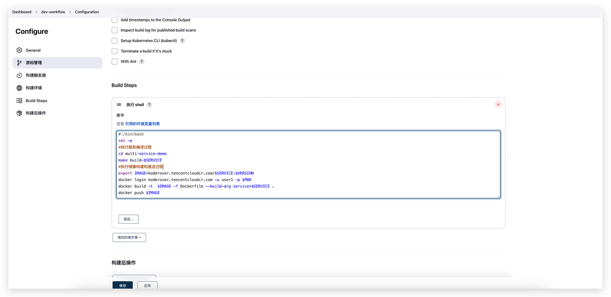
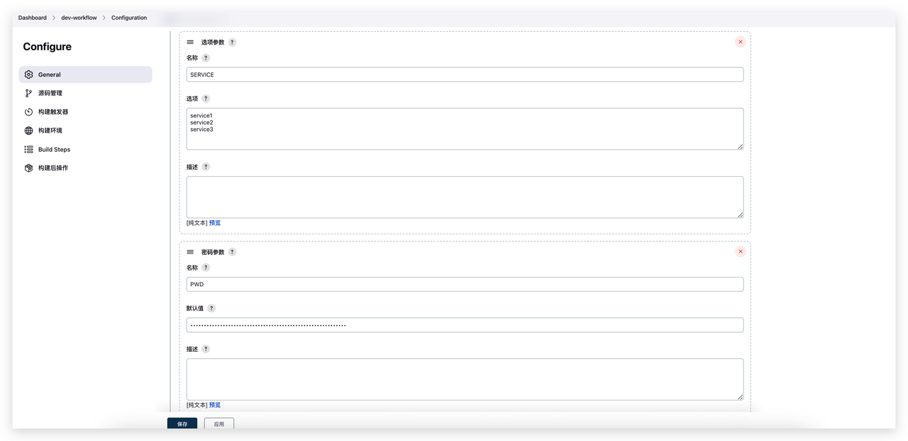

Zadig 执行脚本及变量如下图所示，Zadig 构建内置 `$SERVICE`、`$IMAGE` 变量，脚本更加简洁。

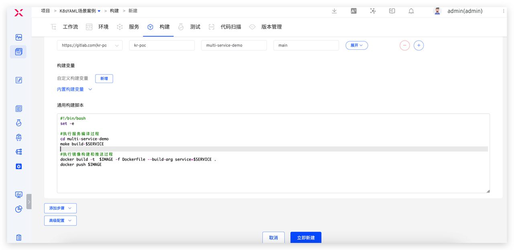
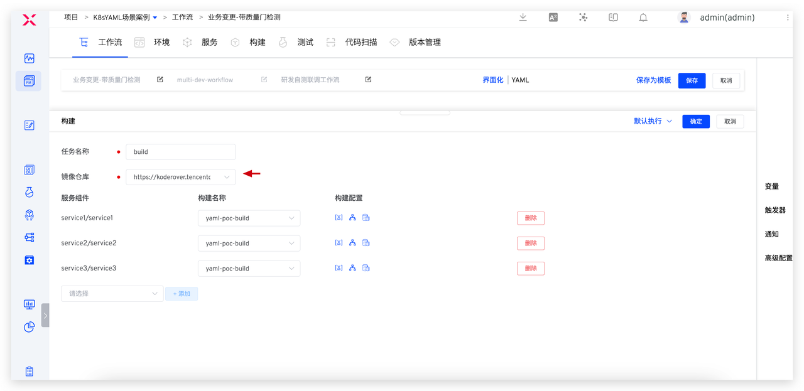

两者之间的差异：
1. Zadig 任务执行过程中根据工作流配置的镜像仓库自动完成 `docker login` 操作，因此无需在脚本中声明。
2. 在 Zadig 中镜像命名规则支持统一配置和管理，具体可参考[文档](/Zadig%20v3.1/project/service/k8s/#策略配置)，因此无需在脚本中定义 IMAGE 变量的生成规则。

### 比较四：定时触发

工作流任务的定时执行场景比较常见，Jenkins 针对工作流任务的默认参数可以配置定时触发，而 Zadig 上除了可以指定触发时间周期外，还支持配置任务的执行变量，更加灵活。
Jenkins 触发器支持配置 Cron 表达式来定时触发任务。

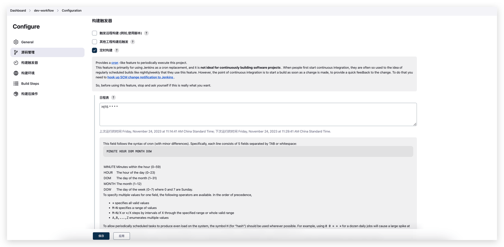

Zadig 定时器支持多种触发方式，包括定时循环、间隔循环和 Cron 表达式，以满足各种定时触发的需求。此外，相较于 Jenkins 使用默认参数执行，Zadig 定时器允许配置不同的工作流执行变量，提供更灵活的定制选项。

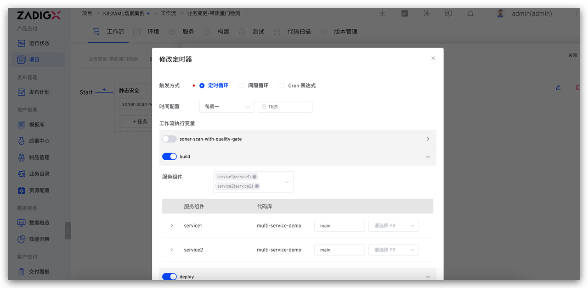

### 比较五：代码变更触发

开发者提交代码自动触发工作流执行是持续集成和持续部署（CI/CD）中常见的实践。在 Jenkins 中，为实现这一需求，需要依赖插件。相比之下，Zadig 则内建 Git 触发器功能，无需额外插件，通过灵活的配置满足各种触发场景，从而提升整体效率。
Jenkins 可以通过安装插件实现代码变更触发任务的执行。

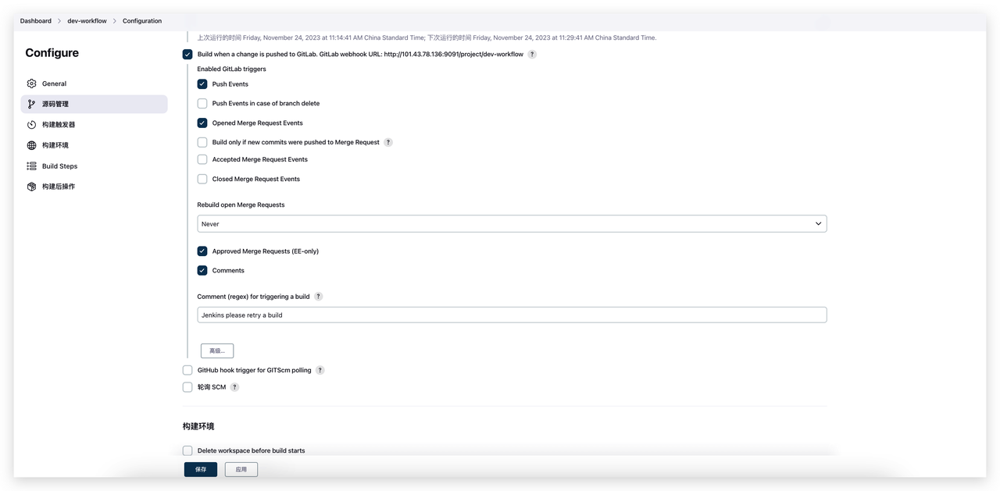

Zadig Git 触发器支持代码变更触发，通过定义代码信息、触发事件、代码文件目录以及工作流执行变量，来配置触发规则。这使得在代码库发生变更时，可以灵活而精准地触发相应的工作流，以满足各种复杂的自动化流程的执行。

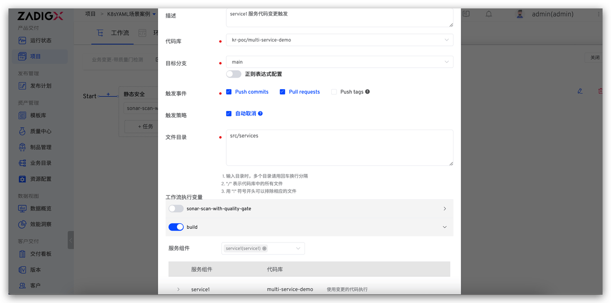

除了上述两种触发器，Zadig 还支持多种其他触发器，包括「JIRA 触发器」、「飞书项目触发器」和「通用触发器」等，使用详情参考[文档](/Zadig%20v3.1/project/workflow-trigger/)。


### 比较六：工作流之间的串接编排

企业内部对于一些服务化的任务，例如安全扫描服务，需要进行统一管理并在多个工作流中使用。通常，这些任务由安全部门或平台团队进行统一管理，然后在各个业务工作流中进行调用。为了降低实施和后续维护的负担，一般选择采用多工作流串接的方式，以实现更高效的任务调度和管理。
Jenkins 通过配置「构建其他工程」来触发其他任务。

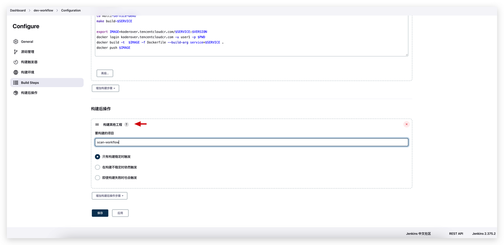

Zadig 的工作流本身采用了服务化的设计，使得测试、代码扫描等配置可以实现集中化的管理，然后轻松挂接到各个工作流中使用。这种设计使得配置和管理变得更加高效，同时在不同的工作流中灵活地应用这些服务，提高了整体工作流的可维护性和可扩展性。

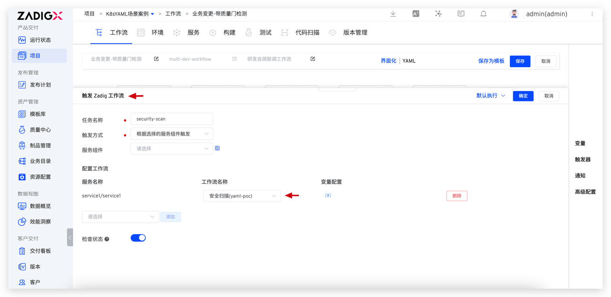

### 比较七：多任务并发执行

多任务并发执行在复杂的软件开发流程、持续集成和部署中尤为关键。这能够显著减少工程师的等待时间，提高整体研发效率，从而加速项目进程，更灵活地应对不断变化的需求。
Jenkins 流水线支持不同的 "stage" 并发执行，详细配置请参考以下结构。

```groovy
pipeline {
    agent any
    stages {
        stage('Build and Deploy Services') {
            parallel {
                stage('Service 1') {
                    steps {
                        echo "构建和部署 Service 1 过程"
                    }
                }
                stage('Service 2') {
                    steps {
                        echo "构建和部署 Service 2 过程"
                    }
                }
                stage('Service 3') {
                    steps {
                        echo "构建和部署 Service 3 过程"
                    }
                }
            }
        }
    }
}
```

Zadig 工作流仅需在「阶段」上打开「并发执行」的开关，即可实现阶段内多个任务的并发执行。

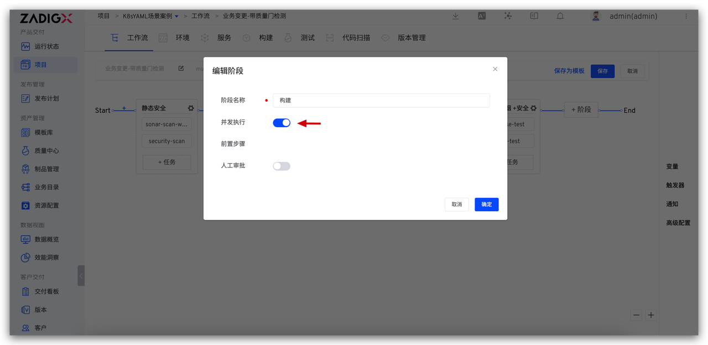
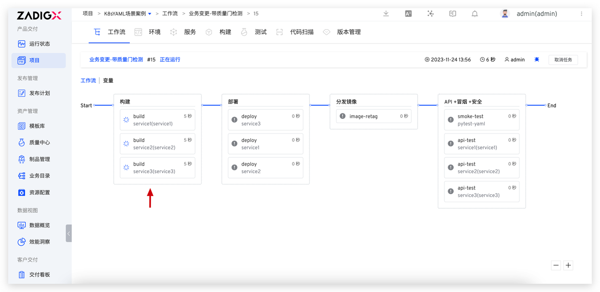


### 比较八：任务并发数量控制

Jenkins 和 Zadig 均支持同一工作流的多个任务并发执行。Jenkins 通过资源节点来控制并发数量，而 Zadig 则统一管理并发调度策略，具有灵活控制任务优先级能力。
Jenkins 通过在节点上配置「任务执行数量」来控制多个任务的并发，单个 Jenkins 任务的并发可以在任务配置中指定。

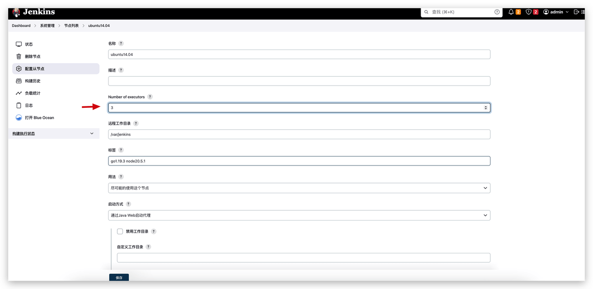
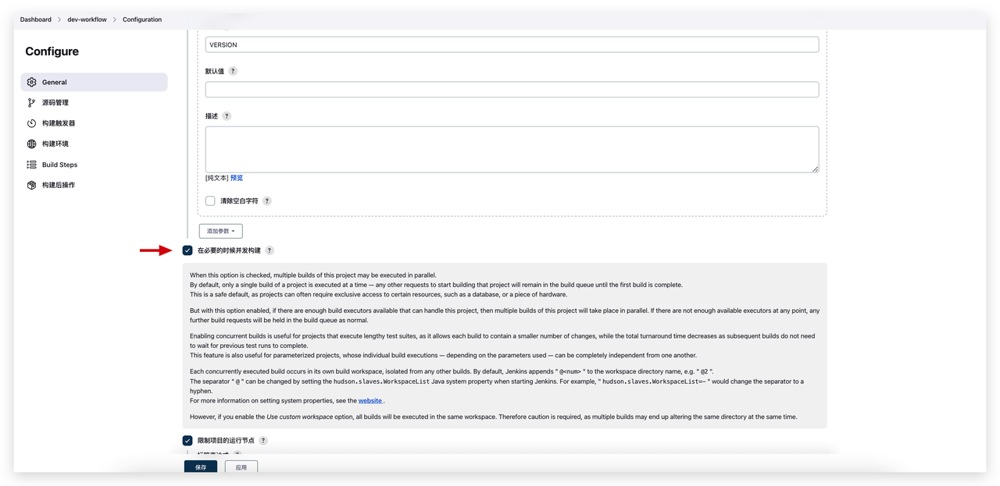

Zadig 通过在任务配置中修改「任务并发数量设置」实现并发数控制，其中「工作流任务并发数量」控制同时执行的工作流任务数，「单任务服务并发数」控制同一个工作流任务中服务的并发数量。除此之外，面对低优先级任务占用全局并发数量的场景，可以通过配置工作流的「执行并发数」来解决。Zadig 具有更自由的任务并发数控制，能够灵活应对企业内部复杂的任务并发场景。

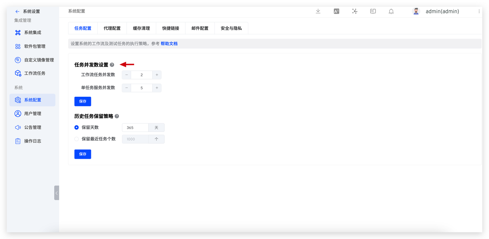
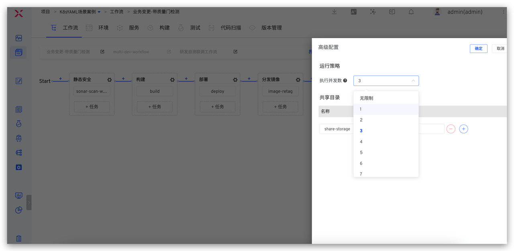


除以上能力外，Jenkins 通过插件来扩展更多的能力，而 Zadig 可以通过开发「自定义任务」，和企业自建系统打通，来满足企业复杂流程，具体开发过程参考[工作流任务](/Zadig%20v3.1/settings/custom-task/)。


