本文主要介绍客户交付中供应商具体操作。

## 新建项目

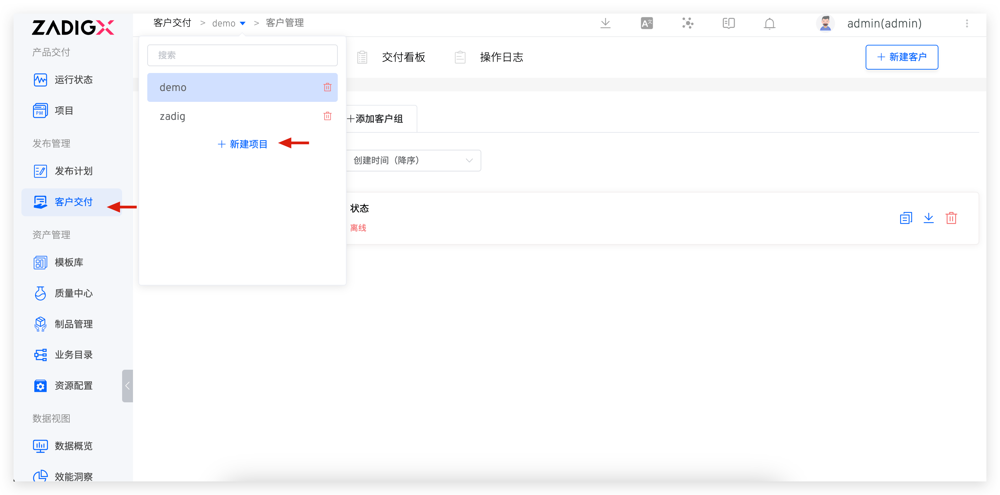
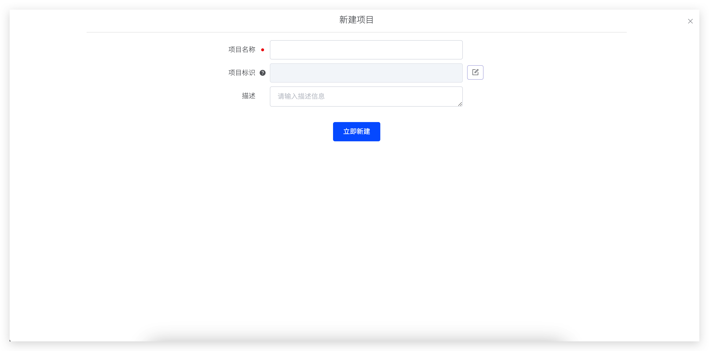

点击`新建项目`选项，输入项目相关信息
- 项目名称：后续不可修改
- 项目主键
- 描述信息
点击`确定`，完成项目新建。

## 添加客户组

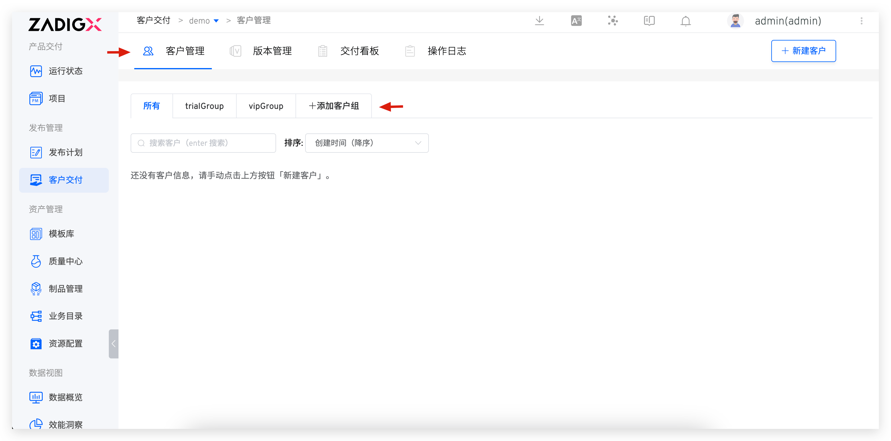
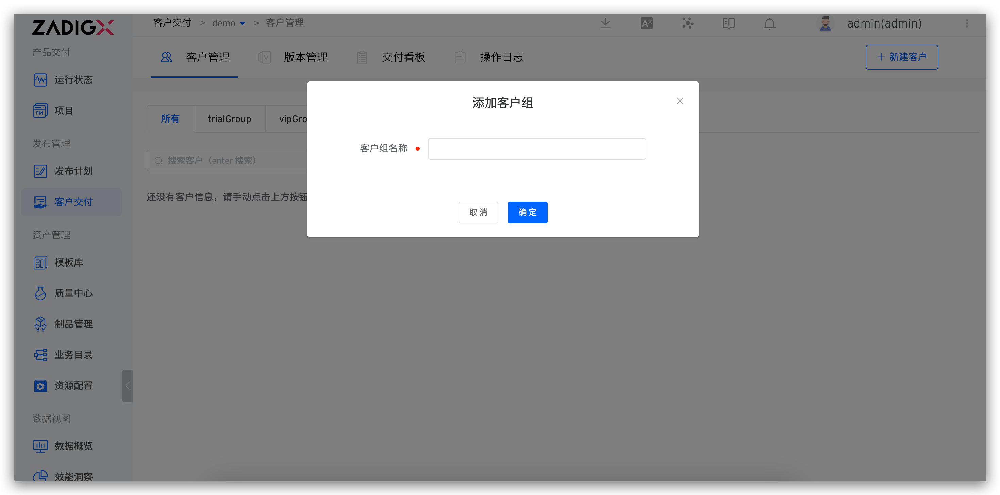

1. 进入客户模块
2. 点击添加`客户组`，输入客户组名称，点击`确定`，完成客户组新建。

## 创建客户

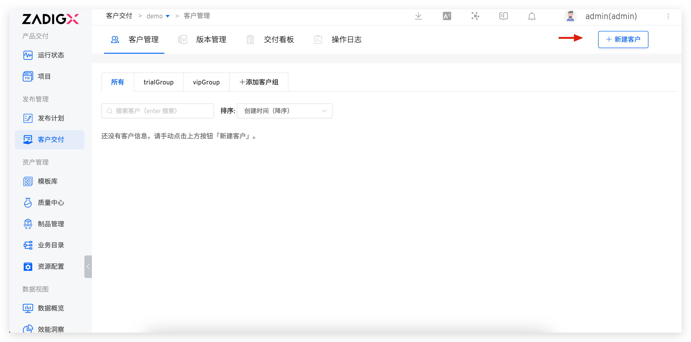
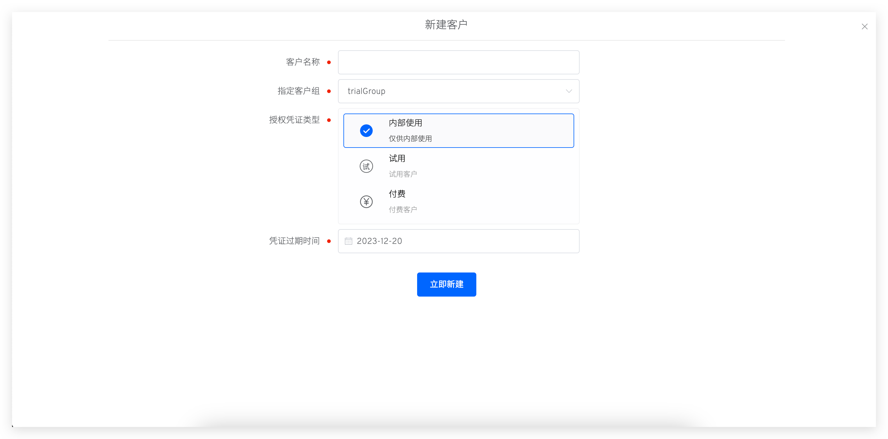

1. 进入客户模块
2. 点击`创建客户`，输入客户信息
    - 客户名称
    - 指定客户组
    - 授权凭证类型：
        - 内部使用：内部测试使用
        - 试用：标识试用客户
        - 付费：标识付费客户
    - 授权凭证过期时间：超过过期时间，客户控制台不再获取供应商提供到的新版本

## 创建版本
::: warning 前提
1. 需要安装 Chart 包推送到 Helm Chart 仓库
2. 在 Zadig 上集成 Helm Chart 仓库，具体集成方式参考[这里](/Zadig%20v3.1/settings/helm/)
:::

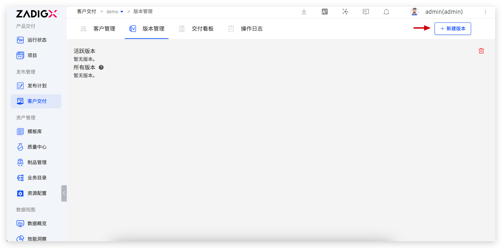
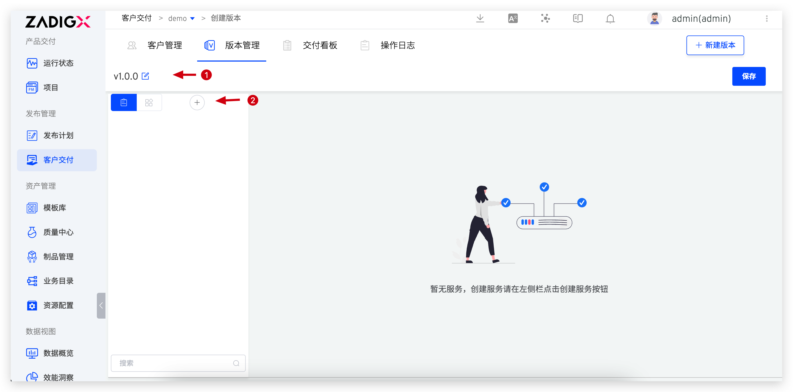
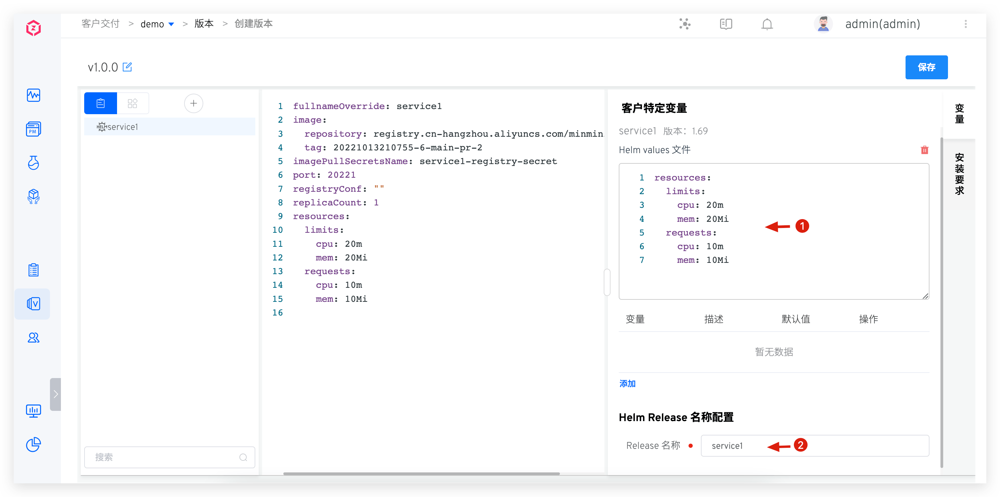

1. 进入版本模块
2. 点击`创建版本` ，配置版本信息
    1. 选择 Chart 仓库和对应的 Chart 版本
    2. 配置客户特定变量：暴露出少量配置供用户安装时根据自己环境的实际情况，配置相应的变量值
    3. Helm Release 名称配置：部署时使用的 release 名称
    4. 配置`安装要求`，根据应用对环境资源的实际要求配置，可以配置如下信息
        1. Kubernetes 最低版本
        2. Kubernetes 节点数量
3. 点击`确定`，完成版本创建

## 推送版本

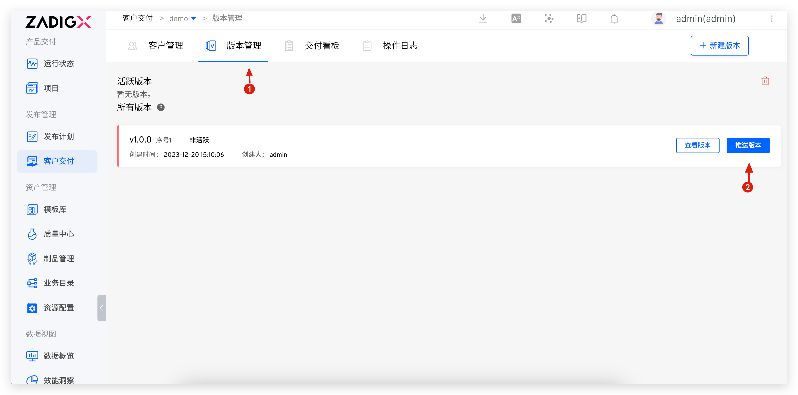
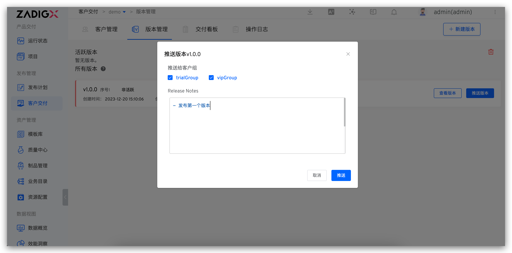

1. 进入版本模块
2. 点击`推送版本`，选择需要推送的客户组，填写 Release Notes
3. 点击`确定`，完成版本推送

## 复制控制台安装脚本

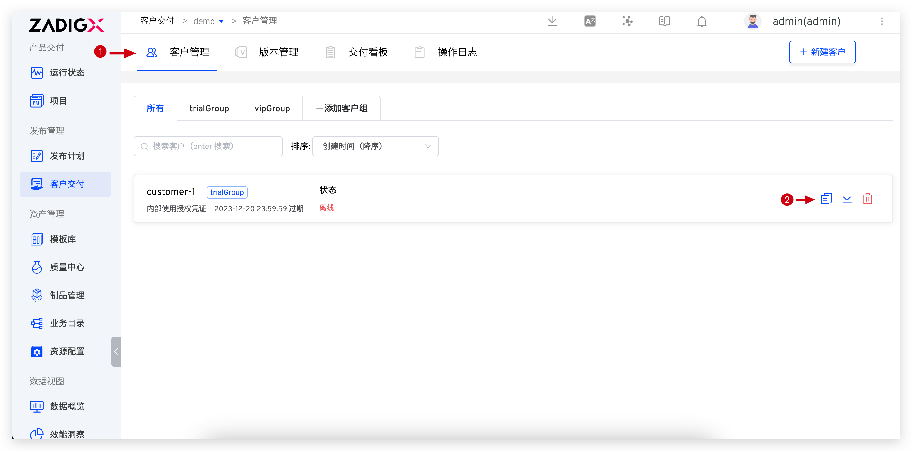

客户环境中需要安装客户控制台，安装方式可以通过以下方式获得：
1. 进入`客户`模块
2. 在图中位置可以复制客户的控制台安装脚本

## 下载授权凭证

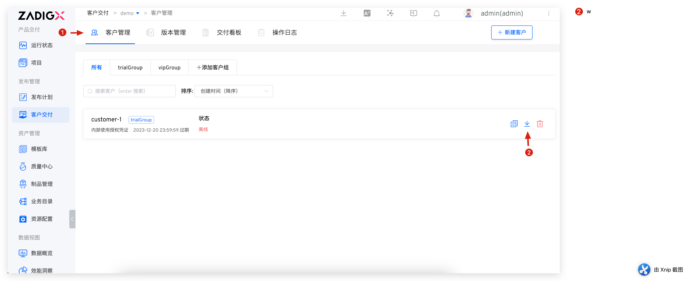

1. 进入`客户`模块
2. 点击下载 icon，获取授权凭证