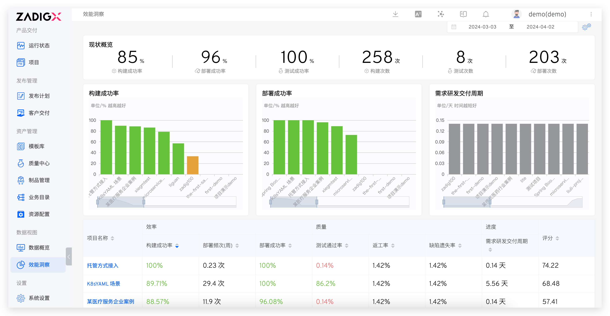
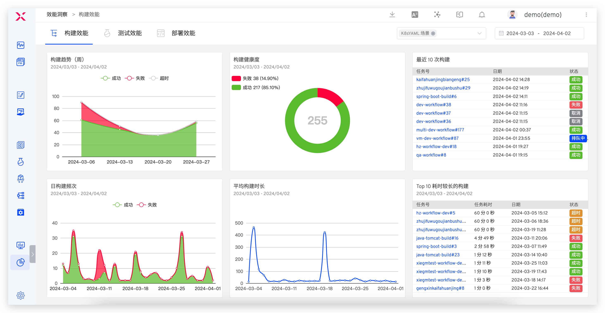
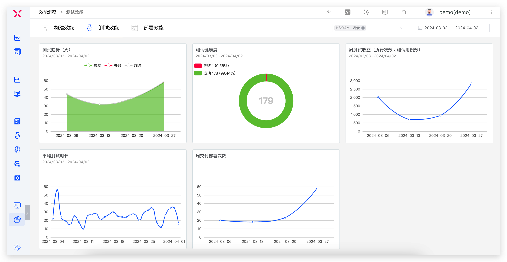
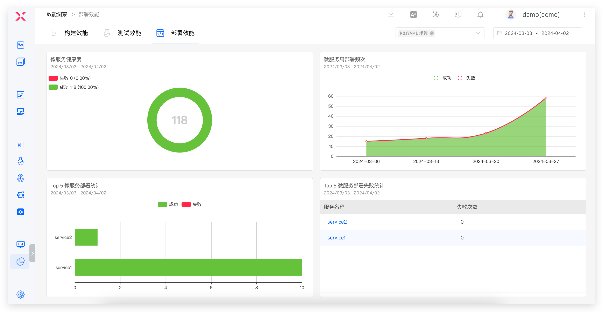
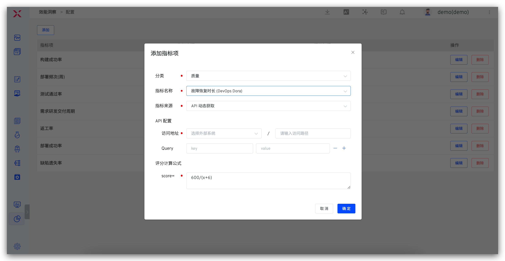
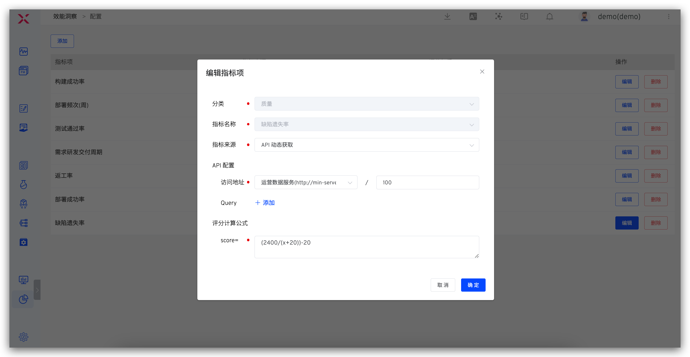

## 概览

访问数据视图 -> 效能洞察，可以从效率、质量和进度对项目进行预览。点击项目名称，可查看服务的构建、部署、测试数据，帮助分析各个环节的变化过程以及效能短板。




### 构建效能

展示可选时间可选项目的构建数据，包括周构建趋势、构建健康度、日构建频次、平均构建时长、最近 10 次构建以及 Top 10 耗时较长的构建。



- `周构建趋势`: 以周为粒度显示项目的构建次数趋势
- `构建健康度`: 项目中构建任务成功和失败次数占比
- `日构建频次`: 项目中构建任务成功和失败的次数
- `平均构建时长`:项目中构建任务的平均每日时长
- `最近 10 次构建`: 项目中最近 10 次工作流执行记录
- `Top 10 较长的构建`: 项目中耗时较长工作流

### 测试效能

关于测试的趋势、健康度、平均测试时长、以及周测试收益。



- `测试趋势`: 以周为粒度显示项目的测试执行次数趋势
- `测试健康度`: 项目中测试任务成功和失败次数占比
- `周测试收益`: 项目中测试任务执行测试x测试用例数
- `平均测试时长`: 项目中测试任务平均每日执行时长

### 部署效能

关于微服务的健康度、周部署频次、部署统计以及微服务部署失败统计。



- `微服务健康度`: 项目中部署任务成功和失败次数占比
- `微服务周部署频次`: 以周为粒度显示项目的服务部署成功和失败次数
- `Top 5 微服务部署统计`: 项目中一段时间内部署成功和失败情况排名前五的服务
- `Top 5 微服务部署失败统计`: 项目中在一段时间内的部署失败总次数排名前五的服务

## 配置

在概览页点击右上角的配置图标，自定义效能指标，以及每一项指标的评分权重。



说明：

- `分类`：可配置质量/效率/进度类别的指标。
- `指标来源`：包括 `Zadig 采集`和 `API 动态获取`。
    - `Zadig 采集`：可用于配置构建/部署/发布/测试的成功率以及平均耗时，数据来源于工作流中的构建/部署/发布/测试执行情况。
    - `API 动态获取`：从外部系统获取并自定义获取数据 API 配置。
- `API 配置`：配置 API，用于获取数据，外部系统集成参考文档：[外部系统](/Zadig%20v3.1/settings/others/)。
- `评分计算公式`：计算该指标分数的公式，对各个指标分数求权后相加，即为项目的总评分。

对于使用 API 动态获取数据，Zadig 获取数据的请求示例如下：

``` bash
GET <外部系统>?start_time=<Unix 时间戳>&end_time=<Unix 时间戳>&project_name=<项目标识>&key1=value1&key2=value2...
```


说明：

- 获取数据的请求为 GET 请求
- 相关查询参数以 query string 的方式实现
- start_time、end_time、project_name 三个参数无需在指标项中配置
- 外部系统返回 JSON 数据，且需要包含 data 信息，示例如下

``` json
{
    "data": 92
}
```
## 指标项语义

### 质量
- `测试通过率`：测试成功执行次数/测试执行总次数，评估内部研发过程的交付质量
- `缺陷遗失率`：生产发现的问题/所有缺陷数量，评估产品质量的一个标准
- `返工率`：测试打回问题/总问题数，评估研发交付质量和效率
- `严重缺陷率`：高优先级缺陷数/总缺陷数，评估研发过程中交付质量
- `单元测试通过率`： 单元测试成功执行数/单元测试执行总次数，评估研发代码质量
- `单元测试覆盖率`：评估代码中被单元测试覆盖的部分的比例
- `变更（发布）失败率`：回滚次数/变更总次数，评估运维上线操作质量

### 效率
- `构建成功率`：构建成功执行次数/构建总次数，评估研发过程中的构建效率
- `构建平均耗时`：一段时间内构建任务的平均耗时，评估研发过程中的构建效率
- `构建频次（周）`：以周为粒度显示构建的次数，评估日常变更效率和工程效率
- `部署成功率`：部署成功次数/部署总次数，评估研发过程中的部署效率
- `部署平均耗时`：一段时间内部署的平均耗时，评估研发过程中的部署效率
- `部署频次(周）`：以周为粒度显示部署的次数，评估日常变更效率和工程效率
- `发布成功率`：发布到生产环境成功次数/发布总次数
- `发布平均耗时`：一段时间内发布过程的平均耗时
- `发布频次(周)`：以周为粒度显示发布的次数，评估交付效率
- `测试平均耗时`：一段时间内测试的平均耗时，评估测试效率
- `变更前置耗时`：从代码提交到代码在生产环境中运行成功的时间
- `故障恢复时长（MTTR）`：评估建设、问题诊断效率

### 进度
- `平均需求交付周期`：从 PRD 评审通过到生产发布周期
- `需求研发交付周期`：从研发认领需求到生产发布周期