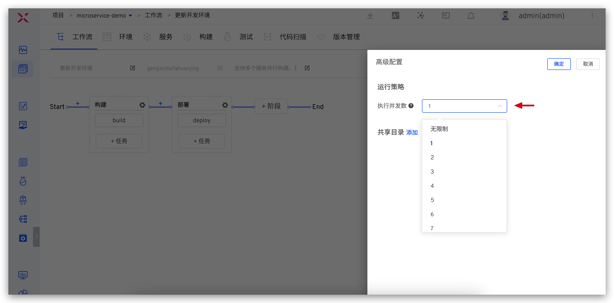
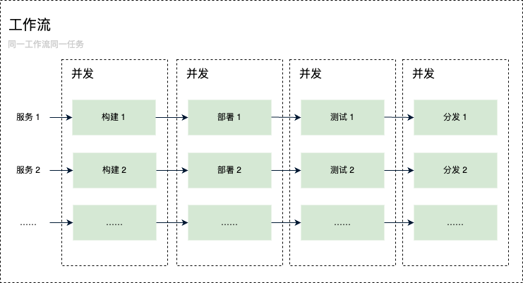
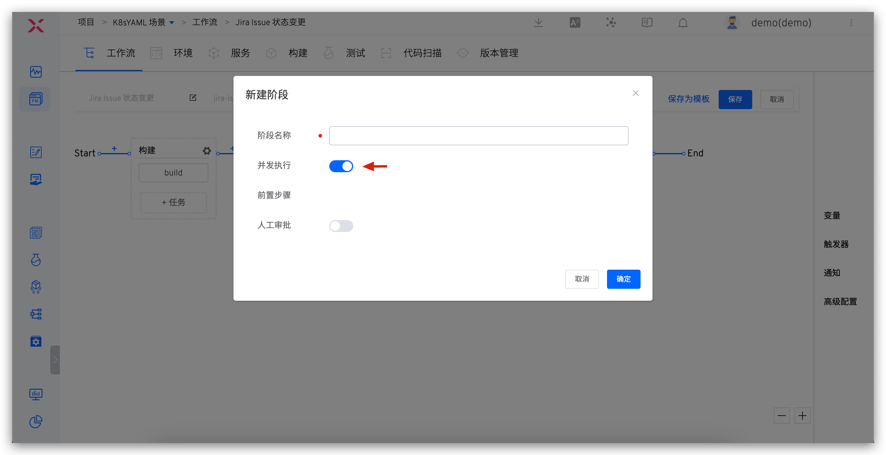
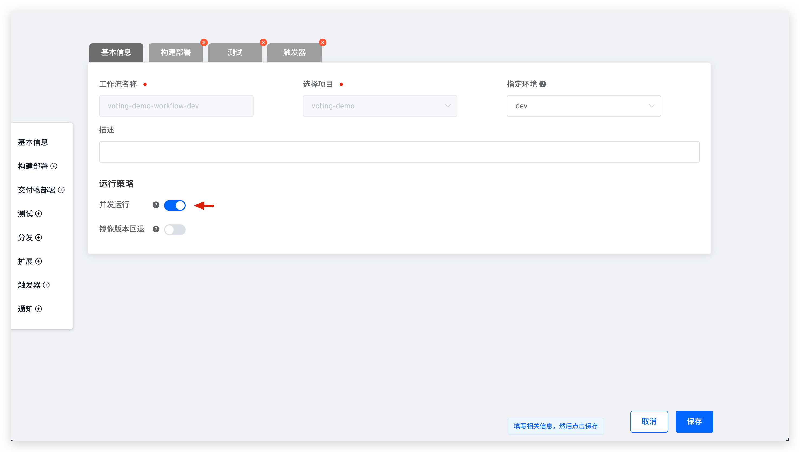

本文主要介绍工作流并发执行能力。

## 同一工作流并发执行

::: tip
Zadig 工作流执行并发数依赖系统资源的上限，需要管理员在系统设置针对自身情况设置合理的 [任务并发数](/Zadig%20v3.2/settings/system-settings/#任务并发数设置)。
:::

同一工作流具备同时处理多个执行实例的能力，在工作流`高级配置`中修改执行并发数，可以开启工作流的并发能力。当多个开发者分别触发该工作流部署更新不同的服务时，这些任务将会同时进行，无需等待其他任务完成，最大限度地提升协作效率。

## 工作流同阶段任务并发执行

Zadig 允许工作流同阶段的任务并发执行。仅执行一次工作流，即可触发多个服务被同时执行`构建`->`部署`->`测试`->`分发`流程，不同服务的构建发布过程彼此独立互不干扰，如下图所示。

开启工作流阶段并发执行，实现同阶段任务并发执行能力，如下图所示。

<!-- 当多个开发者先后触发该工作流：

- 触发的工作流任务里包括部署阶段，则更新不同的服务时，产生的多个工作流任务将会并发执行，开发者之间无需等待，最大限度地提升协作效率。
- 触发的工作流任务里不包含部署阶段，则即使使用工作流更新相同的服务，同一工作流的多个任务也可并发执行。

目前同一个工作流多个不同的任务支持的并发规则如下：
| | 手动触发 | 定时触发 | Webhook 触发 |
|---|---|---|---|
| 不同服务，同时构建             | √ | √ | x |
| 相同服务，同时构建             | √ | √ | x |
| 不同服务，构建部署到同环境      | √ | √ | √ |
| 不同服务，构建部署到不同环境    | √ | √ | √ |
| 相同服务，构建部署到不同环境    | x | x | √ |
| 相同服务，构建部署到同环境      | x | x | x | -->