Zadig 支持性能、功能、接口、UI、端到端自动化测试等诸多测试场景，内置了 jMeter、ginkgo 等主流测试框架，还可以通过[安装软件包](/Zadig%20v3.2/settings/app/)以满足更为丰富的自动化测试需要。

测试模块主要包含自动化测试集管理、测试环境的支持、测试执行和结果分析，同时支持标准 Junit / Html 测试报告的输出。

## 测试管理

- `测试管理`：跨项目用例可共享。
- `测试执行`：支持 CI/CD 并发执行、单独执行、跨环境执行。
- `测试分析`：单场景耗时、通过率分析，跨团队测试效益、健康度分析。

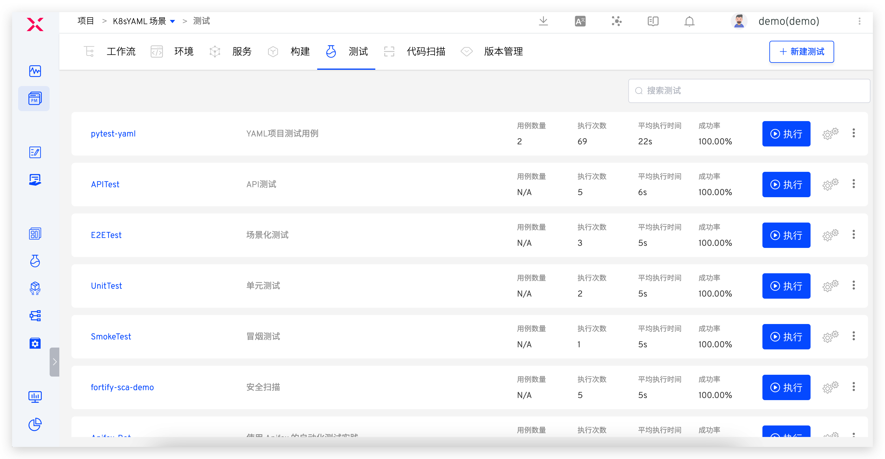

## 测试配置

### 测试执行环境
配置测试任务运行时的环境。

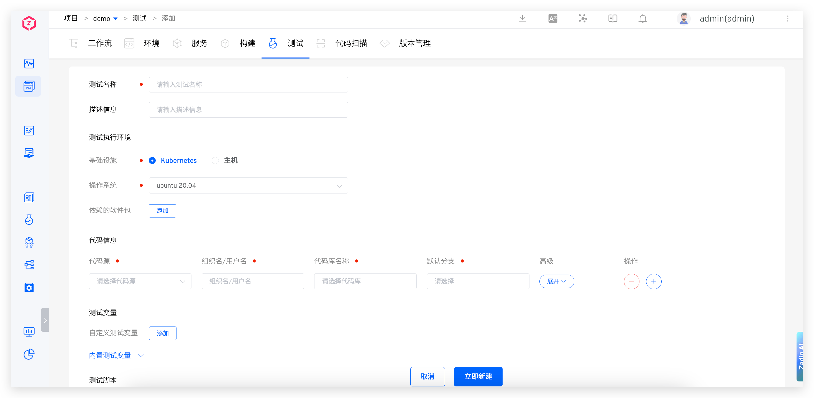

- `基础设施`：支持在 Kubernetes 和主机上执行测试任务

- `操作系统`：目前平台提供 Ubuntu 18.04 / Ubuntu 20.04 供选择，也可以自定义测试执行环境，详情请参考：[构建镜像管理](/Zadig%20v3.2/settings/custom-image/#步骤-1-生成构建镜像)。
- `依赖的软件包`：编译过程中需要用到的各类工具，比如不同版本的 Java、Go、Govendor、Node、Bower、Yarn、Phantomjs 等等。目前系统内置 Jmeter、Ginkgo、Selenium 等常见测试框架和工具。
::: tip
1. 选择软件包的过程中需要注意多个软件包之间的依赖关系，按照顺序进行安装。例如：Govendor 依赖 Go，那么必须先选 Go，再选择 Govendor。
2. 如果有其他软件包或者版本需求，系统管理员可以在[软件包管理](/Zadig%20v3.2/settings/app/)中配置其安装脚本。
:::

### 代码信息
为测试配置代码信息，测试执行时将按照指定的配置来拉取代码。支持的代码源请参考文档 [代码源信息](/Zadig%20v3.2/settings/codehost/overview/#功能兼容列表)，代码信息中的具体字段说明请参考文档 [代码信息字段说明](/Zadig%20v3.2/project/build/#代码信息)。

### 测试变量
包括系统内置变量和自定义变量，可在测试脚本中直接使用。

> 提示：在 [测试脚本](#测试脚本) 中添加 `env` 命令可查看所有测试变量。

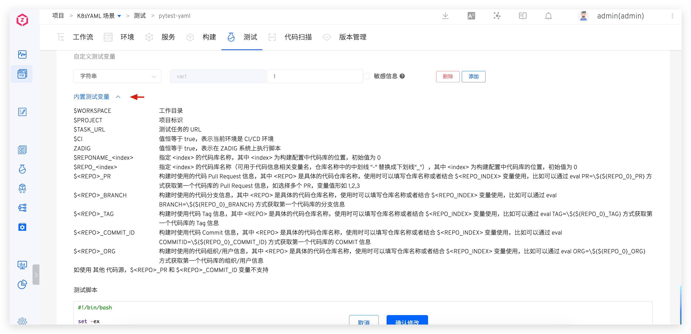

**内置测试变量**

内置测试变量及其描述说明如下：

|变量名称|描述|
|-------|---|
|`WORKSPACE`|当前测试任务的工作目录|
|`PROJECT`|项目标识|
|`TASK_URL`|测试工作流任务的 URL|
|`CI`|值恒等于 true，可视需要使用|
|`Zadig`|值恒等于 true，可视需要使用|
|`REPONAME_<index>`|1. 获取指定 `<index>` 的代码库名称<br>2. 其中 `<index>` 为测试配置中代码的位置，初始值为 0<br>3. 下图例中，在测试脚本中使用 `$REPO_0` 即可获得第一个代码库的名称 `Zadig`|
|`REPO_<index>`|1. 获取指定 `<index>` 的代码库名称，并自动将名称中的中划线 `-` 替换为下划线 `_`<br>2. 其中 `<index>` 为测试配置中代码的位置，初始值为 0<br>3. 下图例中，在测试脚本中使用 `$REPO_1` 即可获得第一个代码库转化后的名称 `test_resources`|
|`<REPO>_PR`|1. 获取测试过程中指定 `<REPO>` 使用的 Pull Request 信息，使用时请将 `<REPO>` 替换为具体的代码库名称<br>2. 当 `<REPO>` 信息中含有中划线 `-` 时，需要将 `-` 替换为下划线 `_`<br>3. 下图例中希望获取 `test-resources` 库的 Pull Request 信息，使用 `$test_resources_PR` 或者 `eval PR=\${${REPO_0}_PR}` 即可<br>4. 若构建时指定了多个 PR，比如指定的 PR ID 为 1、2、3，则该变量的值为 `1,2,3` <br> 5. 当代码库为`其他`代码源时，不支持该变量|
|`<REPO>_BRANCH`|1. 获取测试过程中指定 `<REPO>` 使用的分支信息，使用时请将 `<REPO>` 替换为具体的代码库名称<br>2. 当 `<REPO>` 信息中含有中划线 `-` 时，需要将 `-` 替换为下划线 `_`<br>3. 下图例中希望获取 `test-resources` 库的分支信息，使用 `$test_resources_BRANCH` 或者 `eval BRANCH=\${${REPO_0}_BRANCH}`即可|
|`<REPO>_TAG`|1. 获取测试过程中指定 `<REPO>` 使用的 Tag 信息，使用时请将 `<REPO>` 替换为具体的代码库名称<br>2. 当 `<REPO>` 信息中含有中划线 `-` 时，需要将 `-` 替换为下划线 `_`<br>3. 下图例中希望获取 `test-resources` 库的 Tag 信息，使用 `$test_resources_TAG` 或者 `eval TAG=\${${REPO_0}_TAG}` 即可|
|`<REPO>_COMMIT_ID`|1. 获取测试过程中指定 `<REPO>` 使用的 Commit ID 信息，使用时请将 `<REPO>` 替换为具体的代码库名称<br>2. 当 `<REPO>` 信息中含有中划线 `-` 时，需要将 `-` 替换为下划线 `_`<br> 3. 下图例中希望获取 `test-resources` 库的 Commit ID 信息，使用 `$test_resources_COMMIT_ID` 或者 `eval COMMIT_ID=\${${REPO_0}_COMMIT_ID}` 即可<br> 4. 当代码库为`其他`代码源时，不支持该变量|
|`<REPO>_ORG`|1. 获取测试过程中指定 `<REPO>` 使用的组织/用户信息，使用时请将 `<REPO>` 替换为具体的代码库名称<br>2. 当 `<REPO>` 信息中含有中划线 `-` 时，需要将 `-` 替换为下划线 `_`<br> 3. 下图例中希望获取 `test-resources` 库的组织/用户信息，使用 `$test_resources_ORG` 或者 `eval ORG=\${${REPO_0}_ORG}` 即可|

**自定义测试变量**

说明：
- 支持使用字符串类型或者枚举类型的测试变量。
- 可以设置字符串类型的变量为敏感信息，如 Access Key Id、Secret Access Key 等信息。设置为敏感信息后，测试任务的运行日志中将不会再输出其明文信息。

### 测试脚本
声明测试的具体执行过程，可在测试脚本中使用测试变量。

### 测试报告配置
配置测试报告所在的目录或测试文件的具体路径。

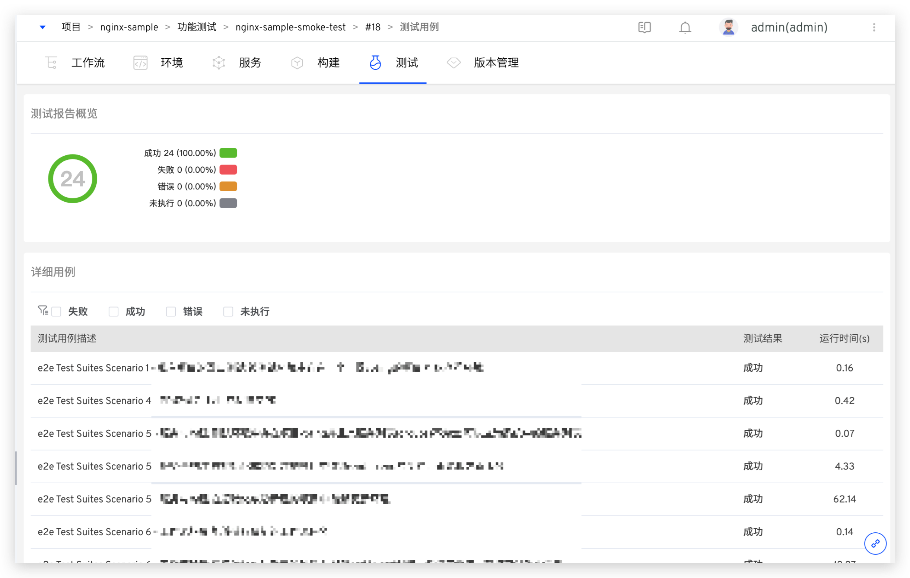

说明：
  - 支持标准 Junit XML / Html 格式的测试报告。
  - 对于 Junit 测试报告，需要配置其所在的目录，比如 `$WORKSPACE/path/to/junit_report/`，若目录下有多个测试报告，Zadig 会将所有测试报告合并视为最终报告。
  - 对于 Html 测试报告，需要配置其具体的文件路径，比如 `$WORKSPACE/path/to/html_report/result.html`，Html 测试报告文件将包含在测试任务发送的 IM 通知内容中。

### 文件存储
在`添加步骤`中可配置文件存储，用于将指定文件上传到对象存储中。

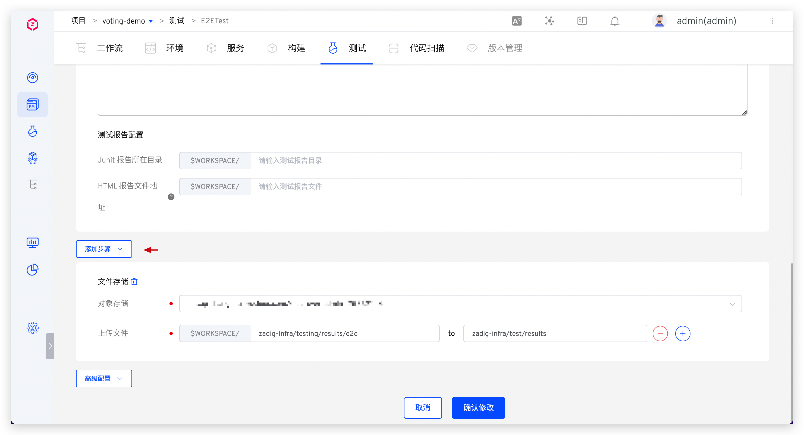

## 高级配置
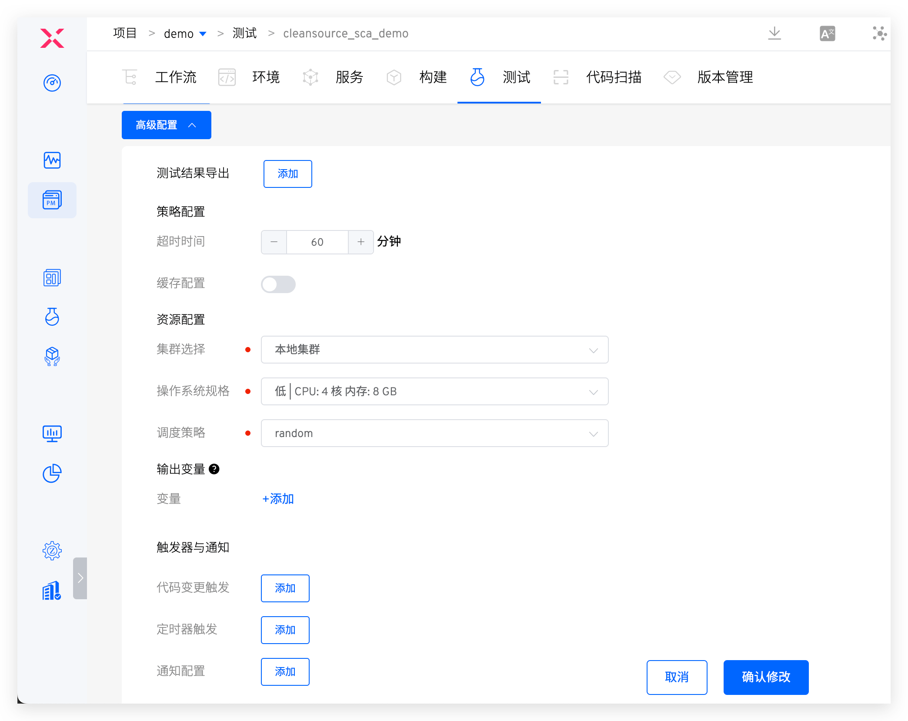

### 测试结果导出
设置一个或者多个文件目录，测试完成后可以在工作流任务详情页面进行下载，如下图所示：

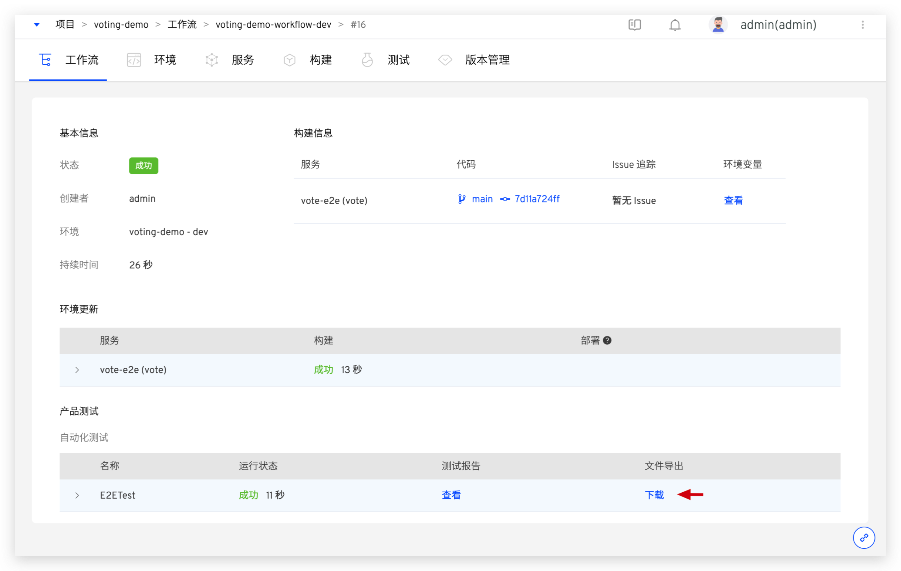

### 策略配置
- `超时时间`：配置测试任务执行的超时时间，若超过设置的时间阈值后测试任务仍未成功，则视为超时失败。
- `缓存配置`：开启缓存后，在测试任务执行时会使用此处配置的缓存目录，目录配置可使用[测试变量](#测试变量)。

### 资源配置
- `集群选择`：选择测试任务运行时所使用的集群资源，其中本地集群指 Zadig 系统所在的集群，关于集群的集成可参考[集群管理](/Zadig%20v3.2/pages/cluster_manage/)。
- `操作系统规格`：配置资源规格用于执行测试任务。平台提供 高/中/低/最低 四种配置供选择。此外，还可以根据实际需要自定义，若需使用 GPU 资源，资源配置形式为 `vendorname.com/gpu:num`，更多信息请参考文档 [调度 GPU](https://kubernetes.io/zh-cn/docs/tasks/manage-gpus/scheduling-gpus/)。
- `调度策略`：选择集群调度策略，默认使用`随机调度`策略，集群调度策略管理请参考文档 [设置调度策略](/Zadig%20v3.2/pages/cluster_manage/#设置调度策略)。
- `使用宿主机 Docker daemon`：开启后，测试执行过程中使用容器所在节点上的 Docker daemon 执行 docker 操作。

### 输出变量
将测试中的环境变量输出，可实现工作流中不同任务之间的变量传递，参考文档 [变量传递](/Zadig%20v3.2/project/common-workflow/#变量传递)。

### Webhook 触发器
添加触发器配置，对指定的事件进行 Webhook 自动触发。支持的代码源请参考文档：[代码源信息](/Zadig%20v3.2/settings/codehost/overview/#功能兼容列表)。


参数说明：
- `代码库`：需要监听触发事件的代码仓库。
- `目标分支`：提交 pull request 时的 Base 分支。支持正则表达式配置，语法参见 [Regexp Syntax](https://pkg.go.dev/regexp/syntax@go1.17.3#hdr-Syntax)。
- `触发事件`: 指定触发测试运行的 Webhook 事件，可选事件如下：
    - `Push commits` 事件（Merge 操作）时触发。
    - `Pull requests` 提交 pull request 时触发。
    - `Push tags` 新建 tag 之后触发。
- `自动取消`：`Push commits` 和 `Pull requests` 事件支持自动取消，如果你希望只触发最新的提交，则使用这个选项会自动取消队列中正在进行的前序任务。
- `文件目录`: 通过设置文件和文件目录，可以实现对文件以及目录的监听，当文件或者目录发生变化（新增/修改/删除）时触发测试任务。也可以忽略对应的文件或者目录变更，不进行测试任务的触发。

使用以下代码仓库文件结构为例：

``` bash
├── reponame  # 仓库名称
  ├── Dockerfile
  ├── Makefile
  ├── README.md
  ├── src
    ├── service1/
    ├── service2/
    └── service3/
```
| 触发场景 | 文件目录配置 |
|----|------------|
| 所有文件更新|`/`|
| 除 *.md 以外的其他文件更新|`/`<br>`!.md`|
| 除 service1 目录下的其他文件更新 | `/`<br>`!src/service1/`|
| service1 目录下所有文件更新 | `src/service1/` |
| src 目录下（除 service1 目录下的文件）的文件更新|`src`<br>`!src/service1/`|


### 定时配置
通过配置定时器，可以实现周期性的运行测试任务，目前支持的定时器方式主要有：
- 定时循环：在某个时间点定时执行某个工作流，例如每天 12:00 运行，每周一 10:00 运行
- 周期循环：周期性的执行某个任务，例如每 30 分钟执行一次工作流
- Cron 表达式：使用标准的 Linux Cron 表达式灵活的配置定时器，例如："45 4 1,10,22 * *"，每月 1、10、22 日 4:45 分执行工作流任务

#### 定时循环

点击添加按钮添加一项定时循环条目，分别选择周期时间以及时间点。

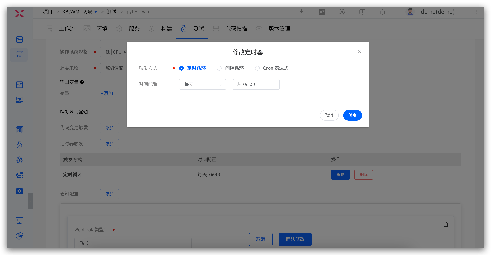

#### 间隔循环

点击添加按钮添加一项间隔循环条目，分别选择间隔时间以及间隔时间单位。

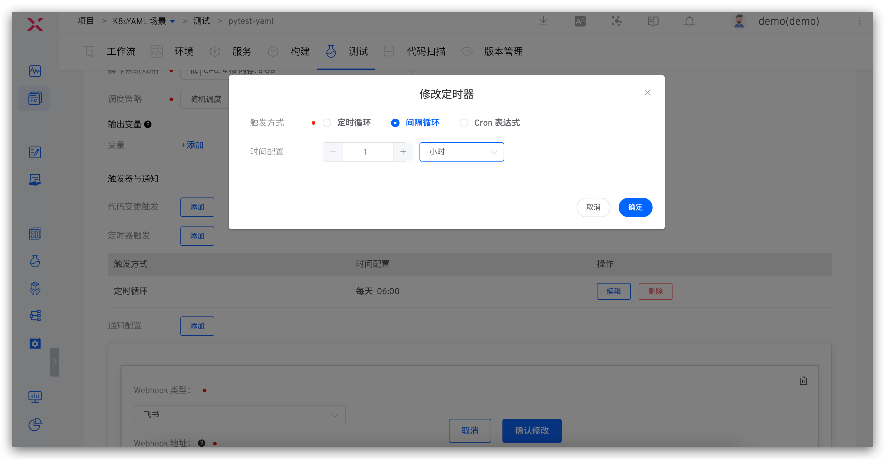

#### Cron 表达式
点击添加按钮添加一项 Cron 表达式条目，填写 Cron 表达式。

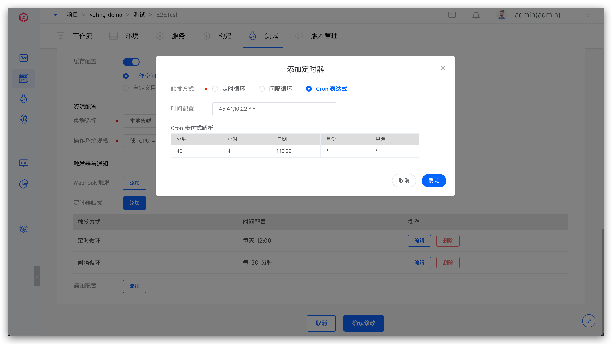

### 通知配置
目前支持配置测试任务最终执行状态通知到企业微信、钉钉、飞书。

#### 企业微信

请参照[企业微信配置文档](https://work.weixin.qq.com/help?doc_id=13376)获取详细信息。

若为某个群组添加 Bot 可以登录企业微信 -> 选择某个群组后右键点击，选择添加机器人，可以获取到相关 Webhook 地址。

参数说明:

- `企业微信 Webhook 地址` : 通知到企业微信群 Bot 机器人的地址
- `通知事件`: 可配置通知的规则，工作流状态可多选

配置图示：

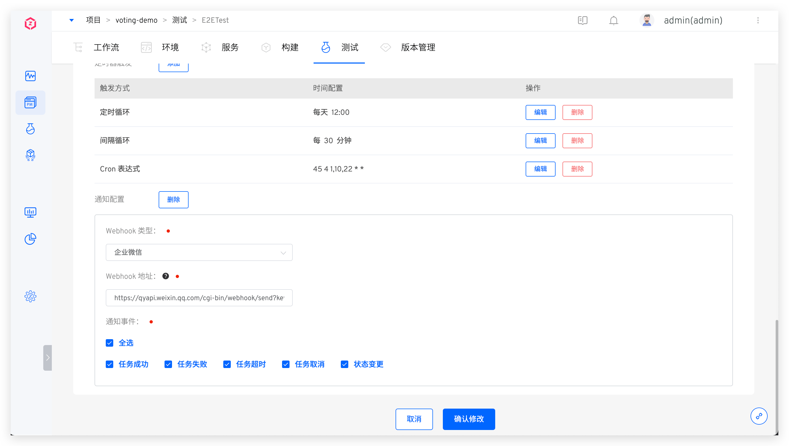

#### 钉钉
请参照[钉钉自定义机器人配置](https://developers.dingtalk.com/document/robots/custom-robot-access)获取详细信息。

在钉钉上添加自定义 Bot 机器人的时候，必须开启安全设置，安全设置有 3 种，可以设置一种或多种：

- `自定义关键字`：如果选择自定义关键字，请输入`工作流`三个字
- `加签`：开启后，Webhook 地址获取参考：[获取加签后的 Webhook 地址](https://developers.dingtalk.com/document/robots/customize-robot-security-settings)
- `IP 地址(段)`：具体配置请参考配置文档

配置图示：


#### 飞书
请参照[飞书配置](https://www.feishu.cn/hc/zh-CN/articles/360024984973)配置飞书 Bot 并获得 Webhook 地址，将复制的 Webhook 地址填写到测试的通知配置中。

配置图示：


通知效果如下图，点击测试结果中的链接即可查看 Html 测试报告。


## 查看测试报告

点击测试任务中的测试结果链接可查看测试报告。

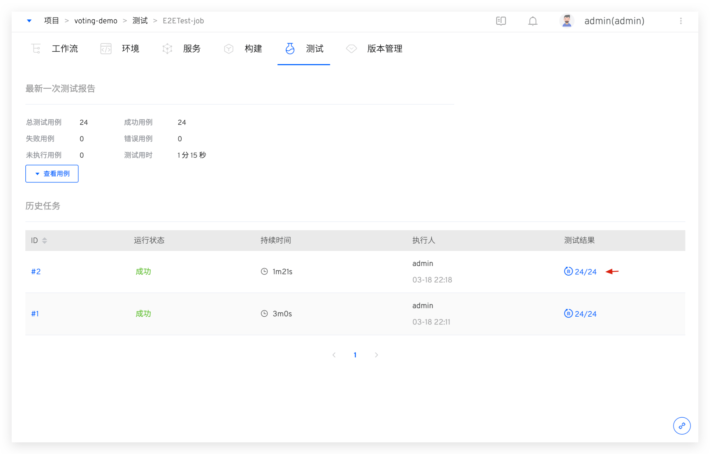

可概览测试用例的运行结果和耗时、不同结果用例的比例。对失败/错误的用例进行过滤、快速查看失败信息以辅助定位分析。

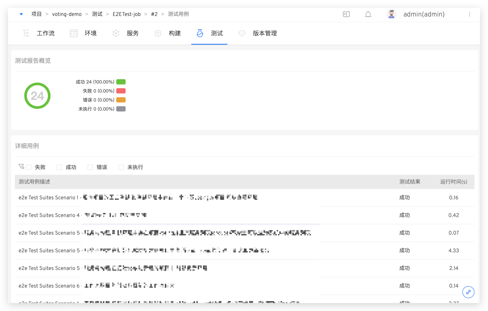
