工作流具备构建、部署、测试、生产发布、项目协同、配置变更、数据变更、服务监测等能力，本文主要介绍这些能力对应的任务如何配置使用。

## 构建
### 构建
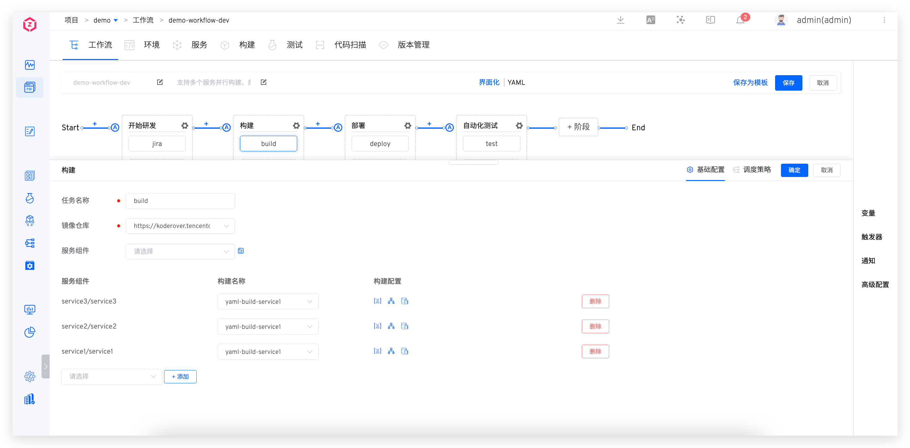

参数说明：
- `任务名称`：支持 32 位以内的小写英文字母、数字或者中划线，且以小写英文字母开头；在同一个工作流中，任务名称需唯一
- `镜像仓库`：选择镜像仓库，当构建任务执行完成功后，构建出的镜像（即内置 `$IMAGE` 变量）会被推送到所选仓库中
- `服务组件`：支持运行时输入或者指定前置任务。
- `组件列表`：
  - `变量配置`：配置构建中的变量值，参考 [变量赋值](/Zadig%20v3.3/project/common-workflow/#变量赋值方式)
  - `分支配置`：选择代码库并指定默认分支及分支可选范围，执行工作流时会默认使用指定的分支
  - `共享存储配置`：参考 [共享存储](/Zadig%20v3.3/project/common-workflow/#共享存储)

## 部署
### 容器服务部署
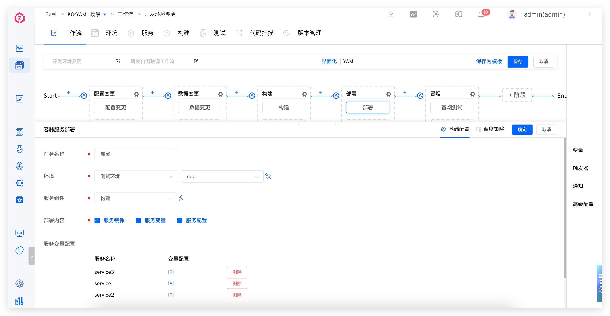

参数说明：
- `任务名称`：支持 32 位以内的小写英文字母、数字或者中划线，且以小写英文字母开头；在同一个工作流中，任务名称需唯一
- `环境`：选择要部署的环境，参考 [变量赋值](/Zadig%20v3.3/project/common-workflow/#变量赋值方式)
- `服务组件`：支持手动输入或指定前置构建任务两种配置方式（系统将会使用构建任务中输出的 `$IMAGE` 变量来部署服务）
- `部署内容`：包括以下三种选项：
  - `服务镜像`：更新服务的镜像
  - `服务变量`：更新服务的变量，变量的定义请参考：[服务变量](/Zadig%20v3.3/project/service/k8s/#自定义变量)
  - `服务配置`：更新服务的配置，服务配置来源请参考：[服务配置](/Zadig%20v3.3/project/service/k8s/#新建服务)
- `服务变量及配置`：当`部署内容`中包含`服务变量`时，配置工作流可更新的服务及变量
- `状态检测`：若开启，部署任务会轮询服务运行状态
  - 服务实例的 Replicas = AvailableReplicas，则部署成功，工作流任务状态为成功
  - 服务容器因 ImagePullBackOff/ErrImagePull/CrashLoopBackOff/ErrImageNeverPull 原因而处于 waiting 状态时，视为部署失败，工作流任务状态为失败
  - 当超过部署超时时间后仍没有满足成功/失败条件，则部署超时，部署超时设置可参考 [服务策略配置](/Zadig%20v3.3/project/service/k8s/#策略配置)

::: tip
- 部署任务的服务组件指定为 `全局变量/其他任务输出` 时，系统将会使用构建任务中输出的 `$IMAGE` 变量来部署服务。
- 使用版本进行部署时，关闭阶段并发执行，部署任务按照服务编排顺序进行部署。
- 使用版本进行部署时，若部署任务只配置了`服务镜像` 则支持自动过滤掉环境中不存在的服务。
:::

### 主机服务部署

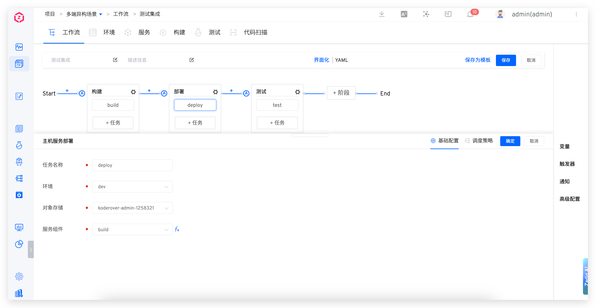

参数说明：
- `任务名称`：支持 32 位以内的小写英文字母、数字或者中划线，且以小写英文字母开头；在同一个工作流中，任务名称需唯一
- `环境`：需要部署的环境
- `对象存储`：二进制包存储的对象存储
- `服务组件`：支持运行时输入和前置构建任务两种配置方式（系统将会使用构建任务中输出的 `$IMAGE` 、`$ARTIFACT` 变量来部署服务）

### Kubernetes 部署
部署指定集群指定命名空间中的容器。

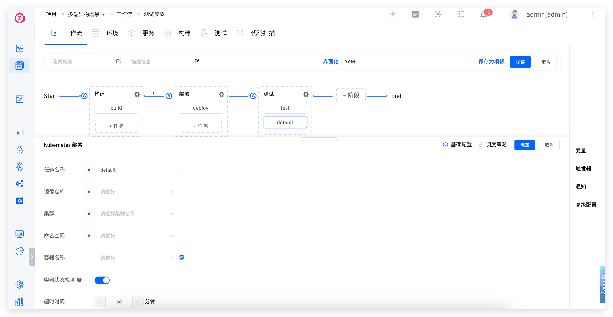

参数说明：
- `任务名称`：在同一个工作流中，任务名称需唯一
- `镜像仓库`：执行 Kubernetes 部署任务时，从哪个镜像仓库获取镜像来部署目标容器
- `集群`：待部署容器所在的集群
- `命名空间`：待部署容器所在的命名空间
- `容器`：指定命名空间中的容器应用（目前支持 Deployment 资源及 Statefulset 资源）
- `容器状态检测`：若开启，部署任务会轮询容器运行状态，在部署超时之前该容器正常运行，任务状态才为成功
- `超时时间`：容器部署超时时间

### 更新 K8s YAML 任务
可以帮助解决自动化更新原生 K8s 资源的问题，比如更新容器 CPU 和 Mem、更新 istio 的 VirtualService 配置等等。

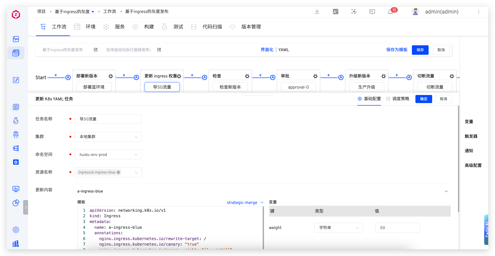

参数说明：
- `集群`：集群信息
- `命名空间`：实例所在的 K8s 命名空间
- `资源名称`：需要修改的资源名称，支持一次更新多个资源
- `更新内容`：
  - `模板`：配置对应的更新内容，支持 `{{.Key}}` 格式的变量，模板中设置变量后，变量区域自动解析，可配置变量类型和默认值，解析出来的变量
  - `策略`：支持 strategic-merge/merge/json，具体使用方式参考 [K8s 官方文档](https://kubernetes.io/docs/tasks/manage-kubernetes-objects/update-api-object-kubectl-patch/)

执行工作流，填写更新内容的变量，工作流按照设置的任务完成执行。

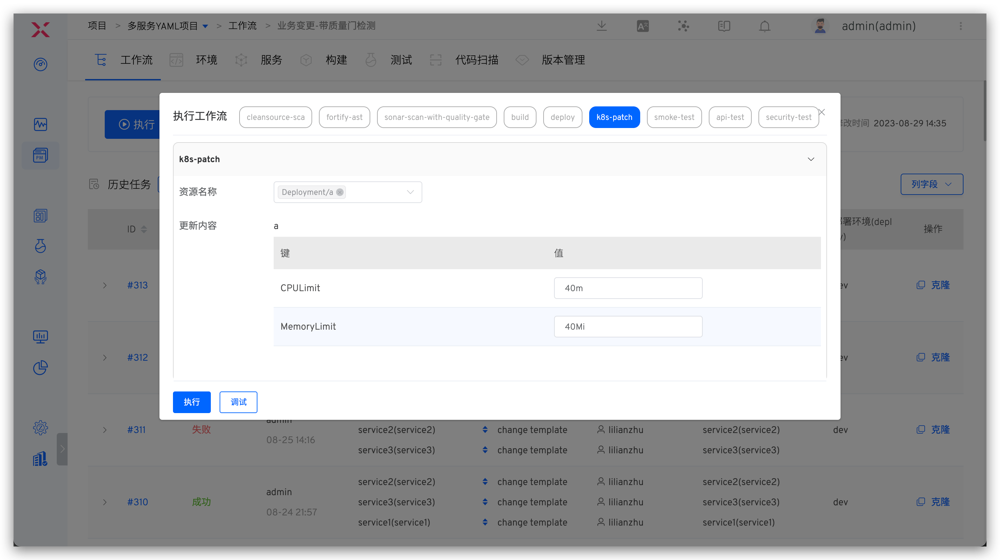
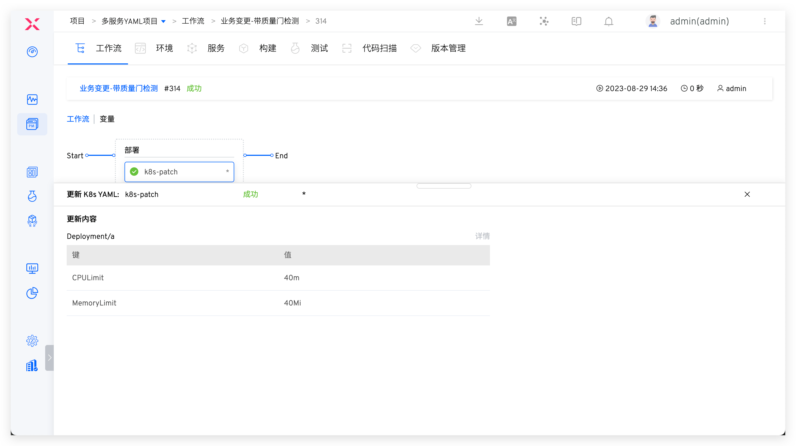

## 测试
### 测试
支持在工作流中引用测试配置。

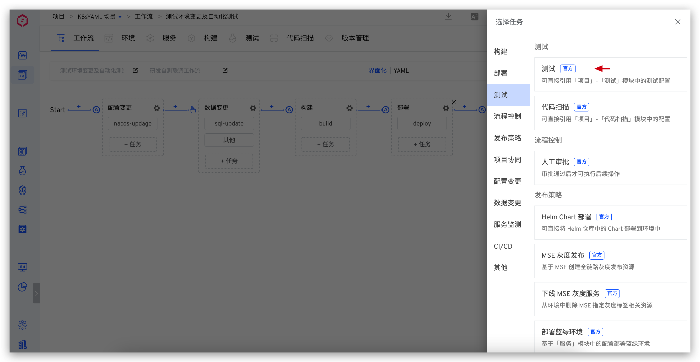
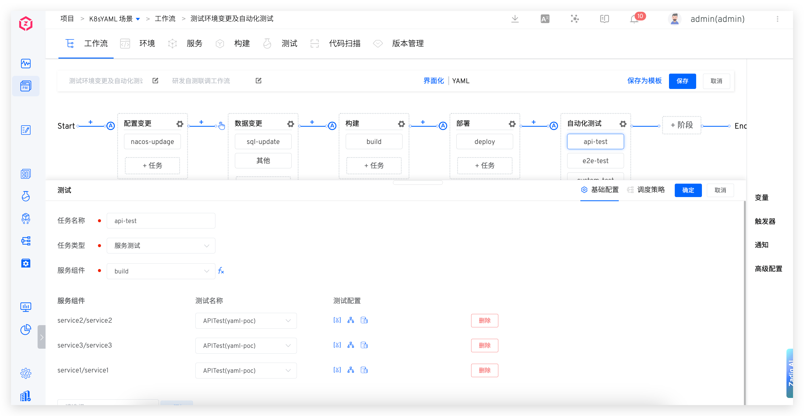

任务类型包括服务测试和产品测试：
- `产品测试`：指定测试即可
- `服务测试`：指定服务组件并配置服务组件和测试的对应关系，其中服务组件来源可指定为运行时输入，也可指定为前置任务输出（包括：构建任务、部署任务、镜像分发任务）
  - `服务组件`：支持运行时输入和前置构建任务两种配置方式，前置任务中如果有代码信息，那么可以选择`引用所选任务的代码信息`，如果测试任务的代码库和所选任务的一致，那么执行工作流时只需在前置任务选择服务组件和代码信息，测试任务将自动引用相应输入。

选择具体的测试配置后，可对测试配置中的代码库默认分支和变量进行设置，按需开启共享存储，参考文档：

- [变量赋值](/Zadig%20v3.3/project/common-workflow/#变量赋值方式)
- [共享存储](/Zadig%20v3.3/project/common-workflow/#共享存储)

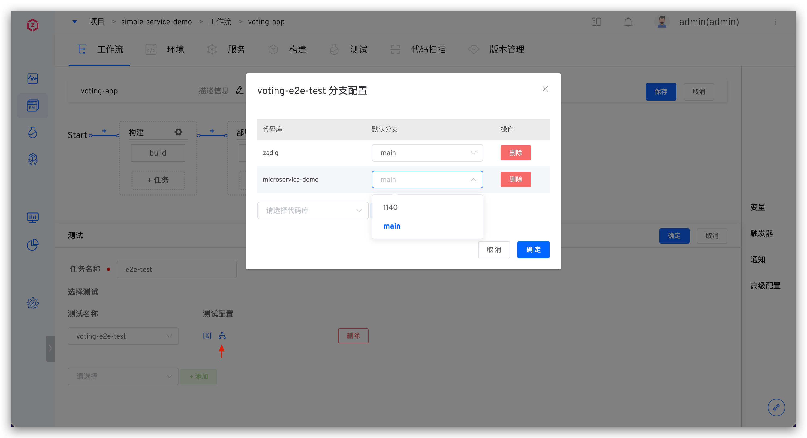

### 代码扫描
使用已配置完成的 Sonar 进行代码扫描任务，对代码质量进行验证。

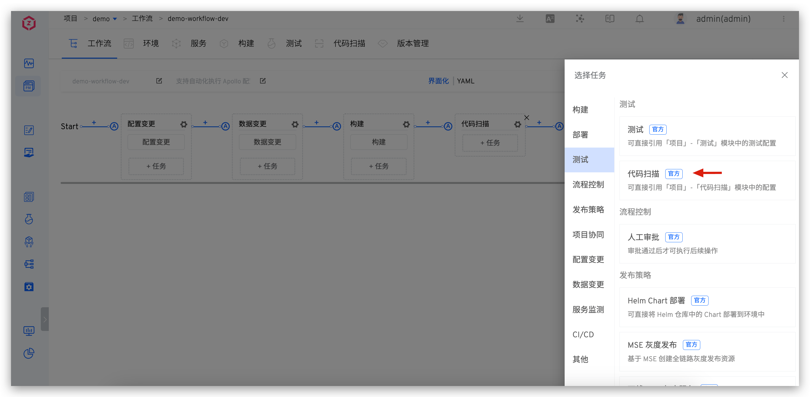

参数说明：
- `任务名称`：在同一个工作流中，任务名称需唯一。
- `任务类型`：
  - `产品扫描`：指定代码扫描即可。
  - `服务扫描`：指定服务组件，并配置对应的代码扫描任务进行扫描，服务组件的选择支持来自前置任务输出，可串接构建任务。
    - `服务组件`：支持运行时输入和前置构建任务两种配置方式，前置任务中如果有代码信息，那么可以选择`引用所选任务的代码信息`，如果代码扫描任务的代码库和所选任务的一致，那么执行工作流时只需在前置任务选择服务组件和代码信息，代码扫描任务将自动引用相应输入。
- `扫描名称`：选择项目中的代码扫描任务，可多选。
- `扫描配置`：可设置代码扫描中代码库的默认分支，按需开启共享存储，可参考 [共享存储](/Zadig%20v3.3/project/common-workflow/#共享存储) 进行配置。

## 流程控制

### 人工审批

支持 Zadig 审批、飞书审批、钉钉审批、企业微信审批，详细配置和使用参考文档[工作流审批](/Zadig%20v3.3/workflow/approval/#zadig-审批)
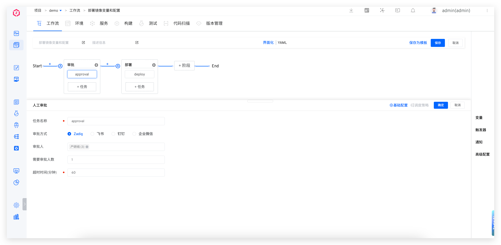

### 通知

工作流在执行过程中支持编排通知任务，通知成员支持运行时输入或固定，目前支持邮件、企业微信、飞书、钉钉四种通知方式。

## 发布策略
支持 Helm Chart 部署、MSE 灰度、蓝绿发布、金丝雀发布、分批次灰度发布、Istio 发布，详细介绍请参考文档：[发布策略](/Zadig%20v3.3/project/release-workflow/)。

### Helm Chart 部署

> 仅 K8s Helm Chart 项目中适用。

可以将 Chart 仓库中已有的 Chart 自动化部署到环境中。

#### 配置任务
编辑工作流，添加「Helm Chart 部署」任务：点击「+ 任务」，选择「Helm Chart 部署」任务并配置环境。

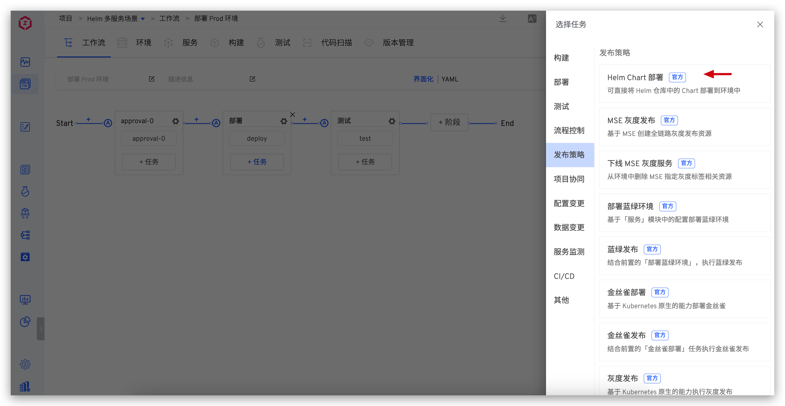
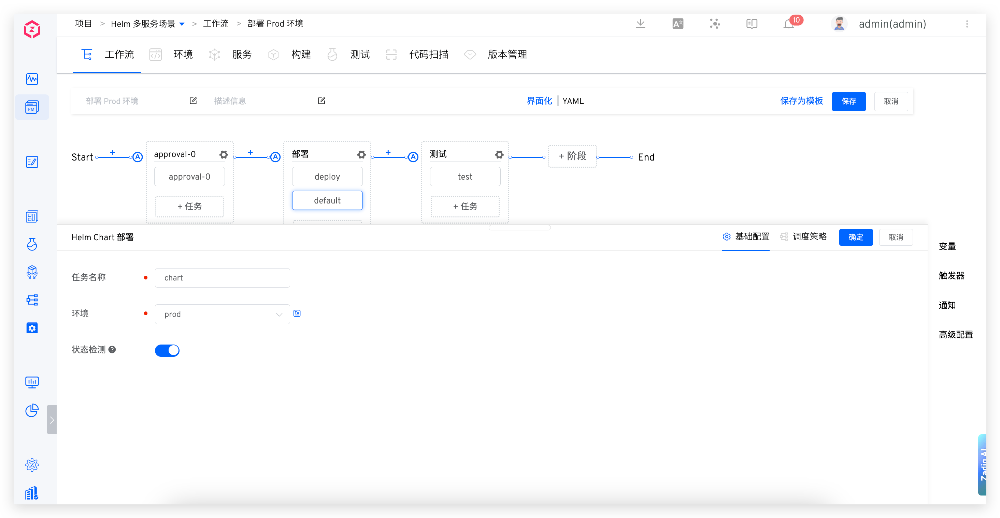

#### 执行任务
选择环境、Release，按需修改 Chart 信息及 values 内容后执行工作流即可。

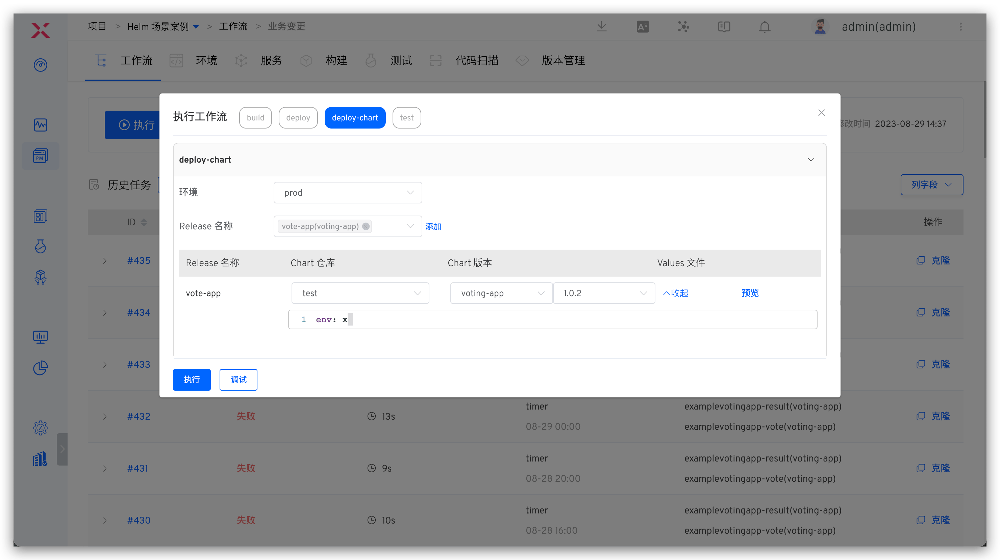

### 更新 Istio 灰度策略

> 自动化更新 Istio 全链路灰度中的灰度策略。使用实践参考[Istio 全链路灰度](/Zadig%20v3.3/env/istio-gray-release/)。

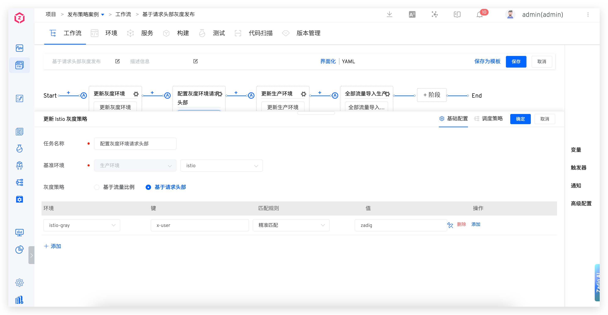

- `任务名称`：在同一个工作流中，任务名称需唯一。
- `基准环境`：基准生产环境
- `灰度策略`：
  - `基于流量比例`：根据配置流量比例控制生产流量
  - `基于请求头部`：根据配置的请求头部控制生产流量

## 项目管理
### JIRA 问题状态变更 
可以在完成工作流某个阶段后，自动变更 JIRA 对应项目下 Issue 的状态。

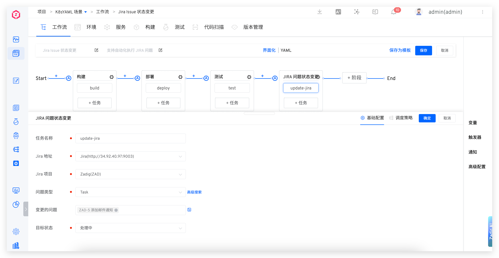

参数说明：
- `任务名称`：在同一个工作流中，任务名称需唯一。
- `Jira 项目`：选择 Jira 空间下对应的项目。
- `问题类型`：可根据需要选择对应类型。
- `JQL 搜索`：在`高级搜索`中，支持使用 JQL 语句搜索问题，请确保 JQL 语句的正确性。
- `变更的问题`：选择所需变更的问题，参考文档 [变量赋值](/Zadig%20v3.3/project/common-workflow/#变量赋值方式)。
- `目标状态`：选择需要变更到的状态。

::: tip
1. 在 JQL 搜索中还支持使用变量 `{{.system.username}}`，比如   `issuetype = Task and assignee = {{.system.username}}`
2. `{{.system.username}}` 的值是 Zadig 系统中当前登录用户，如果使用该变量进行搜索，请确保 Jira 中的用户存在
:::

### 飞书工作项状态变更 
可以在完成工作流某个阶段后，自动变更飞书对应空间下的工作项状态。

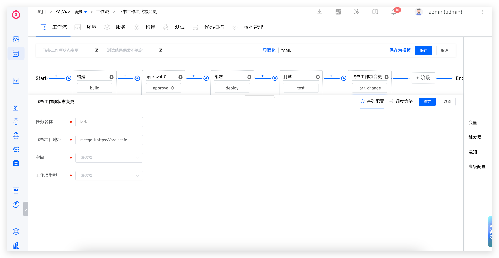

参数说明：
- `任务名称`：在同一个工作流中，任务名称需唯一。
- `空间`：选择所需的飞书空间。
- `工作项类型`：可根据需要选择对应类型。
  
执行工作流时，选择所需变更的工作项和对应的目标状态，点击执行后，飞书项目状态将完成自动变更。

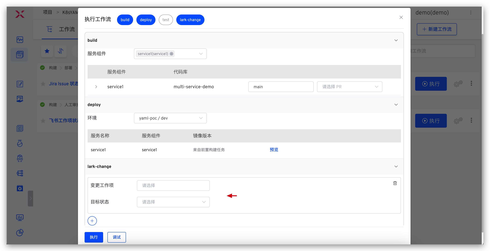

::: tip 提示
目前只支持状态模式的工作项变更。
:::

## 配置变更
### Apollo 配置变更 
通过工作流的任务执行，支持同时对 Apollo 管理的多份配置进行变更。

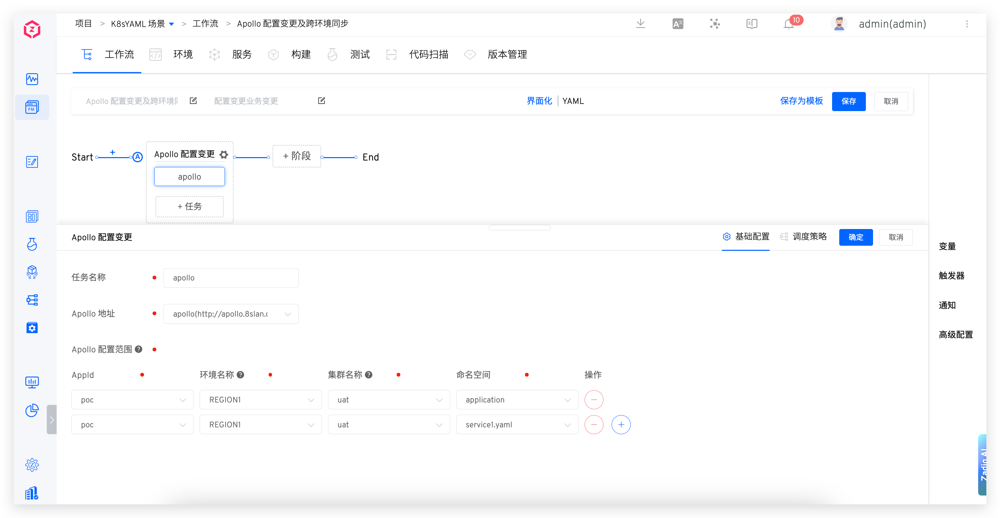

参数说明：
- `任务名称`：在同一个工作流中，任务名称需唯一。
- `Apollo 地址`：选择已绑定过的 Apollo 地址，如需添加可前往 [Apollo 配置](/Zadig%20v3.3/settings/configsystem/apollo/) 查看详情。
- `Apollo 配置范围`：配置可变更的配置范围，支持 TEXT、JSON、XML、YAML、HTML、Properties。

### Nacos 配置变更 
通过工作流的任务执行，支持同时对 Nacos 管理的多份配置进行变更。

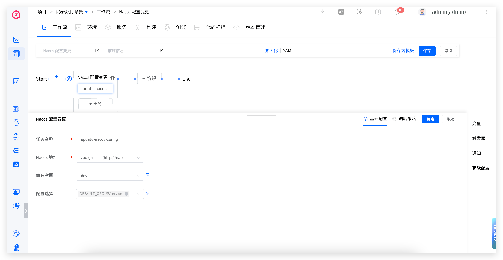

参数说明：
- `任务名称`：在同一个工作流中，任务名称需唯一。
- `Nacos 地址`：选择已绑定过的 Nacos 地址，如需添加可前往 [Nacos 配置](/Zadig%20v3.3/settings/configsystem/nacos/) 查看详情。
- `命名空间`：选择所需的命名空间
- `配置`：选择对应的配置，可多选。

## 数据变更
### SQL 数据变更
可针对指定数据库执行 SQL 命令，结合构建等任务一起使用，可实现数据、代码一站式变更。

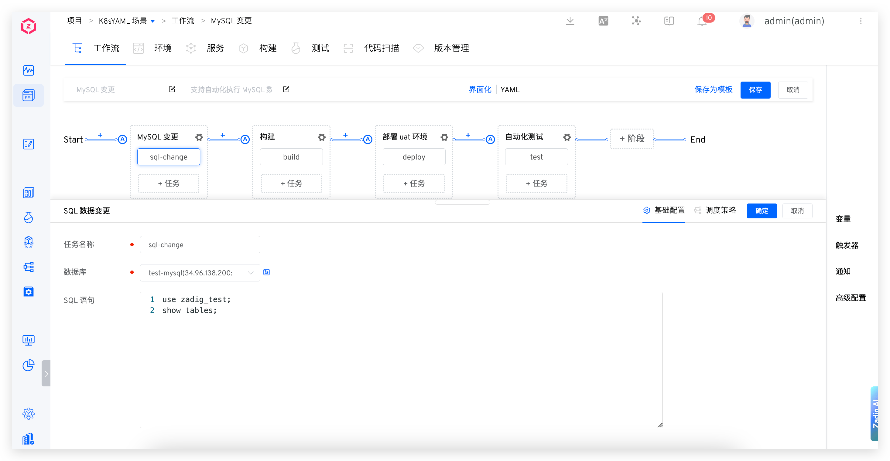

参数说明：
- `数据库`：选择要执行变更的数据库，需提前在系统中集成
- `SQL 语句`：变更的 SQL 语句，支持多行，请在 SQL 语句中指定使用的数据库名称

### DMS 数据变更工单 
自动向阿里 DMS 提交 SQL 变更工单并等待工单完成。

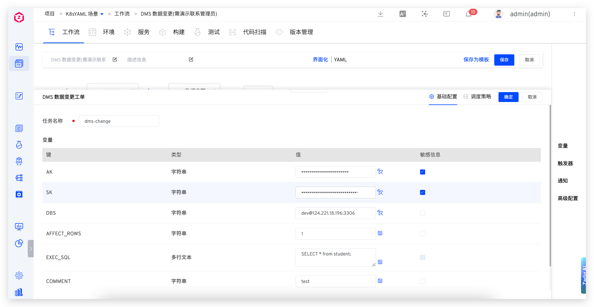

参数说明：
- `AK`：阿里云账号的 AK
- `SK`：阿里云账号的 SK
- `DBS`：需要执行变更的数据库，比如：`test@127.0.0.1:3306,test@127.0.0.2:3306`
- `AFFECT_ROWS`：影响行数
- `EXEC_SQL`：需要执行的 SQL 语句
- `COMMENT`：工单评论信息

## 服务监测

<!--
### 观测云监测

 对观测云监测器在指定观测时间内的事件进行监控，当出现不低于配置级别的事件时，则检测结果异常。

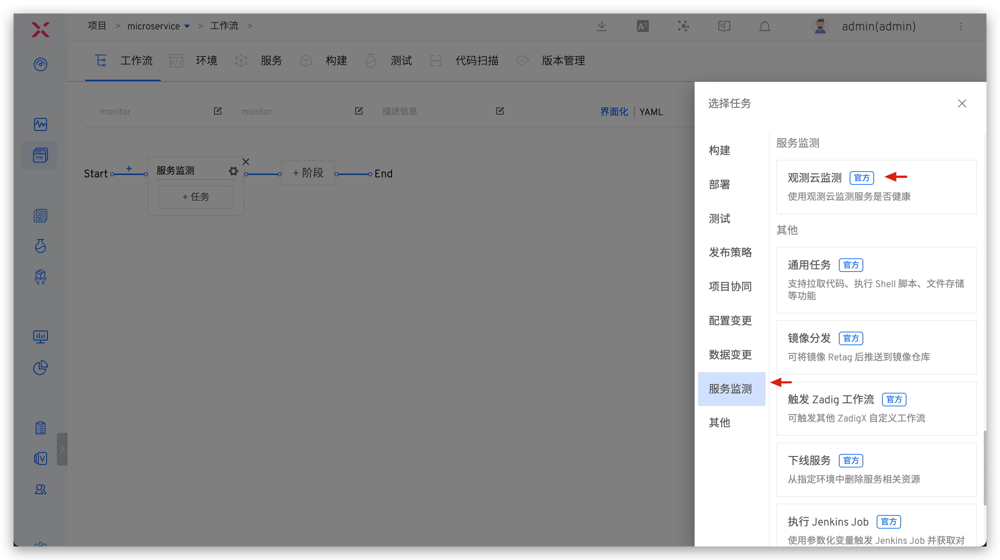
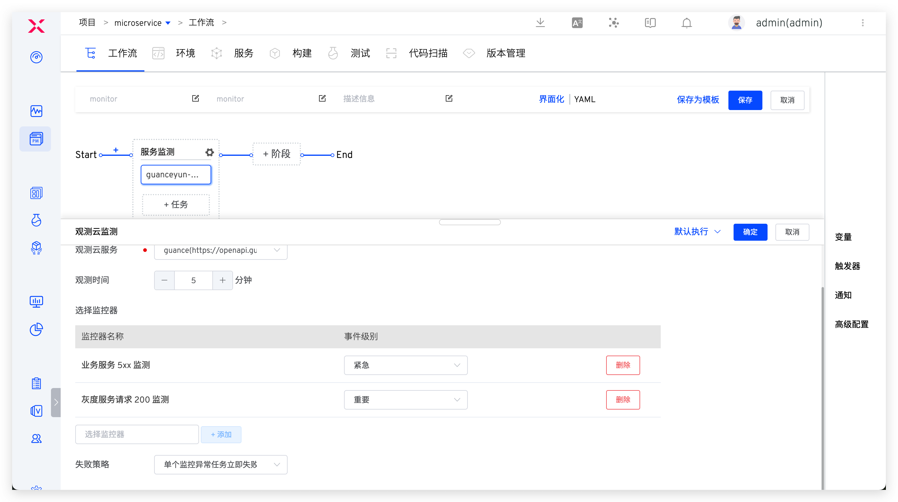

参数说明：
- `观测云服务`：选择系统集成中配置的观测云监测系统
- `观测时间`：配置观测云监测时间
- `选择监控器`：选择观测云系统中的监控器并配置需要关注的最低事件级别
- `失败策略`：配置工作流任务失败的策略，包括以下两种
  - `单个监控异常任务立即失败`：只要有一个监测器结果异常，工作流任务就失败结束，不会等待所有监测器执行完毕
  - `所有监控完成后存在异常时任务失败`：所有监控器执行完毕后有异常结果时，工作流任务才失败

监测异常时，可点击查看事件详情分析服务是否健康。

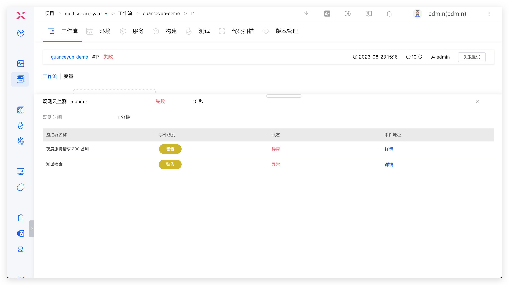 -->

### Grafana 监测

使用 Grafana 对服务在指定监测时间内进行健康监测。

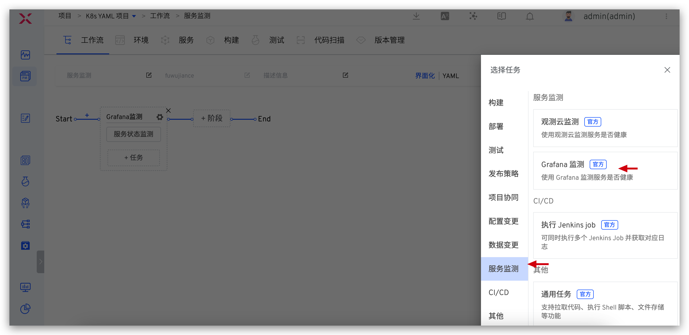
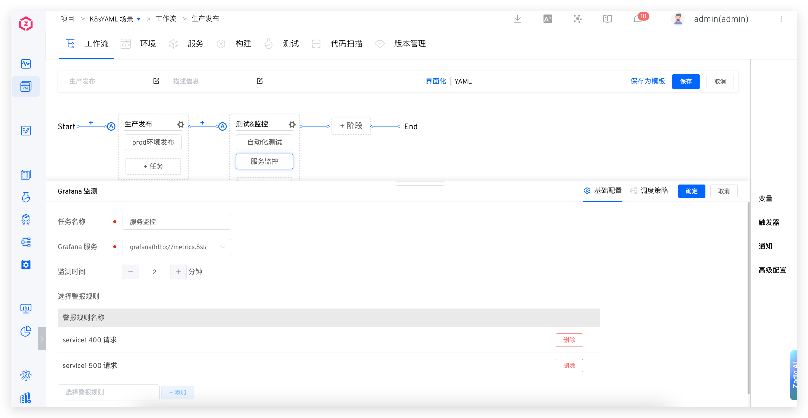

参数说明：
- `Grafana 服务`：选择系统集成中配置的 Grafana 监测系统
- `监测时间`：配置 Grafana 监测时间
- `选择警报规则`：选择 Grafana 系统中的配置的警报规则
- `失败策略`：配置工作流任务失败的策略，包括以下两种
  - `单个监控异常任务立即失败`：只要有一个监测器结果异常，工作流任务就失败结束，不会等待所有监测器执行完毕
  - `所有监控完成后存在异常时任务失败`：所有监控器执行完毕后有异常结果时，工作流任务才失败

监测异常时，可点击查看事件详情分析服务是否健康。

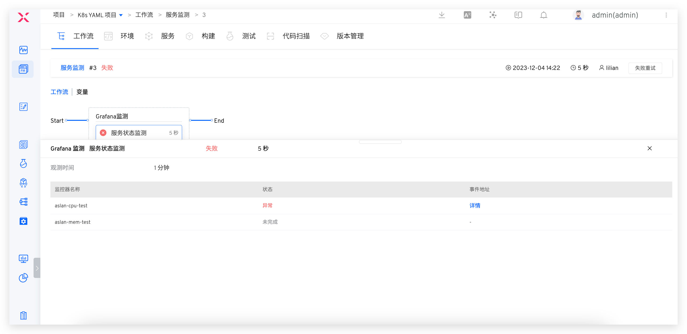

## CI/CD

### 执行 Jenkins Job

支持使用工作流执行多个 Jenkins Job。 
具体配置方式：在工作流中 添加`执行 Jenkins Job` 任务 -> 选择 Jenkins 系统 -> 添加多个 Jenkins Job -> 配置 Jenkins Job 中的参数即可。

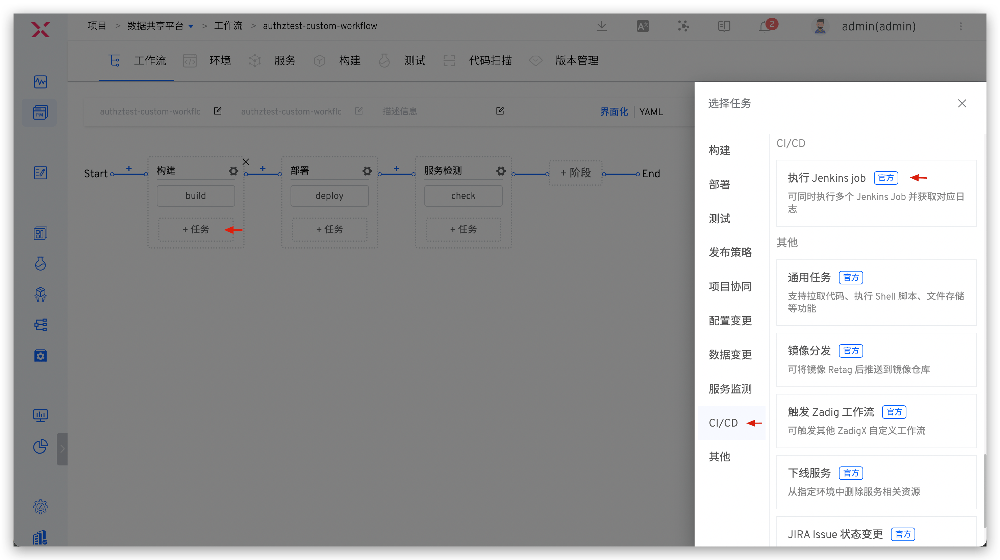
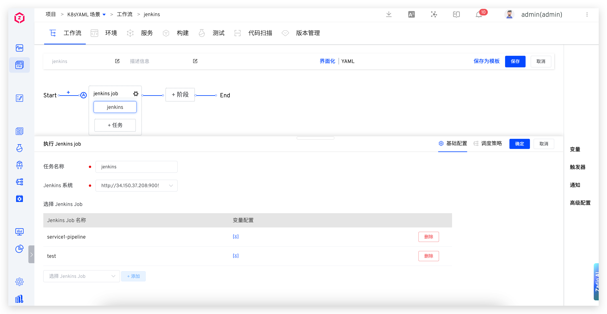

### 执行蓝鲸作业

可触发蓝鲸作业平台执行方案。

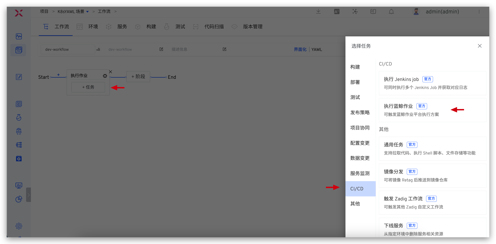
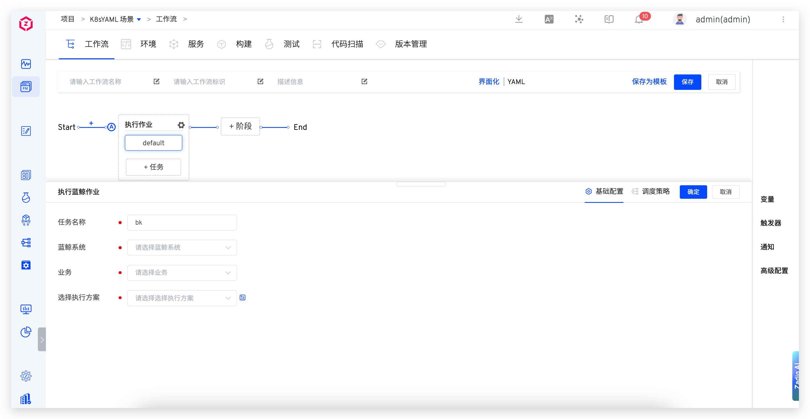

参数说明：
- `蓝鲸系统`：选择系统集成中配置的蓝鲸系统
- `业务`：蓝鲸中的业务单元
- `执行方案`：选择蓝鲸系统中的预定义的执行方案

## 其他
### 通用任务
支持拉取代码、执行 Shell 脚本、文件存储等功能。
- `执行方式`：
  - `单任务执行`：只执行一个任务
  - `服务组件多任务执行`：根据选择的服务组件分成多个任务执行
    - `服务组件`：支持运行时输入和前置构建任务两种配置方式，前置任务中如果有代码信息，那么可以选择`引用所选任务的代码信息`，如果代码扫描任务的代码库和所选任务的一致，那么执行工作流时只需在前置任务选择服务组件和代码信息，代码扫描任务将自动引用相应输入。
- `执行环境`：参考 [构建环境配置](/Zadig%20v3.3/project/build/#构建环境)
- `代码信息`：为通用任务配置代码库，支持直接配置和使用变量赋值两种方式
  - 直接配置：具体字段说明可参考文档 [代码信息](/Zadig%20v3.3/project/build/#代码信息)
  - 使用变量：配置代码库类型的工作流变量后，将此处代码源的值设置为`全局变量/其他任务输出`，配置工作流变量可参考 [变量](/Zadig%20v3.3/project/common-workflow/#自定义变量)
- `变量`：为通用任务配置自定义变量，变量赋值支持三种方式，参考 [变量赋值](/Zadig%20v3.3/project/common-workflow/#变量赋值方式)
- `添加步骤`：包括添加 Shell 脚本执行以及文件存储，可参考 [更多构建配置](/Zadig%20v3.3/project/build/#更多构建步骤)
- `高级配置`：参考 [高级配置](/Zadig%20v3.3/project/build/#高级配置)
  - 其中，`选择集群` 配置来源支持运行时输入和固定值。

### 镜像分发

可将镜像推送到指定镜像仓库。

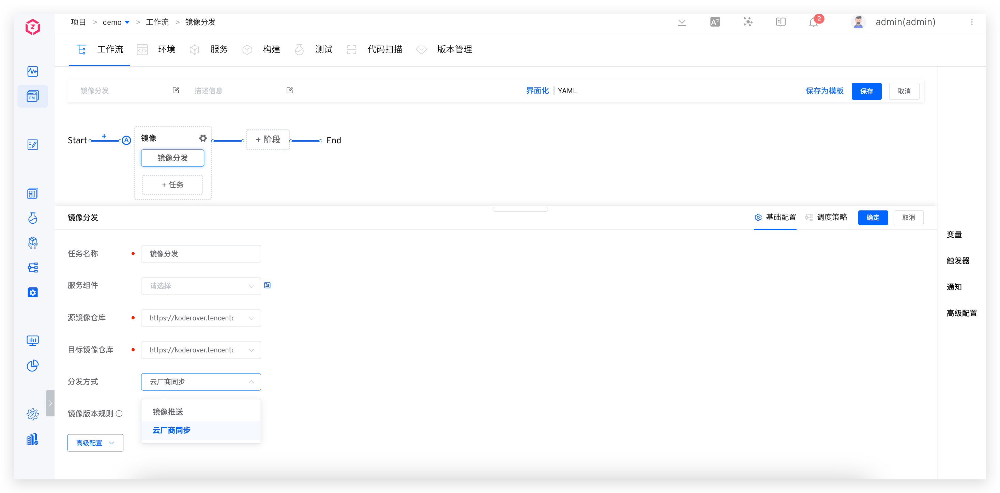

参数说明：
- `任务名称`：在同一个工作流中，任务名称需唯一。
- `服务组件`：需要做镜像分发的服务组件，支持手动输入和其他任务输出两种方式。
- `源镜像仓库`：待分发的镜像来源。
- `目标镜像仓库`：镜像分发的目标仓库。
- `分发方式`：
  - `镜像推送`：将镜像 retag 后推送目标镜像仓库
  - `云厂商同步`：使用云厂商镜像多区域同步，即 Zadig 只负责进行镜像地址转换，确保后续任务能够获取到正确的镜像地址，而实际的镜像同步则由云厂商完成。
- `镜像版本规则`：开启并配置规则，镜像分发任务将根据指定规则生成目标镜像的版本，支持以下变量和常量组合的方式来配置。

> 执行镜像分发任务时，所有服务的镜像版本都按照配置中的规则生成。

| 变量名 | 说明              |
|--------|-----------------------------|
| `{{.project}}` | 项目名称 |
| `{{.workflow.name}}` | 工作流名称 |
| `{{.workflow.task.creator}}`  | 工作流任务执行者 |
| `{{.workflow.task.timestamp}}` | 工作流任务执行时间，Unix 时间戳格式 |
| `{{.workflow.task.id}}` | 工作流任务序号 |
| `{{.workflow.input.imageTag}}` | 当服务组件指定为运行时输入时可使用该变量，其值为输入的值 |
| `{{.job.<部署任务名称>.envName}}`| 指定部署任务中的环境名称 |
| `{{.job.preBuild.imageTag}}` | 当服务组件指定为其他任务输出时可使用该变量，其值为前置构建任务的镜像版本 |

除上述变量外，还支持使用前置任务中输出的变量，参考文档：[输出变量](/Zadig%20v3.3/project/common-workflow/#变量传递)。

### 触发 Zadig 工作流

可触发其他 Zadig 工作流。
- 被触发的工作流需要满足条件：仅包含通用任务/自定义任务/触发 Zadig 工作流任务
- 可触发所有项目的工作流

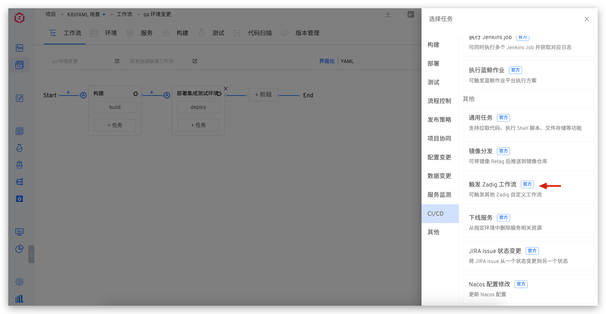

支持触发所有工作流，或指定服务组件和工作流的对应关系触发部分工作流。

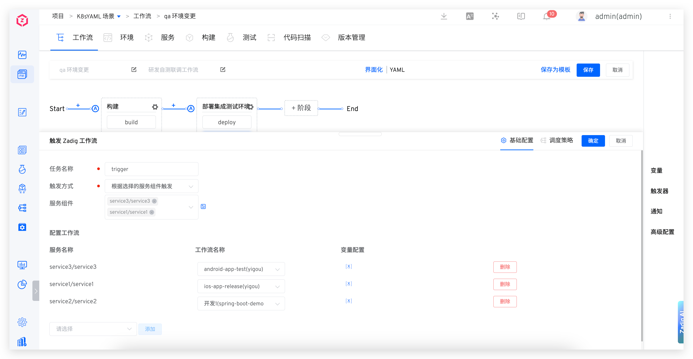

点击变量配置可对被触发工作流中的自定义变量进行配置，实现跨工作流、跨项目的变量传递。工作流自定义变量请参考文档：[自定义变量](/Zadig%20v3.3/project/common-workflow/#自定义变量)。

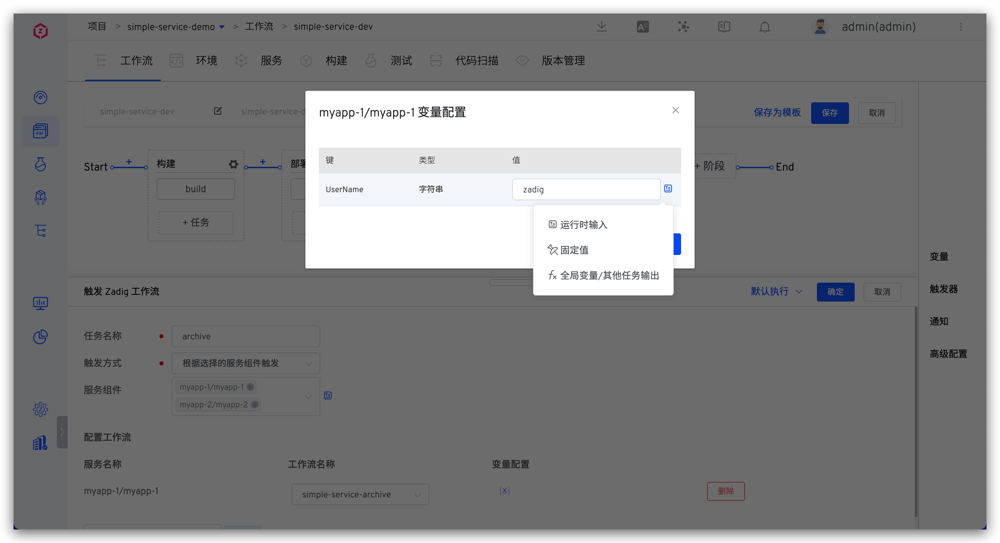

### 下线服务
> K8s YAML 项目和 K8s Helm Chart 项目中支持。

将服务从环境中删除。

::: tip
如果服务是通过部署的方式加入环境的，则下线服务会将服务资源从 K8s 集群中删除；如果是通过仅导入的方式加入环境的，则下线服务后，K8s 集群中该服务的资源仍然存在。
:::

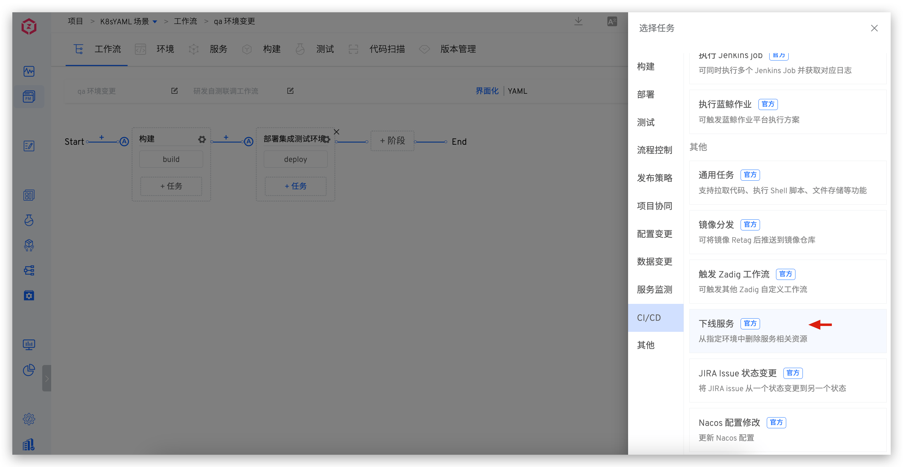
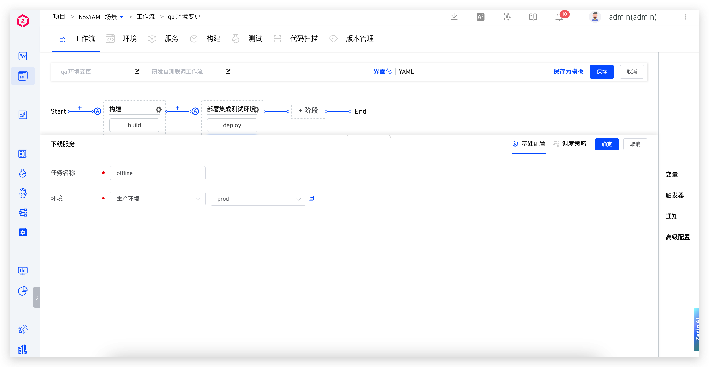

### 自定义任务
自己定义任务的实现，在工作流中配置自定义任务，详细使用方法请参考 [自定义任务](/Zadig%20v3.3/settings/custom-task/)。

## 不同任务中支持的配置方式

任务中的相关配置项支持丰富的[赋值方式](/Zadig%20v3.3/project/common-workflow/#变量赋值方式)，不同任务中支持的方式参见下表：

| 任务 | 配置项 | 固定值 | 运行时输入 | 全局变量/其他任务输出 |
|:--------: | :----: |:--------:|:--------:|:--------:|
| 构建 | 构建变量 | √ | √ | √ |
| 部署 | 环境 | √ | √ | - |
|         | 服务组件 | - | √ | √ |
| Kubernetes 部署 | 容器 | √ | √ | - |
| 测试 | 测试变量 | √ | √ | √ |
| JIRA 问题状态变更 | 变更的问题 | - | √ | √ |
| Nacos 配置变更 | 命名空间 | √ | √ | - |
|  | 配置默认值 | √ | √ | - |
| SQL 数据变更| 变量 |  √ | √ | √ |
| DMS 数据变更工单| 变量 |  √ | √ | √ |
| 通用| 代码源 |  - | √ | √ |
| | 自定义变量 |  √ | √ | √ |
|镜像分发| 服务组件 |  - | √ | √ |
|触发 Zadig 工作流| 服务组件 |  - | √ | √ |
|| 被触发工作流的变量 | √ | √ | √ |
|下线服务| 环境 | √ | √ | -  |
| 执行 Jenkins Job | 变量 | √ | √ | √ |
| JIRA Issue 状态变更 | 变量 | √ | √ | √ |
| Nacos 配置修改 | 变量 | √ | √ | √ |
| 自定义任务 | 变量 | √ | √ | √ |

## 高级配置

在任务的高级配置中可指定任务的超时时间、使用的集群资源以及调度策略、是否开启共享存储等配置。支持高级配置的任务列表如下：
| 任务 | 支持高级配置
|:--------: | :----: |
| 构建 | √ |
| 测试 | √ |
| 代码扫描 | √ |
| SQL 数据变更 | √ |
| DMS 数据变更工单 | √ |
| 通用任务 | √ |
| 镜像分发 | √ |
| 执行 Jenkins Job | √ |
| JIRA Issue 状态变更 | √ |
| Nacos 配置修改 | √ |
| 自定义任务 | √ |

超时时间、资源配置及共享存储配置可分别参考文档：

- [超时策略配置](/Zadig%20v3.3/project/build/#高级配置)
- [资源配置](/Zadig%20v3.3/project/build/#高级配置)
- [如何使用共享存储](/Zadig%20v3.3/project/common-workflow/#共享存储)
