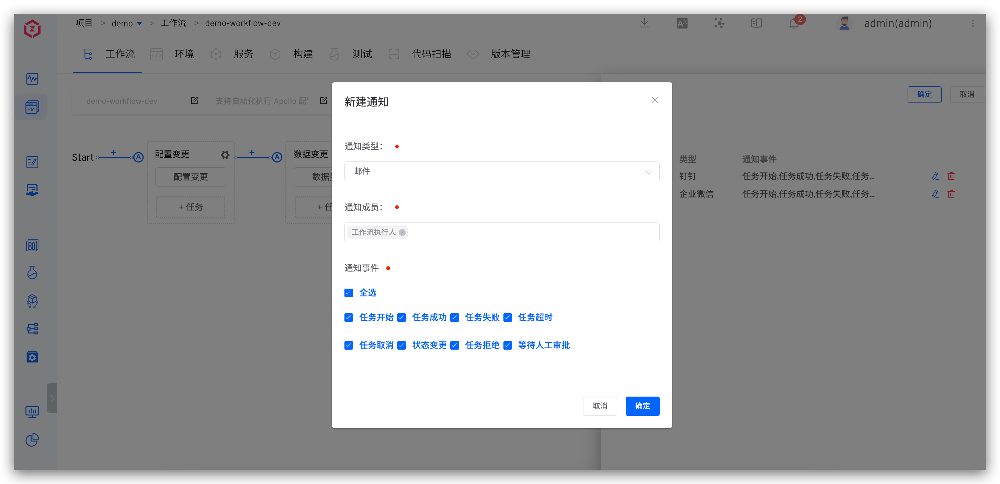
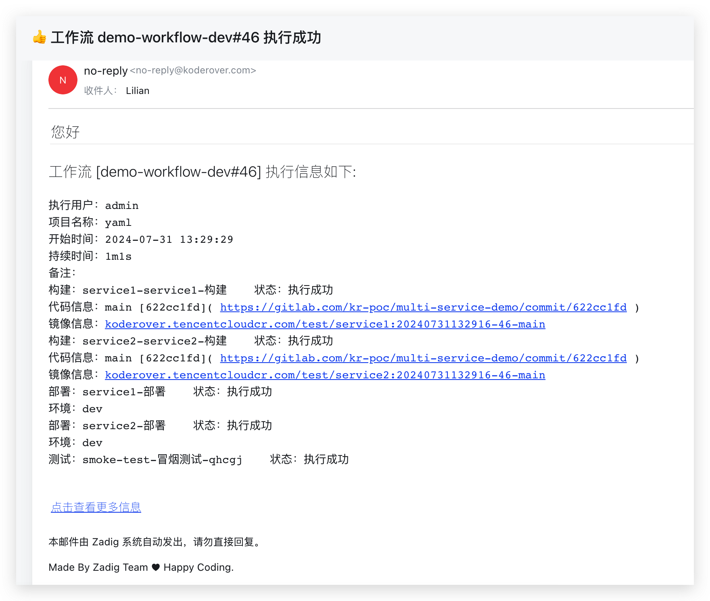
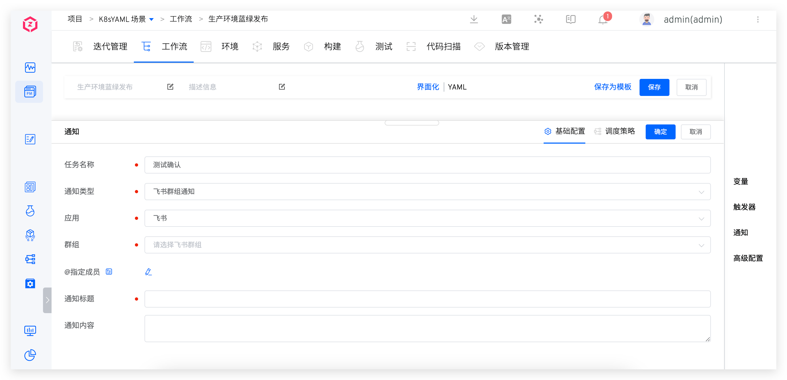

本文主要介绍如何使用 Zadig 工作流的通知功能。

**通知场景：**
1. 工作流事件发生时进行通知：比如工作流开始运行、运行成功、取消运行等。
2. 流程中编排通知任务：比如工作流某个节点通知测试人员进行操作确认。

**通知方式：**
1. [邮件](#邮件)
2. [钉钉](#钉钉)
3. [企业微信](#企业微信)
4. [飞书](#飞书)：支持使用「自定义机器人」和「自建应用」通知两种配置方式
5. [Webhook](#webhook-通知)

## 邮件

### 如何配置

第一步：系统管理员前往「系统设置」->「系统配置」-> 「邮件配置」配置发送邮件服务器配置，具体配置参考[邮件配置](/Zadig%20v3.3/settings/system-settings/#邮件配置)。

第二步：编辑工作流，添加邮件通知。



参数说明：
- `通知成员`：可选择工作流执行人、用户或者用户组，需确保通知成员已在「账号设置」中[配置个人邮箱](/Zadig%20v3.3/preferences/#账号设置)。
- `通知事件`：配置通知的规则，工作流状态可多选。

### 通知效果



## 钉钉

### 如何配置

第一步：配置钉钉自定义机器人并获取 Webhook 地址，可参考文档：[添加钉钉自定义机器人](https://open.dingtalk.com/document/robots/custom-robot-access#title-jfe-yo9-jl2)。

::: tip
在钉钉中配置自定义机器人时，若安全设置指定为`自定义关键字`，请配置`工作流`三个字即可。
:::

第二步：编辑工作流，添加钉钉通知。


参数说明：

- `Webhook 类型`：选择`钉钉`
- `Webhook 地址`：第一步中获取的 Webhook 地址
- `@指定成员`：如果希望通知到指定人，输入对应钉钉用户的手机号，多个用户用 `;` 分割即可
- `通知事件`：配置通知的规则，工作流状态可多选

### 通知效果


## 企业微信

### 如何配置

第一步：添加企业微信群机器人并获取 Webhook 地址，参考文档：[如何设置企业微信群机器人](https://open.work.weixin.qq.com/help2/pc/14931?person_id=1&is_tencent=)。

第二步：编辑工作流，添加企业微信通知。


参数说明：

- `Webhook 类型`：选择`企业微信`
- `Webhook 地址`：第一步中获取的 Webhook 地址
- `@指定成员`：如果希望通知到指定人，输入对应用户的 user_id，多个用户用 `;` 分割即可
- `通知事件`：配置通知的规则，工作流状态可多选

> 获取 user_id 可参考文档：[如何获取成员的 UserID](https://developers.weixin.qq.com/community/develop/doc/00084af5cc8010eaee9a1163f58400)

### 通知效果


## 飞书

### 如何配置

#### 自定义机器人通知

第一步：在飞书群中添加自定义机器人并获取 Webhook 地址，参考文档：[如何在群组中使用机器人](https://www.feishu.cn/hc/zh-CN/articles/360024984973)


第二步：编辑工作流，添加飞书通知。


参数说明：

- `Webhook 类型`：选择`飞书`
- `Webhook 地址`：第一步中获取的 Webhook 地址
- `@指定成员`：如果希望通知到指定人，输入对应用户的 ID，多个用户用 `;` 分割即可
- `通知事件`：配置通知的规则，工作流状态可多选

> 进入飞书管理后台，点击组织架构 > 成员与部门，选定成员即可获得 ID。


#### 自建应用通知

第一步：在 Zadig 上进行[飞书 IM 集成](/Zadig%20v3.3/settings/approval/#飞书)。

第二步：编辑工作流，添加飞书通知。




### 通知效果


## Webhook 通知

### 如何配置

编辑工作流，添加 Webhook 类型通知。


### Payload

#### 头部信息

- `x-zadig-event`：值为 workflow
- `x-zadig-event-uuid`： webhook 事件的唯一标识
- `x-zadig-instance`：Zadig 访问地址
- `x-zadig-token`：如果配置了 Secret Token 会发送
- `x-zadig-webhook-uuid`：Webhook 的唯一标识

#### Webhook 请求示例

::: details

```
curl -X "POST" "https://webhook.site/764375c9-3dd3-41a0-9392-e284015a811e" \
     -H 'Accept-Encoding: gzip' \
     -H 'X-Zadig-Webhook-Uuid: c1bdb079-2653-4f90-96f0-171e621583a9' \
     -H 'X-Zadig-Token: 764375c9-3dd3-41a0-9392-e284015a811e' \
     -H 'X-Zadig-Instance: https://course.koderover.com' \
     -H 'X-Zadig-Event-Uuid: 496534b5-8ac1-4c97-9ddd-be93821f6dc0' \
     -H 'X-Zadig-Event: workflow' \
     -H 'Content-Type: application/json' \
     -H 'Accept: application/json' \
     -H 'Content-Length: 1898' \
     -H 'User-Agent: Zadig/3.2.0' \
     -H 'Host: webhook.site' \
     -d $'{
  "object_kind": "workflow",
  "event": "workflow",
  "workflow": {
    "task_creator": "admin",
    "project_name": "yaml",
    "task_creator_id": "89358827-5137-11ee-b0c5-56d5fd1dd39e",
    "task_creator_email": "xxx@koderover.com",
    "stages": [
      {
        "status": "passed",
        "start_time": 1722404733,
        "end_time": 1722404763,
        "name": "构建",
        "jobs": [
          {
            "status": "passed",
            "end_time": 1722404763,
            "start_time": 1722404733,
            "spec": {
              "repositories": [
                {
                  "source": "gitlab",
                  "repo_namespace": "kr-poc",
                  "branch": "main",
                  "commit_id": "622cc1fdfaa87cd72d33c227a1895b860c0e7bd3",
                  "commit_url": "https://gitlab.com/kr-poc/multi-service-demo/commit/622cc1fd",
                  "repo_name": "multi-service-demo",
                  "prs": null,
                  "tag": "",
                  "repo_owner": "kr-poc",
                  "commit_message": "Update deployment.yaml"
                }
              ],
              "image": "koderover.tencentcloudcr.com/test/service1:20240731134527-47-main"
            },
            "type": "zadig-build",
            "error": "",
            "name": "service1-service1-构建"
          }
        ],
        "error": ""
      },
      {
        "status": "passed",
        "start_time": 1722404763,
        "end_time": 1722404771,
        "name": "部署dev环境",
        "jobs": [
          {
            "status": "passed",
            "end_time": 1722404771,
            "start_time": 1722404763,
            "spec": {
              "env": "dev",
              "service_name": "service1",
              "service_modules": [
                {
                  "service_module": "service1",
                  "image": "koderover.tencentcloudcr.com/test/service1:20240731134527-47-main"
                }
              ]
            },
            "type": "zadig-deploy",
            "error": "",
            "name": "service1-部署"
          }
        ],
        "error": ""
      },
      {
        "status": "passed",
        "start_time": 1722404771,
        "end_time": 1722404783,
        "name": "冒烟测试",
        "jobs": [
          {
            "status": "passed",
            "end_time": 1722404783,
            "start_time": 1722404771,
            "spec": null,
            "type": "zadig-test",
            "error": "",
            "name": "smoke-test-冒烟测试-v2bb8"
          }
        ],
        "error": ""
      }
    ],
    "error": "",
    "start_time": 1722404733,
    "workflow_name": "demo-workflow-dev",
    "detail_url": "https://course.koderover.com/v1/projects/detail/yaml/pipelines/custom/demo-workflow-dev?display_name=demo-workflow-dev",
    "task_id": 47,
    "remark": "",
    "workflow_display_name": "demo-workflow-dev",
    "end_time": 1722404783,
    "task_creator_phone": "1340096xxxx",
    "create_time": 1722404727,
    "status": "passed"
  }
}'
```
:::