在本文中，我们将详细探讨 Zadig 如何利用阿里云 MSE 实现的全链路灰度发布方案，包括方案原理的深入介绍、管理员配置的详细讲解以及工程师在日常使用中的实际操作等方面的细节。

## 工作原理介绍

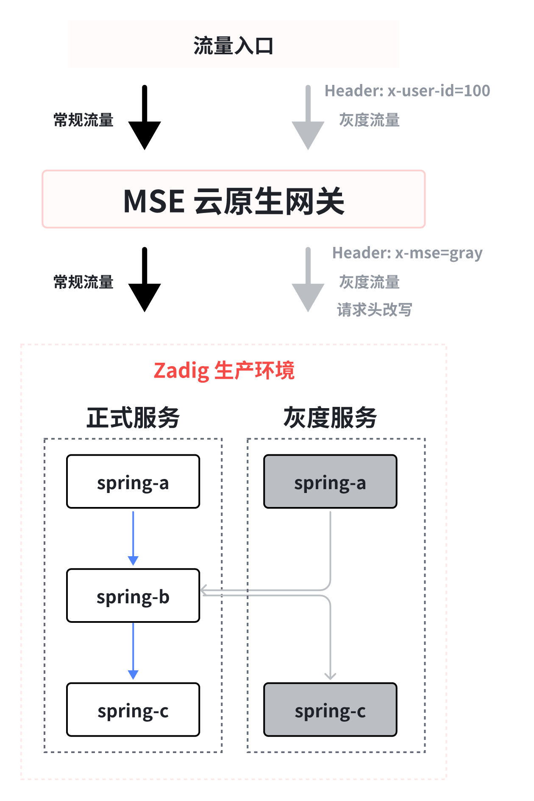

**工作流程描述:**

MSE 灰度发布任务
1. 复制一份基准环境中服务的 YAML
2. 自动为 YAML 中的资源名称 `metadata.name` 添加后缀 `-mse-<grayTag>`
3. 自动为 YAML 中的资源添加 MSE 全链路灰度发布所需的相关 label 
4. 用户可以设置灰度镜像、副本数，此外可以直接在渲染后的 YAML 中修改其他需要改动的字段（不可删除灰度过程中使用的 label）
5. 根据最终的 YAML 生成灰度版本资源

下线 MSE 灰度服务
1. 删除所有带灰度标的 Kubernetes 资源


## 前置操作

> MSE 全链路灰度能力可以支持任意 K8S 集群，全链路灰度场景需基于网关能力建设，下面以 MSE 自带的云原生网关为例介绍场景，用户可以根据自身情况选择合适的网关。

### 安装 MSE 组件

在阿里云 ACK 集群中安装 MSE 组件，安装方式参考文档： [安装 ack-onepilot 组件](https://help.aliyun.com/document_detail/2360531.html?spm=a2c4g.2359474.0.0.33a34ca1nN0X0c)。

### 安装 MSE Ingress 云原生网关

安装方式参考文档
1. [创建 MSE 云原生网关](https://help.aliyun.com/document_detail/347638.html?spm=a2c4g.250951.0.0.c99b3e06EsealV)
2. [通过 MSE Ingress 访问容器服务](https://help.aliyun.com/document_detail/438003.html?spm=a2c4g.440050.0.0.1e5e30d5JwFRF1#task-2229308)

下面以 spring-a、spring-b、spring-c、nacos 这几个服务为例，结合 MSE 云原生网关演示项目初始化和 MSE 灰度发布过程。

## 管理员做项目初始化

### 步骤一：新建项目

在 Zadig 上新建项目，输入项目名称，项目类型选择 「K8s YAML」项目。

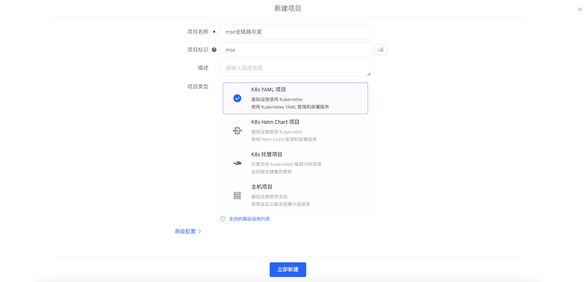

### 步骤二：新建服务

在 Zadig 服务-生产服务模块新建 `nacos`、`spring-a`、`spring-b`、`spring-c` 服务并配置对应的 YAML。具体配置参考[示例项目 YAML 配置](https://github.com/koderover/zadig/tree/main/examples/mse-demo)。


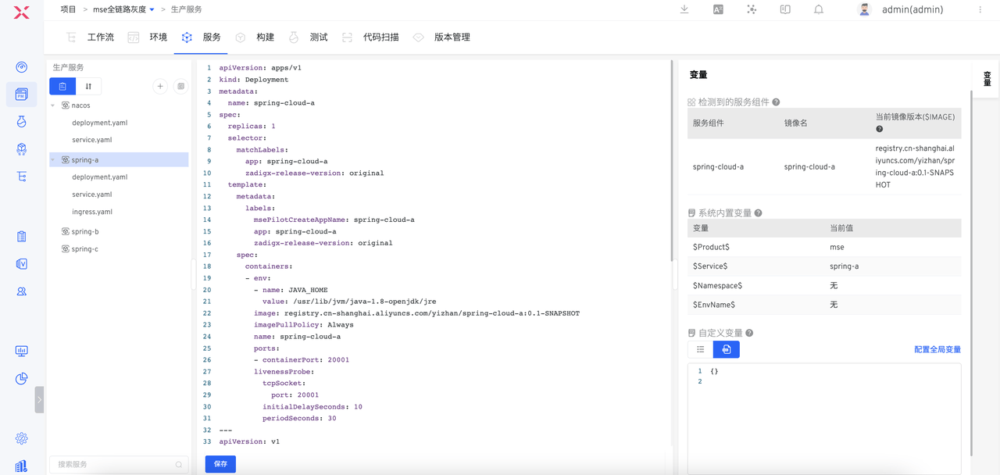

::: warning 注意
在服务 deployment 中需添加以下  selector 和 template.metadata.labels：

`zadigx-release-version: original`
:::

### 步骤三：新建环境并启用 MSE

1. 在 Zadig 上新建生产环境

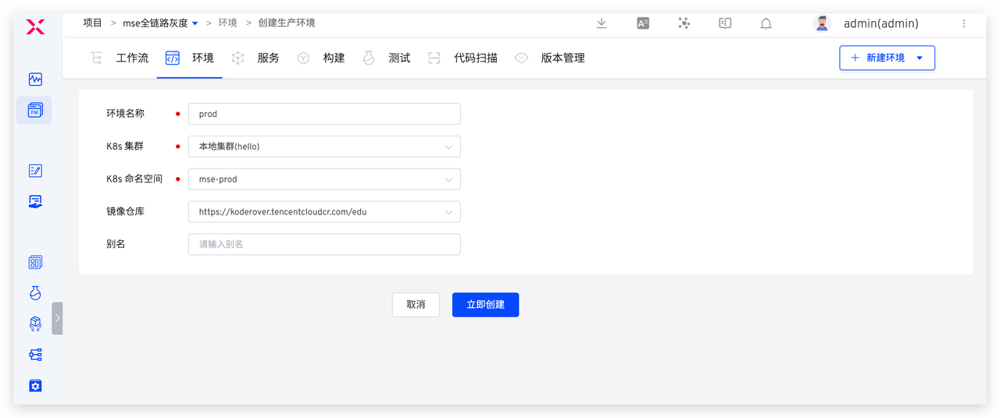

2. 执行以下命令启用 MSE，对灰度过程涉及到的命名空间（上图中为：mse-prod） 打上 `mse-enable` 标签。

``` bash
kubectl label namespace <NAMESPACE> mse-enable=enabled
```

3. 在生产环境中添加服务 `spring-a`、`spring-b`、`spring-c`、`nacos`。

4. 检查服务是否成功接入 MSE。在 Zadig 环境中选择服务，比如`spring-a`，检查 Pod YAML 中是否成功注入`one-pilot-initcontainer`，如下图所示。

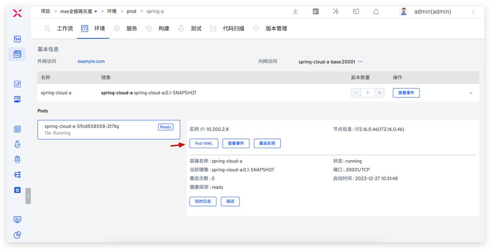
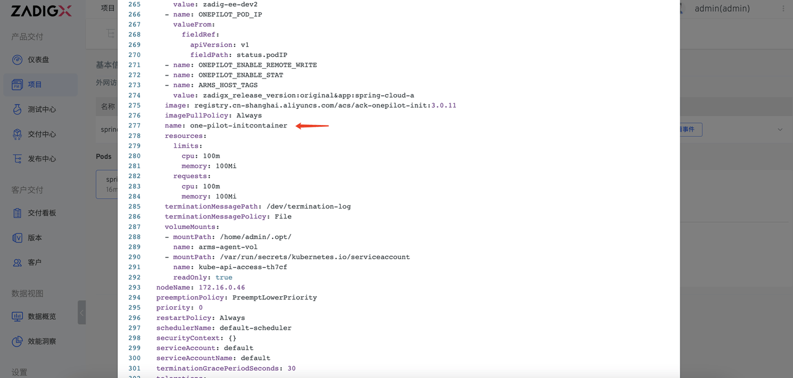

### 步骤四：配置 MSE 灰度发布工作流

1. 新建发布工作流 mse-gray-workflow，添加任务，配置如下。
  1. `MSE 灰度发布`：用于部署灰度服务
  2. [可选]`通用任务` ：用于验证灰度后的新版本
  3. `下线 MSE 灰度`：用于下线灰度服务

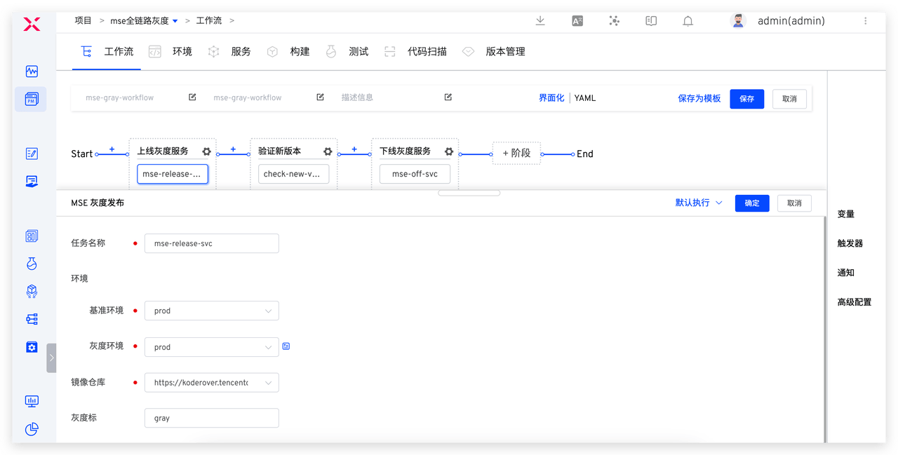


2. 新建发布工作流 prod-workflow ，添加`部署`任务，用于执行生产发布，配置如下图所示。

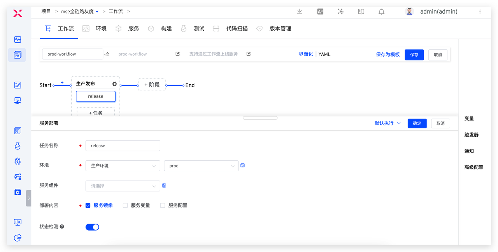

## 工程师执行 MSE 灰度发布

### 多个灰度服务部署

执行 mse-gray-workflow，选择服务组件 `spring-cloud-a`和`spring-cloud-c`，设置灰度标，选择对应的灰度镜像、副本数量、修改灰度服务 YAML 配置，点击执行即可完成灰度服务部署。

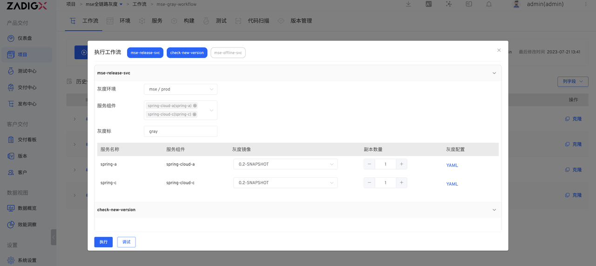
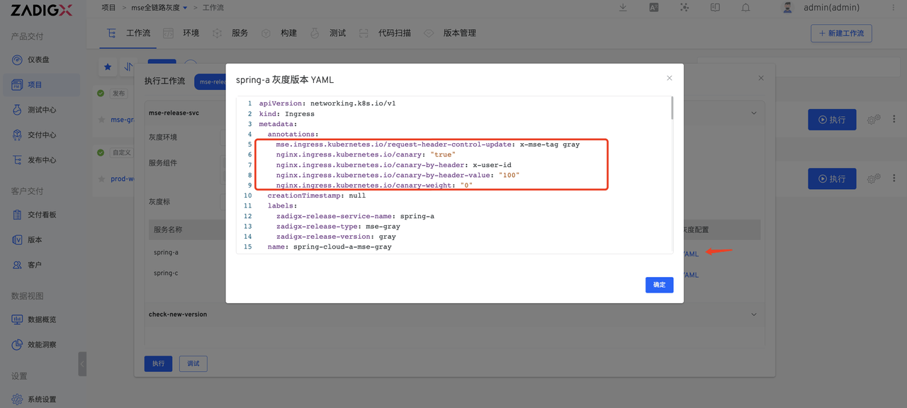


此处 `spring-cloud-a` 为流量入口，因此需要在灰度服务 YAML 中手动添加/修改 Service 和 MSE Ingress 资源的一些相关字段：
1. 通过 MSE Ingress 的 annotations 设置灰度流量规则，并为灰度流量带上灰度标 Header。
  MSE Ingress 云原生网关支持按请求头、Cookie、权重三个维度进行配置，三者可以只配置一种，若同时配置生效规则按请求头、Cookie、权重顺序匹配
  - 按请求头：基于 Request Header 的流量切分，添加注解`nginx.ingress.kubernetes.io/canary-by-header`、`nginx.ingress.kubernetes.io/canary-by-header-value`或`nginx.ingress.kubernetes.io/canary-by-header-pattern`。
  - 按 Cookie：基于 Cookie 的流量切分，添加注解`nginx.ingress.kubernetes.io/canary-by-cookie`。
  - 按权重：设置请求到指定服务的百分比（值为0~100的整数），添加注解`nginx.ingress.kubernetes.io/canary-weight`。

2. 设置灰度路由规则的 `backend.service.name` 为其下的灰度 Service 名称。具体改动内容如下：

:::details
``` yaml
apiVersion: networking.k8s.io/v1
kind: Ingress
metadata:
  annotations: # 加上灰度路由
    mse.ingress.kubernetes.io/request-header-control-update: x-mse-tag gray
    nginx.ingress.kubernetes.io/canary: "true"
    nginx.ingress.kubernetes.io/canary-by-header: x-user-id
    nginx.ingress.kubernetes.io/canary-by-header-value: "100"
    nginx.ingress.kubernetes.io/canary-weight: "0"
  creationTimestamp: null
  labels:
    zadigx-release-service-name: spring-a
    zadigx-release-type: mse-gray
    zadigx-release-version: gray
  name: spring-cloud-a-mse-gray
spec:
  ingressClassName: mse
  rules:
  - host: example.com
    http:
      paths:
      - backend:
          service:
            name: spring-cloud-a-mse-gray  # 修改 service 配置
            port:
              number: 20001
        path: /
        pathType: Prefix
status:
  loadBalancer: {}
---
apiVersion: v1
kind: Service
metadata:
  creationTimestamp: null
  labels:
    zadigx-release-service-name: spring-a
    zadigx-release-type: mse-gray
    zadigx-release-version: gray
  name: spring-cloud-a-mse-gray
spec:
  ports:
  - name: http
    port: 20001
    protocol: TCP
    targetPort: 20001
  selector:
    app: spring-cloud-a
    zadigx-release-service-name: spring-a
    zadigx-release-type: mse-gray
    zadigx-release-version: gray
status:
  loadBalancer: {}
```
:::

部署完成后，可在生产环境中查看灰度服务的运行状态和基本信息。

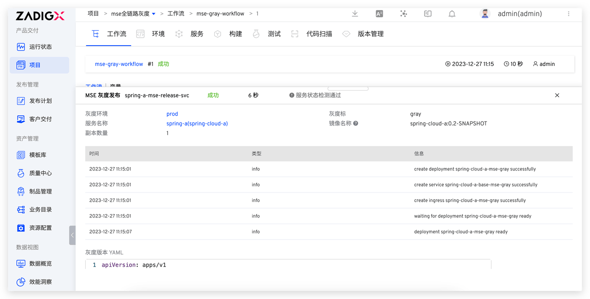
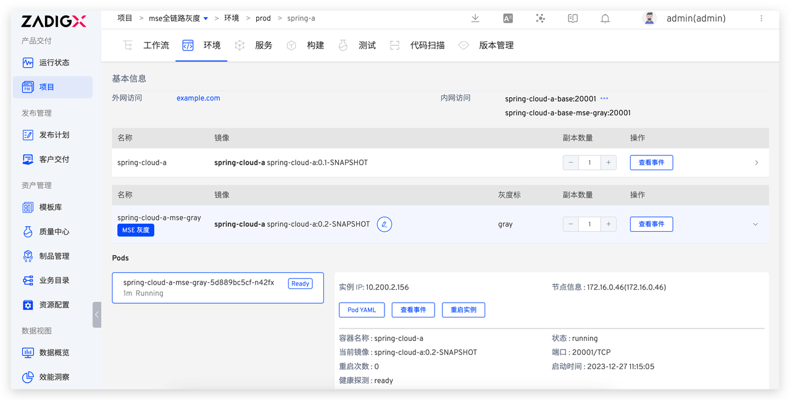

### 灰度结果验证

灰度服务部署完成后，自动执行新版本功能验证或通过其他业务方法验证灰度结果。

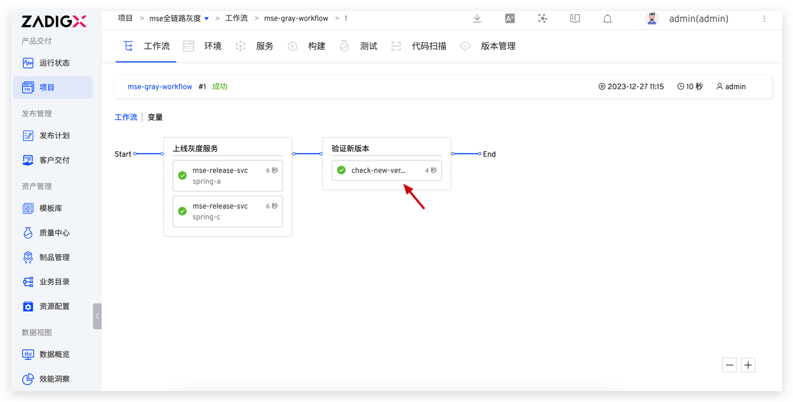


### 正式发布生产服务

灰度服务验证没有问题后，执行 prod-workflow 工作流，选择更新的服务及对应的镜像，即可更新生产服务。

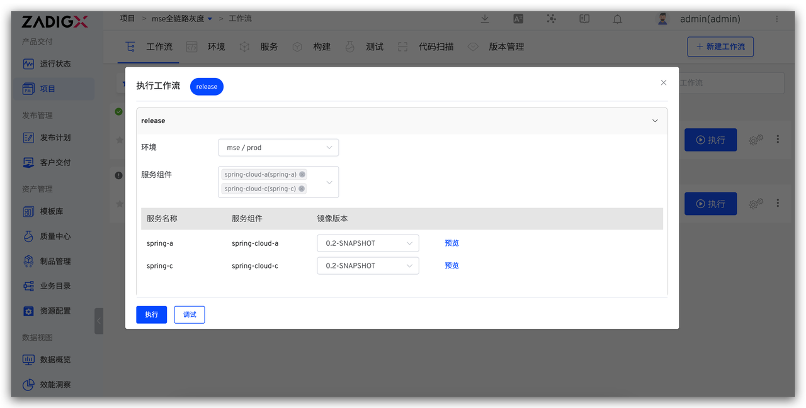
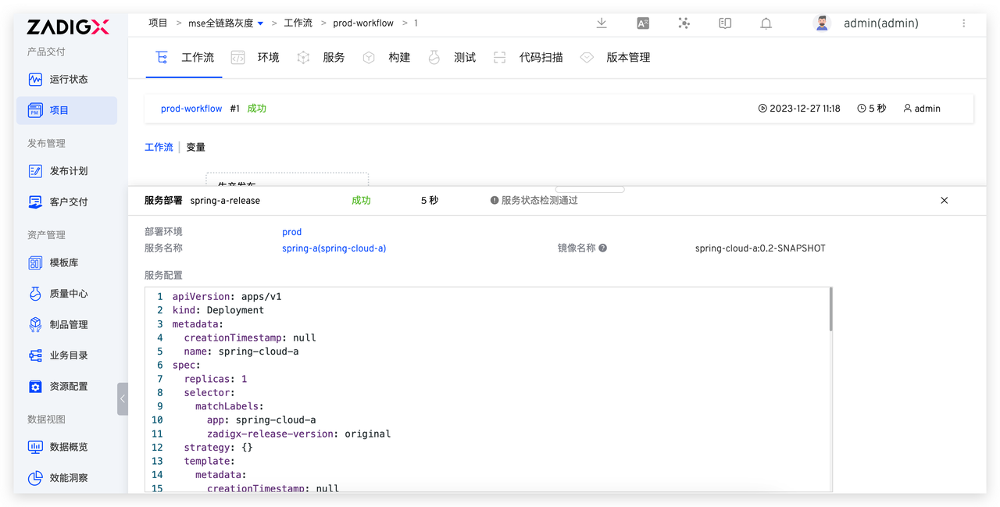

### 灰度服务清理与下线

生产发布成功后，执行 mse-gray-workflow 工作流，选择需要下线的灰度标，即可下线对应的灰度服务。

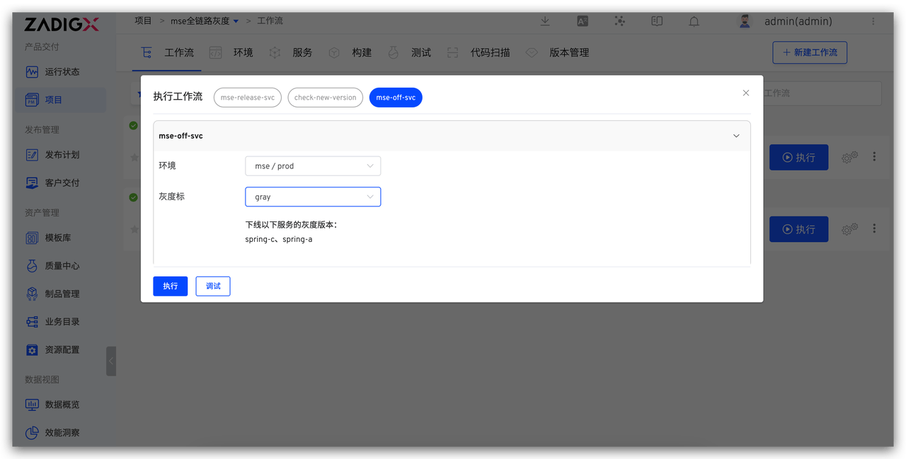
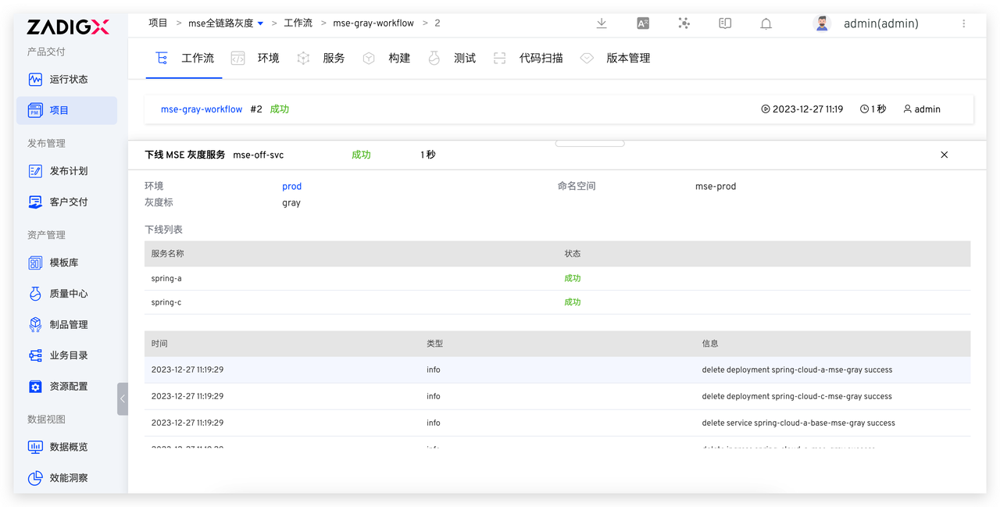
