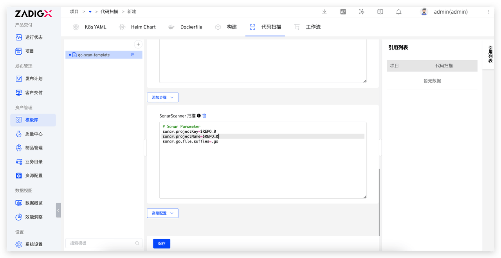
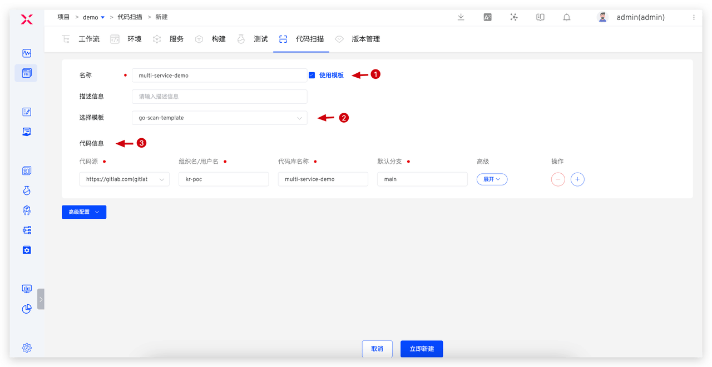

将项目的代码扫描过程抽象成模板，一次配置多项目复用，大幅降低企业在质量工程方面的运维工作量，提升代码的质量和安全性。

## 新建模板

依次访问`资产管理`-> `模板库` -> `代码扫描` 进入构建模板管理页面。点击 `+` 按钮，填写模板名称，参考[代码扫描配置](/Zadig%20v3.3/project/scan/)完成模板的配置。

## 使用模板

新建代码扫描，勾选`使用模板`并选择模板，填写代码信息。

更多实践参考[Sonar 扫描最佳实践](/Zadig%20v3.3/sonar-scan/practice/)。