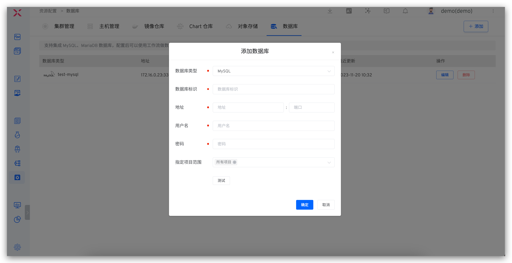

本文介绍如何在 Zadig 系统上集成和使用数据库。Zadig 支持集成 MySQL、MariaDB 数据库，集成后可使用工作流实现数据的自动化变更。

## 如何集成

点击 `资源配置` -> `数据库` -> `添加` ，填写数据库配置参数后保存即可。
1. 数据库标识字段可自定义，需全局唯一，以便在 Zadig 系统中快速识别出该数据库。
2. 配置填写完毕后可点击`测试`进行数据库连通性校验。

## 如何使用

在工作流中编排 SQL 数据变更任务，即可实现数据的自动化变更，参考文档 [SQL 数据变更任务](/Zadig%20v3.3/project/workflow-jobs/#sql-数据变更)。
