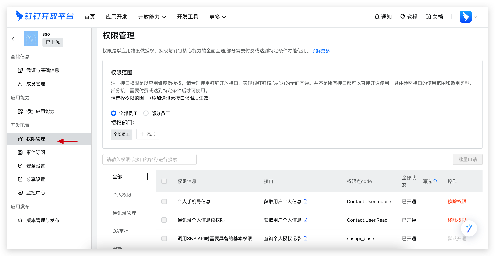
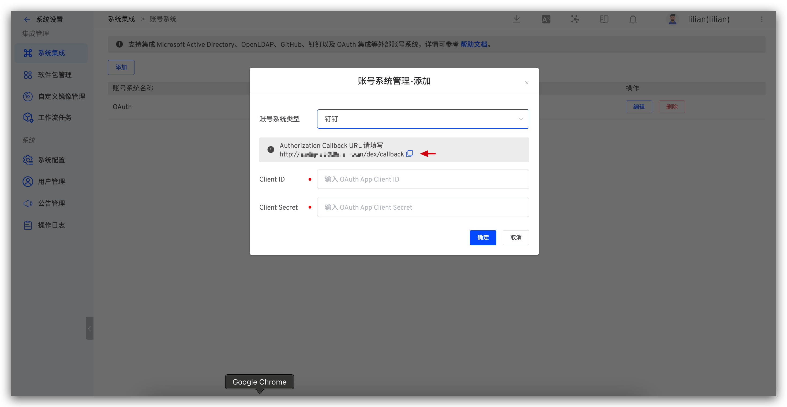

Zadig 账号系统支持集成钉钉账号，用户可以通过配置钉钉应用，实现钉钉账号登录 Zadig。

## 步骤 1：创建钉钉应用

1. 访问[钉钉开放平台](https://open-dev.dingtalk.com/fe/app#/corp/app)，创建应用，如下图所示。

2. 在`权限管理` - `数据权限`中设置通讯录权限范围，并在 `API 权限`中开通审批应用需要的权限，如下图所示。

需要的权限项如下：

- `Contact.User.Read`
- `Contact.User.Mobile`

3. 获取 `Client ID` 和 `Client Secret`，如下图所示。
   

4. 创建版本，发布钉钉应用。

## 步骤 2：配置 Zadig 账号集成

访问 Zadig，点击`系统设置`->`系统集成`->`账号系统`，选择 `钉钉`，填入步骤 1 中获取的 `Client ID` 和 `Client Secret`，如下图所示。

获取其中的 Callback 地址，在钉钉开放平台中配置回调地址，如下图所示。

