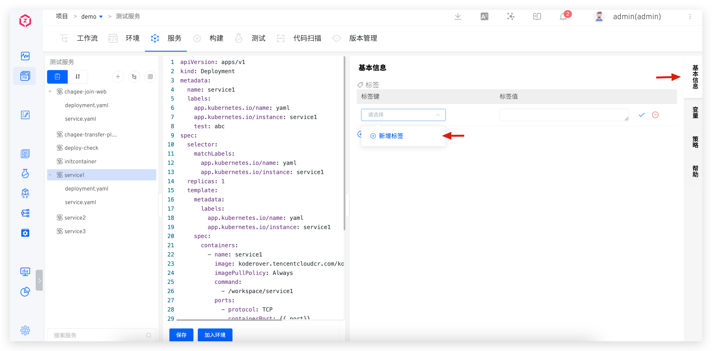
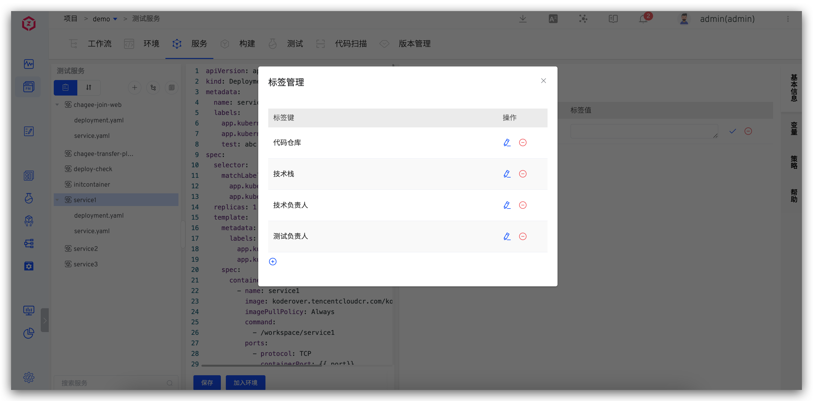
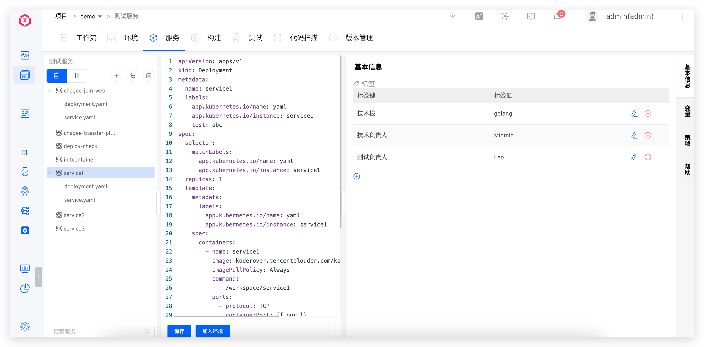
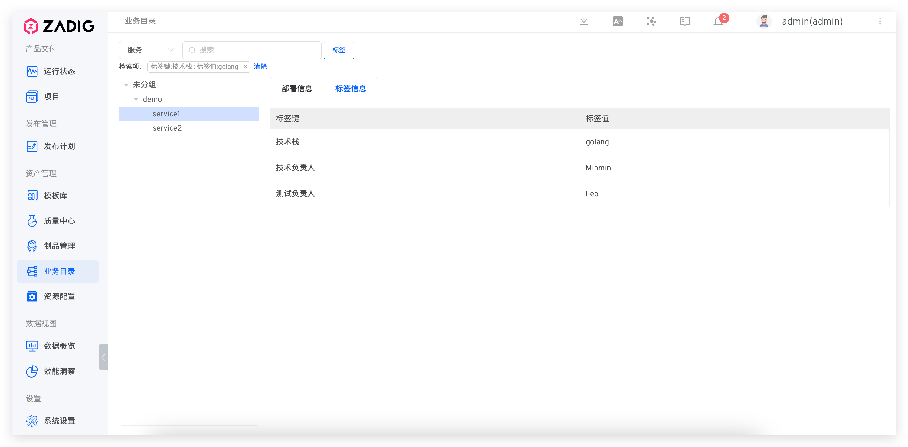

## 标签管理

在 Zadig 上，可以轻松实现对服务标签的集中管理。进入「服务」页面，在「基本信息」区域添加相应的服务标签，即可为服务关联已有的标签，从而提升服务的分类和检索效率。

## 标签的使用

### 快速检索服务

访问「业务目录」，选择标签键值进行服务检索。
  

### 服务元信息管理

给服务打上相关元信息标签，第三方系统通过调用 Zadig OpenAPI 获取服务元信息，OpenAPI 参考[文档](/Zadig%20v3.4/api/service/#获取服务标签)。