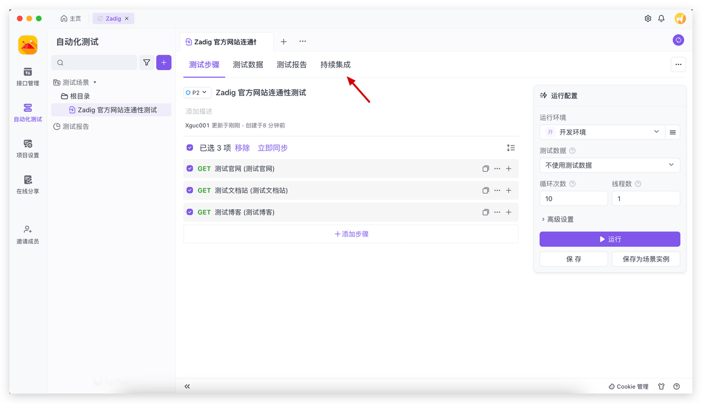
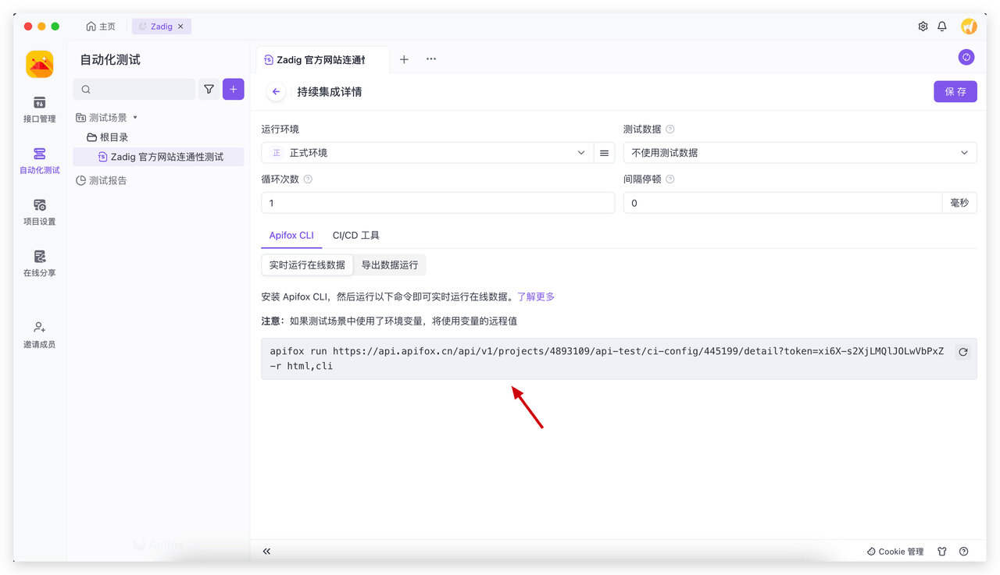
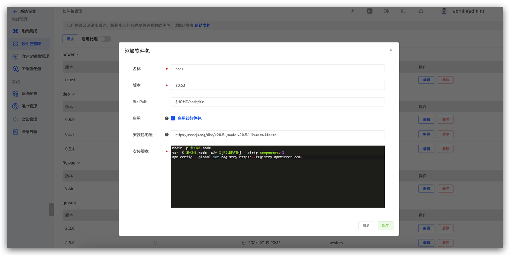
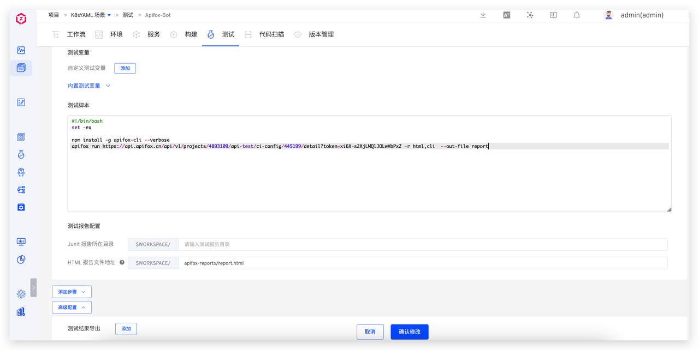

本文主要介绍如何将 Apifox 测试平台接入 Zadig，执行自动化测试，分析测试报告，并结合 Zadig 的环境能力实现测试左移，赋能其他角色也参与到质量建设中来，有效降低问题发现和修复成本。

## Apifox 接入

### 第一步：在 Apifox 中配置持续集成

访问 Apifox 自动化测试 -> 持续集成，新增持续集成后保存 Apifox CLI 命令。




### 第二步：在 Zadig 中配置 Nodejs

Zadig 系统管理员访问系统设置 -> 集成管理 -> 软件包管理，新增软件包。



具体配置如下：
- `名称`：`node`
- `版本`：`20.5.1`
- `Bin Path`：`$HOME/node/bin`
- `Bin Path`：`https://nodejs.org/dist/v20.5.1/node-v20.5.1-linux-x64.tar.xz`
- `安装脚本`：内容如下

``` bash
mkdir -p $HOME/node 
tar -C $HOME/node -xJf ${FILEPATH} --strip-components=1 
npm config --global set registry https://registry.npmmirror.com/
```

### 第三步：在 Zadig 中配置测试

进入项目的测试模块，点击`新建测试`，完成测试配置。





配置说明：
- 依赖的软件包：选择 node 20.5.1
- 测试脚本：Apifox 持续集成 CLI ，加上 --out-file=report ，示例如下
```bash
#!/bin/bash
set -ex

npm install -g apifox-cli --verbose
apifox run https://api.apifox.cn/api/v1/projects/4893109/api-test/ci-config/445199/detail?token=xi6X-s2XjLMQlJOLwVbPxZ -r html,cli  --out-file report
```

- Html 报告文件地址：`$WORKSPACE/apifox-reports/report.html`

**通知**

参考文档：[通知配置](/Zadig%20v3.4/project/test/#通知配置)。

## 自动化测试执行

执行 Zadig 测试，将会自动触发 Apifox 执行自动化测试，待 Zadig 测试成功执行完毕后会将执行情况通知到 IM 中，以飞书示例如下。


## 测试报告分析

点击 IM 通知中的测试结果链接可查看测试报告，对测试报告进行分析。


## 测试左移

配置工作流，编排构建、部署（开发环境）、测试任务，参考文档：[工作流](/Zadig%20v3.4/project/common-workflow/)。


功能开发完成后提交代码变更 PR，选择 PR 变更执行工作流部署开发环境并执行自动化测试，在研发环节即可发现质量问题，及早修复。


