## 系统管理员操作

### 第三方系统集成

|系统       |  描述                            | 配置方式 |
| ---------- | ---------------------------------| -------|
| 账号系统 | 企业内部统一账号系统接入 |[LDAP](/ZadigX%20dev/settings/account/ldap/) [OAuth 2.0](/ZadigX%20dev/settings/account/oauth2/)|
| 代码仓库 | 企业使用的研发代码仓库集成 |[GitLab 集成](/ZadigX%20dev/settings/codehost/gitlab/) [GitHub 集成](/ZadigX%20dev/settings/codehost/github/) [Gerrit 集成](/ZadigX%20dev/settings/codehost/gerrit/) [Gitee 企业版集成](/ZadigX%20dev/settings/codehost/gitee-enterprise/)|
| 镜像仓库 | 项目中使用的镜像仓库集成 |[镜像仓库](/ZadigX%20dev/settings/image-registry/)|
| 对象存储 | 对象存储集成，存放工作流历史日志、测试报告、构建缓存 |[对象存储](/ZadigX%20dev/settings/object-storage/)|
| 集群管理 | 多集群管理，用于工作流任务执行和服务部署 |[集群管理](/ZadigX%20dev/pages/cluster_manage/)|
| 项目管理 | 集成项目管理工具，用于在工作流中自动变更项目管理中的任务状态 |[Jira 集成](/ZadigX%20dev/settings/jira/) [飞书项目集成](/ZadigX%20dev/settings/lark/)|
| 配置管理 | 集成配置管理工具，用于在工作流中自动变更业务配置（Apollo 配置/Nacos 配置） |[Apollo 配置](/ZadigX%20dev/settings/configsystem/apollo/) [Nacos 配置](/ZadigX%20dev/settings/configsystem/nacos/)|
| 代码扫描 | 集成 Sonar 系统，用于 Sonar 代码扫描 |[Sonar 集成](/ZadigX%20dev/settings/sonar/)|
| 审批系统 | 集成审批系统，用于工作流流程审批 |[审批系统集成](/ZadigX%20dev/settings/approval/)|
| Helm Chart 仓库 | 集成 Helm Chart 仓库，用于拉取和推送 Chart 服务 |[Helm 仓库](/ZadigX%20dev/settings/helm/)|

### 系统设置

#### 因磁盘空间不足导致工作流执行失败，如何处理？

> 可以从 **释放磁盘空间** 和 **增加磁盘空间** 两个角度来解决。

1. **释放磁盘空间**：访问系统设置 -> 系统配置 -> 缓存清理 -> 一键清理，快速释放磁盘空间。
::: tip
为避免系统长时间运行产生的缓存资源占用磁盘空间，可设置定时清理，参考文档：[缓存清理](/ZadigX%20dev/settings/system-settings/#缓存清理)。 
注意：清理镜像缓存后，初次执行工作流构建镜像的效率可能会有影响，请确认无误后再操作。
:::

2. **增加磁盘空间**：访问系统设置 -> 集群管理 -> 编辑集群，修改 Dind 资源配置，调整存储空间大小，参考文档：[Dind 资源配置](/ZadigX%20dev/pages/cluster_manage/#dind-资源配置)。 

#### 如何提高工作流构建执行效率？
::: tip
从工作流配置和集群资源配置两个角度来优化工作流构建执行效率。以下途径均可提高工作流执行效率：
1. 开启构建缓存，节省构建执行时间
2. 使用更高规格的构建资源
3. 配置工作流并发执行
4. 使用 PVC 资源作为缓存存储介质
5. 使用更高配置的 Dind 资源
:::

1. **开启构建缓存**：访问项目 -> 构建 -> 高级配置，开启缓存配置并自定义缓存目录，可参考文档：[工作流构建缓存](/ZadigX%20dev/workflow/cache/#工作空间缓存)。

2. **构建资源配置**：访问项目 -> 构建 -> 高级配置，选择更高规格的操作系统配置。

3. **开启工作流并发执行**：系统设置 -> 系统配置中设置任务并发数；编辑工作流 -> 开启并发执行，参考文档：[任务配置](/ZadigX%20dev/settings/system-settings/#任务配置)，[工作流并发运行](/ZadigX%20dev/project/workflow/#基本信息)。 
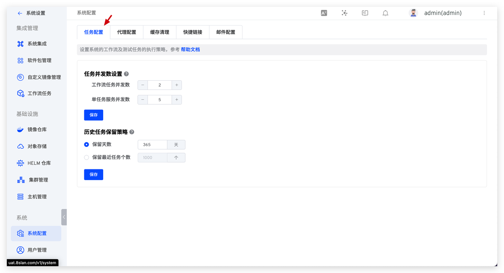
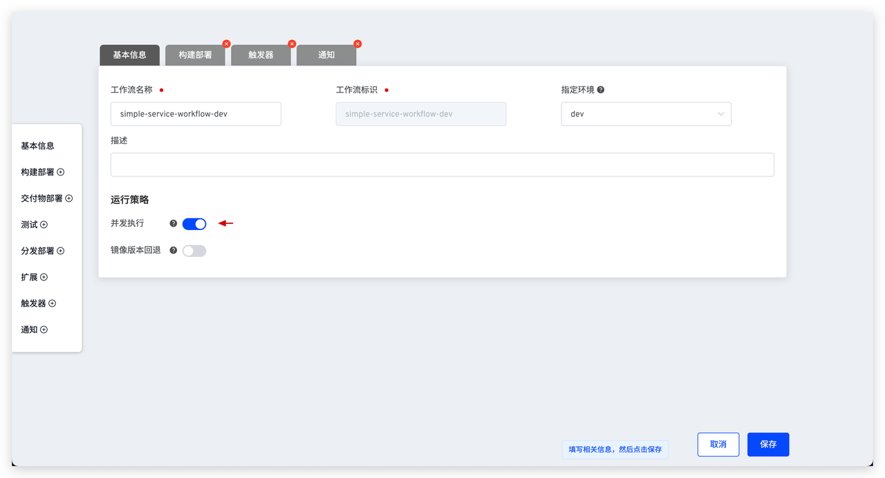

4. **设置集群缓存资源配置**：访问系统设置 -> 集群管理 -> 编辑集群的缓存资源配置，参考文档：[缓存资源配置](/ZadigX%20dev/pages/cluster_manage/#缓存资源配置)。 
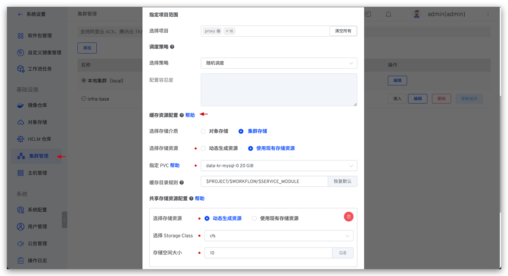

5. **设置集群 Dind 资源配置**：访问系统设置 -> 集群管理 -> 编辑集群的 Dind 资源配置，参考文档：[Dind 资源配置](/ZadigX%20dev/pages/cluster_manage/#dind-资源配置)。 

#### 如何配置任务的调度资源？
> 设置集群的调度策略，将任务调度到指定的节点上运行，确保资源被高效使用。

访问系统设置 -> 集群管理 -> 编辑集群的调度策略，参考文档：[调度策略配置](/ZadigX%20dev/pages/cluster_manage/#设置调度策略)。

场景一：集群中可用节点都可用于运行任务，选择随机调度。 
场景二：只允许任务在指定的节点上运行，将节点加上专用标签，选择强制调度。 
场景三：集群中可用节点都可用于运行任务，但希望优先使用某些节点，将节点加上标签，选择优先调度。 
场景四：希望实现更细粒度的资源调度，具体设置：给节点增加污点，在调度策略中配置容忍度。 

#### 如何在工作流中执行自定义任务？

> 前期准备工作：编码实现自定义任务的功能，提交到代码库。自定义任务的实现对文件目录结构有要求，参考文档：[自定义任务](/ZadigX%20dev/settings/custom-task/#实现自定义任务)；

1. 访问 Zadig 的系统设置 -> 工作流任务，添加来源。

2. 在自定义工作流中添加任务，配置自定义任务。参考文档：[自定义工作流](/ZadigX%20dev/project/common-workflow/#基本概念)。

#### 如何配置代理？
> 适用于有额外的网络需求（比如：代码构建中存在外部依赖；拉 GitHub 代码超时等）。

访问系统设置 -> 系统配置 -> 添加代理配置，参考文档：[代理配置](/ZadigX%20dev/settings/system-settings/#代理配置)。
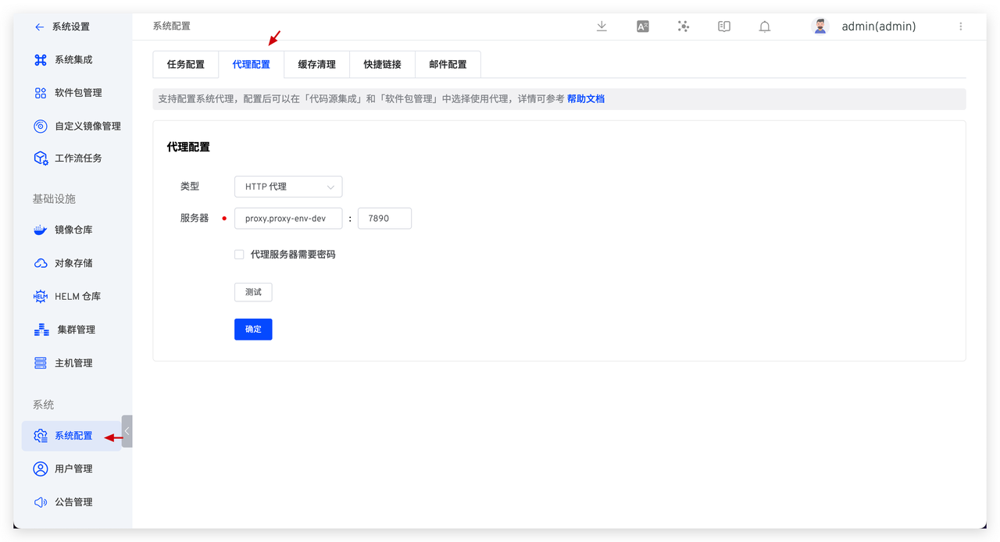

#### 如何配置多集群？
> 希望实现细粒度的集群资源管理，比如：不同团队的项目使用不同的集群资源。

访问系统设置 -> 集群管理 -> 添加集群。参考文档：[集群管理](/ZadigX%20dev/pages/cluster_manage/)。 
对于不同的网络情况，使用不同的方式来接入集群：
1. 外接集群可以访问 Zadig 所在的集群，使用代理连接的方式接入。
2. Zadig 所在的集群可以访问外接集群，使用直接连接的方式接入。

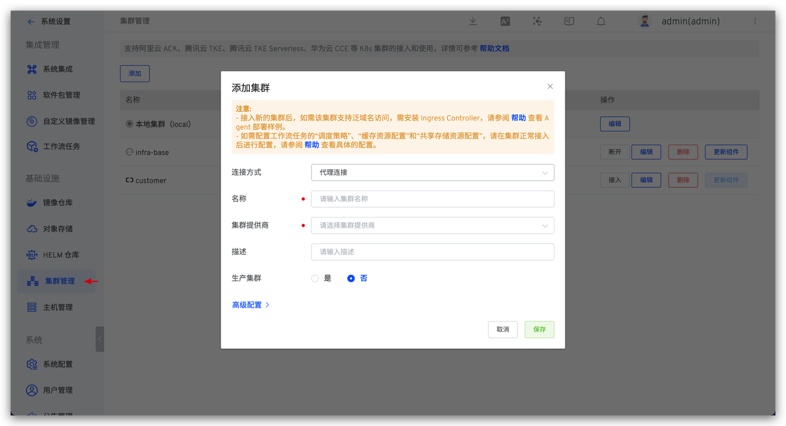

## 项目管理员操作

### 项目接入方式
#### 现有项目托管
> 适用场景：已有服务 YAML 配置并未做管理，比如服务部署通过云厂商控制台或直接在 Jenkins 中通过脚本组装生成 YAML 等情况。使用 Zadig 快速拉起不同业务域的项目，给开发测试运维一个协同平面，实现高效的业务开发和交付。

接入操作步骤：
1. 新建项目 -> 选择托管项目。
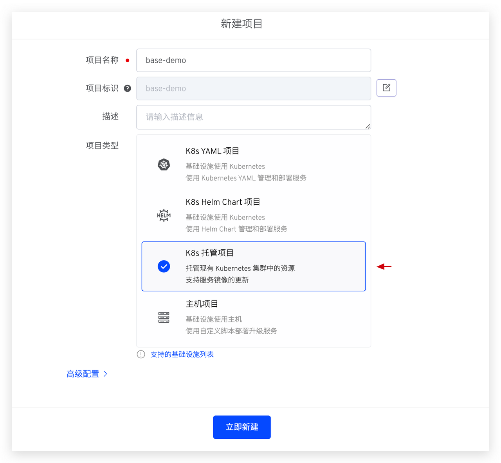

2. 配置托管环境，从指定集群、指定命名空间中选择服务导入。
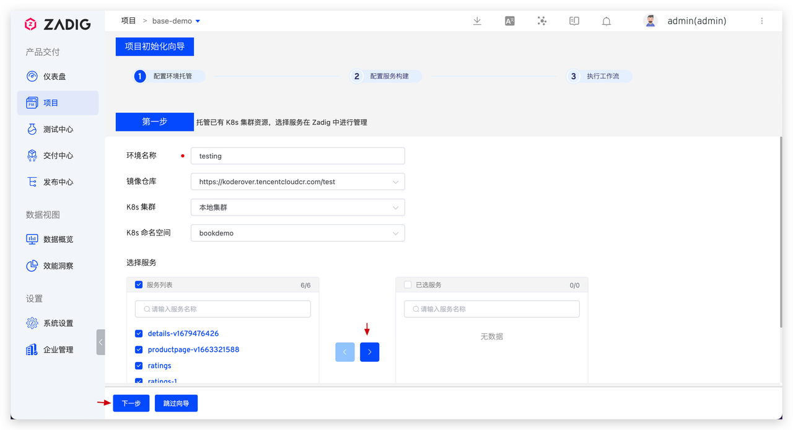

3. 配置服务构建，参考文档：[构建](/ZadigX%20dev/project/build/#zadig-构建)。

4. 执行工作流，部署更新指定环境中的服务。

::: tip
若后续需要在 Zadig 上管理服务配置，可以一键切换项目类型，切换成 K8s YAML 项目，参考文档：[切换项目类型](/ZadigX%20dev/project/host-k8s-resources/#托管项目切换-k8s-yaml-项目)。
:::

#### 现有项目导入
> 适用场景：已有服务的 YAML/Helm Chart 配置已经通过 Git 仓库、Chart 仓库或者其他存储介质管理。使用 Zadig 导入已有服务配置和已有环境，实现迭代过程和发布过程的自动化。

以下就配置文件的两种形式（YAML / Helm Chart）分别介绍接入步骤。

> **YAML 形式**
1. 新建项目，选择 K8s YAML 项目。

2. 新建服务：从代码库中同步服务配置，参考文档：[新建服务](/ZadigX%20dev/project/service/k8s/#新建服务)。
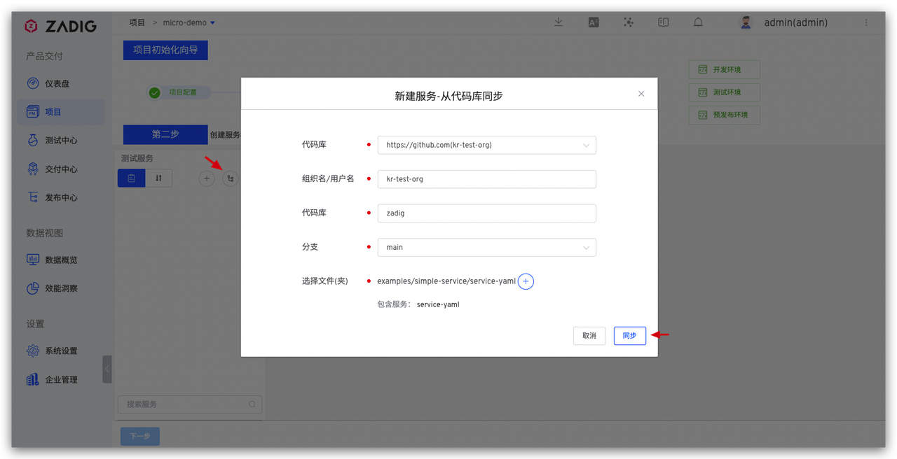

3. 新建环境：选择已有命名空间新建环境（比如：dev/sit/uat/prod 环境），参考文档：[新建环境](/ZadigX%20dev/project/env/k8s/#创建环境)。
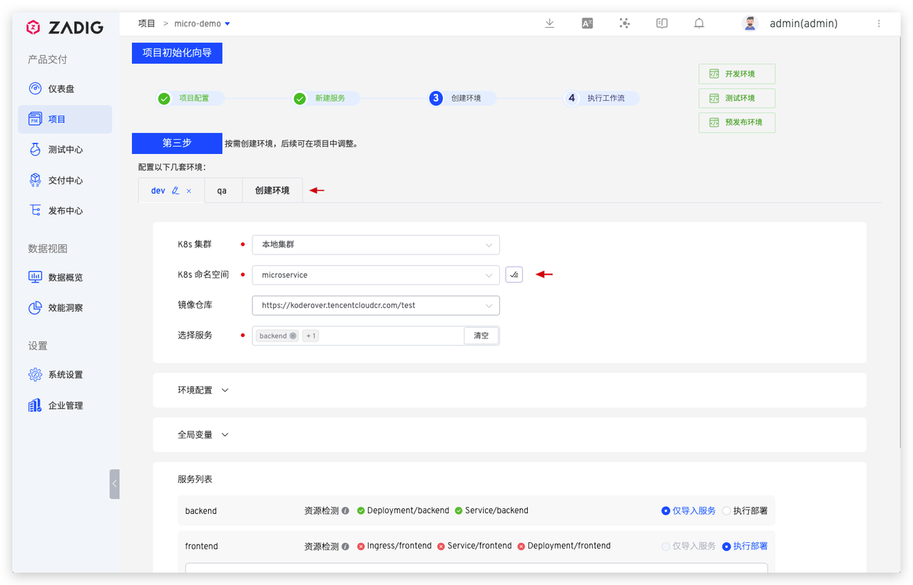

4. 配置构建：进入项目 -> 构建，配置服务构建脚本，参考文档：[构建](/ZadigX%20dev/project/build/#zadig-构建)。

5. 执行工作流：进入项目 -> 工作流，运行工作流更新指定环境的服务。

> **Helm Chart 形式**

1. 新建项目，选择 K8s Helm Chart 项目。

2. 新建服务：从代码库中同步服务配置，参考文档：[新建服务](/ZadigX%20dev/project/service/helm/chart/#从代码库同步服务)。

3. 新建环境：选择已有命名空间新建环境（比如：dev/sit/uat/prod  环境），参考文档：[新建环境](/ZadigX%20dev/project/env/k8s/#创建环境)。

4. 配置构建：进入项目 -> 构建，配置服务构建脚本，参考文档：[构建](/ZadigX%20dev/project/build/#zadig-构建)。
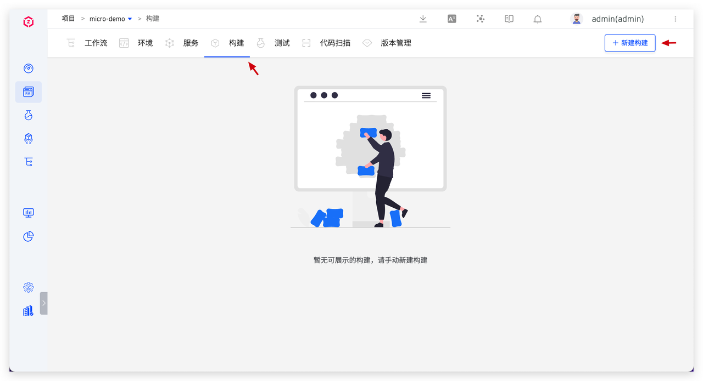

5. 执行工作流：进入项目 -> 工作流，执行工作流更新指定环境的服务。工作流的更多功能可参考文档：[工作流](/ZadigX%20dev/project/workflow/)。
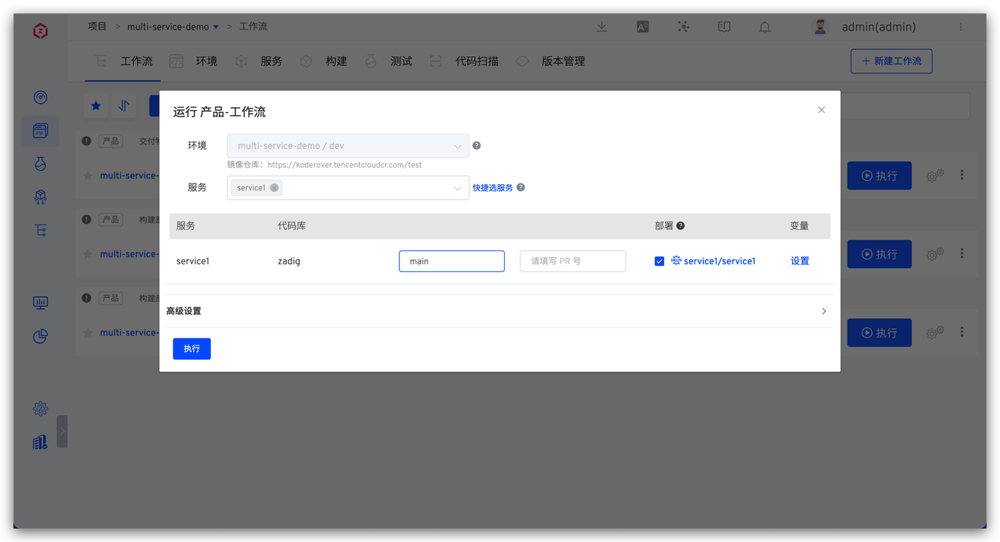

#### 新项目接入
> 适用场景：对于需要搭建工程体系的新项目，使用现有模板来统一管理服务配置和构建，实现标准化规范化运维。

以下就配置文件的两种形式（YAML / Helm Chart）分别介绍接入步骤。

> **YAML 形式**
1. 新建项目：选择 K8s YAML 项目。

2. 新建服务：使用模板新建服务，参考文档：[新建服务](/ZadigX%20dev//project/service/k8s/#使用模板新建服务)。

3. 新建环境：选择服务新建 dev/sit/uat/prod 环境。

4. 配置构建：使用构建模板配置构建脚本，参考文档：[构建](/ZadigX%20dev/project/build/#zadig-构建)。

5. 配置工作流：配置测试和生产环境对应工作流，参考文档：[工作流](/ZadigX%20dev/project/common-workflow/)。

> **Helm Chart 形式**
1. 新建项目：选择 K8s Helm Chart 类型项目。

2. 新建服务：使用模板新建服务，参考文档：[新建服务](/ZadigX%20dev/project/service/helm/chart/#使用模板新建单个服务)。

3. 新建环境：选择服务新建 dev/sit/uat/prod 环境。

4. 配置构建：使用构建模板配置构建脚本，参考文档：[构建](/ZadigX%20dev/project/build/#zadig-构建)。

5. 配置工作流：配置测试环境和生产环境对应工作流，参考文档：[工作流](/ZadigX%20dev/project/common-workflow/)。

### 标准模板管理

#### 服务模板

::: tip 适用场景
多个服务的配置文件内容结构同构，只是具体配置不同。比如：不同服务的端口号/副本数/数据库连接地址等不同。将服务的配置抽象成通用的 K8s YAML/Helm Chart 模板，支持用户在通用模板上创建多个服务。
:::

就服务配置的不同组织形式（K8s YAML/Helm Chart）分别介绍。

> **K8s YAML 模板**

准备工作：将多个服务的配置抽象成 K8s YAML 模板，以下为 multi-service-demo 项目的相关配置供参考。更多使用姿势可参考文档：[K8s YAML 模板](/ZadigX%20dev//template/k8s_yaml/)、[使用模板创建服务](/ZadigX%20dev/project/service/k8s/#使用模板新建服务)。
- 三个微服务的 K8s YAML 配置：[service1](https://github.com/koderover/zadig/tree/main/examples/multi-service-demo/k8s-yaml/service1)、[service2](https://github.com/koderover/zadig/tree/main/examples/multi-service-demo/k8s-yaml/service2)、[service3](https://github.com/koderover/zadig/tree/main/examples/multi-service-demo/k8s-yaml/service3)
- 对上述三个服务配置抽象的模板：[K8s YAML 模板](https://github.com/koderover/zadig/blob/main/examples/multi-service-demo/k8s-yaml/template.yaml)。
1. 新建模板：访问模板库 -> K8s YAML -> 创建模板，输入模板内容后保存。

2. 配置自定义变量：自动解析变量，按需配置变量默认值。

3. 使用模板创建服务。

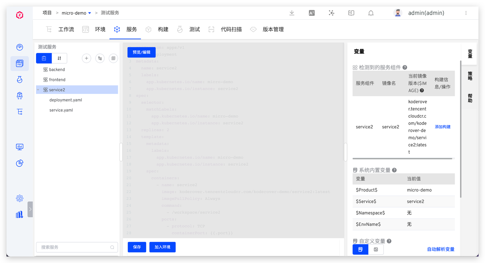

4. 模板内容变更同步更新服务配置：服务配置中开启自动同步，模板内容变更后，应用到服务

> **Helm Chart 模板**

准备工作：将多个服务的 Helm Chart 配置抽象成 Helm Chart 模板，以下为 multi-service-demo 项目的相关配置供参考。更多使用姿势可参考文档：[Helm Chart 模板](/ZadigX%20dev/template/helm_chart/)、[使用模板创建服务](/ZadigX%20dev/project/service/helm/chart/#使用模板新建单个服务)。
- 三个微服务的 Helm Chart 配置：[service1](https://github.com/koderover/zadig/tree/main/examples/multi-service-demo/full-charts/service1)、[service2](https://github.com/koderover/zadig/tree/main/examples/multi-service-demo/full-charts/service2)、[service3](https://github.com/koderover/zadig/tree/main/examples/multi-service-demo/full-charts/service3)。
- 对上述三个服务 Helm Chart 配置抽象的模板：[Helm Chart 模板](https://github.com/koderover/zadig/tree/main/examples/multi-service-demo/general-chart)。
1. 新建模板：访问模板库 -> K8s YAML -> 创建模板，输入模板内容后保存。

2. 配置自定义变量：按需配置变量默认值后保存。
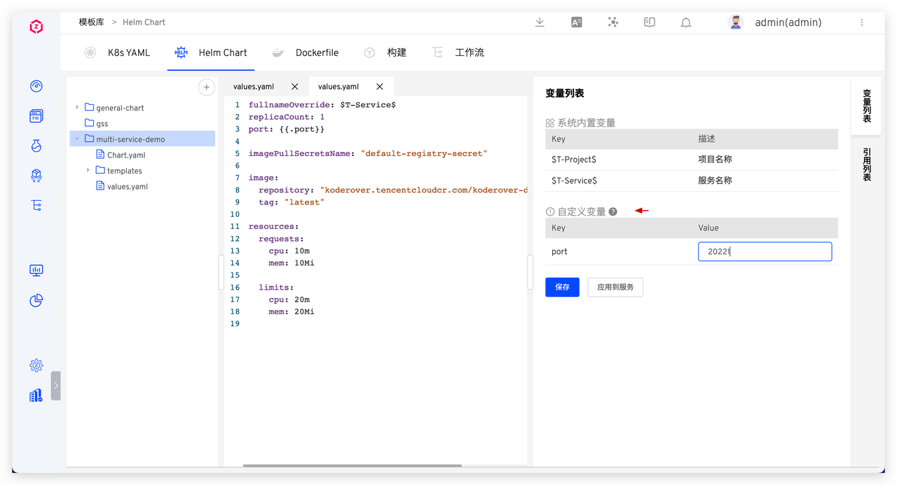

3. 使用模板创建服务：进入  K8s Helm Chart 项目 -> 服务 -> 使用模板新建，填写参数后导入即可。

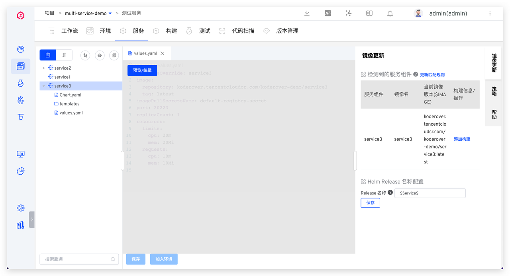

4. 模板内容变更同步更新服务配置：服务配置中开启自动同步，模板内容变更后，应用到服务。

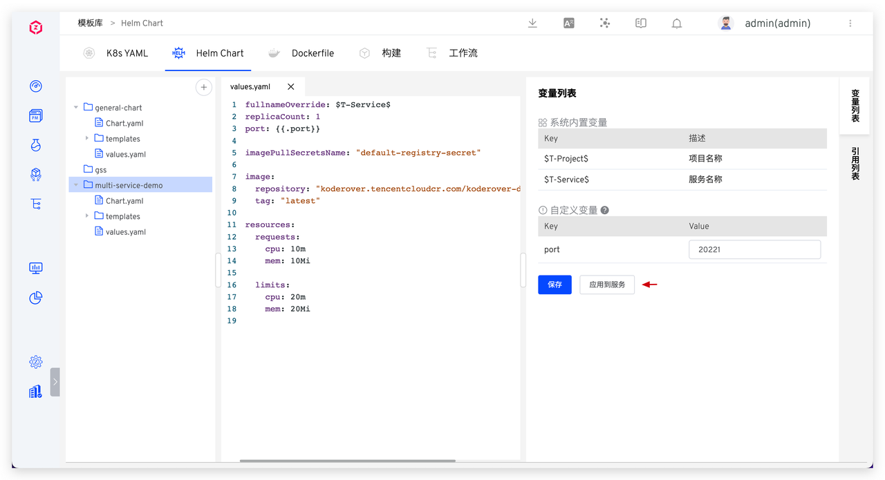

> **Dockerfile 模板**

准备工作：将多个服务的镜像构建配置抽象为 Dockerfile 模板，以下为 multi-service-demo 项目的相关配置供参考。更多使用姿势可参考文档：[Dockerfile 模板](/template/dockerfile/)、[构建配置](/ZadigX%20dev/project/build/#更多构建步骤)。
- 三个微服务的源码：[服务源码](https://github.com/koderover/zadig/tree/main/examples/multi-service-demo/src)。
- 上述三个服务的工程编译文件：[Makefile](https://github.com/koderover/zadig/blob/main/examples/multi-service-demo/Makefile)。
- 对上述三个服务的镜像构建配置进行抽象：[Dockerfile 模板](https://github.com/koderover/zadig/blob/main/examples/multi-service-demo/Dockerfile)。
1. 新建模板：访问模板库 -> Dockerfile 模板 -> 创建模板，输入模板内容后保存。

2. 使用 Dockerfile 模板为服务配置构建。

> **构建模板**

::: tip 适用场景
多个服务的构建配置同构（比如相同技术栈的多个服务代码分别在单独的代码库中维护，构建所依赖的软件包相同、构建脚本同构，只有代码信息有区别...）使用 Zadig 构建模板来提升配置构建的效率，具体可参考文档：[构建模板](/ZadigX%20dev/template/build/)。
:::

1. 新建构建模板：访问模板库 -> 构建 -> 创建模板，配置完毕后保存。

2. 使用构建模板：使用模板配置构建，分别配置多个服务构建所需的代码信息。对于多个服务使用同一构建模板的情况，可使用批量录入快速配置，参考文档：[批量录入](/ZadigX%20dev/project/build/#批量录入)。

> **工作流模板**

根据项目流程抽象工作流模板，基于模板快速创建工作流，具体参考文档：[工作流模板](/ZadigX%20dev/template/workflow/)。

### 业务运维操作
#### 服务及环境配置
> 上线测试服务

第 1 步：配置测试服务
1. 基于 K8s  YAML 模板，新建业务服务，参考文档：[服务](/ZadigX%20dev/project/service/k8s/#使用模板新建服务)。
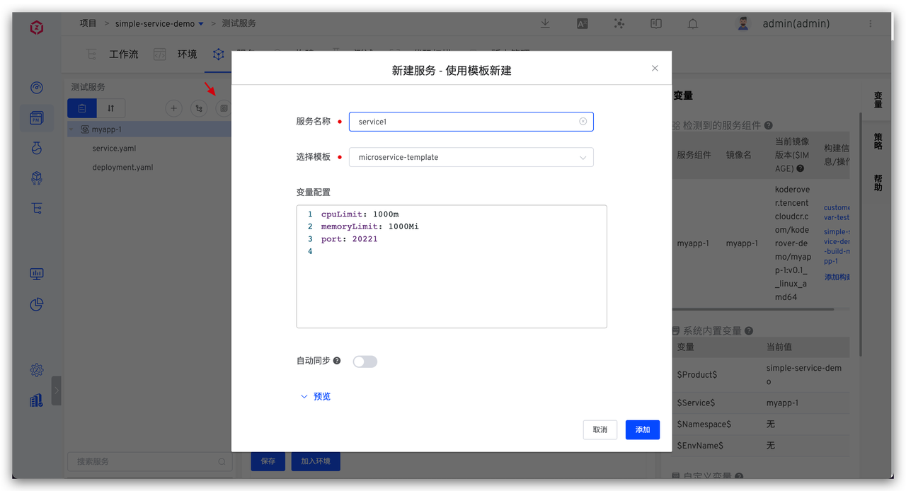

2. 基于构建模板，为服务配置构建，参考文档：[构建](/ZadigX%20dev/project/build/#zadig-构建模板)。

::: tip 优化建议：
|    建议项   |                说明                           |                    参考文档              |
|:----------- | :-------------------------------------------- |:-----------------------------------------|
| 构建过程提速 | 1. 把常用构建的依赖工具打进去  2. 自定义缓存目录| 1. [自定义构建镜像](/ZadigX%20dev/settings/custom-image/)  2. [配置构建缓存](/ZadigX%20dev/project/build/#高级配置) |
| 减少维护负担 | 1. 多个服务构建相似，配置一份构建脚本，减少维护成本  2. 规范并统一服务构建物料的管理方式，减少维护和管理负担| 1. [共享构建脚本](/ZadigX%20dev/project/build/#zadig-共享构建)  2. [使用构建模板](/ZadigX%20dev/project/build/#zadig-构建模板) |
:::

第 2 步：添加到环境，参考文档：[K8s YAML 环境](/ZadigX%20dev/project/env/k8s/#基本操作)。

第 3 步：添加服务到对应工作流，在工作流中添加服务组件及其对应构建。

> 下线测试服务
1. 删除服务定义，参考文档：[删除服务](/ZadigX%20dev/project/service/k8s/#删除服务)。

2. 从环境中删除服务，参考文档：[K8s YAML 环境](/ZadigX%20dev/project/env/k8s/#删除服务)。

> 新建测试环境

进入项目 -> 环境 -> 新建环境 -> 测试环境，填写参数后新建。
- K8s YAML 项目，参考文档：[新建 K8s YAML 环境](/ZadigX%20dev/project/env/k8s/#创建环境)。
- K8s Helm Chart 项目，参考文档：[新建 Helm Chart 环境](/ZadigX%20dev/project/env/helm/chart/#创建环境)。
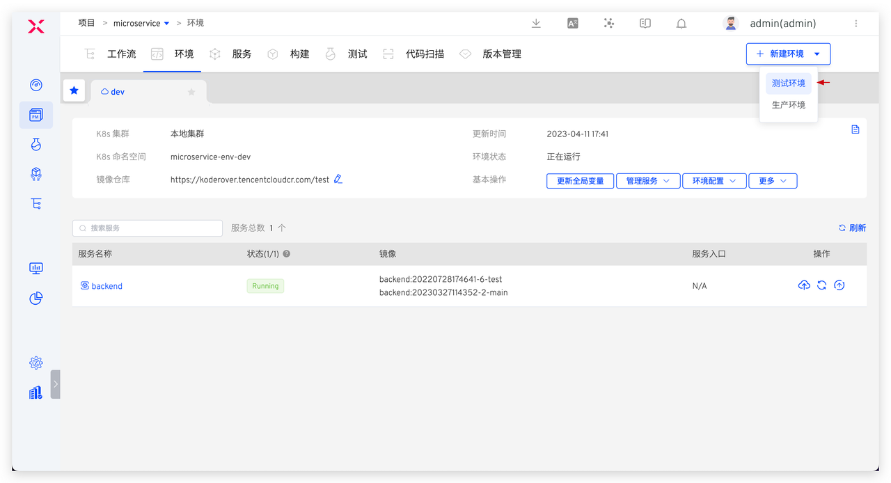

提供部分最佳实践供参考：
1. 使用一套服务配置创建多套测试环境 ，参考文档：[配置多套集成环境](/ZadigX%20dev/env/multi-env/)。
2. 不同环境使用不同结构的 deployment，可使用变量能力，参考文档：[K8s YAML 服务](/ZadigX%20dev/project/service/k8s/#变量配置)。
3. 不同业务线可以使用不同的 K8s 集群资源，新增集群配置参考：[集群管理](/ZadigX%20dev/pages/cluster_manage/)。
4. 环境配置管理，参考文档：[环境配置](/ZadigX%20dev/project/env/k8s/#环境配置)。

> 上线生产服务

第 1 步：配置生产服务，参考文档：[生产服务](/ZadigX%20dev/project/service/k8s/prod/#新建)。

第 2 步：配置生产环境，参考文档：[K8s YAML 生产环境](/ZadigX%20dev/project/env/release/)。

第 3 步：配置工作流，添加部署任务，参考文档：[工作流](/ZadigX%20dev/project/workflow-jobs/#部署任务)。

> 下线生产服务

鉴于生产服务的严肃性，下线操作有一定的风险，暂不支持在 Zadig 平台中自动操作，请确认无误后手动操作下线。

> 新建生产环境

参考文档：[生产环境](/ZadigX%20dev/project/env/release/#创建环境)。

#### 工作流配置

包括产品工作流、自定义工作流和发布工作流。
|    工作流类型   |                适用场景                        |                    参考文档                  |
|:------------- | :-------------------------------------------- |:--------------------------------------------|
| 产品工作流      | 按照顺序执行构建 -> 部署 -> 测试 -> 分发等全流程的自动化编排| [产品工作流](/ZadigX%20dev/project/workflow/)          |
| 自定义工作流    | 自由编排工作流流程，自定义执行步骤，开放性强          | [自定义工作流](/ZadigX%20dev/project/common-workflow/) |
| 发布工作流      | 自由编排发布流程，具备数据变更、配置变更、灰度发布等能力| [发布工作流](/ZadigX%20dev/project/release-workflow/) |

> 工作流触发器及 IM 通知配置
- 工作流配置 Webhook 触发：[工作流 Webhook](/ZadigX%20dev/project/workflow/#git-webhook)。
- sit 环境工作流配置定时任务：[工作流定时器](/ZadigX%20dev/project/workflow/#定时器)。
- 配置 IM 通知： [工作流飞书通知](/ZadigX%20dev/project/workflow/#飞书)。

> 自定义工作流服务能力编排

面向团队和项目的安全扫描、自动化测试等能力编排。
|    能力   |                功能描述                        |                    配置参考                 |
|:------------- | :-------------------------------------------- |:--------------------------------------------|
| 数据变更      | 对业务数据库的变更，编排到工作流中，实现数据变更的自动化| 1. [Zadig + Mysql 代码、数据变更一站式编排，可靠丝滑交付](https://mp.weixin.qq.com/s/vKVPR6sn4lAifiOPZgvzNA) 2. [Zadig + Flyway 工作流统一数据和代码变更，研发更丝滑](https://mp.weixin.qq.com/s/KFyKkYTQp58BpNn9HGA7AQ) 3. [Zadig + Liquibase，数据变更、业务变更、数据回滚，一键搞定](https://mp.weixin.qq.com/s/ZnAJ_h_GXAABxzaD4kfTqg)         |
| 配置变更    | 针对业务配置（Apollo/Nacos）的变更，可编排到工作流中，实现业务配置变更的自动化      |[配置变更](/ZadigX%20dev/project/workflow-jobs/#apollo-配置变更) |
| JIRA 问题/飞书工作项状态变更      | 针对项目管理任务，可编排到工作流中，实现项目管理任务的关联和状态变更 | 1. [JIRA 问题状态变更](/ZadigX%20dev/project/workflow-jobs/#jira-问题状态变更) 2. [飞书工作项状态变更](/ZadigX%20dev/project/workflow-jobs/#飞书工作项状态变更)|
| 其他企业内部服务/系统      | 企业内部有相关的系统需要做自动化，编排在研发流程中，可以通过工作流自定义任务实现| [工作流任务](/ZadigX%20dev/settings/custom-task/#实现自定义任务)|

#### 项目权限配置

可通过项目权限以及协作模式来配置项目成员的权限，区别如下：
- 项目权限：配置权限后，对项目下的所有资源（比如：所有工作流、所有环境、所有服务...）都生效。
- 协作模式：对项目中指定的工作流、环境资源有权限，可以实现细粒度的权限控制。
> 权限配置

访问项目配置 -> 权限，配置角色和项目成员即可，可参考文档：[权限配置](/ZadigX%20dev/project/config/#权限配置)。

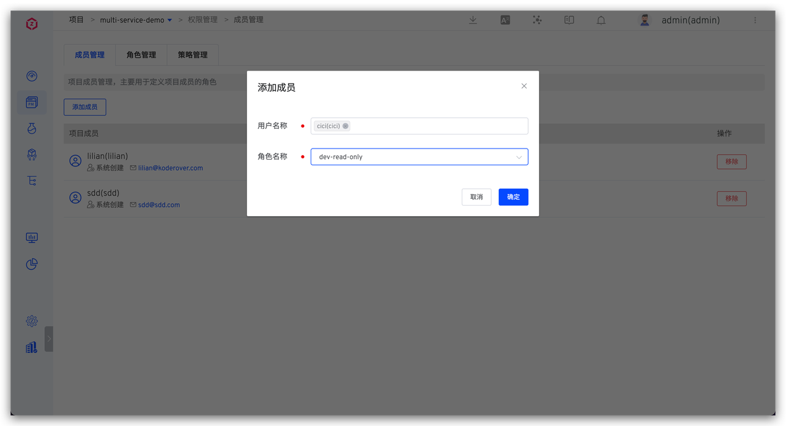

> 协作模式配置

访问项目配置 -> 协作模式，配置协作成员以及工作流、环境资源的权限即可，具体配置过程参考：[协作模式](/ZadigX%20dev/project/config/#协作模式)。

### 测试过程接入
#### 代码扫描
::: tip 必要性
1. 通过代码扫描自动查出代码中的 Bugs/漏洞/坏味道
2. 设置代码质量门禁，建设质量文化
3. 配置触发器实现代码变更自动触发代码扫描执行， 做到 fail fast，feedback fast
:::

1. 新增代码扫描，开启质量门禁检查，参考文档：[代码扫描](/ZadigX%20dev/project/scan/#新建代码扫描)。以下图为例进行示范（使用 SonarQube 工具扫描 [koderover/zadig](https://github.com/koderover/zadig) 库指定目录）： 
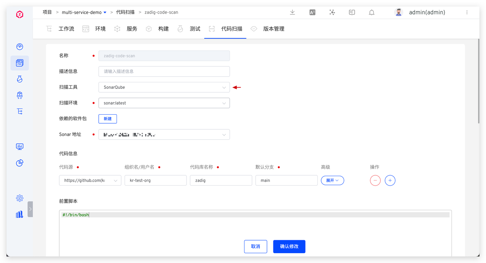

2. 在代码扫描中配置代码变更触发器，参考文档：[触发器配置](/ZadigX%20dev/project/scan/#触发器与通知)。
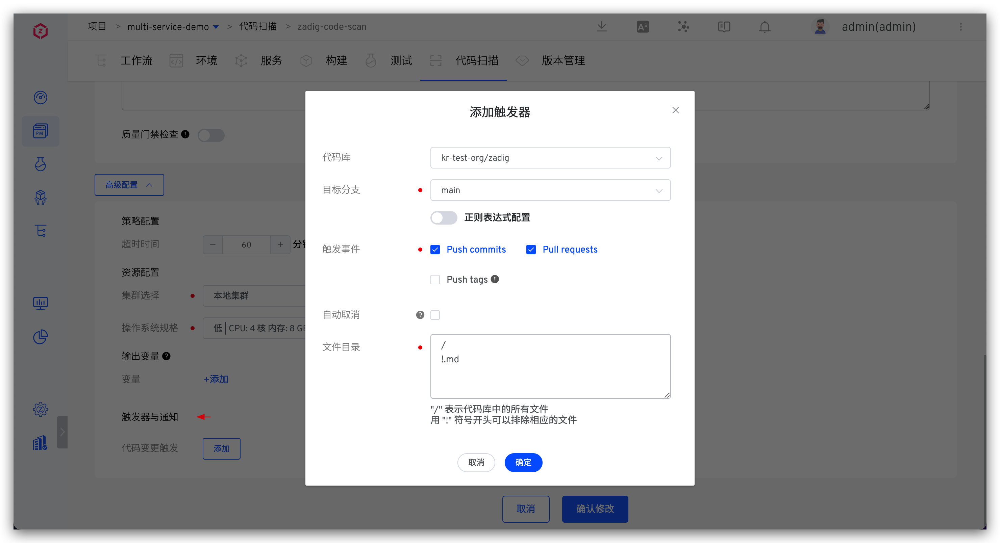

#### 单元测试
::: tip 必要性
1. 配置单元测试，尽早在尽量小的范围内暴露错误
2. 配置触发器可实现代码变更自动触发单元测试执行， 让工程师从繁琐的流程中解放出来，专注在代码实现上
3. 配置 IM 通知，单元测试执行结果反馈在 PR（代码变更） 下，做到 fail fast，feedback fast
:::

1. 新增测试，参考文档：[测试](/ZadigX%20dev/project/test/)。

2. 在测试中配置代码变更触发器，参考文档：[触发器配置](/ZadigX%20dev/project/test/#webhook-触发器)。
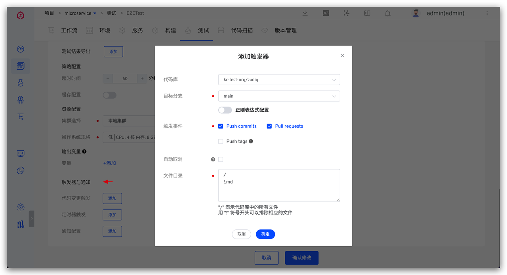

3. 在测试中配置 IM 通知，参考文档：[通知配置](/ZadigX%20dev/project/test/#通知配置)。
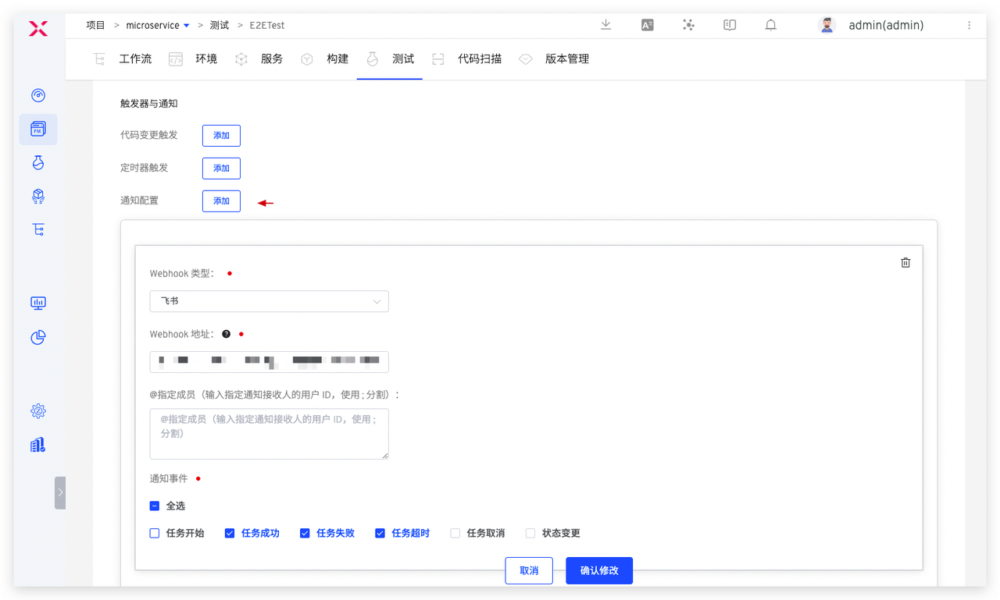

#### 集成测试
适用场景：执行服务级别的测试，针对部署的服务，执行对应的测试用例。
1. 新增测试，参考文档：[测试](/ZadigX%20dev/project/test/)。
2. 配置工作流，增加测试任务，任务类型指定为服务测试，参考文档：[工作流测试配置](/ZadigX%20dev/project/workflow-jobs/#测试任务)。

#### 系统测试
适用场景：执行产品级别的测试，针对整个产品，执行对应的测试用例。
1. 新增系统测试，参考文档：[测试](/ZadigX%20dev/project/test/)。
2. 配置工作流，增加测试任务，任务类型指定为产品测试，参考文档：[工作流测试配置](/ZadigX%20dev/project/workflow-jobs/#测试任务)。
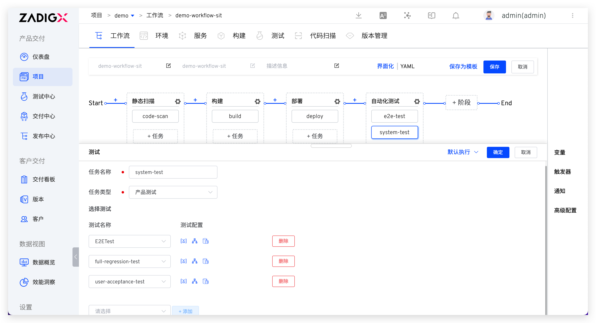
