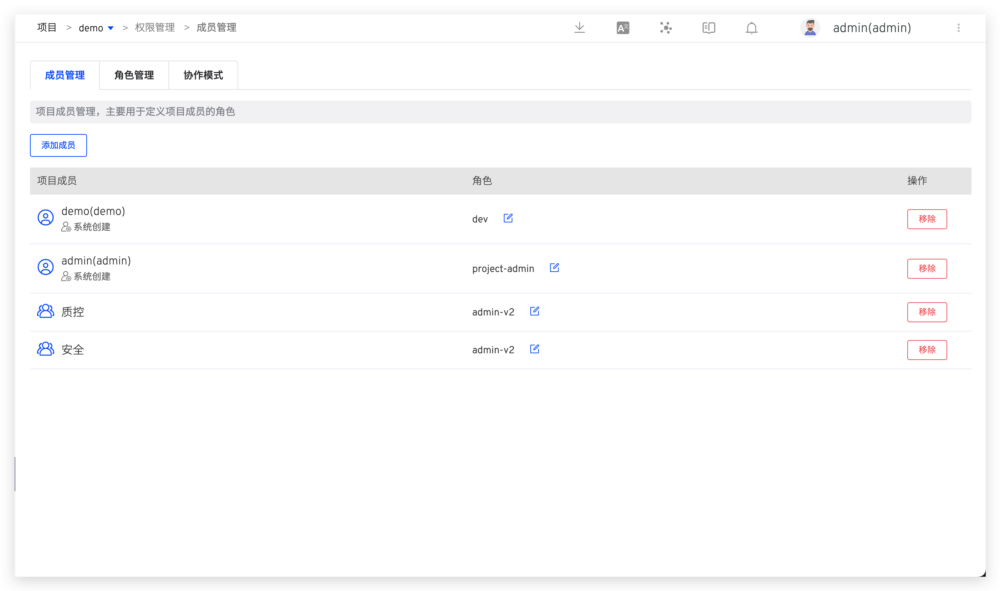

::: tip 前提
仅系统管理员及项目管理员，可以操作项目配置。
:::

## 修改项目信息

在项目详情页点击`配置`->`修改`，对项目的基本信息进行修改。

参数说明：
- `项目名称`：该项目的名称，项目创建后可修改。
- `项目标识`：创建项目时可指定，默认值为项目名称。项目创建后，其标识不可再更改。
- `描述信息`：对该项目的简要描述，非必填。
- `访问权限`：可选`公开`或`私有`，定义该项目的默认权限。
    - 公开项目：用户默认享有 `read-only` 角色中的权限，可查看项目中的资源。该角色的细节请阅[权限配置](/ZadigX%20dev/project/config/#权限配置)。
    - 私有项目：用户默认无权限查看项目中的资源，项目管理员可以在权限和协作模式中对用户进行细粒度的权限控制。

## 权限配置

在项目详情页点击`配置`->`权限`，对项目成员及成员权限进行配置，此处设置的权限对当前项目下的所有资源（比如：所有工作流、所有环境、所有服务...）都生效。

### 成员管理

在`成员管理`中，查看该项目的用户成员列表及对应角色和策略，可按需对用户角色进行配置。

- 角色：一系列权限的集合，在[角色管理](/ZadigX%20dev/project/config/#角色管理)中可查看角色中的权限细节。
- 策略：工作流/环境资源粒度的权限集合，对私有项目适用。在[策略管理](/ZadigX%20dev/project/config/#策略管理)中可查看该策略的权资源和限细节。

### 角色管理
包括系统内置角色和项目管理员自定义角色。

#### 内置角色
- `project-admin`：项目管理员，可操作所辖项目中的所有资源，可对项目配置进行修改。
- `read-project-only`：拥有此角色的成员可在项目列表中看到对应的项目，但没有权限操作项目中的资源。使用协作模式**必须**选择该角色。
- `read-only`：只读角色，在公开项目中，所有用户默认拥有此角色。对应的权限项组合如下：

#### 自定义角色

在`角色管理`中，可自定义角色并赋予权限。

### 策略管理
项目管理员为项目配置协作模式，在协作成员对资源进行确认后，系统会为该成员生成对应的策略。在`策略管理`中可查看其关联资源和权限细节。

### 权限清单

陈述各个权限项和功能的对应关系，各功能模块中完整的功能文档分别参见：[工作流](/ZadigX%20dev/project/workflow/)/[环境](/ZadigX%20dev/project/env/k8s)/[服务](/ZadigX%20dev/project/service/k8s/)/[构建](/ZadigX%20dev/project/build/)/[测试](/ZadigX%20dev/project/test/)/[版本管理](/ZadigX%20dev/project/version/)/[代码扫描](/ZadigX%20dev/project/scan/)。

<table>
	<tr>
		<th colspan="3"><b>权限与功能清单</b></th>
	</tr>
	<tr>
		<td><b>功能模块</b></td>
		<td><b>权限项</b></td>
		<td><b>功能清单</b></td>
	</tr>
	<tr>
		<td rowspan="5">工作流</td>
		<td>查看</td>
		<td>- 查看工作流列表、基本信息、任务列表、任务详情 - 查看工作流任务运行的日志(构建日志、测试日志..)</td>
	</tr>
	<tr>
		<td>编辑</td>
		<td>- 修改工作流 - 快速打开/关闭工作流定时器 - 将测试任务关联在工作流上</td>
	</tr>
	<tr>
		<td>新建</td>
		<td>- 新建工作流 - 复制工作流</td>
	</tr>
	<tr>
		<td>删除</td>
		<td>- 删除工作流</td>
	</tr>
	<tr>
		<td>执行</td>
		<td>- 启动工作流 - 重试/取消/克隆工作流任务</td>
	</tr>
	<tr>
		<td rowspan="7">环境</td>
		<td>查看</td>
		<td>- 查看环境列表、环境基本信息 - 查看环境中的服务列表、服务详情 - 查看环境配置(Ingress/ConfigMap/Secret/PVC)的内容、比较不同版本差异 - 查看服务实例的实时日志、事件、配置管理、Yaml 导出(K8s YAML 项目)</td>
	</tr>
	<tr>
		<td>创建</td>
		<td>- 新建环境 - 新建子环境</td>
	</tr>
	<tr>
		<td>配置</td>
		<td>- 更新环境变量(K8s YAML 项目)、更新全局变量(K8s Helm Chart 项目) - 配置托管(K8s 托管项目) - 开启/关闭自测模式 - 添加/更新/删除服务实例 - 编辑环境配置(Ingress/ConfigMap/Secret/PVC)、删除环境配置、回滚其版本 - 查看环境变更记录</td>
	</tr>
	<tr>
		<td>删除</td>
		<td>- 删除环境 - 取消环境托管(K8s 托管项目)</td>
	</tr>
	<tr>
		<td>管理服务实例</td>
		<td>- 更换服务实例的镜像、重启服务实例、调整服务实例副本数量、启动容器调试 - 更新服务实例</td>
	</tr>
	<tr>
		<td>服务调试</td>
		<td>- 进入服务实例容器里调试(K8s YAML/K8s Helm Chart/K8s 托管项目)</td>
	</tr>
	<tr>
		<td>主机登录</td>
		<td>- 登录到环境所部署的主机中(主机项目)</td>
	</tr>
	<tr>
		<td rowspan="4">服务</td>
		<td>查看</td>
		<td>- 查看服务配置</td>
	</tr>
	<tr>
		<td>编辑</td>
		<td>- 更新服务配置</td>
	</tr>
	<tr>
		<td>新建</td>
		<td>- 新建服务配置</td>
	</tr>
	<tr>
		<td>删除</td>
		<td>- 删除服务配置</td>
	</tr>
	<tr>
		<td rowspan="4">构建</td>
		<td>查看</td>
		<td>- 查看构建配置</td>
	</tr>
	<tr>
		<td>编辑</td>
		<td>- 更新构建配置</td>
	</tr>
	<tr>
		<td>新建</td>
		<td>- 新建构建配置</td>
	</tr>
	<tr>
		<td>删除</td>
		<td>- 删除构建配置</td>
	</tr>
	<tr>
		<td rowspan="4">测试</td>
		<td>查看</td>
		<td>- 查看测试配置</td>
	</tr>
	<tr>
		<td>编辑</td>
		<td>- 更新测试配置</td>
	</tr>
	<tr>
		<td>新建</td>
		<td>- 新建测试配置</td>
	</tr>
	<tr>
		<td>删除</td>
		<td>- 删除测试配置</td>
	</tr>
	<tr>
		<td rowspan="3">版本管理</td>
		<td>查看</td>
		<td>- 查看版本</td>
	</tr>
	<tr>
		<td>编辑</td>
		<td>- 更新版本</td>
	</tr>
	<tr>
		<td>新建</td>
		<td>- 新建版本</td>
	</tr>
	<tr>
		<td rowspan="5">代码扫描</td>
		<td>查看</td>
		<td>- 查看代码扫描配置</td>
	</tr>
	<tr>
		<td>编辑</td>
		<td>- 更新代码扫描配置</td>
	</tr>
	<tr>
		<td>新建</td>
		<td>- 新建代码扫描配置</td>
	</tr>
	<tr>
		<td>删除</td>
		<td>- 删除代码扫描配置</td>
	</tr>
	<tr>
		<td>执行</td>
		<td>- 执行/取消代码扫描任务</td>
	</tr>
</table>

## 协作模式
> 适用于访问权限为`私有`的 K8s YAML/K8s Helm Chart/托管项目，对项目中指定的工作流、环境资源做权限控制。

### 配置协作模式
在项目详情页点击`配置`->`协作模式`，配置项目的各个成员在协作过程中使用的功能模块和权限。

配置说明：

- 填写协作模式名称，比如 `developer`。
- 选择参与成员，若需要添加的用户不在成员列表中，可在[成员管理](/ZadigX%20dev/project/config/#成员管理)中添加，并选择 `read-project-only` 角色。
- 配置协作规则，根据需要为协作成员配置工作流和环境资源，并配置操作权限及回收规则，其中：
    - 独享：基于基准工作流/基准环境，为每一个协作成员创建一份新的工作流/环境供其独享使用，新资源的名称规则为 `协作模式名称-基准资源名称-用户来源-用户名称`，适用于 K8s YAML/K8s Helm Chart 项目
    - 共享：协作成员共享使用基准工作流/基准环境资源，不为其新建资源。
    - 资源回收策略：如果成员在配置的时间内没有访问项目，那么该成员的资源将会被回收。当成员重新访问项目时，会再次获得资源。

### 如何协作使用
当协作模式中的成员登录 ZadigX 系统进入指定项目后，对协作模式中分配的工作流和环境资源进行确认。

稍等片刻待系统将资源准备就绪，该成员即可获得对应资源的操作权限，在日常工作中使用。

## 主机管理

主机项目中，项目管理员点击`配置` -> `主机管理`可在项目中对主机资源进行管理，具体配置可参考 [添加主机](/ZadigX%20dev/settings/vm-management/#添加主机)。

创建后，环境中的服务可按需关联系统资源/项目资源。
::: tip
在`系统设置`-`主机管理`中创建的主机为系统资源，在项目中创建的主机为项目资源。系统资源可用于所有项目中，项目资源可用于当前项目中。
:::

## 变量组 <Badge text="企业版" />

Helm Chart 项目中，项目管理员点击`配置`->`变量组`可以对项目中的变量镜像管理。

创建后，Helm Chart 项目中环境的全局变量可以使用变量组，详情参考[更新全局变量](/ZadigX%20dev/project/env/helm/chart/#更新全局变量)
