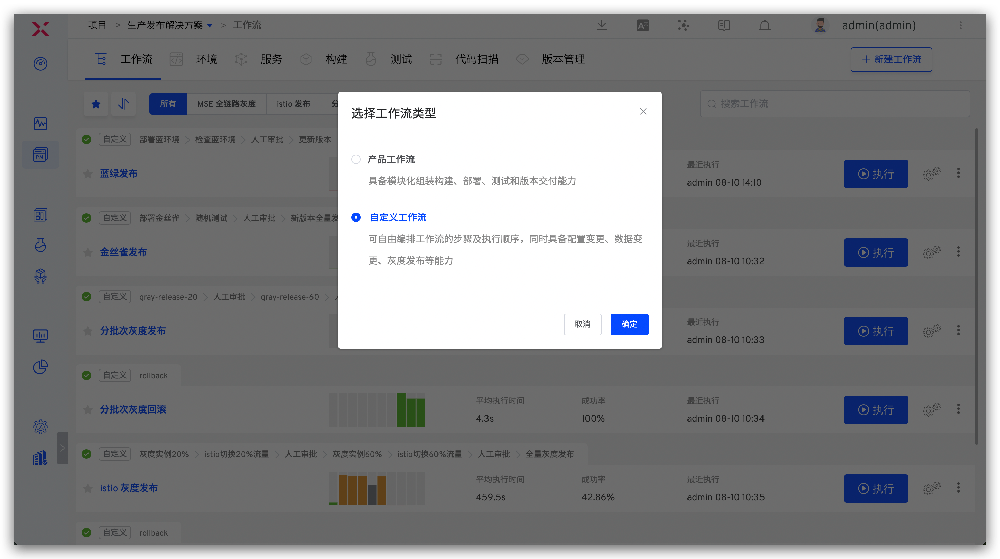
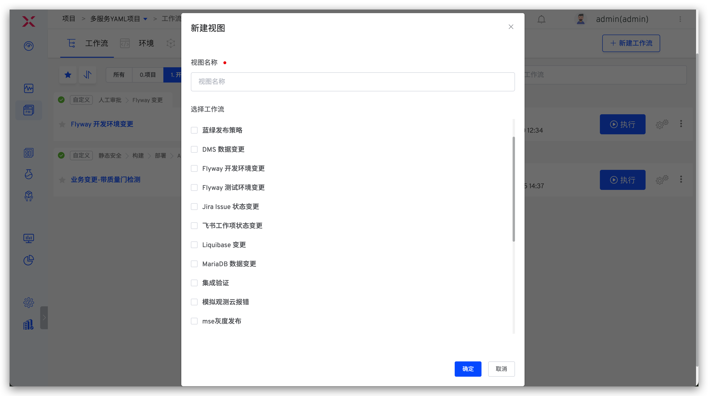

ZadigX 中的工作流包括产品工作流、自定义工作流和发布工作流，其中：

- 工作流：支持按照顺序执行`构建` -> `部署` -> `测试` -> `分发`全流程的自动化编排，使用手册参考：[工作流](/ZadigX%20dev/project/workflow/)
- 自定义工作流：可自由编排工作流流程，自定义执行步骤，使用手册参考：[自定义工作流](/ZadigX%20dev/project/common-workflow/)
- 发布工作流：支持蓝绿发布、金丝雀发布、分批次灰度发布、Istio 发布、更新 K8s YAML 等任务，使用手册参考：[发布工作流](/ZadigX%20dev/project/release-workflow/)

## 工作流视图
> 将工作流组织在不同的视图里，方便快速预览和使用。

进入项目 -> 工作流，点击视图 Tab 可分别查看当前视图下的工作流信息。点击 `+` 按钮可新建视图。

- 仅系统管理员和项目管理员可操作 `新建视图`、`编辑视图`、`删除视图`
- `所有` 视图中包含当前项目下的所有工作流，且不可删除

