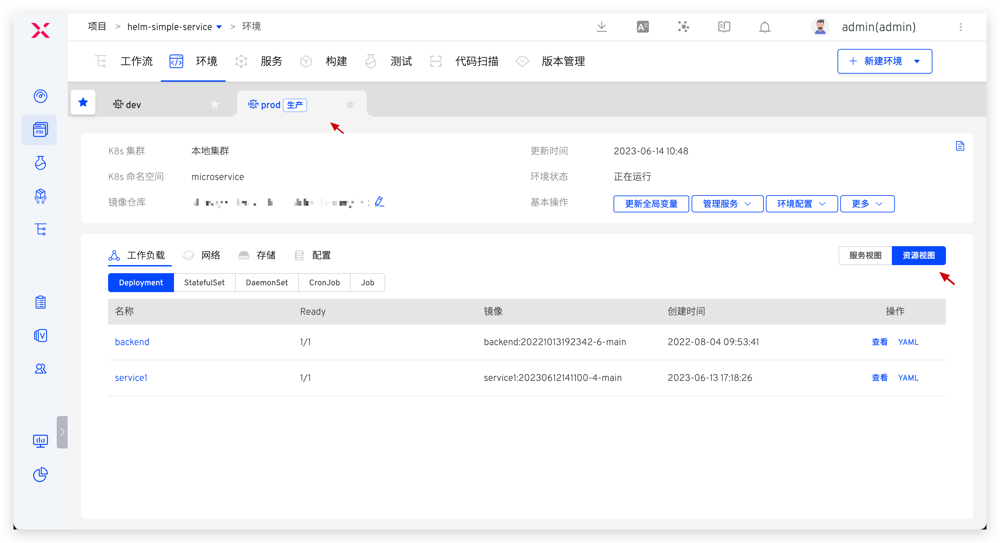
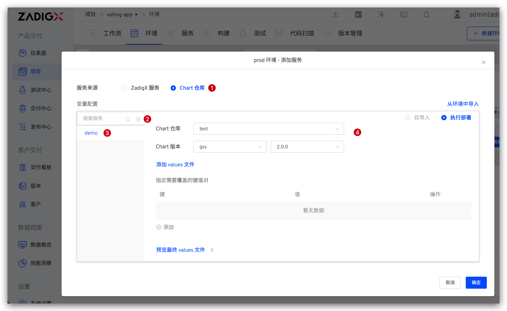
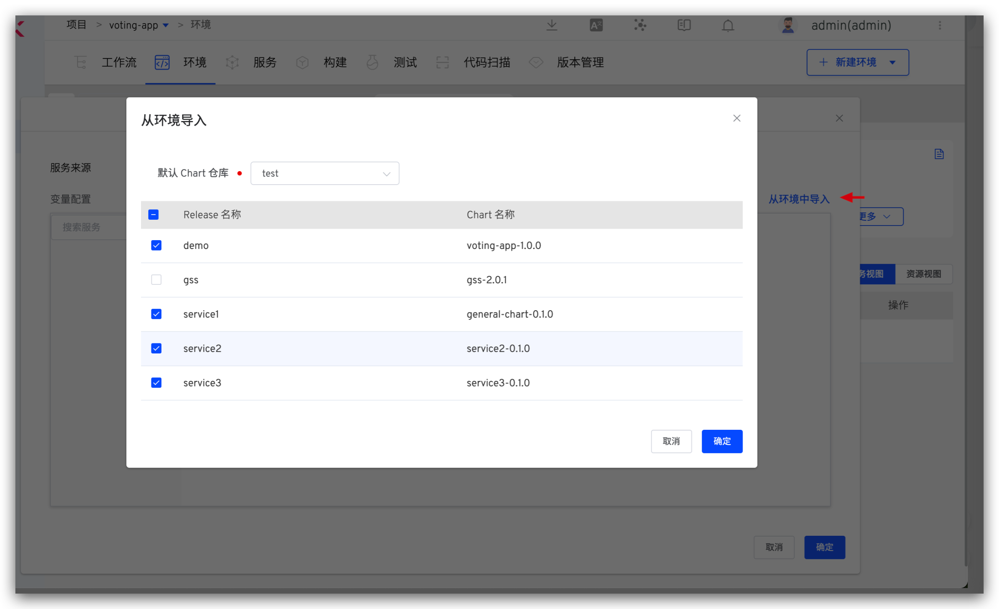
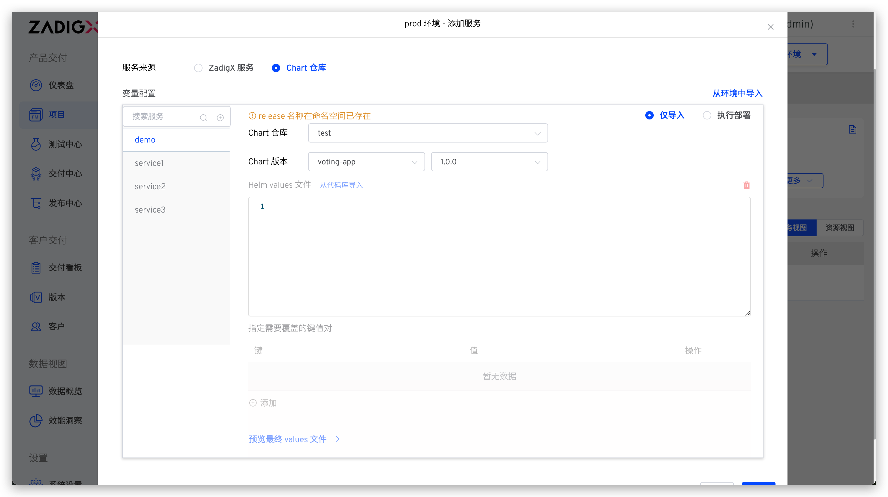
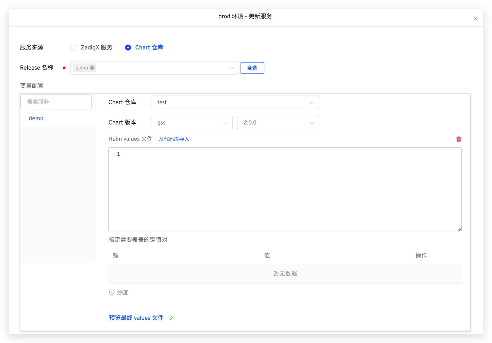

本文主要介绍 K8s Helm Chart 项目中的生产环境相关操作。

## 查看环境

环境创建完成后，点击不同的环境 Tab 即可切换到该环境的详情页面，生产环境右上角会有`生产`标识。更多信息请参考测试环境中的描述：[查看环境](/ZadigX%20dev/project/env/helm/chart/#查看环境)。

## 新建环境

参考：[新建环境](/ZadigX%20dev/project/prod/env/k8s/#新建环境)。

## 更新全局变量

对环境中的全局变量进行更新，具体操作参考测试环境中的描述：[更新全局变量](/ZadigX%20dev/project/env/helm/chart/#更新全局变量)。

## 管理服务

对环境中的服务进行管理，具体操作参考测试环境中的描述：[管理服务](/ZadigX%20dev/project/env/helm/chart/#管理服务)。

### 添加服务

将服务添加到环境中，支持 `ZadigX 服务` 和 `Chart 仓库` 两种服务来源。

**ZadigX 服务**

> 服务的配置在 ZadigX 中管理。

具体操作可参考文档 [添加 ZadigX 服务](/ZadigX%20dev/project/env/helm/chart/#添加服务)。

**Chart 仓库**

> 服务的配置在 Chart 仓库中管理。

服务来源选择 `Chart 仓库` > 点击添加按钮 > 输入服务 Release 名称 > 选择 Chart 仓库及版本，可按需修改 values 文件内容。

支持从已有的 Kubernetes 命名空间中批量导入服务：点击`从环境中导入` > 选择默认 Chart 仓库 > 选择 Release 后点击确定，可按需修改 Release 的 Chart 版本。

::: tip 使用前提
环境所在的命名空间中已存在 Release。
:::

在添加服务时，系统会自动检测命名空间中 Release 是否已存在，如果已存在，可选择仅导入服务，或者重新部署服务到环境中。

### 更新服务

按照不同的服务来源展开介绍。

**ZadigX 服务**

参考文档：[更新 ZadigX 服务](/ZadigX%20dev/project/env/helm/chart/#更新服务)。

**Chart 仓库**

服务来源选择 `Chart 仓库` > 选择 Release 名称 > 修改 Chart 仓库和版本信息 > 按需修改 values 内容即可。

### 删除服务

参考文档：[删除服务](/ZadigX%20dev/project/env/helm/chart/#删除服务)。

## 环境配置管理

对环境中的 Ingress、ConfigMap、Secret、PVC 配置进行管理，具体操作参考测试环境中的描述：[环境配置管理](/ZadigX%20dev/project/env/helm/chart/#环境配置管理)。

## 设置别名

参考：[设置别名](/ZadigX%20dev/project/prod/env/k8s/#设置别名)。

## 睡眠与唤醒

参考文档：[睡眠与唤醒](/ZadigX%20dev/project/env/k8s/#睡眠与唤醒)。

## 删除环境

点击`基本操作` -> `更多` -> `删除环境`按钮并输入环境名即可删除环境。

::: tip
1. 鉴于生产服务的严肃性，在 ZadigX 中删除生产环境只是将环境记录删除，Kubernetes 集群中相关服务资源并不会删除。
2. 如果需要删除集群中的资源，请在确保没有影响后手动操作。
:::
