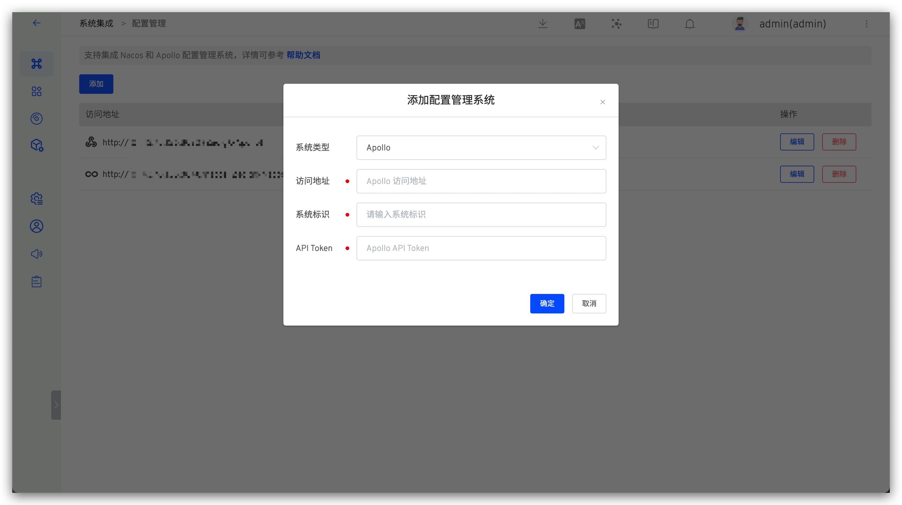

支持在 ZadigX 配置管理中集成 Apollo，实现高效稳定的管理工具接入。

## 添加账号
- 打开 Apollo，进入 `管理员工具` ->`用户管理`，填写信息，完成用户创建。

::: tip 注意事项
用户登录账户命名为 `zadig`。
:::

## 添加配置
- 进入 `管理员工具` ->`开放平台授权管理`，填写信息，完成第三方应用创建。

- 创建成功后复制下方的 Token。

- 在 ZadigX 中进入 `系统设置`-> `系统集成` -> `配置管理`，点击 `添加`，系统类型选择 `Apollo`，填入 `地址` 和 `Token`，系统会自动完成校验，点击确定即可完成添加。

