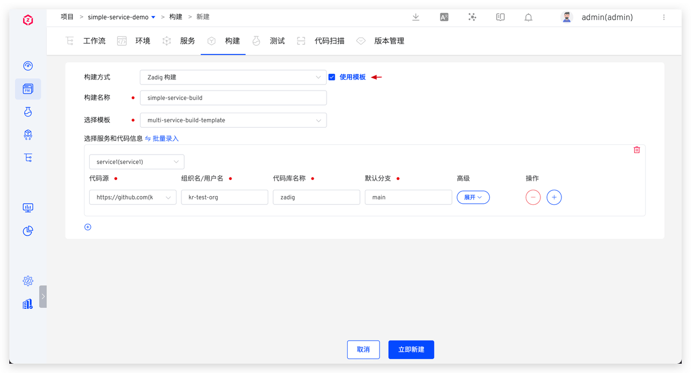
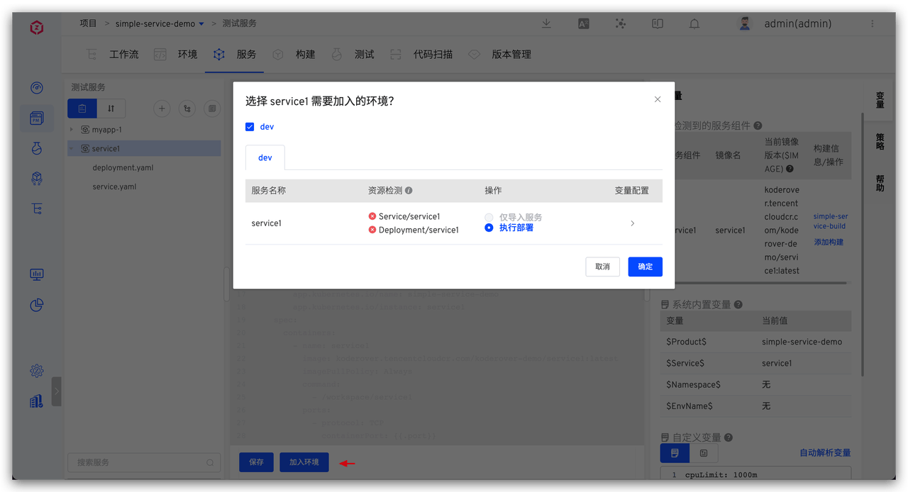
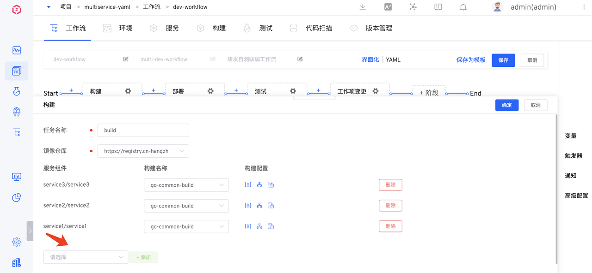
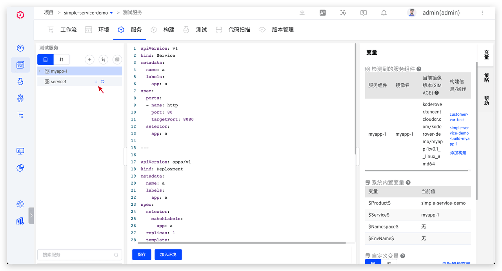
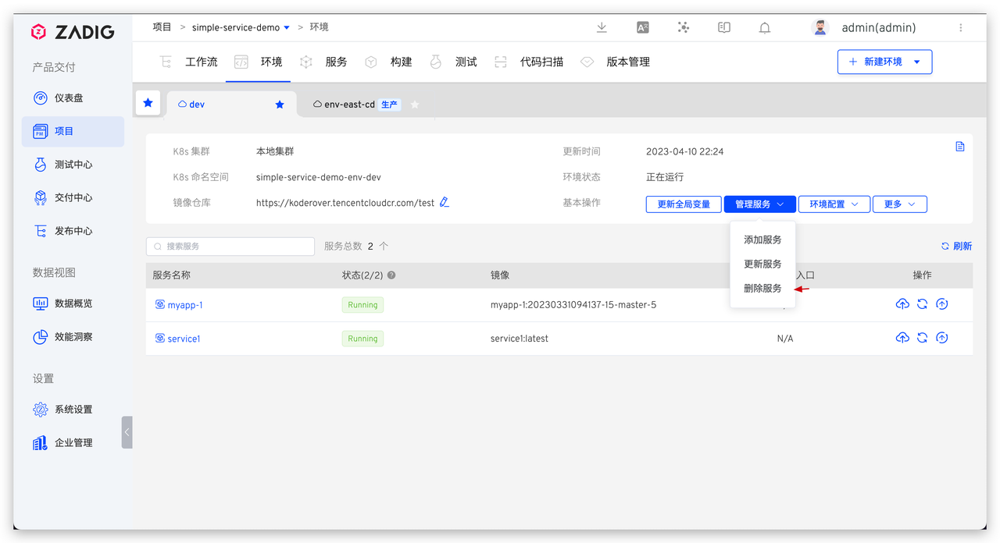
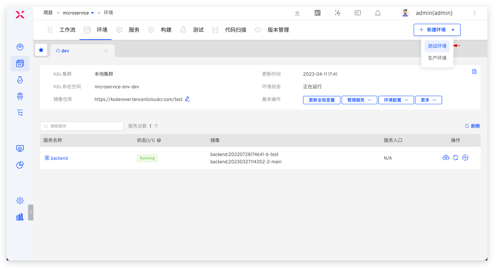
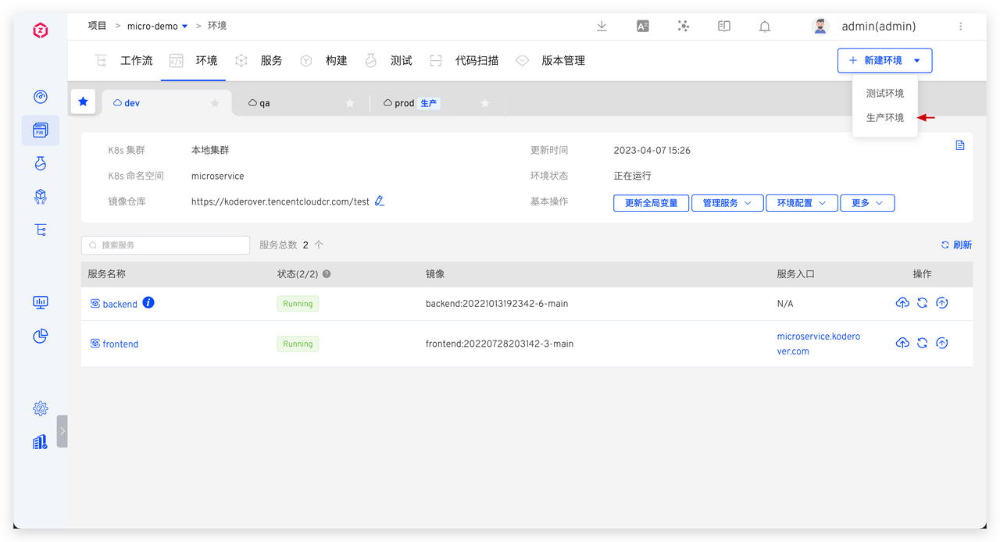
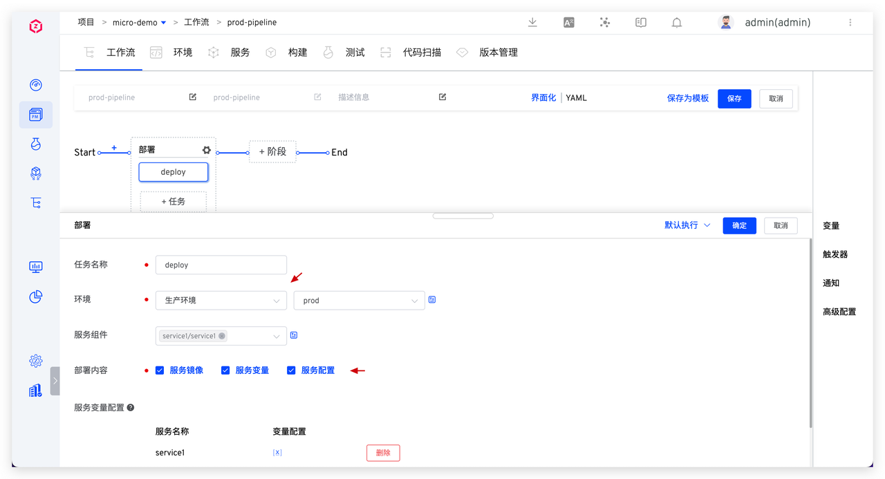

本手册主要涵盖日常高频使用场景，包括服务、环境、工作流。

## 服务及环境配置

### 上线测试服务

第 1 步：配置测试服务
1. 基于 K8s  YAML 模板，新建业务服务，参考文档：[服务](/ZadigX%20v1.4.0/project/service/k8s/#使用模板新建服务)。

2. 基于构建模板，为服务配置构建，参考文档：[构建](/ZadigX%20v1.4.0/project/build/#zadig-构建模板)。

::: tip 优化建议：
|    建议项   |                说明                           |                    参考文档              |
|:----------- | :-------------------------------------------- |:-----------------------------------------|
| 构建过程提速 | 1. 把常用构建的依赖工具打进去  2. 自定义缓存目录| 1. [自定义构建镜像](/ZadigX%20v1.4.0/settings/custom-image/)  2. [配置构建缓存](/ZadigX%20v1.4.0/project/build/#高级配置) |
| 减少维护负担 | 1. 多个服务构建相似，配置一份构建脚本，减少维护成本  2. 规范并统一服务构建物料的管理方式，减少维护和管理负担| 1. [共享构建脚本](/ZadigX%20v1.4.0/project/build/#ZadigX-共享构建)  2. [使用构建模板](/ZadigX%20v1.4.0/project/build/#zadig-构建模板) |
:::

第 2 步：添加到环境，参考文档：[K8s YAML 环境](/ZadigX%20v1.4.0/project/env/k8s/#基本操作)。

第 3 步：添加服务到对应工作流，在工作流中添加服务组件及其对应构建。

### 下线测试服务

1. 删除服务定义，参考文档：[删除服务](/ZadigX%20v1.4.0/project/service/k8s/#删除服务)。

2. 从环境中删除服务，参考文档：[K8s YAML 环境](/ZadigX%20v1.4.0/project/env/k8s/#删除服务)。

### 新建测试环境

进入项目 -> 环境 -> 新建环境 -> 测试环境，填写参数后新建。
- K8s YAML 项目，参考文档：[新建 K8s YAML 环境](/ZadigX%20v1.4.0/project/env/k8s/#创建环境)。
- K8s Helm Chart 项目，参考文档：[新建 Helm Chart 环境](/ZadigX%20v1.4.0/project/env/helm/chart/#创建环境)。

提供部分最佳实践供参考：
1. 使用一套服务配置创建多套测试环境 ，参考文档：[配置多套集成环境](/ZadigX%20v1.4.0/env/multi-env/)。
2. 不同环境使用不同结构的 deployment，可使用变量能力，参考文档：[K8s YAML 服务](/ZadigX%20v1.4.0/project/service/k8s/#变量配置)。
3. 不同业务线可以使用不同的 K8s 集群资源，新增集群配置参考：[集群管理](/ZadigX%20v1.4.0/pages/cluster_manage/)。
4. 环境配置管理，参考文档：[环境配置](/ZadigX%20v1.4.0/project/env/k8s/#环境配置)。

### 上线生产服务

第 1 步：配置生产服务，参考文档：[生产服务](/ZadigX%20v1.4.0/project/service/k8s/prod/#新建)。

第 2 步：配置生产环境，参考文档：[K8s YAML 生产环境](/ZadigX%20v1.4.0/project/env/release/)。

第 3 步：配置工作流，添加部署任务，参考文档：[工作流](/ZadigX%20v1.4.0/project/workflow-jobs/#部署任务)。

### 下线生产服务

鉴于生产服务的严肃性，下线操作有一定的风险，暂不支持在 ZadigX 平台中自动操作，请确认无误后手动操作下线。

### 新建生产环境

参考文档：[生产环境](/ZadigX%20v1.4.0/project/env/release/#创建环境)。

## 工作流配置

包括产品工作流、自定义工作流和发布工作流。
|    工作流类型   |                适用场景                        |                    参考文档                  |
|:------------- | :-------------------------------------------- |:--------------------------------------------|
| 产品工作流      | 按照顺序执行构建 -> 部署 -> 测试 -> 分发等全流程的自动化编排| [产品工作流](/ZadigX%20v1.4.0/project/workflow/)          |
| 自定义工作流    | 自由编排工作流流程，自定义执行步骤，开放性强          | [自定义工作流](/ZadigX%20v1.4.0/project/common-workflow/) |
| 发布工作流      | 自由编排发布流程，具备数据变更、配置变更、灰度发布等能力| [发布工作流](/ZadigX%20v1.4.0/project/release-workflow/) |

### 工作流触发器及 IM 通知配置

- 工作流配置 Webhook 触发：[工作流 Webhook](/ZadigX%20v1.4.0/project/workflow/#git-webhook)。
- sit 环境工作流配置定时任务：[工作流定时器](/ZadigX%20v1.4.0/project/workflow/#定时器)。
- 配置 IM 通知： [工作流飞书通知](/ZadigX%20v1.4.0/project/workflow/#飞书)。

### 自定义工作流服务能力编排

面向团队和项目的安全扫描、自动化测试等能力编排。
|    能力   |                功能描述                        |                    配置参考                 |
|:------------- | :-------------------------------------------- |:--------------------------------------------|
| 数据变更      | 对业务数据库的变更，编排到工作流中，实现数据变更的自动化| 1. [ZadigX + Mysql 代码、数据变更一站式编排，可靠丝滑交付](https://mp.weixin.qq.com/s/vKVPR6sn4lAifiOPZgvzNA) 2. [ZadigX + Flyway 工作流统一数据和代码变更，研发更丝滑](https://mp.weixin.qq.com/s/KFyKkYTQp58BpNn9HGA7AQ) 3. [ZadigX + Liquibase，数据变更、业务变更、数据回滚，一键搞定](https://mp.weixin.qq.com/s/ZnAJ_h_GXAABxzaD4kfTqg)         |
| 配置变更    | 针对业务配置（Apollo/Nacos）的变更，可编排到工作流中，实现业务配置变更的自动化      |[配置变更](/ZadigX%20v1.4.0/project/workflow-jobs/#apollo-配置变更) |
| JIRA 问题/飞书工作项状态变更      | 针对项目管理任务，可编排到工作流中，实现项目管理任务的关联和状态变更 | 1. [JIRA 问题状态变更](/ZadigX%20v1.4.0/project/workflow-jobs/#jira-问题状态变更) 2. [飞书工作项状态变更](/ZadigX%20v1.4.0/project/workflow-jobs/#飞书工作项状态变更)|
| 其他企业内部服务/系统      | 企业内部有相关的系统需要做自动化，编排在研发流程中，可以通过工作流自定义任务实现| [工作流任务](/ZadigX%20v1.4.0/settings/custom-task/#实现自定义任务)|
