## 软件交付面临的问题
系统的软件交付是个漫长且充满挑战的过程，离不开多方的努力和协作。和人、技术、流程、工具等关键要素都息息相关，企业在软件交付中遇到的问题包括但不限于：

1. 多人使用一套自测联调环境，环境经常不够用，研发过程受到影响，效率低。
2. 开发完成后才能部署测试环境进行集成验证，问题积重难返且修复代价大。
3. 大量手工测试且有效性低，测试环境不稳定，自动化测试难以开展，测试工程师价值难以体现。
4. 上线审批流程冗长，严重影响发布效率。
5. 运维工程师手工操作繁重，费时费力易出错，心智负担重。
6. 跨部门碎片化沟通严重，成本高。
7. ......

## 方案介绍
研发、测试、运维工程师基于 ZadigX 的协作可以实现代码到可部署物的最短路径，下图涵盖从需求到发布的全流程敏捷交付，我们将在[用户核心场景使用](#用户核心场景使用)中展开介绍如何使用。

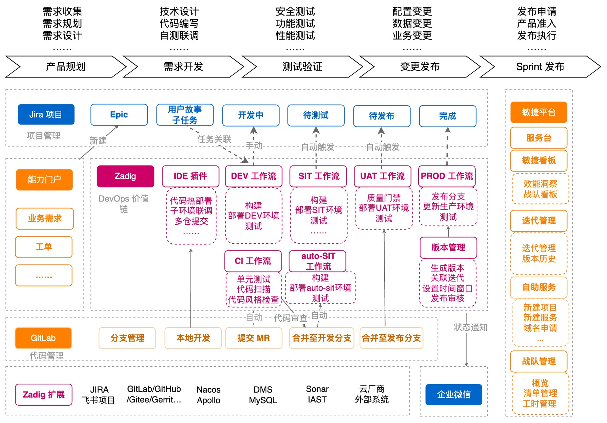

## 用户核心场景使用
以下面向不同的角色（运维工程师、开发工程师、测试工程师）展开介绍 ZadigX 的使用。

### 管理员(运维)准备
#### 工作流
<table>
	<tr>
		<th colspan="4"><b>面向角色的工作流介绍</b></th>
	</tr>
	<tr>
		<td><b>面向角色</b></td>
		<td><b>功能描述</b></td>
		<td><b>工作流名称样例</b></td>
		<td><b>具体配置</b></td>
	</tr>
	<tr>
		<td rowspan="2">开发工程师</td>
		<td>更新日常开发环境</td>
		<td>project-dev-workflow</td>
		<td>构建、部署、自动化测试</td>
	</tr>
	<tr>
		<td>更新开发环境业务配置</td>
		<td>project-dev-nacos-workflow</td>
		<td>Nacos 变更</td>
	</tr>
    <tr>
		<td rowspan="3">测试工程师</td>
		<td rowspan="2">更新集成测试环境</td>
		<td rowspan="2">project-sit-workflow</td>
		<td>构建、部署、自动化测试（上报 API 扫描结果）</td>
	</tr>
	<tr>
		<td>开启定时任务每日使用 develop 分支更新环境</td>
	</tr>
	<tr>
		<td>更新 sit 环境业务配置</td>
        <td>project-sit-nacos-workflow</td>
		<td>Nacos 变更</td>
	</tr>
    <tr>
		<td rowspan="2">发布工程师</td>
        <td>更新预发环境</td>
		<td>project-uat-workflow</td>
        <td>构建、Nacos 变更、部署 uat（变量变更、模板变更），自动化测试</td>
	</tr>
    <tr>
        <td>更新生产环境</td>
		<td>project-prod-workflow</td>
        <td>审批，Nacos 变更，部署生产环境（变量变更、模板变更）</td>
	</tr>
</table>

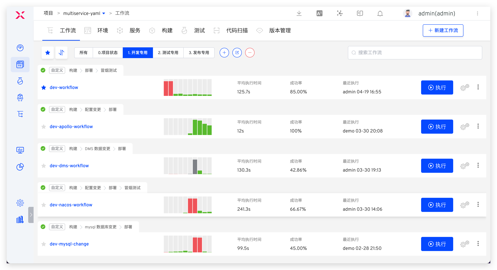

#### 环境

<table>
	<tr>
		<th colspan="4"><b>面向角色的环境介绍</b></th>
	</tr>
	<tr>
		<td><b>面向角色</b></td>
		<td><b>环境描述</b></td>
		<td><b>环境名称样例</b></td>
		<td><b>场景介绍</b></td>
	</tr>
	<tr>
		<td rowspan="2">开发工程师</td>
		<td rowspan="2">用于日常开发、联调</td>
		<td rowspan="2">dev</td>
		<td>如果 Java 栈实现灰度能力，可以通过新建环境随时拉起开发自测子环境</td>
	</tr>
    <tr>
		<td>如果采用 Istio + Skywalking 技术栈，通过 ZadigX 开启自测模式随时拉起子环境</td>
	</tr>
	<tr>
		<td rowspan="2">测试工程师</td>
		<td>用于测试、集成验证</td>
		<td>sit</td>
		<td>自主升级环境，选择一个或多个 PR/MR 进行功能需求的并行验证</td>
	</tr>
    <tr>
		<td>用于验收测试</td>
		<td>uat</td>
		<td>可以以此环境作为发布生产环境前的用户验收环节</td>
	</tr>
	<tr>
		<td>运维工程师</td>
		<td>用于生产查看</td>
		<td>prod</td>
		<td>生产环境管理，变更过程需经过严格审批</td>
	</tr>
</table>

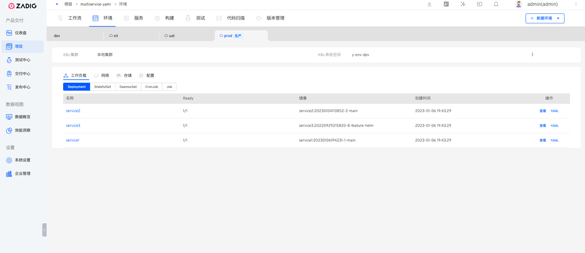

### 开发工程师

#### 更新服务镜像
1. 本地编写代码推送到远端分支。
2. Webhook 自动触发工作流执行，执行过程包括： dev 环境构建 + 部署 + smoke test + IM 通知。

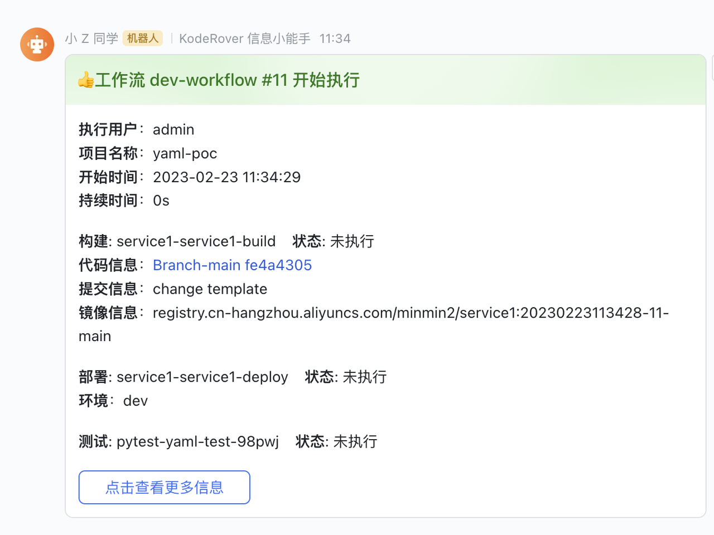

#### 更新服务业务配置
> 日常更新 dev/qa 环境 Nacos 配置

执行服务业务配置工作流。
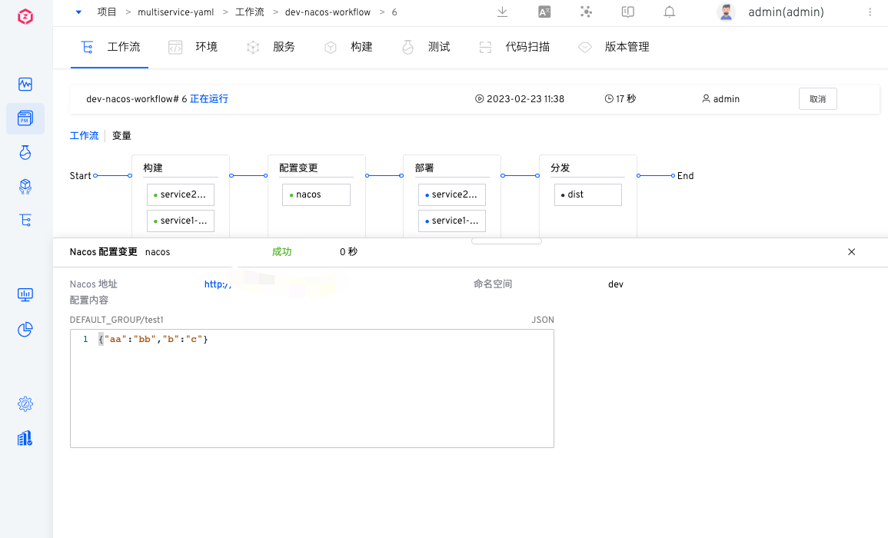

#### 更新数据
> 日常更新 dev/sit 环境数据

执行数据变更工作流。

#### 日常调试
1. 进入对应测试环境。
2. 查看服务状态。

3. 查看服务实时日志。

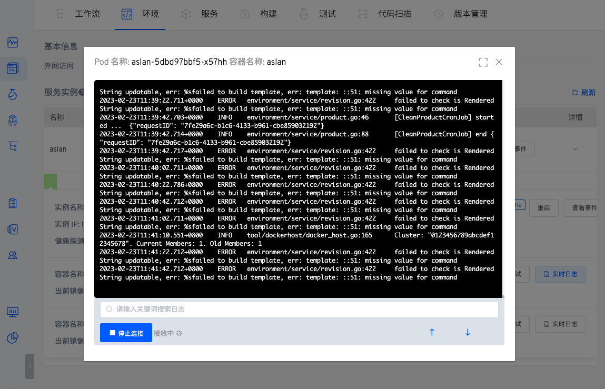

4. 进入容器调试。

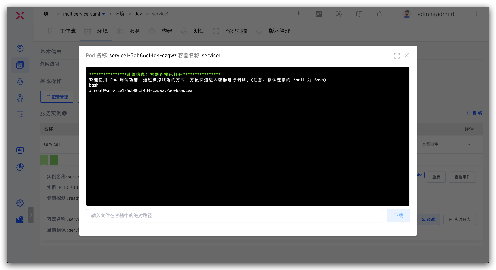

5. 临时替换镜像。

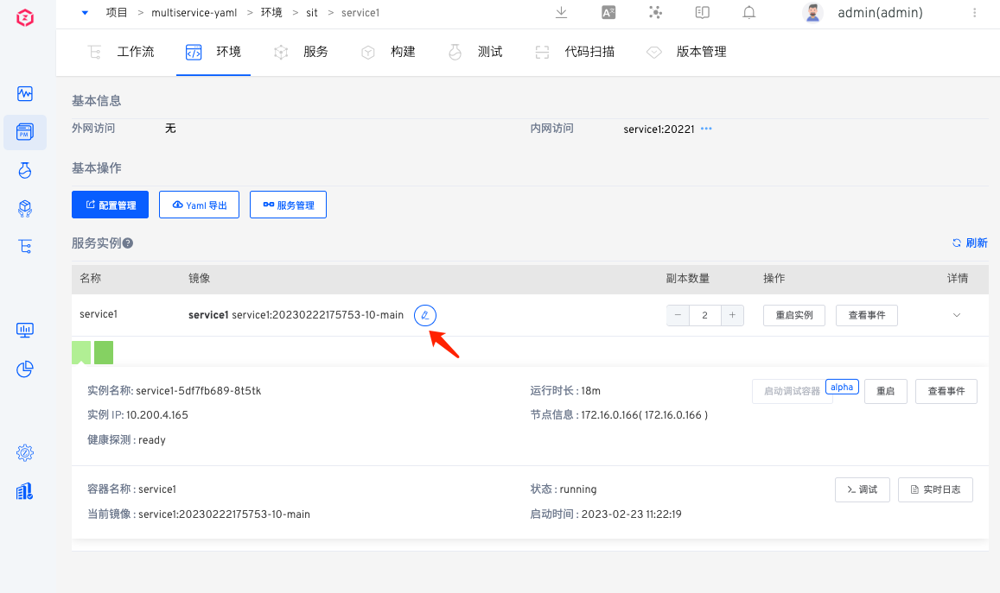

6. 调整副本数量/重启实例。

### 测试工程师
#### 管理测试脚本
挂接到研发测试工作流中。

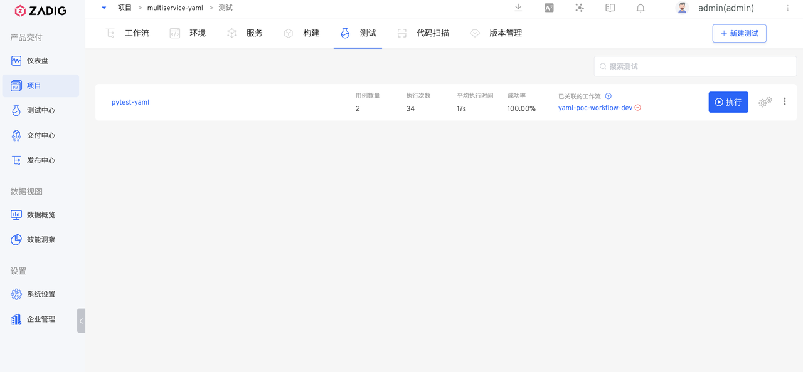

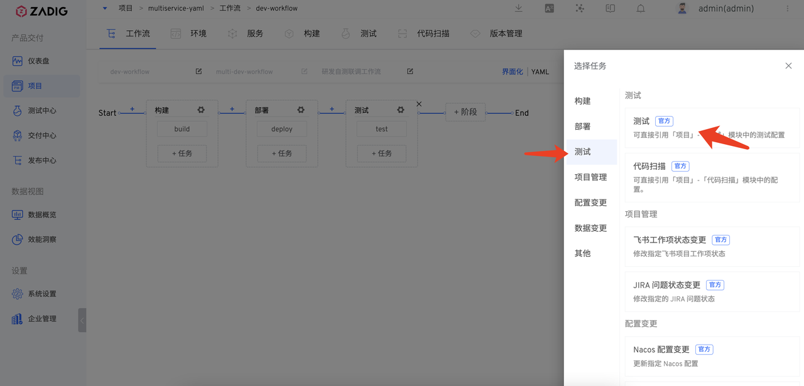

#### 测试验证
执行 sit 工作流更新环境。

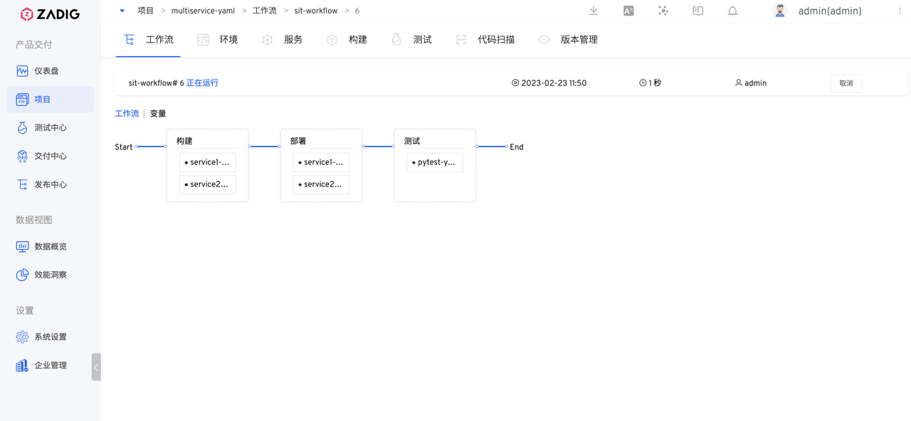

### 发布工程师
#### 更新预发环境
执行 uat 工作流更新预发环境做预发验证，包含构建 -> Nacos 变更 -> 部署 -> 测试。

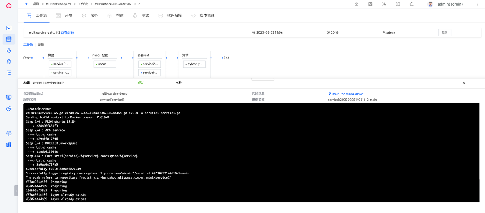

#### 更新生产环境
执行 prod 工作流更新生产环境，包含审批 ->  Nacos 变更 -> 部署。

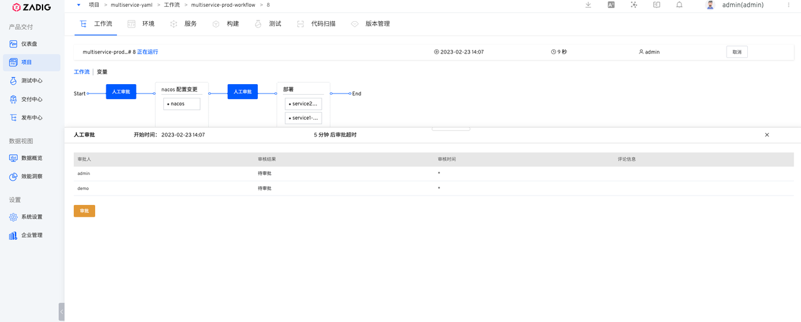

#### 线上数据库变更
执行 prod 数据库变更工作流。

### 项目/企业管理人员
企业项目整体运行状况。

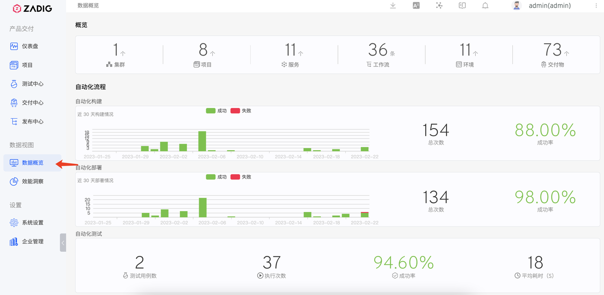

分析项目各个环境的变化过程及效能短板。

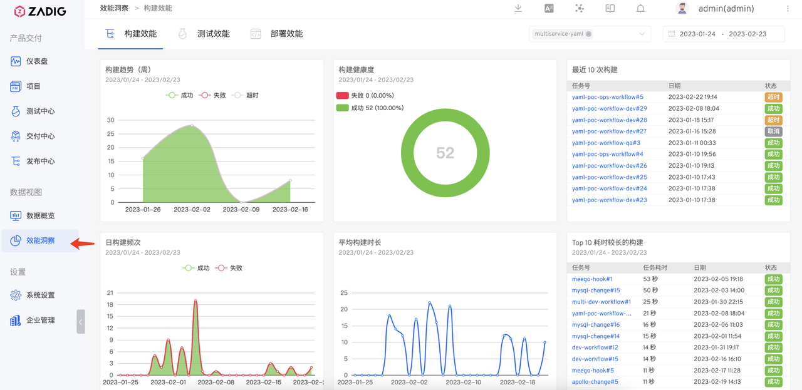

## 更多产品特性

### 面向开发者的云原生环境
一键拉起环境、一键复制环境、多环境/环境配置管理、服务编排、开发者共享环境 - 自测子环境。参考文档：

- [K8s YAML 环境](/ZadigX%20v1.4.0/project/env/k8s/)
- [K8s Helm Chart 环境](/ZadigX%20v1.4.0/project/env/helm/chart/)

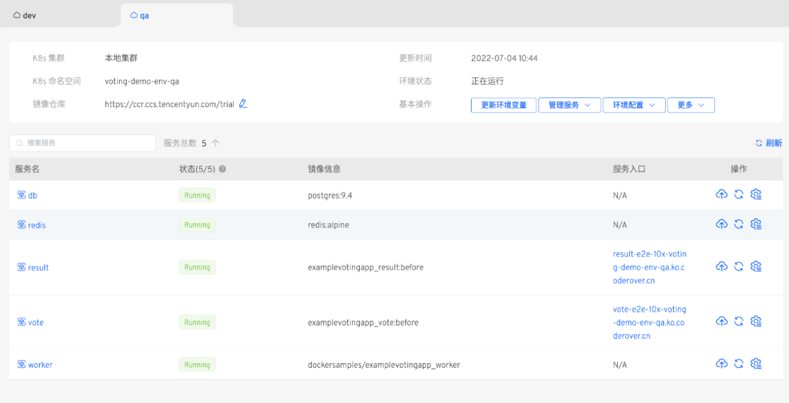

### 灵活易用的高并发工作流
自动生成面向开发、测试、运维角色的工作流；多个微服务并行构建、部署、测试，代码验证效率 UP；自定义工作流，灵活编排、自主开发和对接企业内部流程和系统。参考文档：[工作流](/ZadigX%20v1.4.0/project/workflow-overview/)。

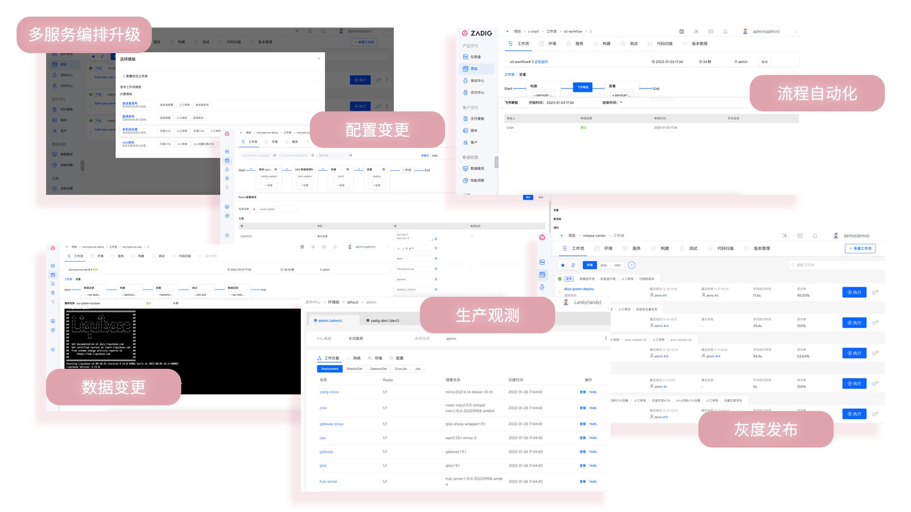

### 高效协同的测试管理
便捷对接 Jmeter、Pytest 等主流测试框架，跨项目管理和沉淀 UI、API、E2E 测试用例资产。通过工作流，向开发者提供前置测试验证能力。通过持续测试和质量分析，充分释放测试价值。参考文档：[测试](/ZadigX%20v1.4.0/project/test/)。

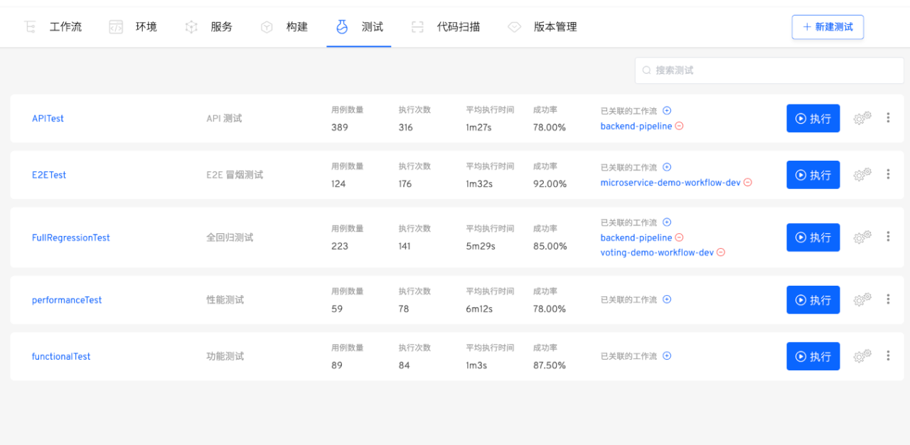

### 强大免运维的模版库
一套YAML/Chart 模板管理数百微服务；每个技术栈抽象一套构建模板；运维统一规范管理，开发自主使用；跨多项目复用模板。参考文档：

- [K8s YAML 模板](/ZadigX%20v1.4.0/template/k8s_yaml/)
- [K8s Helm Chart 模板](/ZadigX%20v1.4.0/template/helm_chart/)
- [Dockerfile 模板](/ZadigX%20v1.4.0/template/dockerfile/)
- [构建模板](/ZadigX%20v1.4.0/template/build/)
- [工作流模板](/ZadigX%20v1.4.0/template/workflow/)

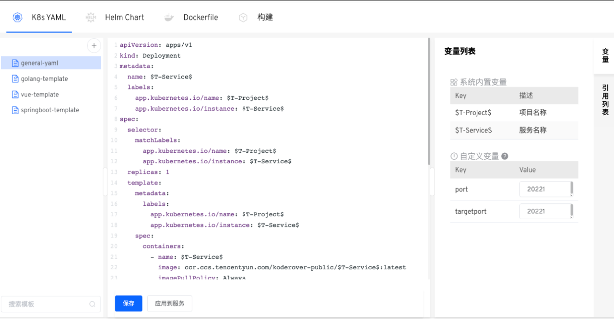

### 云原生 IDE 插件 (VSCode)
在 VScode IDE 中使用 Zadig 核心能力；无需打包镜像，即可一键热部署到自测环境；与 Zadig 基准环境交互，完成自测、联调验证。参考文档：[VSCode 插件使用指南](/ZadigX%20v1.4.0/zadig-toolkit/overview/)。

