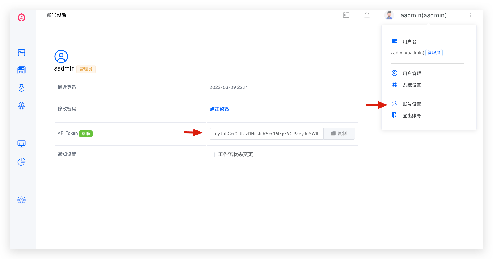

ZadigX 除了支持 Zadig 开发者 API 以外，还提供更多扩展 API 的支持，帮助开发者对接企业内部系统。如有更多需要，请[联系官方](https://www.koderover.com/contacts)以获取更多支持。

## API 概览
### 项目

| API 功能描述 | API 链接           |
|:--------|:-----------------------------|
| 创建项目 | [POST /openapi/projects/project](/ZadigX%20v1.4.0/api/project/#创建项目)  |

### 工作流

| API 功能描述 | API 链接           |
|:--------|:-----------------------------|
| 获取自定义工作流任务详情 | [GET /openapi/workflows/custom/task](/ZadigX%20v1.4.0/api/workflow/#获取自定义工作流任务详情) |
| 执行自定义工作流 | [POST /openapi/workflows/custom/task](/ZadigX%20v1.4.0/api/workflow/#执行自定义工作流) | 
| 取消自定义工作流任务 | [DELETE /openapi/workflows/custom/task](/ZadigX%20v1.4.0/api/workflow/#取消自定义工作流任务) | 
| 自定义工作流人工审批 | [POST /openapi/workflows/custom/task/approve](/ZadigX%20v1.4.0/api/workflow/#自定义工作流人工审批) | 
| 创建自定义工作流 | [POST /api/aslan/workflow/v4](/ZadigX%20v1.4.0/api/workflow/#创建自定义工作流) | 
| 创建工作流视图 | [POST /openapi/workflows/view](/ZadigX%20v1.4.0/api/workflow/#创建工作流视图) | 
| 获取产品工作流任务状态|[GET /api/directory/workflowTask](/ZadigX%20v1.4.0/api/workflow/#获取工作流任务状态)  | 
| 工作流任务重试 | [POST /api/directory/workflowTask/id/:id/pipelines/:pipelineName/restart](/ZadigX%20v1.4.0/api/workflow/#工作流任务重试) | 
| 取消产品工作流任务 | [POST /api/directory/workflowTask/id/:id/pipelines/:pipelineName/cancel](/ZadigX%20v1.4.0/api/workflow/#取消工作流任务) | 
| 执行产品工作流 | [POST /openapi/workflows/product/task](/ZadigX%20v1.4.0/api/workflow/#执行工作流) | 
| 获取产品工作流任务详情 | [GET /api/directory/workflowTask/id/:id/pipelines/:pipelineName](/ZadigX%20v1.4.0/api/workflow/#获取工作流任务详情) | 

### 自定义任务
支持自定义开发工作流任务，实现任何自定义功能，参考文档：[自定义任务](/ZadigX%20v1.4.0/settings/custom-task/)。

### 环境

| API 功能描述 | API 链接           |
|:--------|:-----------------------------|
| 调整服务实例副本数 | [POST /openapi/environments/scale](/ZadigX%20v1.4.0/api/env/#调整服务实例副本数)  |

### 服务

| API 功能描述 | API 链接           |
|:--------|:-----------------------------|
| 使用模板新建服务 | [POST /openapi/service/template/load/yaml](/ZadigX%20v1.4.0/api/service/#使用模板新建服务)  |
| 新建服务 | [POST /openapi/service/yaml/raw](/ZadigX%20v1.4.0/api/service/#新建服务)  |
| 删除服务 | [DELETE /openapi/service/yaml/:serviceName](/ZadigX%20v1.4.0/api/service/#删除服务)  |
| 获取服务的 YAML 内容 | [GET /openapi/service/yaml/:serviceName](/ZadigX%20v1.4.0/api/service/#获取服务的-yaml-内容)  |

### 构建

| API 功能描述 | API 链接           |
|:--------|:-----------------------------|
| 使用构建模板创建构建 | [POST /openapi/build](/ZadigX%20v1.4.0/api/build/#从模板创建构建)  |

### 代码扫描

| API 功能描述 | API 链接           |
|:--------|:-----------------------------|
| 创建代码扫描 | [POST /openapi/quality/codescan](/ZadigX%20v1.4.0/api/scan/#创建代码扫描)  |

### 交付中心

| API 功能描述 | API 链接           |
|:--------|:-----------------------------|
| 获取版本列表 | [GET /api/aslan/delivery/releases](/ZadigX%20v1.4.0/api/delivery-center/#获取交付中心版本列表)  |
| 获取交付物追踪信息 | [GET /api/directory/dc/artifact](/ZadigX%20v1.4.0/api/delivery-center/#获取交付物追踪信息)  |

### 效能洞察

| API 功能描述| API 链接          |
|:--------|:-----------------------------|
| 数据概览| [GET /openapi/statistics/overview](/ZadigX%20v1.4.0/api/insight/#数据概览) |
| 构建数据统计| [GET /openapi/statistics/build](/ZadigX%20v1.4.0/api/insight/#构建数据统计) |
| 部署数据统计| [GET /openapi/statistics/deploy](/ZadigX%20v1.4.0/api/insight/#部署数据统计) |
| 测试数据统计| [GET /openapi/statistics/test](/ZadigX%20v1.4.0/api/insight/#测试数据统计) |
| 生产环境发布数据统计| [GET /openapi/statistics/v2/release](/ZadigX%20v1.4.0/api/insight/#生产环境发布数据统计) |

### 镜像仓库

| API 功能描述 | API 链接           |
|:--------|:-----------------------------|
| 集成镜像仓库 | [POST /openapi/system/registry](/ZadigX%20v1.4.0/api/registry/#集成镜像仓库)  |

## API 调用方式

**第一步：获取 API Token**

点击右上角用户，在菜单中选择 `账号设置`，复制 API Token。



**第二步：调用 API**

在请求的 HTTP Header 中，加入指定的 Authorization 信息，即可在 HTTP Client 中调用 ZadigX API，示例如下：

> 提示：示例中的 `yours.zadig.com` 是 ZadigX 系统访问地址，请求前请视实际情况替换。

``` bash
curl -H 'Authorization: Bearer your-token' http://yours.zadig.com/api/aslan/system/notification/subscribe
```
