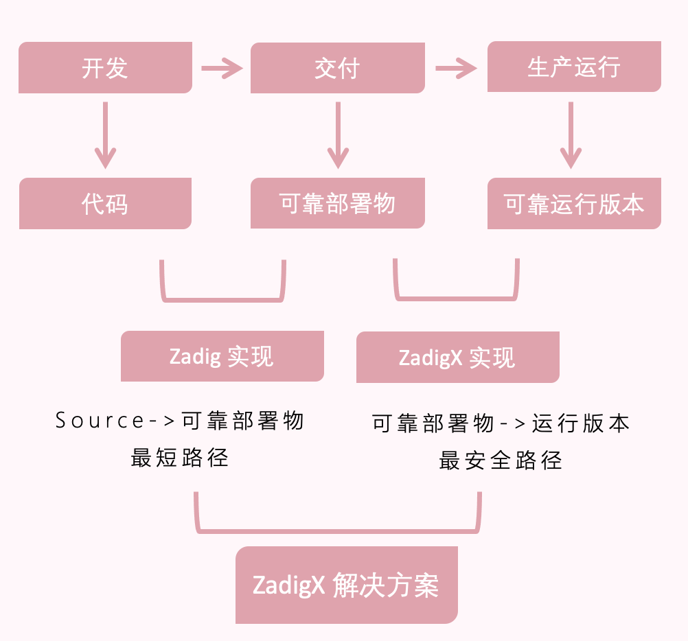
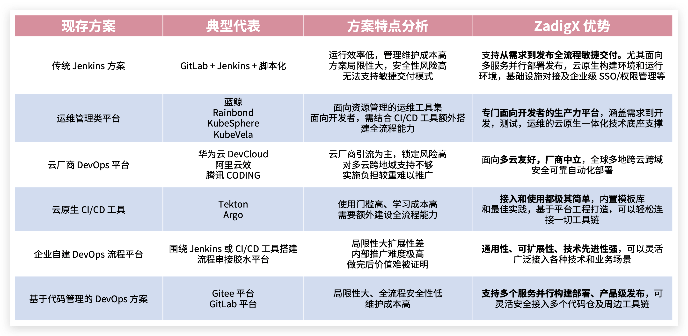
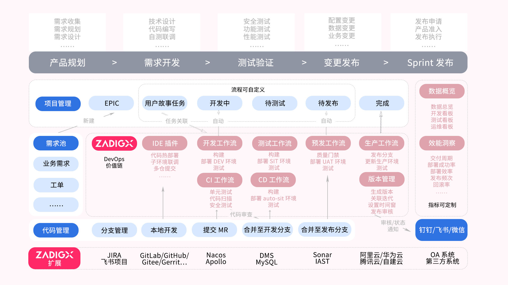
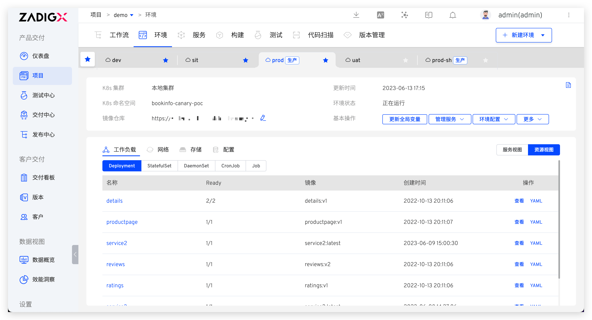
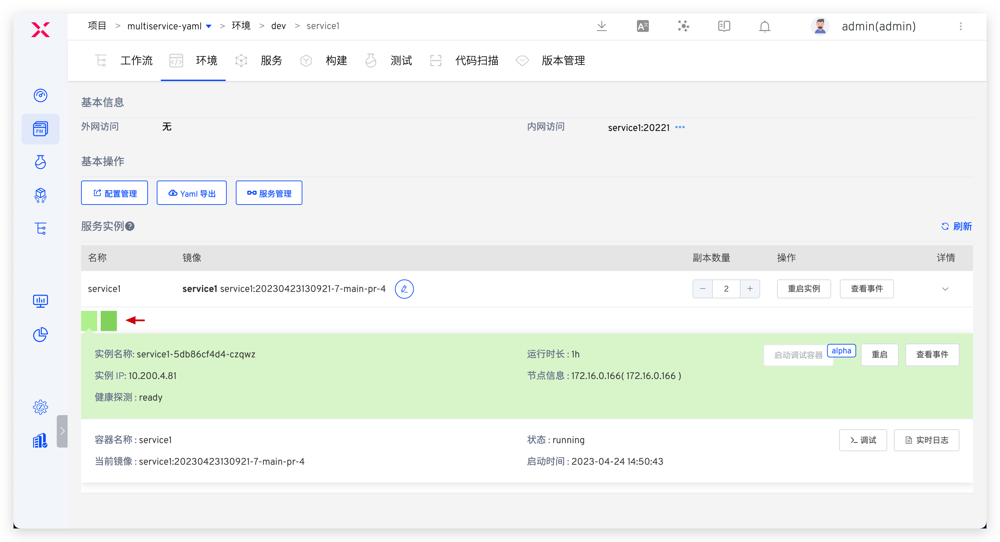
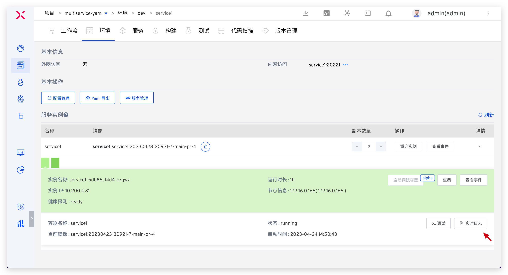
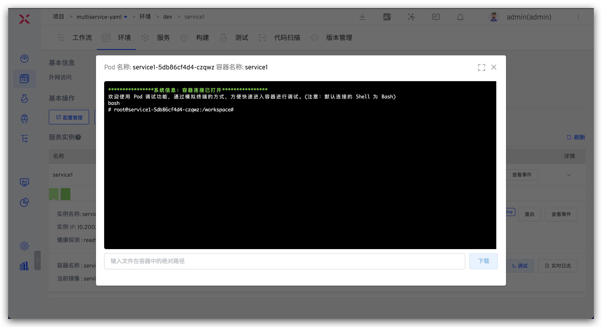
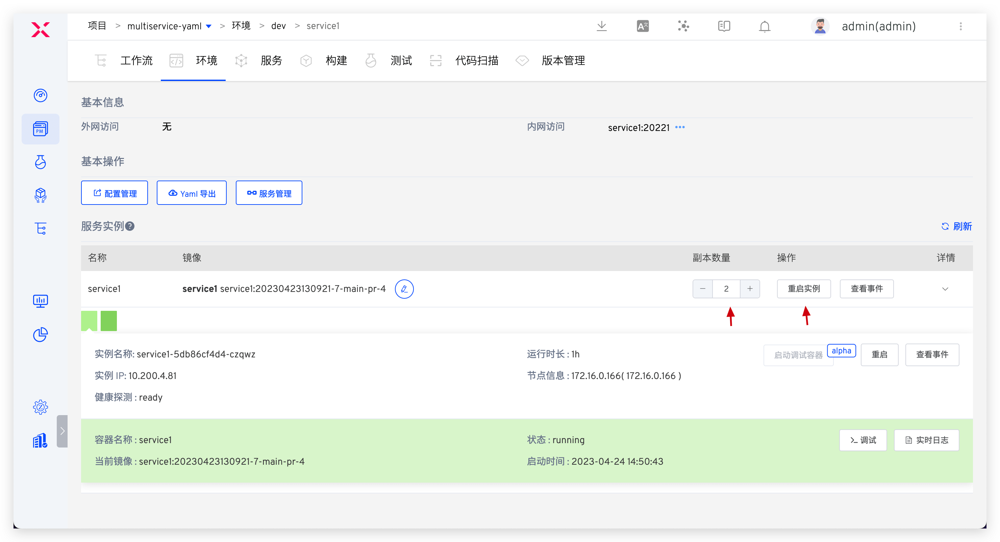
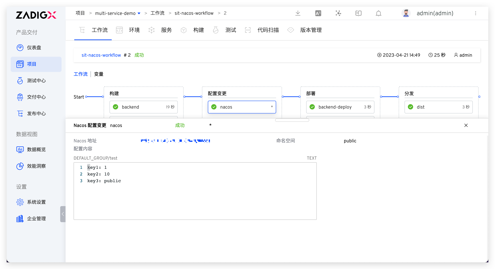
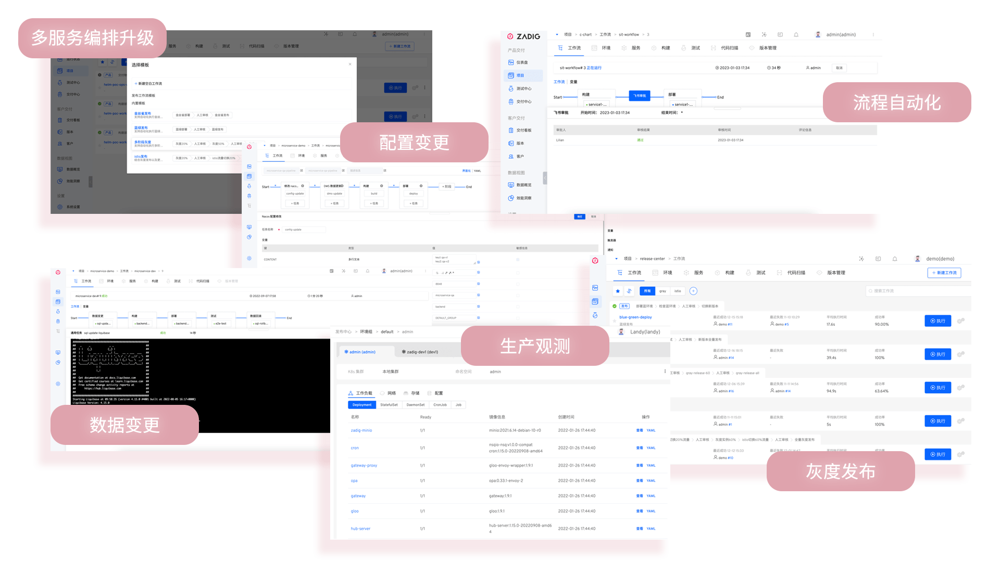

## 软件交付面临的问题

软件交付是复杂且具有挑战性的过程，涉及到人员、技术、流程和工具等要素。在这个过程中，企业常常遇到以下问题：
- 开发环境模拟困难，多业务联调困难，研发效率低下。
- 大量手工测试效率低，环境不稳定，自动化建设困难。
- 运维负担重，手工操作繁重，交付效率低。
- 跨部门沟通困难，流程制定耗时，各方面临能力限制。

为了解决这些问题，ZadigX 应运而生。它通过平台工程和技术升级提升组织效能，建立全流程一体化工程协同基线，释放团队生产力。ZadigX 旨在帮助企业更高效地进行软件交付，解决流程挑战，提升组织效能。

## 与开源 Zadig 有什么不同

Zadig 是一款开源 CI/CD 产品，ZadigX 则是一款面向企业级场景的云原生 DevOps 价值链平台。在能力上，Zadig 提供的是代码到可靠部署物的最佳路径，而 ZadigX 在此基础上额外提供了可靠部署物到稳定运行时的最安全路径。

在功能层面上，ZadigX 包含开源 Zadig 的一切，额外支持发布管理能力，编排组织、流程、内外部系统，管理代码、配置、数据变更流程，支持灰度组合策略。用一个简单的公式可以表示为：

<strong>`ZadigX = Zadig ➕ 发布上线管理 ➕ 集成企业现有的工具（项目管理、配置管理、代码管理、商用系统、自建系统、OpenAPI...)`</strong>

更多比对可点击[链接](https://www.koderover.com/zadigx)查看。

## 与传统 DevOps 方案比对

现存做法大多以「单点工具 + 写脚本」或运管类平台为主，ZadigX 则是面向开发者视角，中立，云原生一体化价值链平台。

## ZadigX 产研敏捷协同方案介绍

ZadigX 提供工程底座，产研团队可统一协作实现敏捷交付，完成需求从开发到测试到发布的全生命周期。并且支持自定义流程，扩展工具，编排测试服务、IT 服务、安全服务等能力，通过 ZadigX 自动化可以自动化的一切，让工程师专注在创造上。

## 核心场景使用介绍

开发、测试、运维工程师基于 ZadigX 统一协作平面，使用自动化工作流和云原生环境进行交付。此外，业务负责人/企业管理人员可以在效能看板中分析项目整体运行情况，分析项目各个过程中的效能短板。以下面向不同角色展开介绍。

### 管理员(运维)准备
#### 工作流
<table>
	<tr>
		<th colspan="4"><b>面向角色的工作流介绍</b></th>
	</tr>
	<tr>
		<td><b>面向角色</b></td>
		<td><b>功能描述</b></td>
		<td><b>工作流名称样例</b></td>
		<td><b>具体配置</b></td>
	</tr>
	<tr>
		<td rowspan="3">开发工程师</td>
		<td>更新日常开发环境</td>
		<td>dev-workflow</td>
		<td>构建、部署、自动化测试</td>
	</tr>
	<tr>
		<td>更新开发环境业务配置</td>
		<td>dev-nacos-workflow</td>
		<td>构建，Nacos 变更，部署（dev 环境），分发</td>
	</tr>
	<tr>
		<td>更新开发环境数据</td>
		<td>mysql-change</td>
		<td>mysql 数据库变更，构建，部署</td>
	</tr>
    <tr>
		<td rowspan="3">测试工程师</td>
		<td rowspan="2">更新集成测试环境</td>
		<td rowspan="2">sit-workflow</td>
		<td>构建、部署、自动化测试（上报 API 扫描结果）</td>
	</tr>
	<tr>
		<td>开启定时任务每日使用 develop 分支更新环境</td>
	</tr>
	<tr>
		<td>更新 sit 环境业务配置</td>
        <td>sit-nacos-workflow</td>
		<td>构建，Nacos 变更，部署（sit 环境），分发</td>
	</tr>
    <tr>
		<td rowspan="3">发布工程师</td>
        <td>更新预发环境</td>
		<td>uat-workflow</td>
        <td>构建、Nacos 变更、部署 uat（变量变更、模板变更），自动化测试</td>
	</tr>
    <tr>
        <td>更新生产环境</td>
		<td>prod-workflow</td>
        <td>审批，Nacos 变更，部署生产环境（变量变更、模板变更）</td>
	</tr>
    <tr>
        <td>更新生产环境数据</td>
		<td>prod-mysql-change</td>
        <td>审批，mysql 数据库变更</td>
	</tr>
</table>

#### 环境

<table>
	<tr>
		<th colspan="4"><b>面向角色的环境介绍</b></th>
	</tr>
	<tr>
		<td><b>面向角色</b></td>
		<td><b>环境描述</b></td>
		<td><b>环境名称样例</b></td>
		<td><b>场景介绍</b></td>
	</tr>
	<tr>
		<td rowspan="2">开发工程师</td>
		<td rowspan="2">用于日常开发、联调</td>
		<td rowspan="2">dev</td>
		<td>如果 Java 栈实现灰度能力，可以通过新建环境随时拉起开发自测子环境</td>
	</tr>
    <tr>
		<td>如果采用 Istio + Skywalking 技术栈，通过 ZadigX 开启自测模式随时拉起子环境</td>
	</tr>
	<tr>
		<td rowspan="2">测试工程师</td>
		<td>用于测试、集成验证</td>
		<td>sit</td>
		<td>自主升级环境，选择一个或多个 PR/MR 进行功能需求的并行验证</td>
	</tr>
    <tr>
		<td>用于验收测试</td>
		<td>uat</td>
		<td>可以以此环境作为发布生产环境前的用户验收环节</td>
	</tr>
	<tr>
		<td>运维工程师</td>
		<td>用于生产查看</td>
		<td>prod</td>
		<td>生产环境管理，变更过程需经过严格审批</td>
	</tr>
</table>

### 开发工程师

#### 更新服务镜像
1. 本地编写代码推送到远端分支。
2. Webhook 自动触发工作流执行，执行过程包括： dev 环境构建 + 部署 + smoke test + IM 通知。

#### 更新服务业务配置
> 日常更新 dev/qa 环境 Nacos 配置

执行服务业务配置工作流。

#### 更新数据
> 适用场景：改动涉及到数据变更（比如表结构变更、表字段变更...）

执行数据变更工作流。

#### 日常调试
1. 进入对应测试环境。
2. 查看服务状态。

3. 查看服务实时日志。

4. 进入容器调试。

5. 临时替换镜像。

6. 调整副本数量/重启实例。

### 测试工程师
#### 管理测试脚本
挂接到研发测试工作流中。

#### 测试验证
执行 sit 工作流更新环境。

#### 配置变更
执行服务业务配置变更工作流。

### 发布工程师
#### 更新预发环境
执行 uat 工作流更新预发环境做预发验证，包含构建 -> Nacos 变更 -> 部署 -> 测试。

#### 更新生产环境
执行 prod 工作流更新生产环境，包含审批 ->  Nacos 变更 -> 部署。

#### 线上数据库变更
执行 prod 数据库变更工作流。

### 业务负责人/企业管理人员
查看企业项目整体运行状况。

分析项目各个环境的变化过程及效能短板。

## 更多产品特性

### 开源 Zadig 的一切

云原生 CI/CD、产研高效工程化协作、快速应对业务迭代。

参考文档：

- [Zadig 最佳实践](https://mp.weixin.qq.com/mp/appmsgalbum?action=getalbum&__biz=Mzg4NDY0NTMyNw==&scene=1&album_id=2315406414233927682&count=3#wechat_redirect)
- [Zadig 企业案例](https://mp.weixin.qq.com/mp/appmsgalbum?action=getalbum&__biz=Mzg4NDY0NTMyNw==&scene=1&album_id=2408445357925269505&count=3#wechat_redirect)

### 发布中心

可灵活编排多种发布策略，支持蓝绿、金丝雀、分批次灰度、Istio 等发布策略，以及 APISIX + MSE 等灰度发布方案。配合人工审批可以打通组织、流程、内外系统，实现一键自动化、安全可靠发布。

参考文档：

- [ZadigX 发布工作流](/ZadigX%20v1.5.0/project/release-workflow/)
- [ZadigX 工作流审批](/ZadigX%20v1.5.0/project/workflow-approval/)

### 客户交付

面向大客户全天候响应、全地域升级部署，提供自运维和专用服务通道，实现稳定高效交付和服务保障。

参考文档：

- [客户交付](/ZadigX%20v1.5.0/plutus/overview/)

