## 简介

本文主要介绍自定义工作流的触发器功能，包括：
- Git 触发器：代码变更后自动触发工作流
- Jira 触发器：Jira Issue 变更后自动触发工作流
- 飞书触发器：飞书工作项状态变更后自动触发工作流
- 定时器：定时触发工作流
- 通用触发器：任意第三方系统通过 Webhook 触发工作流

## Git 触发器
> 为工作流配置 Webhook 触发器，当满足触发条件的事件发生时会自动触发工作流执行，暂不支持通过 SSH 协议或 AccessToken 方式接入的代码源。

点击右侧的 `触发器` -> 选择 `Git 触发器`即可配置，实现代码变更自动触发工作流。

参数说明：
- `工作流执行变量`：希望被 Webhook 触发执行的任务，以及任务中的具体配置
- 其他参数：请参考 [触发器基本配置](/ZadigX%20v1.5.0/project/workflow/#gui-方式) 中的描述

## JIRA 触发器 
点击右侧的 `触发器` -> 选择 `JIRA 触发器` 即可配置实现 JIRA 状态变更自动触发工作流。

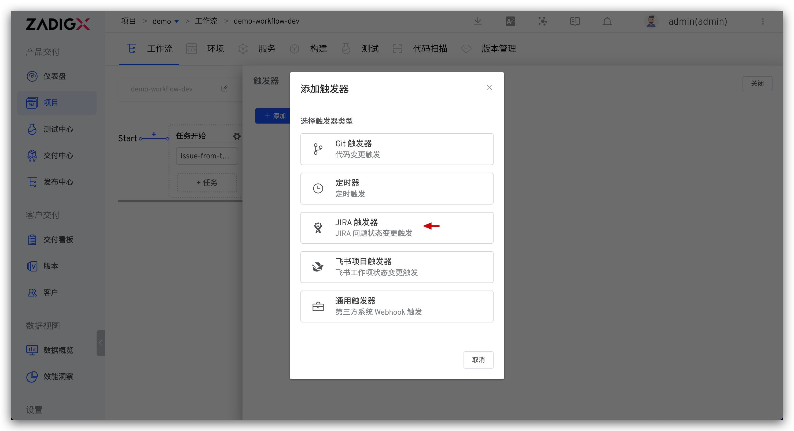

参数说明：
- `工作流执行变量`：希望被 Webhook 触发执行的任务，以及任务中的具体配置
- 其他参数：请参考 [触发器基本配置](/ZadigX%20v1.5.0/project/workflow/#gui-方式) 中的描述

在 JIRA 中完成 Webhook 配置

在右上角点击 `设置` 图标，点击 `System`

在左侧 `ADVANCED` 下找到 `Webhook`

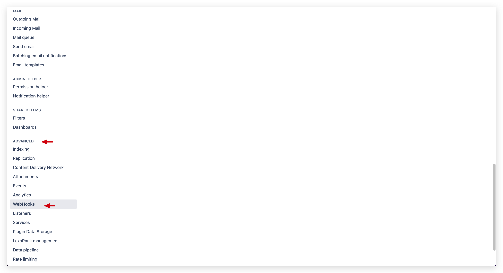

点击 `+ Create a Webhook`

复制触发器的 Webhook 地址，将其填入 URL 输入框内

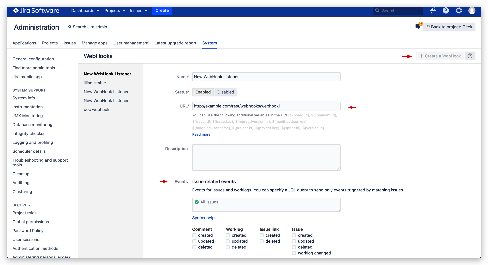

触发器执行成功后，将会添加 Comment 到对应的 Issue

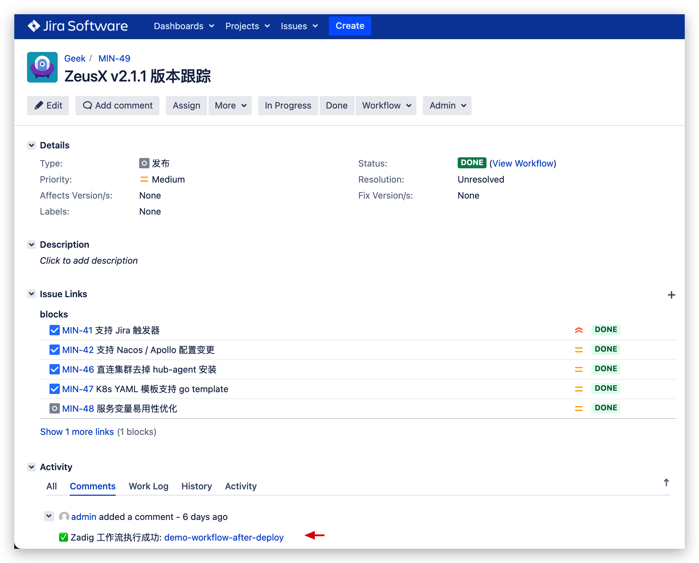

::: tip 提示
配置 Webhook 的时不能同时配置 Issue updated 事件
:::

## 飞书触发器 
点击右侧的 `触发器` -> 选择 `飞书触发器` 即可配置实现 飞书 状态变更自动触发工作流。

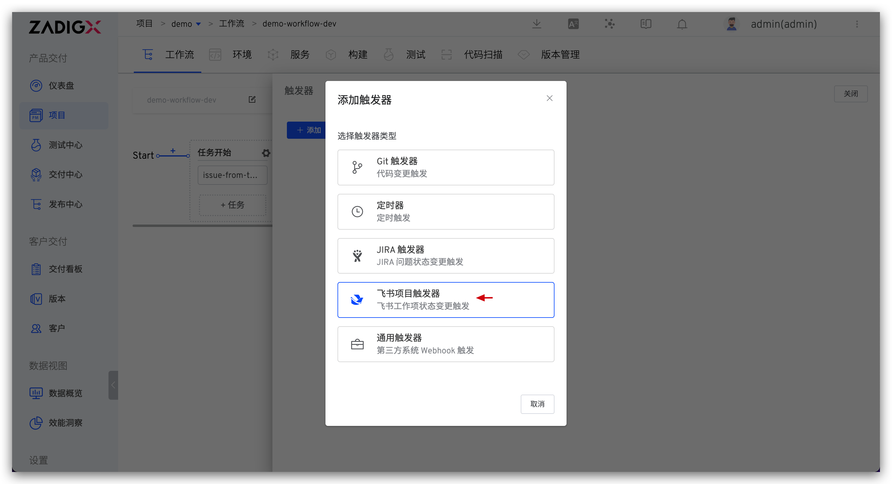
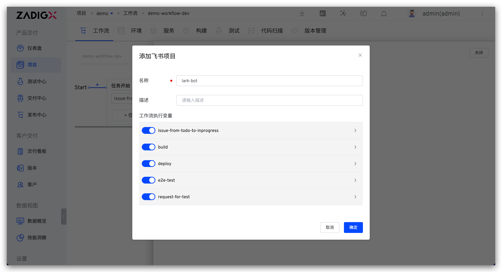

参数说明：
- `工作流执行变量`：希望被 Webhook 触发执行的任务，以及任务中的具体配置
- 其他参数：请参考 [触发器基本配置](/ZadigX%20v1.5.0/project/workflow/#gui-方式) 中的描述

在飞书项目中完成 Webhook 配置

点击 `空间配置` -> `自动化` -> `新建规则`，进入规则创建。

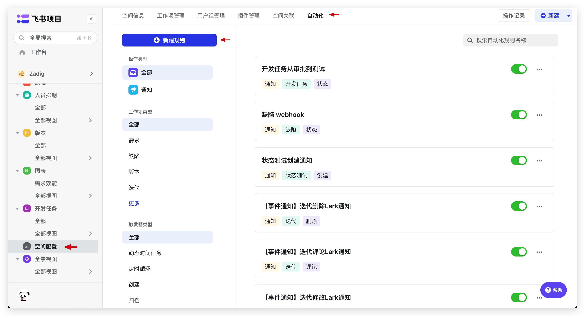

根据需要选择规则，并在操作中将 `操作类型`，设为 Webhook 并复制触发器的 Webhook 地址，将其填入 URL 输入框内。

触发器执行成功后，将会添加 Comment 到对应的 Issue。

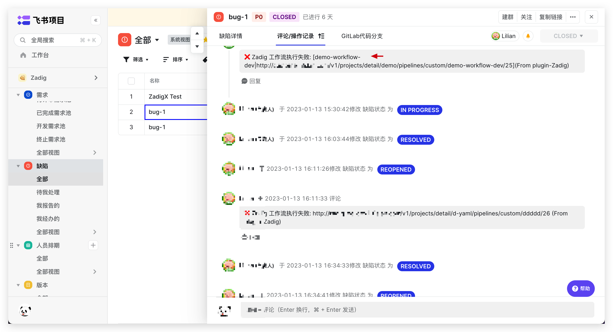

## 定时器
点击右侧的 `触发器` -> 选择 `定时器`。

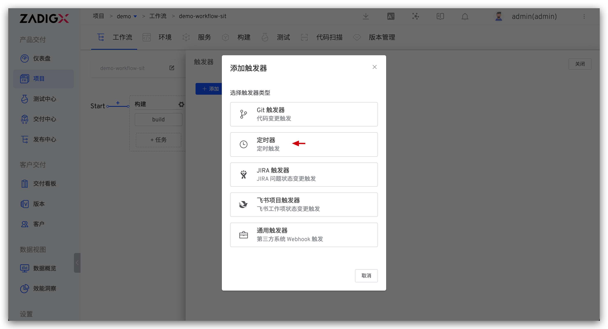

触发方式以及时间配置可参考 [定时器配置](/ZadigX%20v1.5.0/project/workflow/#定时器)，在工作流执行变量中可设置定时运行的任务以及任务中的变量配置。

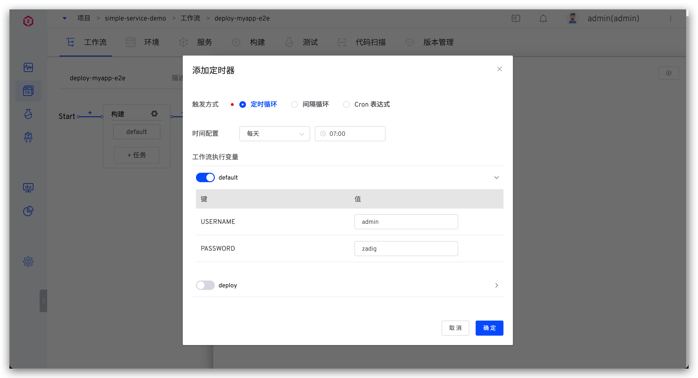

## 通用触发器
点击右侧的 `触发器` -> 选择 `通用触发器` 即可配置实现第三方 Webhook 触发工作流。

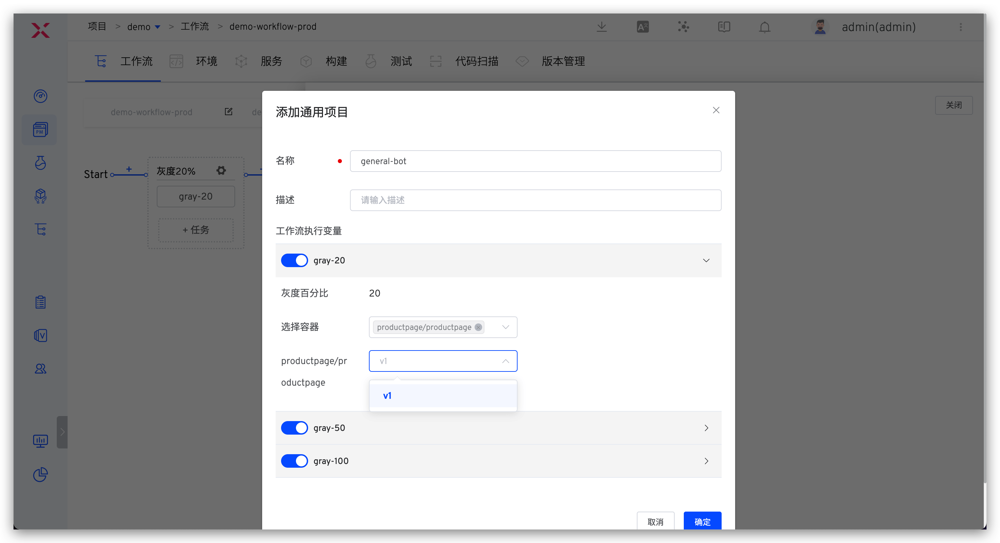

参数说明：
- `工作流执行变量`：希望被 Webhook 触发执行的任务，以及任务中的具体配置
- 其他参数：请参考 [触发器基本配置](/ZadigX%20v1.5.0/project/workflow/#gui-方式) 中的描述在第三方系统中完成 Webhook 配置。

复制 Webhook Url，在第三方系统中完成添加。

