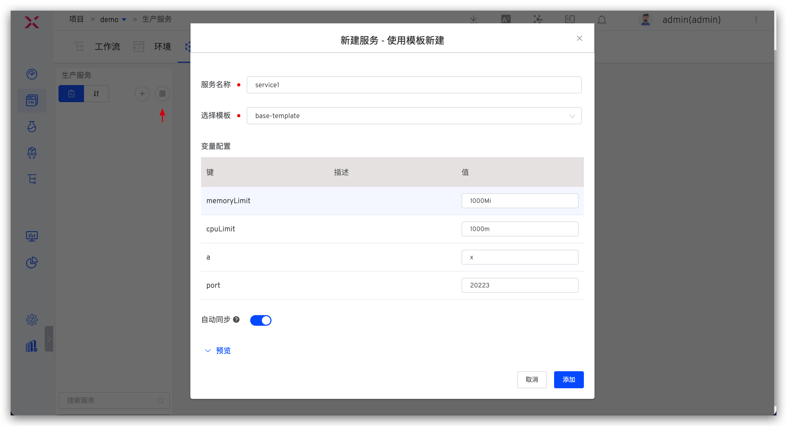

> K8s YAML 生产服务为功能。

## 新建

进入 K8s YAML 项目，点击 `服务` - `生产服务`，进入服务管理页面。

### 手动输入

点击`手动输入`按钮，输入服务配置后保存即可新建服务。

### 使用模板新建服务

点击新建按钮 -> 选择`使用模板新建` -> 填写服务名称，选择模板后填写相关变量配置 -> 点击添加即可。

- 变量配置可使用模板中的默认值，也可以在新建时重新赋值
- 开启`自动同步`后，当在模板库中对使用的模板操作`应用到服务`时，该服务配置将自动基于模板内容同步

## 服务组件

可参考[核心概念](/ZadigX%20v1.5.0/quick-start/concepts/#服务组件)了解更多信息，此处相关字段说明如下：

- `服务组件`：YAML 配置文件中 container 的名称。
- `镜像名`：系统会按照`仓库地址/命名空间/镜像名:标签名`规则来解析 YAML 配置文件中的 image，标签名前即为镜像名。
- `当前镜像版本`：YAML 配置文件中，container 的 `image` 信息

## 服务编排

参考 [服务编排](/ZadigX%20v1.5.0/project/service/k8s/#服务编排)。

## 变量配置

包括系统内置变量和自定义变量，可在服务 YAML 中进行引用，其中容器名称和镜像信息中只能使用内置变量 `$Product$` 和 `$Service$`。

### 系统内置变量

参考 [变量配置](/ZadigX%20v1.5.0/project/service/k8s/#系统内置变量)。

### 自定义变量

在服务的 YAML 配置文件中通过 `{{.Key}}`  的形式来定义使用，点击`自动解析变量`后，可对其赋值。

