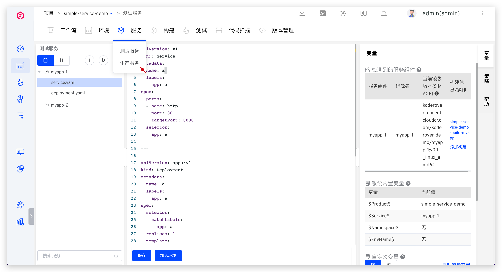

## 新建

进入 K8s YAML 项目，点击 `服务` - `生产服务`，进入服务管理页面，目前支持`手动输入`、`使用模板新建`两种方式来创建服务。

### 手动输入

具体操作和测试服务一样，可参考文档：[手动输入服务](/ZadigX%20v1.5.0/project/service/k8s/#手工输入服务)。

### 使用模板新建

具体操作和测试服务一样，可参考文档：[使用模板新建服务](/ZadigX%20v1.5.0/project/service/k8s/#使用模板新建服务)。

## 服务组件

参考文档：[服务组件](/ZadigX%20v1.5.0/project/service/module/)。

## 服务编排

参考文档：[服务编排](/ZadigX%20v1.5.0/project/service/k8s/#服务编排)。

## 变量配置

包括系统内置变量和自定义变量，可参考文档：[变量配置](/ZadigX%20v1.5.0/project/service/k8s/#变量配置)。
