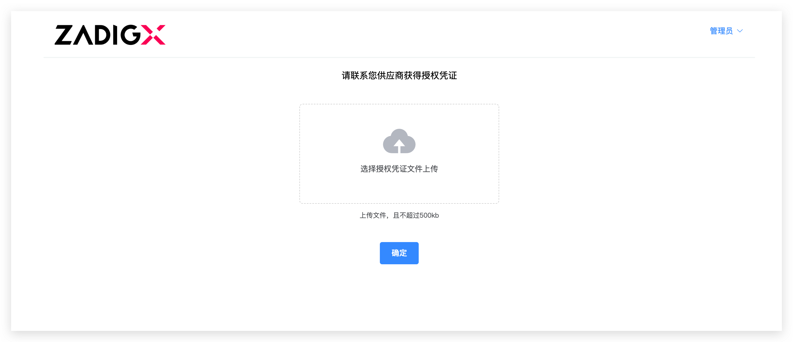
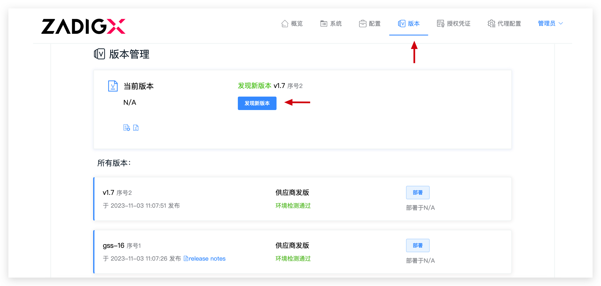
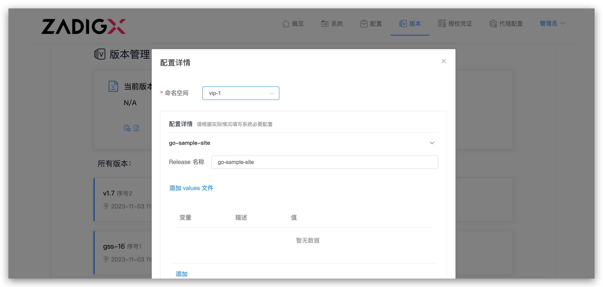
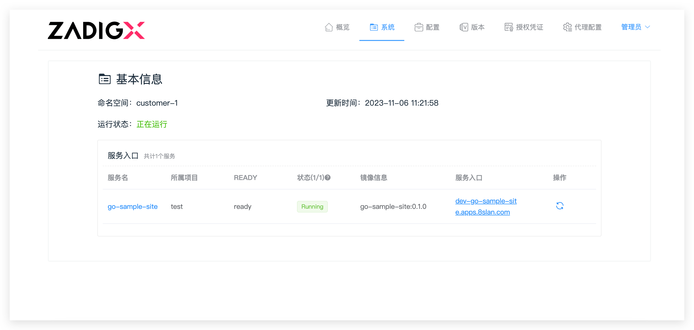
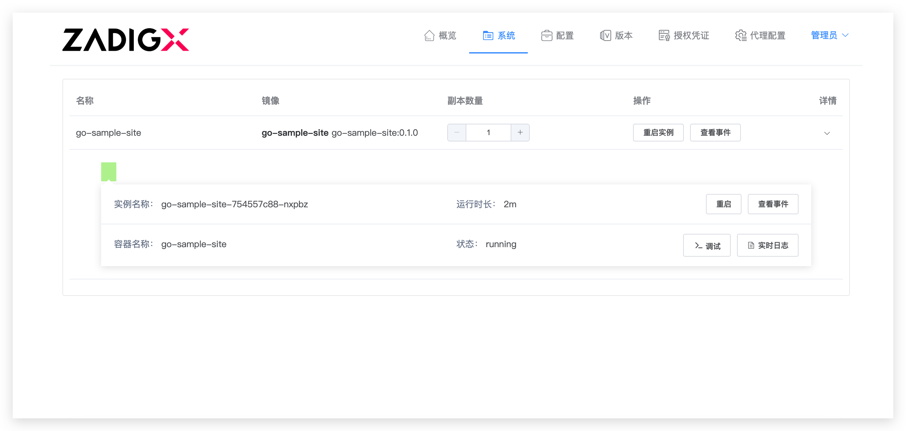
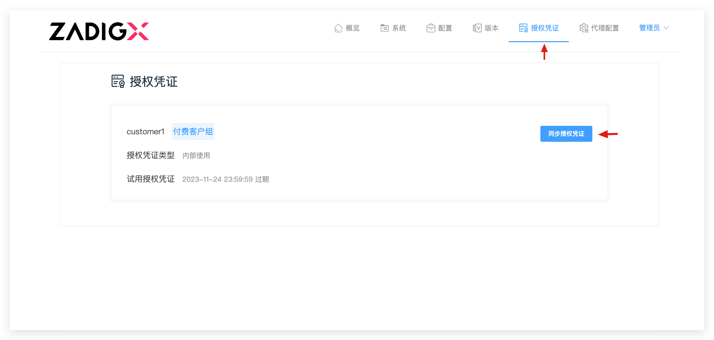

本文主要介绍客户交付中客户控制台相关操作。

## 安装客户控制台
### 安装要求
- Kubernetes 版本：1.16+

### 执行安装脚本
实际安装脚本从供应商获得，例如：

``` bash
curl -sS http://a.b.com/api/plutus/customer/installer/install_plutus_customer.sh | bash
```
具体执行过程如下：


如上图所示，安装过程需要输入以下信息：
1. 输入控制台安装的 Namespace
2. 访问方式：IP+Port 或者 Domain
    1. 如果选择 IP+Port，输入具体的 IP 和 Port 信息
    2. 如果选择 Domain，输入具体的 Domain 信息

安装成功后，从脚本输出中可获取访问地址和控制台密码。

::: danger
 控制台暂不支持修改密码，密码需要保存下来，以免丢失。
:::

## 配置许可证



1. 上传 vendor 提供的许可证
2. 点击`确定`

## 更新版本




1. 当供应商有新版本发布时，客户控制台可以自动发现新版本。
2. 更新版本，点击版本列表中的「部署」按钮，在弹框中确认配置内容，点击「部署」，开始部署新版本

## 管理系统




1. 进入系统，查看应用的整体状态
2. 点击服务名，查看查看服务镜像信息、查看服务状态、查看事件、查看实时日志、调整副本数量、重启实例等


## 更新许可证



1. 进入许可证
2. 点击`同步许可证`