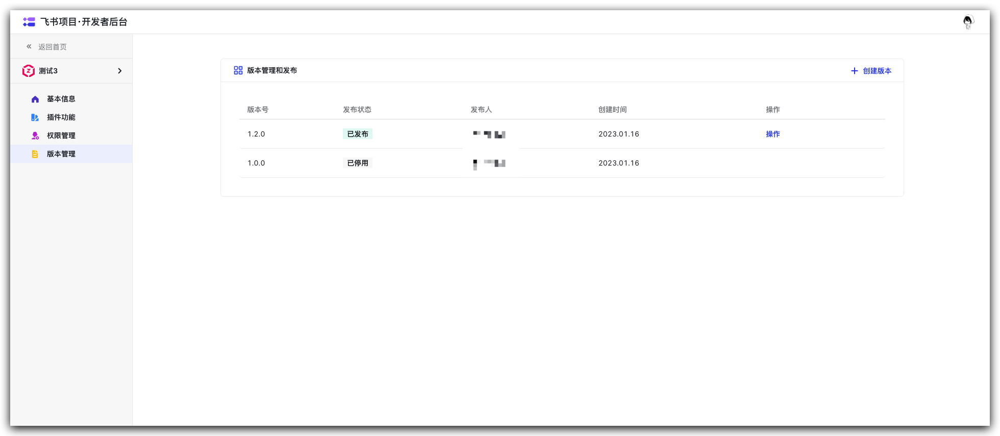

本文介绍如何在 ZadigX 系统上集成飞书项目管理系统。通过在系统中配置 `飞书` 的支持，实现对 `飞书工作项` 的追踪。用户可以通过自定义工作流或发布工作流任务对 `飞书工作项` 状态进行变更。

## 如何配置

### 步骤一：飞书插件配置
进入飞书项目，点击左下角头像，点击 `开发者后台`。

点击 `添加插件`，输入名称后完成创建。

进入 `权限管理`，获取对应权限并指定通讯录权限范围。

所需权限如下：
- 获取指定的空间信息
- 获取空间基础信息
- 获取工作项基础信息
- 创建、更新工作项及工作流
- 添加、更新评论

完成权限获取后进入 `版本管理`，点击 `创建版本`，填写相关信息后进行发布。

回到飞书项目首页，选择 `空间配置` -> `插件管理` -> `添加插件`，将刚刚发布的插件进行添加。

### 步骤二：ZadigX 中配置飞书集成

点击`系统设置` -> `集成管理`  -> `飞书集成`-> 点击添加。

参数说明：
- `访问地址`：飞书项目地址，
- `Plugin ID`：飞书插件的 ID，在插件基本信息页面获取。
- `Plugin Secret`：飞书插件的 Secret，在插件基本信息页面获取。
- `User Key`：拥有空间权限的用户的 User Key，双击头像即可获得。

信息确认无误后保存。

## 使用场景

### 工作流审批及通知

支持在工作流中配置飞书审批并将工作流执行状态通知到飞书中，如何使用可参考文档：

- [飞书审批](/ZadigX%20v1.5.0/project/common-workflow/#人工审批)
- [飞书通知](/ZadigX%20v1.4.0/project/workflow/#飞书)

### 通过飞书项目自动触发工作流

支持在自定义工作流中配置飞书项目触发器，实现飞书项目状态变更后自动触发 ZadigX 工作流，如何使用可参考文档：[飞书触发器](/ZadigX%20v1.5.0/project/common-workflow/#飞书触发器)。

### 通过工作流自动变更飞书工作项

自定义工作流中支持飞书工作项状态变更任务，可实现通过 ZadigX 工作流自动变更飞书项目工作项的状态，如何使用可参考文档：[飞书工作项状态变更](/ZadigX%20v1.5.0/project/workflow-jobs/#飞书工作项状态变更)。
