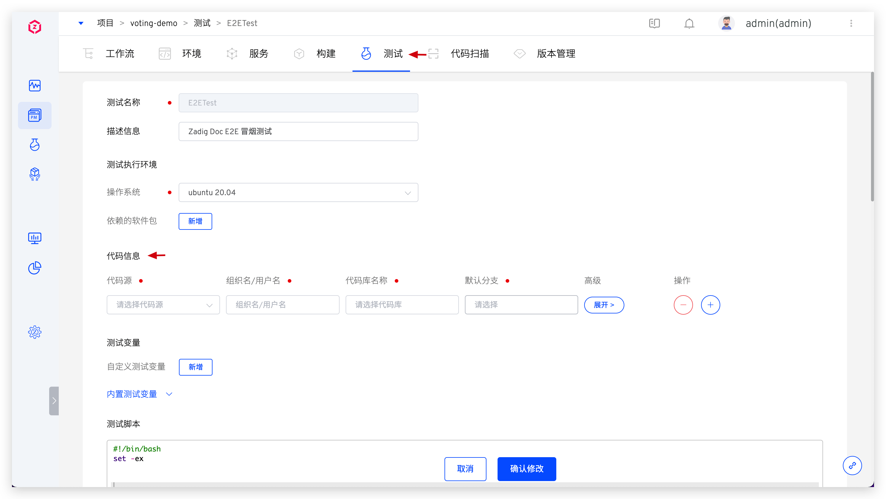
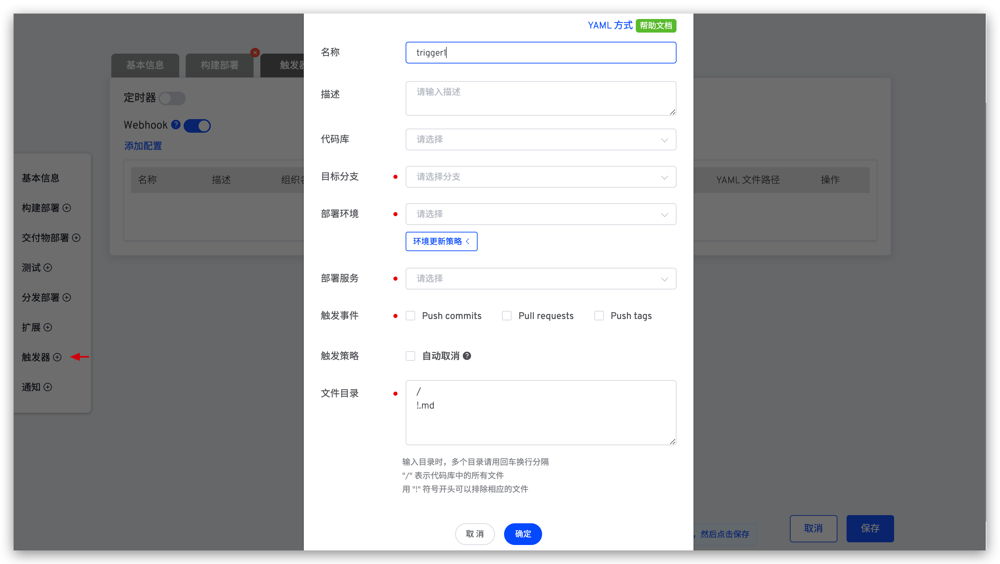
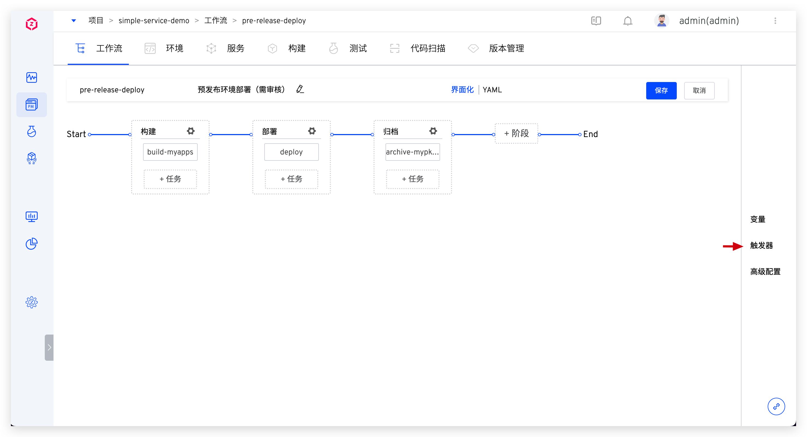
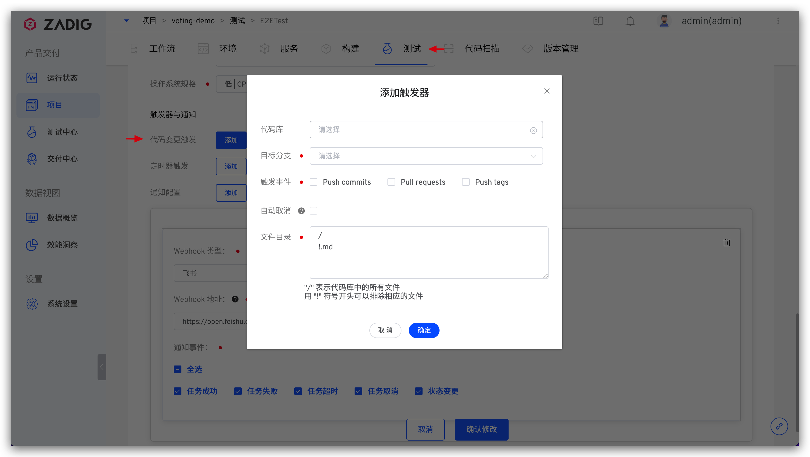
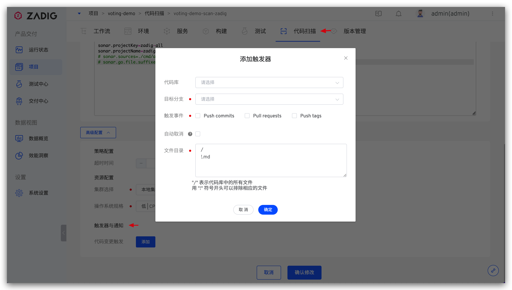
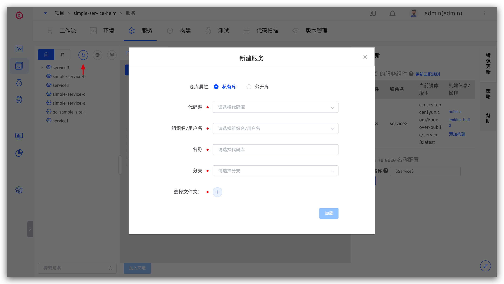

## 代码源集成
ZadigX 支持集成以下代码源：

| 代码源 | 如何集成 | 说明 |
|-------|---------|---|
| GitLab | [GitLab 代码源集成](/ZadigX%20v1.5.0/settings/codehost/gitlab/)| 采用 OAuth2 的方式进行授权认证 |
| GitHub | [GitHub 代码源集成](/ZadigX%20v1.5.0/settings/codehost/github/)| 采用 OAuth2 的方式进行授权认证 |
| Gerrit | [Gerrit 代码源集成](/ZadigX%20v1.5.0/settings/codehost/gerrit/)| 采用 Basic Auth 的方式进行授权认证 |
| Gitee 社区版 | [Gitee 代码源集成](/ZadigX%20v1.5.0/settings/codehost/gitee/)| 采用 OAuth2 的方式进行授权认证 |
| Gitee 企业版  | [Gitee 代码源集成](/ZadigX%20v1.5.0/settings/codehost/gitee-enterprise/)| 采用 OAuth2 的方式进行授权认证 |
| 其他 | [其他代码源集成](/ZadigX%20v1.5.0/settings/codehost/others/)|对于支持标准 Git 协议的代码源，使用 SSH Key 或 Access Token 的方式进行鉴权|

## 功能兼容列表

目前不同代码源在系统中可使用的功能有所差异，兼容列表如下：

| 系统功能 | 图示 | GitHub | GitLab | Gerrit | Gitee 社区版 | Gitee 企业版| 其他代码源 |
|--------|-----------------------------|---------|----|---|---|----|----|
| 拉取源代码 | 构建： </img>   测试：  </img>   代码扫描：  </img>|  ✅ | ✅ | ✅ | ✅ | ✅ |✅ （代码扫描不支持 ssh 鉴权方式拉代码）|
| Webhook 触发工作流(GUI 配置形式) | </img> | ✅ | ✅ | ✅ | ✅ |✅ | — |
| Webhook 触发工作流(YAML 文件配置形式) | </img> | — | ✅ | — | — | — | — |
| Webhook 触发自定义工作流 | </img> |  ✅ | ✅ |  ✅ | ✅ | ✅ | — |
| Webhook 触发测试 | </img> | ✅ | ✅ | — | ✅ |✅ | — |
| Webhook 触发代码扫描 | </img> | ✅ | ✅ | — | — | — |— |
| 从代码库同步创建 K8s YAML 服务 |  </img>| ✅ | ✅ | ✅ | ✅ |✅ | — |
| 从代码库同步创建 K8s Helm Chart 服务 |  </img>| ✅ | ✅ | ✅ | ✅ |✅ | ✅ |
| 从代码库同步创建 K8s Helm Chart 服务模板 |   </img>| ✅ | ✅ | ✅ | ✅ |✅ | ✅ |
| 从代码库导入 Helm Chart values 文件 | </img>| ✅ | ✅ | — |— | — | — |
| 从代码库导入环境配置（Ingress/ConfigMap/Secret/PVC） | </img>| ✅ | ✅ | — | — |— | — |
| 工作流展示代码变更标题中的 Jira issue 信息 | </img>| ✅ | ✅ | — | — | — |— |
