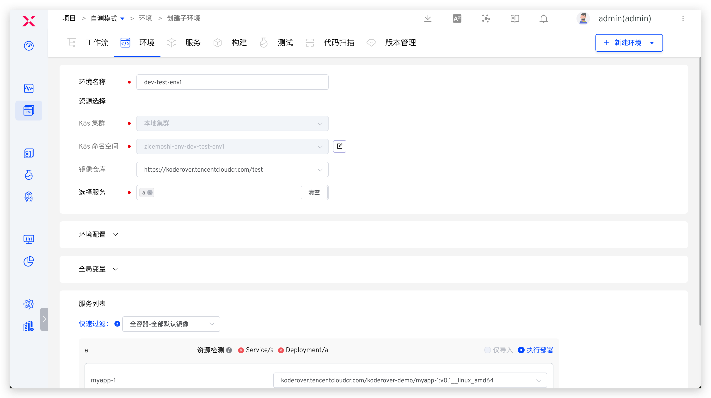
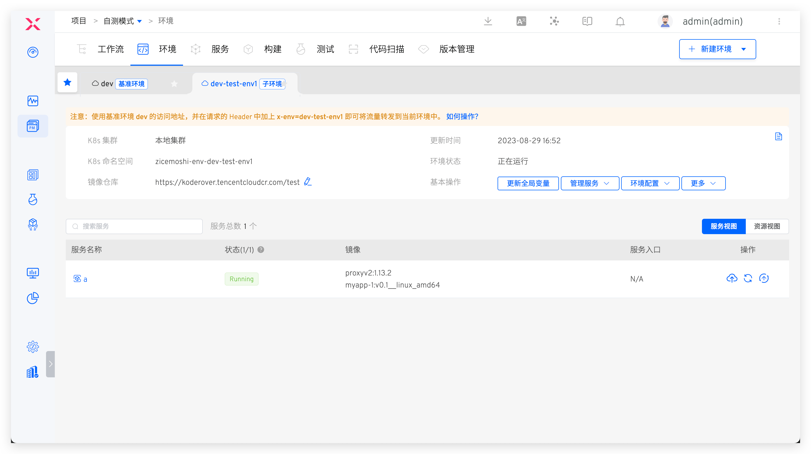
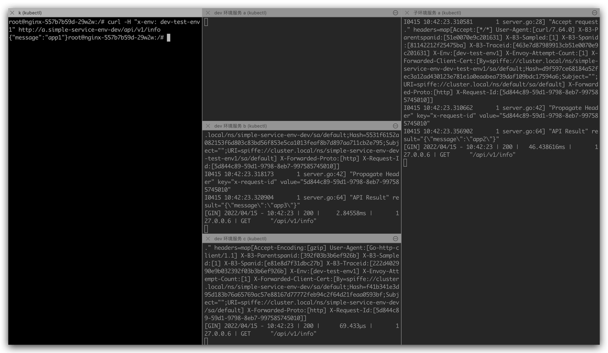

## 简介

自测模式是 ZadigX 为降低环境管理复杂度和部署成本而推出的一种面向开发者的功能模块。当开启了环境的自测模式后，该环境则成为基准环境，开发者们可以基于基准环境快速复制出属于自己的自测环境（即：子环境），并且只关注和自己日常改动相关的服务。对于其上下游服务无需理会，基准环境中会提供这部分服务的能力，快速实现自测联调。图示如下：


## 应用场景

ZadigX 的自测模式功能支持用较低成本快速拉起包括部分服务的子环境，在子环境中开发、变更目标服务，并和包括全量服务的基准环境交互来实现自测联调，企业可使用自测模式解决的问题包括但不限于：

1. 开发频率快，业务验证需求旺盛，亟需小快跑的方式迭代业务，但缺乏相关工程底座建设。
2. 微服务的数量大，业务复杂度高，导致建设一套完整的环境成本高，代价大。
3. 部分微服务因基础技术架构等原因，无法完整地复制出多套完整环境，导致多个团队绑定在一个环境中，环境稳定性难保障。
4. ......

## 如何使用

下面以 [simple-service](https://github.com/koderover/zadig/tree/main/examples/simple-service/) 为例来说明如何使用环境的自测模式来实现日常联调。项目中环境和服务背景，以及自测联调需求说明如下：

1. 项目中共包括 3 个微服务 a、b、c，服务调用链路：a -> b -> c
2. `dev` 环境为日常完整稳定的测试环境，包括全部微服务 a、b、c
3. 日常会对 a 服务进行高频改动，希望能对 a 服务进行充分自测，确定其变更可交付

### 管理员：开启自测模式

::: tip 前提
1. 系统无法自动检查 Tracing 组件，需要管理员自行确保，此处支持较为广泛应用的 SkyWalking、Zipkin、Jaeger 等。
2. 系统会对 Istio 是否安装做自动检查，如果没有请在环境所在集群进行安装
3. 系统会对服务调用链自动检查，主要依据是有 K8s Service 类型的资源和服务 a、b、c 对应
:::

在 `dev` 环境，开启自测模式，开启后，`dev` 环境即成为基准环境：


### 工程师：日常自测联调

#### 创建子环境

在 `dev` 基准环境中点击`创建子环境`，选择 a 服务可创建包含 a 服务的子环境 `dev-test-env1`：





#### 自测联调

以下操作需要在和 a/b/c 处于同一个 Service Mesh，且注入了 istio-proxy 的服务中操作，此例中部署该服务的快捷操作如下：

``` bash
# 执行以下命令为 default 命名空间注入 istio label
kubectl label ns default istio-injection=enabled

# 在 default 命名空间中部署 nginx 服务
kubectl -n default apply -f nginx.yaml # nginx.yaml 可从项目源码中获取
```

当需要请求服务 a 时，在请求的 Header 头中加入 `x-env:dev-test-env1` 即可将请求流量转发到子环境 `dev-test-env1` 中，实现子环境和 `dev` 环境的自测联调。登录 nginx Pod，测试效果如下所示：

1. 未加 `x-env` 请求头，直接请求服务 a，`dev` 环境中的服务 a/b/c 会处理请求，子环境中无请求流量输入。


2. 增加 `x-env: dev-test-env1` 请求头访问服务 a，子环境中的服务 a 会接收到请求并给出响应，对于请求链路上的 b/c 服务，`dev` 环境中的服务会给出正常响应。


